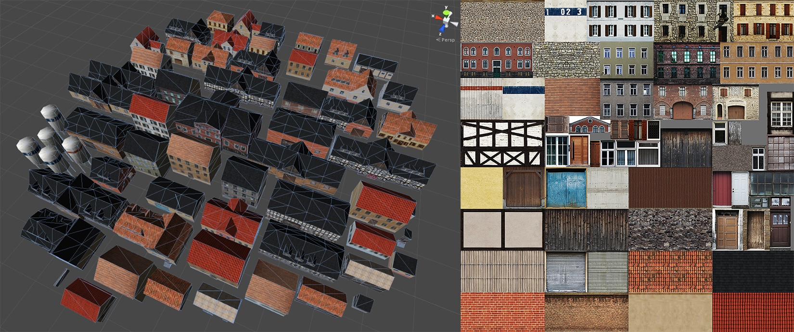

# Modular Level/Environment Design

## Game Levels

Game level: A place you explore in a game. There are usually points to start off, and an exit or goal.

  
_Guacamelee_

_Level 8 by Lord Mithios on Deviantart_

## Things a level has
The list of things a level has could go on forever, or a level can have none of them. It's up to the designer and the game type. Here are some of the most common. 

> 1. Spawn points
> 2. Ground, barriers, sky or ceiling
> 3. Obstacles
> 4. Items. Pickups, hazards, info points.
> 5. Enemies
> 6. Bosses
> 7. Paths for you/Enemies
> 8. Secrets
> 9. Often an exit or goal.
> 10. Collidable things 

In a game these things could be defined by geometry, by imported xml/bsp files, by objects placed in an editor, completely in code, or any other method a team comes up with. We'll use Maya and Unity.

_Unity level editing_

_Tile based map editing_

## Modular Construction
  

> Modular: Made up of compatible, standardized units for easy and flexible construction.     
  
Real world environments are big, varied, but also have a lot of repeating features. We need to reduce our concept art to pieces that can snap together seamlessly, or at least in a way that baked light, shaders or post effects can cover for (like ambient occlusion or grungy cavities.)  

Here are some of the central ideas:
> 1. Define the footprint of pieces
> 1. Only use non uniform pieces last resort
> 1. Pick a pivot and stick with it
> 1. Base kit for simple, square based layout
> 1. Inserts to make it organic, cover corners and seams, add interest.
> 1. Lighting brings atmosphere and more variance.
> 1. Obects!

  
  

_Fallout 4 GDC - [Youtube Link](https://www.youtube.com/watch?v=QBAM27YbKZg&t=330s)_

  

_Modular dungeon pieces, Baldi Konijn: - [Arstation Link](https://www.artstation.com/artwork/3a0yo:)_

## Technical Considerations
1. Levels are big, we can't use a lot of geometry on each piece. Exception: geometry instancing.
2. If we need to reimport a piece we want it, usually, to update wherever we use it. Unity uses prefabs for this.
3.  We need to not use a mountain of textures because our target has limited ram, our user limited file space. So we repeat a lot of the same texture. Different UV procedures.
4.  Lots of materials and objects = lots of drawcalls = low frame rate. Techniques like atlasing and batching can get around this, but we have to build accordingly.

## Atlasing  
  
  Atlases will be a familiar idea if you've done made sprites in 3D, or even in 2D. It's when you take a lot of textuers and arrange them into a single image. It's easier and faster for the computer to deal with one large image than many small images, and historically a power of 2 (2048x2048) resolution has been ideal. It can also save space if you support non rectangular shapes.

  
  
_Truck Simulator buildings in Unity alongside their texture atlas_

  
  
_Rayman texture atlas utilising texture space with non rectangular shapes_

## Batching  
  
Batching takes lots of objects using the same material and separate geometry and merges it into a single big object, removing plenty of drawcalls. Atlasing makes it possible to heavily reduce the number of materials.   
  
Two types of batching:  
* static  
* dynamic  

INSERT PREFAB STUFF