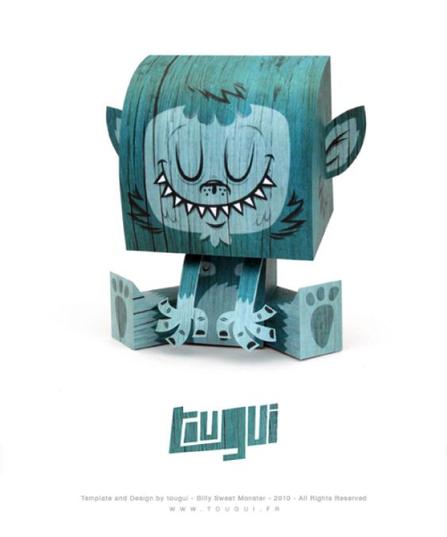
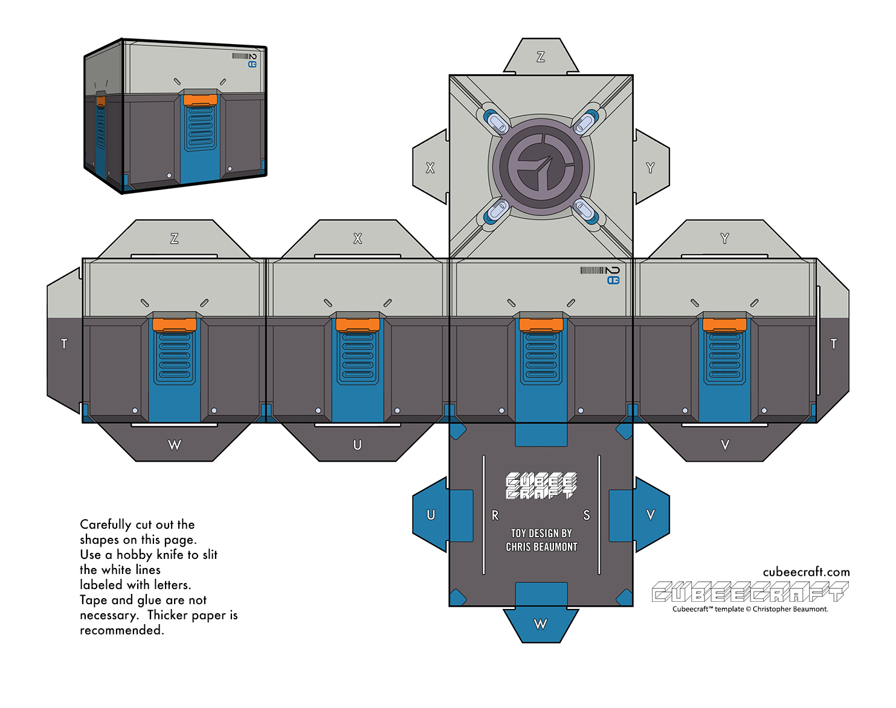
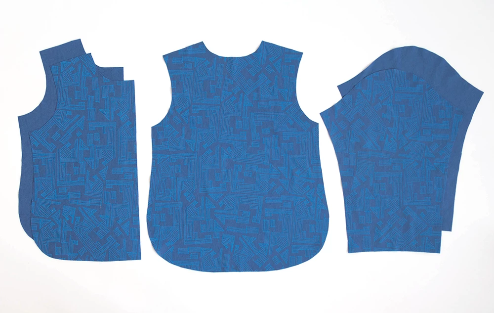
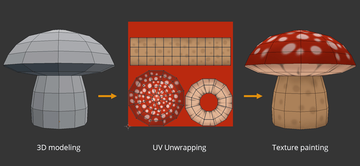

---
html:
  embed_local_images: false
  offline: false
export_on_save:
  html: true
---

# Week 10: Unwrap and paint

<!-- @import "[TOC]" {cmd="toc" depthFrom=2 depthTo=3 orderedList=false} -->

<!-- code_chunk_output -->

- [Week 10: Unwrap and paint](#week-10-unwrap-and-paint)
  - [Texturing and UVs](#texturing-and-uvs)
    - [Textured characters: like vinyl wrapping](#textured-characters-like-vinyl-wrapping)
  - [Exercise: UV together](#exercise-uv-together)
    - [// Link to downloadable project](#link-to-downloadable-project)
    - [Good and Bad UVs](#good-and-bad-uvs)
  - [Unwrapping](#unwrapping)
    - [Create new starting UVs:](#create-new-starting-uvs)
    - [Cutting and unfolding](#cutting-and-unfolding)
  - [Next week character uv and paint.](#next-week-character-uv-and-paint)
  - [UV Unwrapping for characters](#uv-unwrapping-for-characters)
  - [Maya to 3D Coat](#maya-to-3d-coat)
    - [Exporting](#exporting)
    - [Creating a new layer](#creating-a-new-layer)
    - [Filling in some colour](#filling-in-some-colour)
  - [Using AO to generate some lighting layers](#using-ao-to-generate-some-lighting-layers)
    - [Uv tutorials](#uv-tutorials)

<!-- /code_chunk_output -->

## Texturing and UVs

Textures are 2D images wrapped around 3D objects. Think of a cereal box: if you open the ends and cut down one long edge of the box, it can all be layed out flat.

To see the cereal box taken to fun places, check out papercraft toys:

_Click unfolded Dracula to download a pdf pattern_

_Click unfolded monster to download a pdf pattern_

_No PDF: just download this picture to make a lootbox_

### Textured characters: like vinyl wrapping

_Various layers of pbr texturing applied to DVa as images_

## Exercise: UV together

Let's uv the guy I started in class.

### // Link to downloadable project

Guy plus a ground plane (handy to have a simple plane w uvs)
Get it here
// shot of him shaded

### Good and Bad UVs

// shot of dino guy with bad uvs

He has some bad UVs. **Let's see how they affect texturing:**
1. Make sure you're in UV workspace
2. With character unselected, turn on UV grid in uv view
3. Select character to see uvs stretched and messed up
4. Click plane to see that.

Animated gif of steps  above

**Objects have a default uv layout** when Maya creates them. Usually they become badly **distorted** as you model, like Dino guy above.

Also you can just badly apply uvs, like here:

_This ball was uv'd with a technique used on flat planes; a **planar projection**_

_It's like aiming a video projector at a sphere instead of a wall or screen_

**Think of when you try to wrap a christmas present.** Wrapping paper has no stretch to it, so it wants to crunch up in some places and threatens to tear in others. 

**If it was stretchy and sticky, you could get it to follow the surface,** but it would warp or stretch or compress all the little printed reindeers.

When we uv unwrap we essentially have that sticky, stretchy material. The challenge is to find ways to eliminate the stretching and warping by `cutting` and `stitching` the uvs into the right pattern.

_Earth Caller Mih model by Mina Kim. [View it in 3D on Artstation](https://www.artstation.com/artwork/0LBaw)_

## Unwrapping

A method we'll use to do this is **projecting and unfolding.**

_From the [Maya "Planar Projection" documentation](https://knowledge.autodesk.com/support/maya/learn-explore/caas/CloudHelp/cloudhelp/2019/ENU/Maya-Modeling/files/GUID-B6519472-C0ED-4C07-99C6-12107A3509D9-htm.html)_

1. Images one and two above show the creation of uvs that are a single piece, like the object was dipped in rubber and dissolved, leaving just a thin covering.
2. Then you **decide where you would cut it to flatten it out, like flat pieces of fabric that are stitched together to make a jacket**, or the paper toys we looked at.

_Jacket front, back and sleeves outer fabric. Inner lining is the same._

_Assembled jacket_

### Create new starting UVs:
  
  - Go into Maya's UV workspace
  
  - In the perspective view, tumble and look the model from above at 45 degrees, like in the image below
  - UV Tookit -> Create -> Camera-based
  
  
The new UVS are distorted in 2D to resemble what the camera saw. They're all joined together like the mesh too. We need to cut it like papercraft.

### Cutting and unfolding
  - In edge mode, select (and shift select) edges to cut
  
  - UV Toolkit -> Cut and Sew -> Cut
  
These next steps were all done by hand previously (and often still are):
  - Select all edges
  - Uv Toolkit -> Unfold -> Unfold
  - Uv Toolkit -> Arrange and Layout -> Auto Orient
  - Uv Toolkit -> Arrange and Layout -> Layout
    - We'll try to roll with default here
  
  _Unfolded, oriented, then laid out. Colours altered in photoshop._

Unfold and Layout have plenty of settings. Lets have a look at good settings to start with.

**To be added soon: Unfold and Layout settings pics
**

## Next week character uv and paint.

We'll talk more on character unwrapping as you get your models prepped for 3D Coat. Being so rounded, figures provide a lot of stretchy challenge.

Compare the last two bearbricks on this sheet: iron patriot is carefully designed to avoid any stretching, pattern bear.. is less so.

<!--
## UV Unwrapping for characters

Bit more complex than for a cube. 

Spherical things are going to be stretched or cut up heavily.

_Every part of this mushroom has its own UV space

Notice on this guy everything is mirrored: only one side textured.

## Maya to 3D Coat

### Exporting

### Creating a new layer

#### Flat lighting 

Hit 2 to see your real result.

### Filling in some colour

## Using AO to generate some lighting layers
-->

### Uv tutorials

I haven't watched yet:

[
_Bunny unwrap tute made in 2018_](https://www.youtube.com/watch?v=VHUJ-kte1n8)