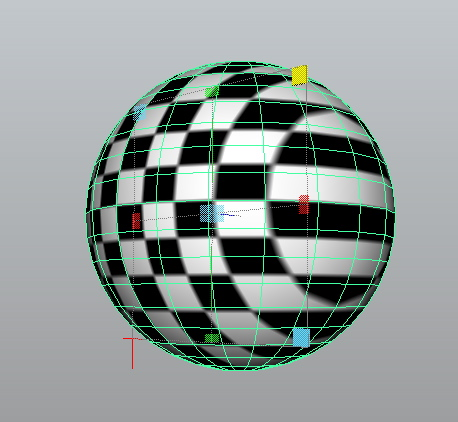
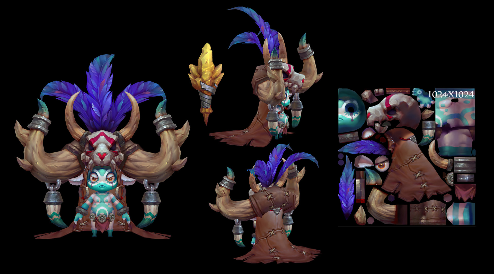
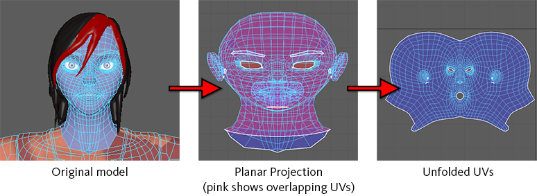
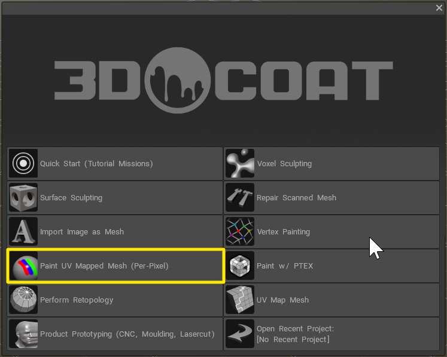
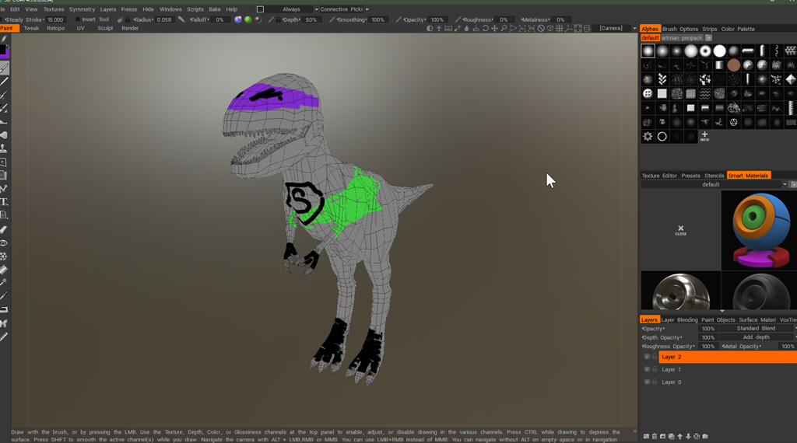
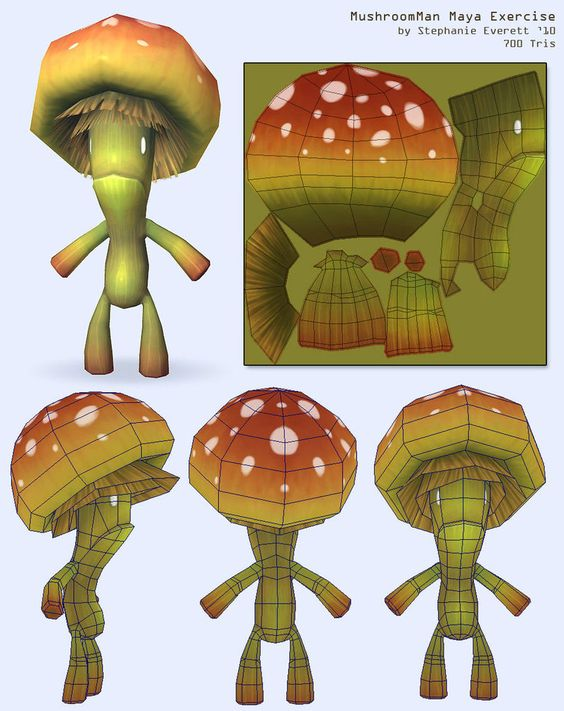

---
html:
  embed_local_images: false
  offline: false
export_on_save:
  html: true
---

# Week 10: Unwrap and paint

<!-- @import "[TOC]" {cmd="toc" depthFrom=2 depthTo=3 orderedList=false} -->

<!-- code_chunk_output -->

- [Week 10: Unwrap and paint](#week-10-unwrap-and-paint)
  - [Texturing and UVs](#texturing-and-uvs)
    - [Textured characters: like vinyl wrapping](#textured-characters-like-vinyl-wrapping)
  - [Exercise: UV together](#exercise-uv-together)
    - [// Link to downloadable project](#link-to-downloadable-project)
    - [Good and Bad UVs](#good-and-bad-uvs)
  - [Unwrapping](#unwrapping)
    - [Create new starting UVs:](#create-new-starting-uvs)
    - [Cutting and unfolding](#cutting-and-unfolding)
  - [Move to 3D Coat](#move-to-3d-coat)
    - [Export FBX](#export-fbx)
    - [Import to 3D Coat](#import-to-3d-coat)
  - [UV Unwrapping for characters](#uv-unwrapping-for-characters)
  - [Maya to 3D Coat](#maya-to-3d-coat)
    - [Exporting](#exporting)
    - [Creating a new layer](#creating-a-new-layer)
    - [Filling in some colour](#filling-in-some-colour)
  - [Using AO to generate some lighting layers](#using-ao-to-generate-some-lighting-layers)
    - [Uv tutorials](#uv-tutorials)

<!-- /code_chunk_output -->

## Texturing and UVs

Textures are 2D images wrapped around 3D objects. Think of a cereal box: if you open the ends and cut down one long edge of the box, it can all be layed out flat.

To see the cereal box taken to fun places, check out papercraft toys:

_Click unfolded Dracula to download a pdf pattern_

_Click unfolded monster to download a pdf pattern_

_No PDF: just download this picture to make a lootbox_

### Textured characters: like vinyl wrapping

_Various layers of pbr texturing applied to DVa as images_

## Exercise: UV together

Let's uv the guy I started in class.

### // Link to downloadable project

Guy plus a ground plane (handy to have a simple plane w uvs)
Get it here
// shot of him shaded

### Good and Bad UVs

// shot of dino guy with bad uvs

He has some bad UVs. **Let's see how they affect texturing:**
1. Make sure you're in UV workspace
2. With character unselected, turn on UV grid in uv view
3. Select character to see uvs stretched and messed up
4. Click plane to see that.

Animated gif of steps  above

**Objects have a default uv layout** when Maya creates them. Usually they become badly **distorted** as you model, like Dino guy above.

Also you can just badly apply uvs, like here:

_This ball was uv'd with a technique used on flat planes; a **planar projection**_

_It's like aiming a video projector at a sphere instead of a wall or screen_

**Think of when you try to wrap a christmas present.** Wrapping paper has no stretch to it, so it wants to crunch up in some places and threatens to tear in others. 

**If it was stretchy and sticky, you could get it to follow the surface,** but it would warp or stretch or compress all the little printed reindeers.

When we uv unwrap we essentially have that sticky, stretchy material. The challenge is to find ways to eliminate the stretching and warping by `cutting` and `stitching` the uvs into the right pattern.

_Earth Caller Mih model by Mina Kim. [View it in 3D on Artstation](https://www.artstation.com/artwork/0LBaw)_

## Unwrapping

A method we'll use to do this is **projecting and unfolding.**

_From the [Maya "Planar Projection" documentation](https://knowledge.autodesk.com/support/maya/learn-explore/caas/CloudHelp/cloudhelp/2019/ENU/Maya-Modeling/files/GUID-B6519472-C0ED-4C07-99C6-12107A3509D9-htm.html)_

1. Images one and two above show the creation of uvs that are a single piece, like the object was dipped in rubber and dissolved, leaving just a thin covering.
2. Then you **decide where you would cut it to flatten it out, like flat pieces of fabric that are stitched together to make a jacket**, or the paper toys we looked at.

_Jacket front, back and sleeves outer fabric. Inner lining is the same._

_Assembled jacket_

### Create new starting UVs:
  
  - Go into Maya's UV workspace
  
  - In the perspective view, tumble and look the model from above at 45 degrees, like in the image below
  - UV Tookit -> Create -> Camera-based
  
  
The new UVS are distorted in 2D to resemble what the camera saw. They're all joined together like the mesh too. Now we cut them like papercraft.

### Cutting and unfolding

Selecting edges and then UV cutting them to control the unwrap. Sewing pieces together where it makes sense.
  - In edge mode, select (and shift select) edges to cut
  
  - UV Toolkit -> Cut and Sew -> Cut

Tips:
  - Put your cuts in places that are less seen. Inner arms, behind head.
  - Think of a jacket or pants, how you'd cut them off and do the least visible damage.1
  - You can cut a few pieces and then stitch edges together again. Stitch will move and orient shells to stitch.
> Fun fact: These next steps were all done by hand previously (and often still are)

#### Unfold

Unfolding attempts to unwrap the surface and minimise the stress on each area of the texture, like a popped balloon. If it can't do a very good job, you'll need more cuts!
  - Change to UV Shell select, select all shells
  - Uv Toolkit -> Unfold -> Unfold
  - Add cuts, or sew things, Unfold, repeat
  

_From left to right: Unfolded, oriented, laid out._

There are many helpful settings for unfold, read more:
[Unfold uv options documentation](https://knowledge.autodesk.com/support/maya/learn-explore/caas/CloudHelp/cloudhelp/2019/ENU/Maya-Modeling/files/GUID-039FFDA5-3AC5-4CCF-A53E-546CCA6439FC-htm.html)
  
#### Orient
Particularly for square/rectangular surfaces, we'll want to orient to the U or V axis. If we don't, we'll get jaggies, or diagonally running pixels.

Auto orient can do a decent job of it. Pick some shells and:
  - Uv Toolkit -> Arrange and Layout -> Auto Orient

At this stage you can also use align verts/edge to the grid. To get a feel for it, move some individual verts around, observe how the texture warps and fits.

#### Layout of shells
critical for every texture: making the best use of the texture space. You have a limited amount of pixels in your texture (say 512x512) and a whole creature to cover. 
* Usually done largely by hand
* Increasingly, algorithms are able to get us very close.

Select all shells and RIGHT CLICK layout:
  - Uv Toolkit -> Arrange and Layout -> Layout

There are a lot of options for Layout, and believe it or not they all have their uses:
  * pre rotation: Often I'll enable it and allow increments of 15. For squares/rectangles, keep it to 90.
  * pre scaling: It can match the 3D proportions so everything gets even coverage. Good for first go. 
  

_From left to right: Unfolded, oriented, laid out._

#### Coverage by importance:
Once you have every thing unpacked, oriented and layed out with even coverage, you can start to apply human judgement.
  - What's most important on the model, and has to stand up to most scrutiny.
  - What's bigger in the UV layout, and has smaller grid/pixels drawn on it, is the most detailed.
  - Some stuff is almost never seen or is basically flat/very dark in colour, doesn't need many pixels.
  
[Maya UV Layout options documentation](https://knowledge.autodesk.com/support/maya/learn-explore/caas/CloudHelp/cloudhelp/2019/ENU/Maya-Modeling/files/GUID-47C4C13C-7DB9-46A0-B044-D336671BF266-htm.html)

## Move to 3D Coat

3D Coat is where we can start to paint our character.

### Export FBX

1. Select our character
2. Delete history (alt-shift-d)
3. Freeze transforms (just scale for now)
4. Export FBX. I use a folder in my 3dc__dino folder called fbxFromMaya

### Import to 3D Coat

1. Windows Start Menu -> 3D Coat 4.x.y -> 3DCoat(GL)
2. Select the "Paint Uv Mapped Mesh" project type

3. Click the folder to choose your file
4. The default import settings should be fine, with your texture width and height at 1024.
5. Hit W to see your wires, and then 2 to see your flat texture.
6. Save your file
7. Select a brush, create a layer and goof around.

<!--
## UV Unwrapping for characters

Bit more complex than for a cube. 

Spherical things are going to be stretched or cut up heavily.

_Every part of this mushroom has its own UV space

Notice on this guy everything is mirrored: only one side textured.

## Maya to 3D Coat

### Exporting

### Creating a new layer

#### Flat lighting 

Hit 2 to see your real result.

### Filling in some colour

## Using AO to generate some lighting layers
-->

### Uv tutorials

Watched and good:

[_Fast and easy uvs in Maya 2018+_](https://www.youtube.com/watch?v=cy1vqLw-agk&t=2s)

I haven't watched yet:

[
_Bunny unwrap tute made in 2018_](https://www.youtube.com/watch?v=VHUJ-kte1n8)