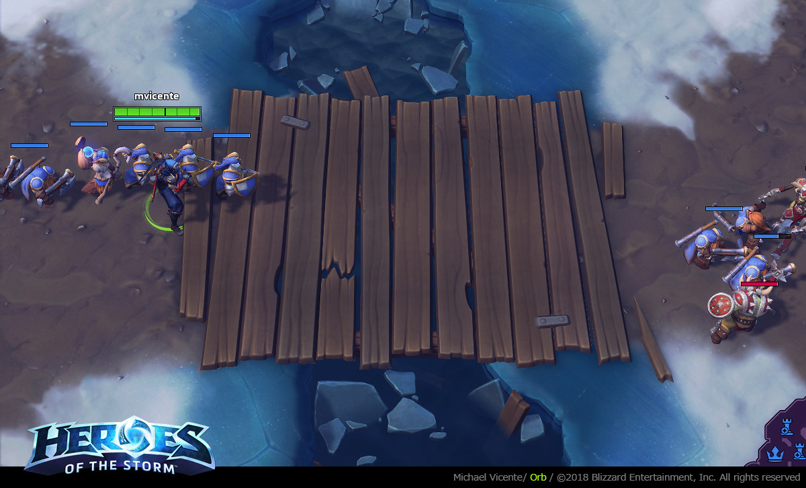
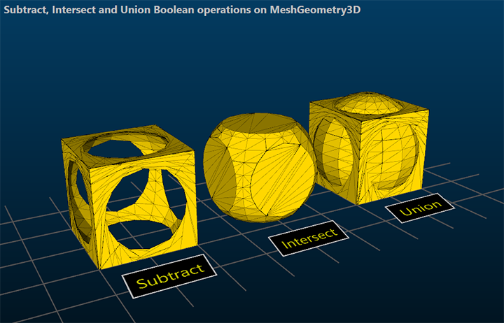
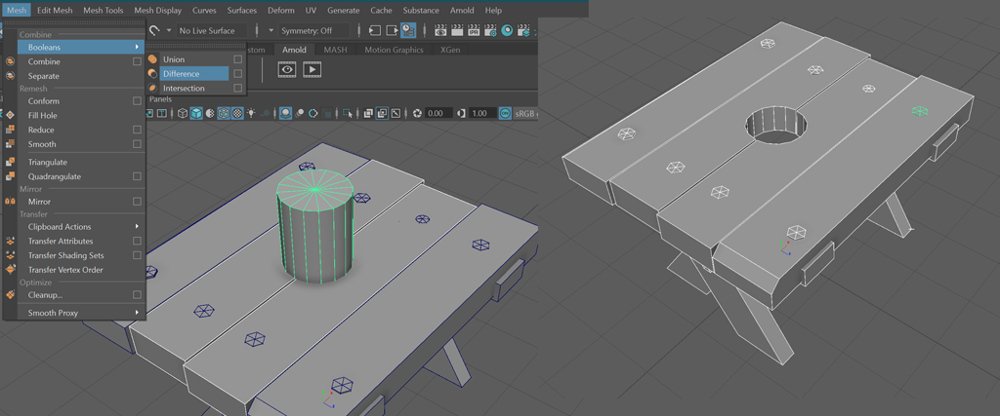
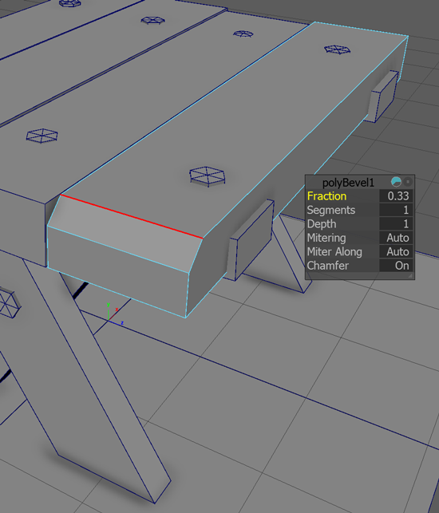
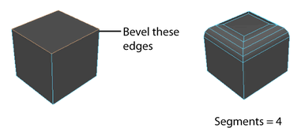
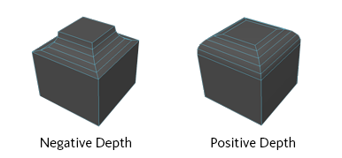
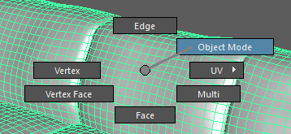
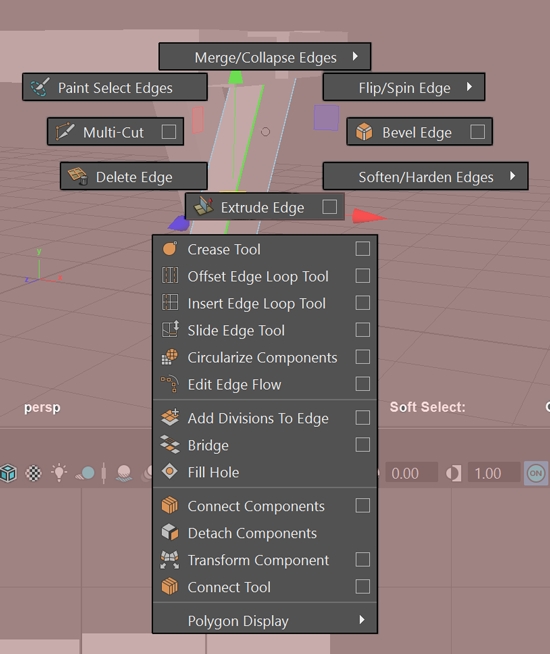
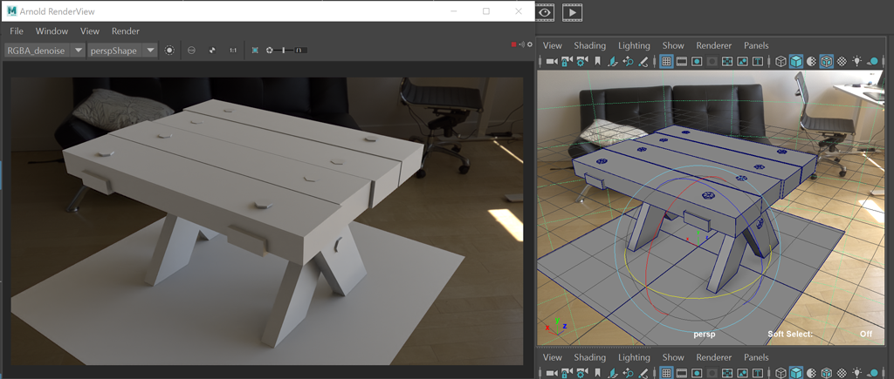

---
html:
  embed_local_images: false
  offline: false
export_on_save:
  html: true
---
# ACR103 Week 3

<!-- @import "[TOC]" {cmd="toc" depthFrom=1 depthTo=2 orderedList=false} -->

<!-- code_chunk_output -->

- [ACR103 Week 3](#acr103-week-3)
  - [Assessment 1 continued](#assessment-1-continued)
  - [Renaming lots of objects at once](#renaming-lots-of-objects-at-once)
  - [Damage!](#damage)
  - [Working faster with Marking Menus](#working-faster-with-marking-menus)
  - [Thin stuff: cloth, straps](#thin-stuff-cloth-straps)
  - [Fixing garbage groups and history](#fixing-garbage-groups-and-history)

<!-- /code_chunk_output -->

## Assessment 1 continued

* Assessing and tweaking our blockouts.
* Adding detail!
* First render scene

## Renaming lots of objects at once

Amazing time saver. 

Select similar objects (in outliner or scene) then rename them from the right end of the modeling toolbar [like in this video:](http://raconteuranimation.com/10-second-maya-tips-rename-multiple-objects/)

## Damage!

**Pair these with images in 2D and 3D.**
* Shields, walls, and tables in raucous taverns can take blows from axes and swords. 
* Wood can split naturally after years of soaking with rain/beer and drying out. 
* Rocks can split just from overnight dew and frost. Random collisions can knock corners off stone blocks.

_Becca Halstedt on Arstation_

_Firrka on Arstation_

_Timo Ehrenfellner on Arstation_

_Orb/Vicente on Artstation_

### Splits and gouges: multi cut, bridge.

Multi cut can add edges between vertices, add new loops, or get serious and cut through any geometry in any direction.

**image**
**demo**

We can:
1. Creat the outline of our missing chunk
2. Select and delete the unwanted faces.
3. Select and bridge edges to create new faces.
  
**image**
**demo**

Learn more about multi cut to add all the extra edges you need.
  * [Youtube tute by Jofftech](https://www.youtube.com/watch?v=4reh8fRLPT0), demoing features/tendencies, providing shortcuts.
  * [Autodesk knowledge base](https://knowledge.autodesk.com/support/maya-lt/learn-explore/caas/CloudHelp/cloudhelp/2019/ENU/MayaLT-Modeling/files/GUID-12DF0D57-6E5E-48E3-8FBF-F787BA4E5410-htm.html)
  * 

### Booleans

We saw these pictures of boolean operations last week. Let's see them work in Maya.

Select your objects in this order:
1. Object A: This will be retained
2. Object B: This will be subtracted from A.

In the top menu, click _Mesh -> Booleans -> Difference_.

### Adding in edges after Booleans

We talked about many edged polygons in Maya, last week, or _n_-gons. Booleans create them, and **we clean them up with multi cut or clean up geometry**.

**If this can be done with cleanup, image and demo that.**

### Bevel an edge

Wear takes off edges. So do carpenters with routers.

Beveling a single edge.

Beveling after a boolean.

Bevels on [Autodesk knowledgebase](https://knowledge.autodesk.com/support/maya/learn-explore/caas/CloudHelp/cloudhelp/2019/ENU/Maya-Modeling/files/GUID-A1C5EC72-AD48-4A7D-8577-1823B3832E14-htm.html)

### Bevel a vertex

It's a strange idea, but it works.

**image**
**demo**

### Go planar, edit, extrude

Sometimes, rather than fussing with so many surfaces (bottom, side, top) it's easier to just:
1. Delete the walls and top
2. Cut away at our base
3. Extrude it back up to the old height

_remember to regularly edit > delete by type > history_

**pics**
**Demo**

## Working faster with Marking Menus

**In maya we have 'marking' menus**. They're **like 'right click'** menus in other programs, but feature packed enough to deserve their own name.

Here's the basic marking menu that shows when you **right click a polygonal object**.

### Gestures
You can drag right past one of those options and it'll select when you release the mouse button. Do it really fast, that's a **gesture**.

**Try:**
1. In one smooth motion, with your mouse over an object, right-click-and-drag straight up. You're in edge mode.
2. Do the same, but down: you're in face mode.
3. Try it again, but to the 1:30 position on a clock, or North East on a compass. That's object mode.

> **Polygonal:** made of polygons (shapes with 3 or more edges).
>  It's usually pronounced **'poh-lig-onal'**. Like 'original' with a hard 'guh' g.
> - 'poh' like start of **'pop'** or **'police'**
> - 'ligg' like **'dig'**
> - 'onal' like end of 'original'

### There are many menus

There are many ways to access many marking menus. Right click, shift right click, hold space, hold w and left click, ctrl-right click, and more.

**The most useful for now:**
* Right click - **component and selection menu**
* Shift right click  - **polygon object or component menus** depending what selection mode you are in.
* Space - **full maya menu**

This menu appears when you **shift-right-click** a polygonal object in **object selection mode**;

The edge context menu appears when you **shift-right-click** a polygonal object **with edges selected**. There's one for vertices, faces and more.

Explore the marking menus [in the Maya 2019 documentation](https://knowledge.autodesk.com/support/maya/learn-explore/caas/CloudHelp/cloudhelp/2019/ENU/Maya-Basics/files/GUID-8BA1A3AA-4C44-4779-8B22-0AAE3627E8EB-htm.html).

> ## Recap: Verts, Edges, Faces
> To describe/reproduce a triangle, all you really need is 3 points (x,y) in space.
> To complete it though and make a surface, you need to add the edges and the face.
> **Make verts to edgey face images with quad draw or just hand draw in ps**

I've created a basic render scene for you guys to work in. It'll help when we start looking at shading/rendering next week.
1. It'll be supplied to you soon.
1. It uses the packaged-with-Maya Arnold renderer.
2. The lighting is a free hdr image from the web (Maxine Roz).
3. You'll be able to import your scene into it, and scale your object up to around the size of mine (for consistent lighting).
4. Hit render to see a pretty picture.

> **Note**: the scene above uses **NVidia** machine learning technology to remove noise from the image. If **you don't have an Nvidia card**, there's another version. You'll be able to remove the noise with your cpu by turning up the 'samples', it'll just take longer.

## Thin stuff: cloth, straps

Lets make cloth, and straps/bands.

### Plane, extrude

Make a plane, move it to a surface, start extruding.

### Quad draw

1. Make a surface live
2. Enter Quad draw
3. Draw and delete verts
4. Create faces with shift
5. Delete things with alt
6. Exit quad draw, turn off live surface.
7. Separate new geometry
8. Extrude bits
9. Finally, extrude the cloth (test this along the way with bigger/complex cloth, do and undo)

_remember to regularly edit > delete by type > history_

## Fixing garbage groups and history

The object history feature in Maya is powerful, but causes problems and a lot of housework. How to fix?

### Turn it off

The slash and burn approach is to just turn it off completely. I'm trying out working this way at the moment.

That blue button in the menu next to the render icons? **Click it to disable history**.  If you can't see the button, click a vertical divider in that area, see if it expands.

### Clean up the garbage groups

If you've used mirror, separate (shells) or extract faces, you've seen garbage groups in your _Outliner_. They are a butt pain. 

The example above is a single metal bracket after I finished a few _mirror_ operations. It has two parents, both pointless extra transform thingies.

**To fix:**
1. **SAVE YOUR SCENE** just in case, before any big operation. To save incrementally and keep your old version, use _File -> Increment And Save_.
1. Drag in the _viewport_ to **select all the objects** in your prop. 
2. See that **they're hilighted** in the _outliner_ (shown above)
3. **_Unparent_ them all** by either **a)** clicking _**edit->unparent**_ in the menus or **b)** hitting the **shift-p** keyboard shortcut.
4. _File -> **Optimize Scene Size** -> Ok_.

### Holes in cloth

Very easy, because we did it with cutting chunks. 

1. Draw out cloth
2. Add edges for holes
3. Select and delete faces where the hole goes
4. Extrude cloth.

_remember to regularly edit > delete by type > history_

_r t r e > dbt > h_

[Arnold sky](https://docs.arnoldrenderer.com/pages/viewpage.action?pageId=40111029)
