---
html:
  embed_local_images: false
  offline: false
export_on_save:
  html: true
---

# ACR103 Week 5

<!-- @import "[TOC]" {cmd="toc" depthFrom=1 depthTo=2 orderedList=false} -->

<!-- code_chunk_output -->

- [ACR103 Week 5](#acr103-week-5)
  - [Assessment 1 Received](#assessment-1-received)
  - [Weeks 5-8, modeling game environments](#weeks-5-8-modeling-game-environments)
  - [Assessment 2: Level Modeling](#assessment-2-level-modeling)
  - [How will we do it all?](#how-will-we-do-it-all)
  - [This week](#this-week)
  - [Inspect plane uvs](#inspect-plane-uvs)
  - [Next week (w6)](#next-week-w6)
  - [Styles and concepts](#styles-and-concepts)

<!-- /code_chunk_output -->

## Assessment 1 Received 

Thanks for assessment 1 submissions.
* A couple issues, i’ve messaged those people about correcting submission

## Weeks 5-8, modeling game environments

We'll learn about:
#### Modular modelling
  - Assembling usable level pieces from basic components
  - components like floors, walls, columns, doors
  - level pieces like repeating wall with floor, corner of room etc

**Modular (simple) in the real world:**

_Bunnings modular storage_

**Modular level construction:**

Examples by [Glenatron](https://polycount.com/discussion/158818/another-modular-dungeon-tileset)

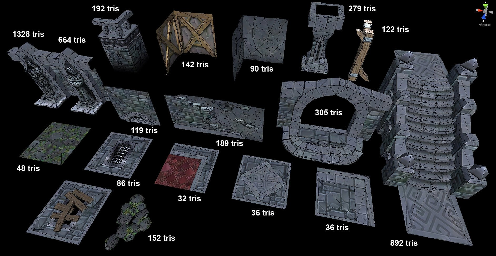
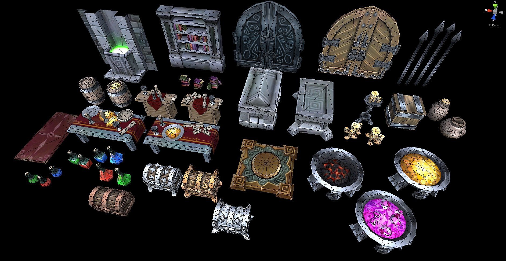
_Components for making modules_

_Levels made from modules_

| Objects     | Description
|---          |---
| wall        | basic component 
| floor       | basic component 
| wall+floor  | wall_floor module
| 2 walls + floor | wall_floor_corner module
| 5 x wall_floor  | one side of a corridor? | 

#### Texturing
  - uv unwrapping
  - Applying textures
  - Creating/editing textures
  - Using wacom tablets
  - 3d coat and painter

_Low poly dagger with hand painted texture (diffuse)_

_Download the [dagger_maya project](assets/week5/dagger_maya.zip)_

## Assessment 2: Level Modeling

(I'll provide a few concepts. You will be designing an environment based on the elements and style in them. You can modify the scene from say a level 1 dungeon to level 5 dungeon, or a lounge room to an attic bedroom). You can add elements that aren't there, but aim to match the style as if the game exists)
Designing and creating environment for game based on scope sheet from teacher

**Scope will include:**
1. Existing or theoretical world (ie strategy in world of paper blocks)
2. Creative expects: C.D., genre, texture quality/style, model quality/style.
3. Tech spec: poly count, texture specs, topology (quads or tris)

**10-15 modular assets! **

Lighting: export to Unity and bake in ambient occlusion.

DELIVERABLE: 
* Unity project
* Interactive level fly through (camera using a basic unity-provided controller script)

## How will we do it all?

- Choose and modify/extend a concept
- Model and uv unwrap in Maya
- Test with a texture designed to help uv mapping
- Export to 3D Coat/Photoshop for texturing.
- Import components to Unity
- Make simple prefabs
- Snap pieces together

## This week

Beginning the assessment, practising working to a grid.

### Modules and components 

A little more context. 

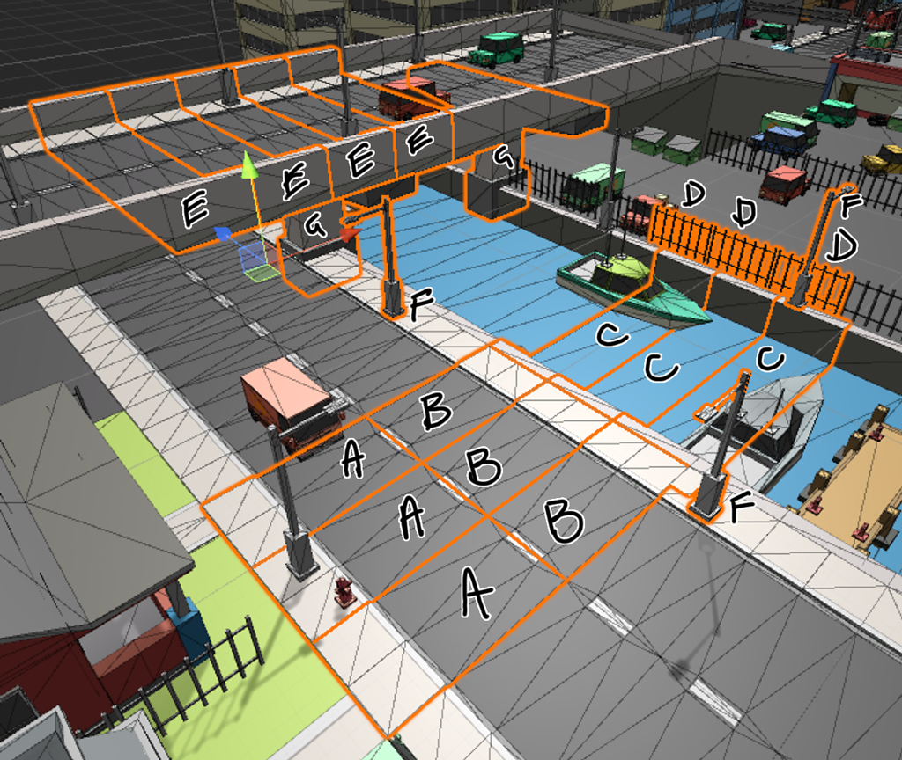
_Notice one road lane component and one sidewalk component making up a module. Look for more._
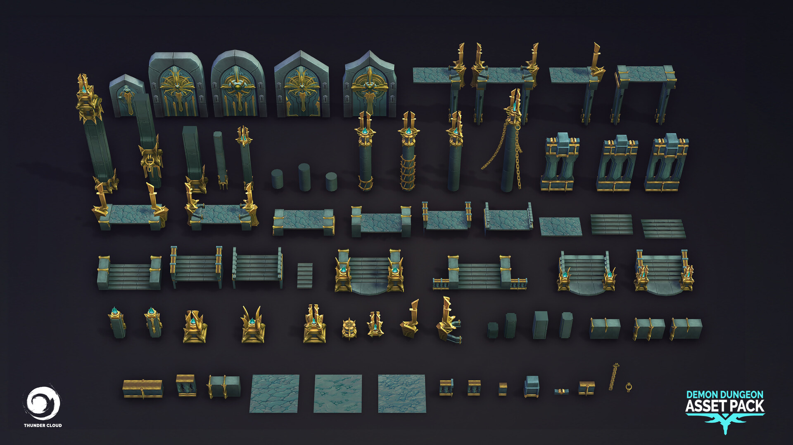

_Components being arranged to make ledge/raised walkway modules_

### Choose your environment and style

Lots of styles and concepts at the end of these notes, many more on [my acr103 pinterest board](https://www.pinterest.com.au/dmacdraws/acr103/)
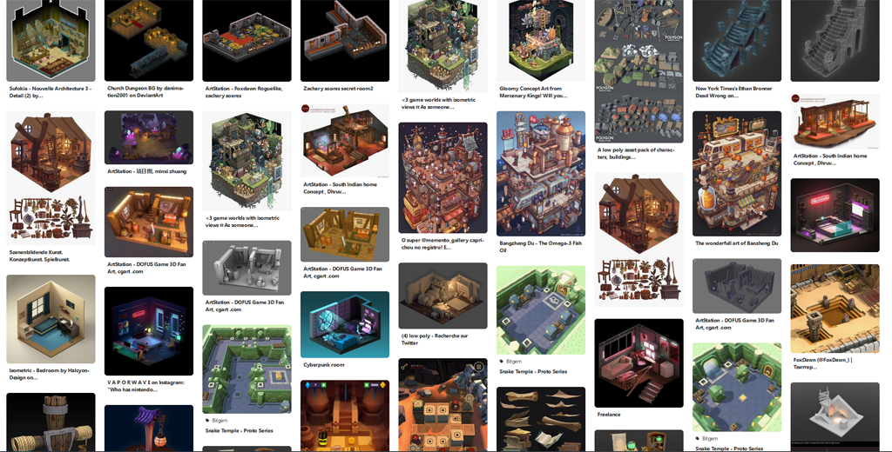
Can match existing style as closely as possible, work directly from concepts in 2D.

### Rough design of your level
Sketch out an approximation of your idea (obviously more refining at home!)

### Figure out components you'll be making.
Getting started here. What do you see in the image? wall, flor, railing, stairs, column, sign?

### model and texture a wall and floor 

<!--
> TODO: add this file
> First, play in this scene to see what we'll be doing.
>
> Make some modules by duplicating (ctrl-d) and moving components:
>  - select translate tool (w)
>  - enable grid snapping (hold down x)
>  - click and drag the translate handle
> -->

* Set up grid

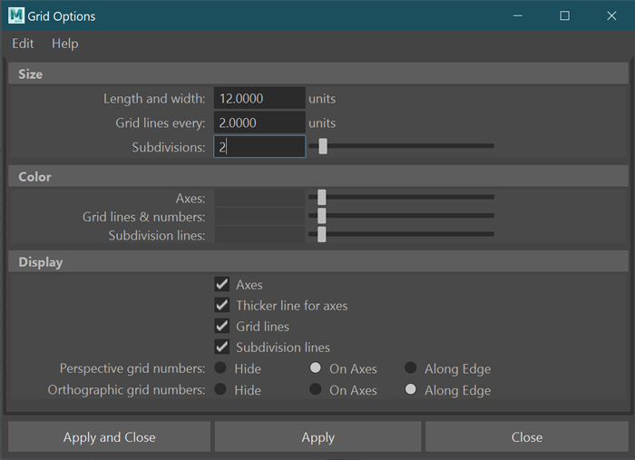
  
* Make a wall plane, a floor plane
* Move our pivot points using d (modify pivot)
  - select translate tool (w)
  - select an object
  - enable pivot editing (d)
  - you can move pivot freely by dragging handles
  - enable snap to vertex (hold down v), click and drag manipulator handles.
  - disable snap to vertex (release v)
  - disable pivot edting (d)
  

* Move and snap our objects. Duplicate, move w snap.
  - select translate tool (w)
  - enable grid snapping (hold down x)
  - click and drag the translate handle
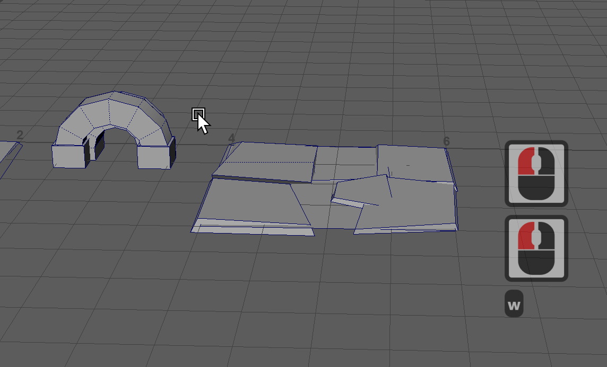

When you have your pivot set, and your object at the origin, you're going to be stuck with funny x and z coordinates, and maybe leftover rotation. Remove them with "Freeze Transforms"
* Select your objects
* Right Click the channel box as in the gif below and freeze all transforms.

_Your new level component should be all 'zeroed out' with its pivot at the origin_

* Make a column
* Move pivot, duplicate, move w snap.

**GIF OF MOVE PIVOT**
Screen cap showing keypresses would be ultimate
  
## Inspect plane uvs
Only if time allows.

## Next week (w6)

#### Assessment deliverable: present your designs in class
Work along as we uv unwrap a model, apply uv texture.
Pick simple component to model

## Styles and concepts

For these and more, continue to [my acr103 board on Pinterest](https://www.pinterest.com.au/dmacdraws/acr103/).

#### Blocky rooms and zones
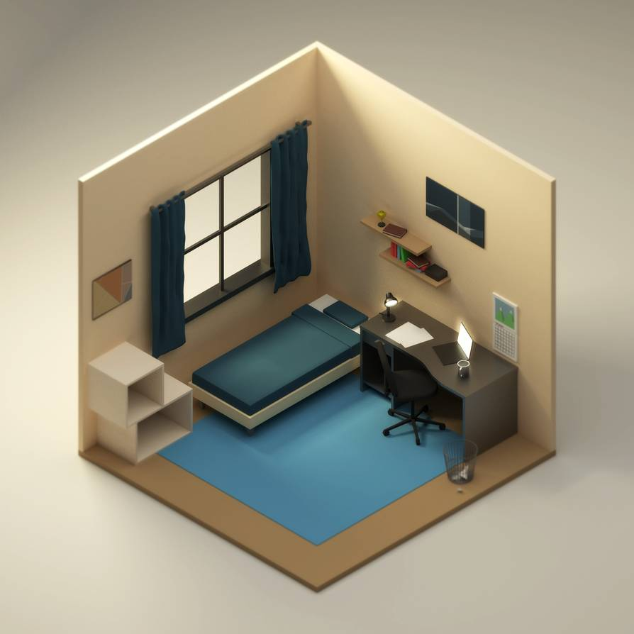

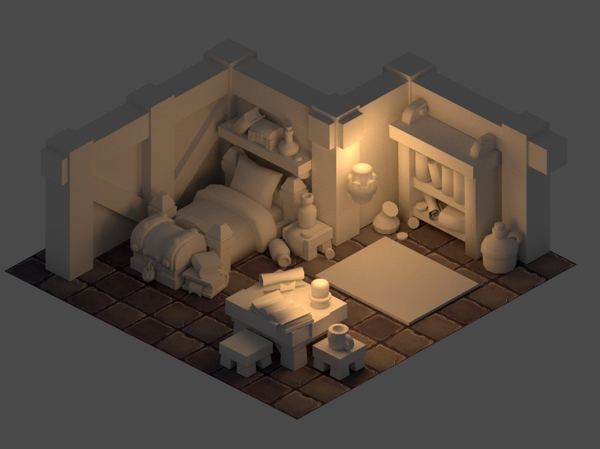

### Snake Temple 
These shots are from [Bitgem's store](https://shop.bitgem3d.com/products/snake-temple-low-poly-3d-proto-series)

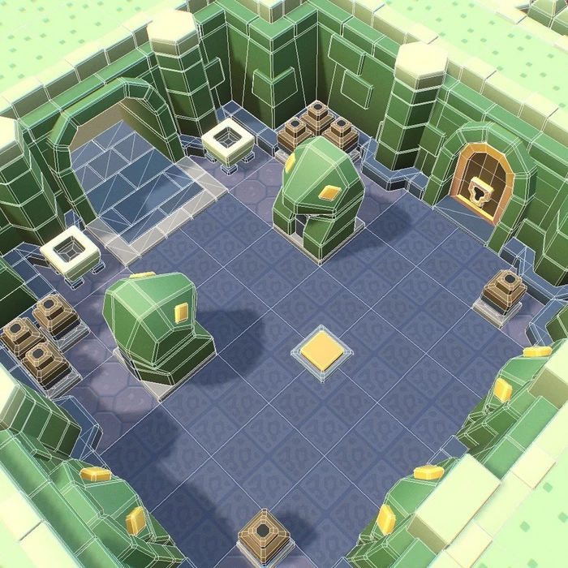
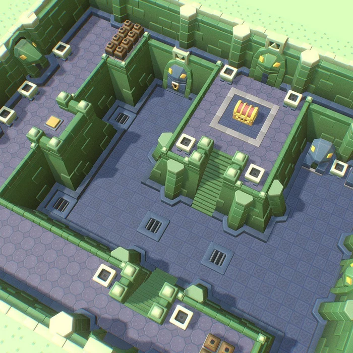

### Cartoony concepts

More Minxi Zhuang on Artstation

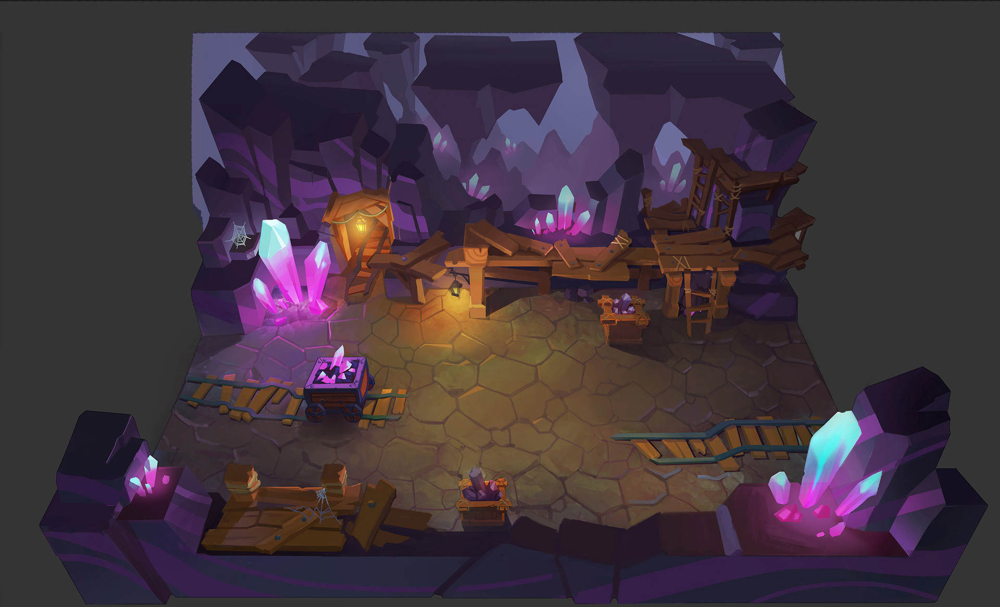
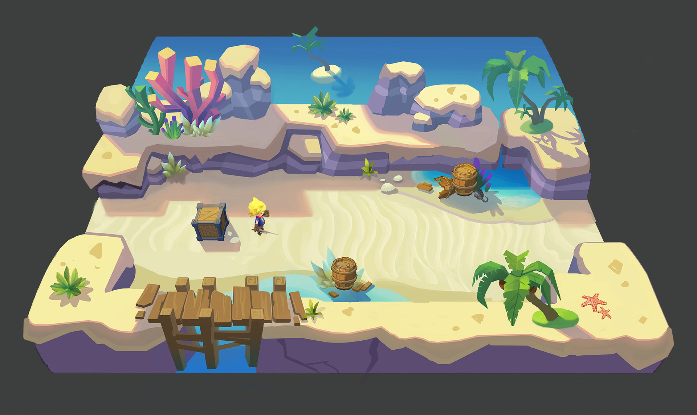

### Bangzheng Du concepts

Multi tier mayhem.
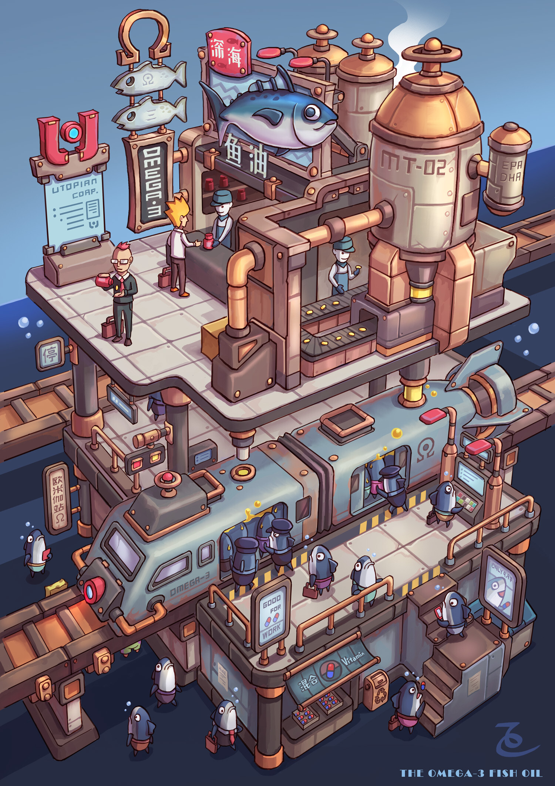

### Baldi Konjin concepts

### Some simple, effective construction:

### Blocky shapes, relatively low fi textures

By cgart dot com, [on artstation](https://www.artstation.com/artwork/RzB5e) 

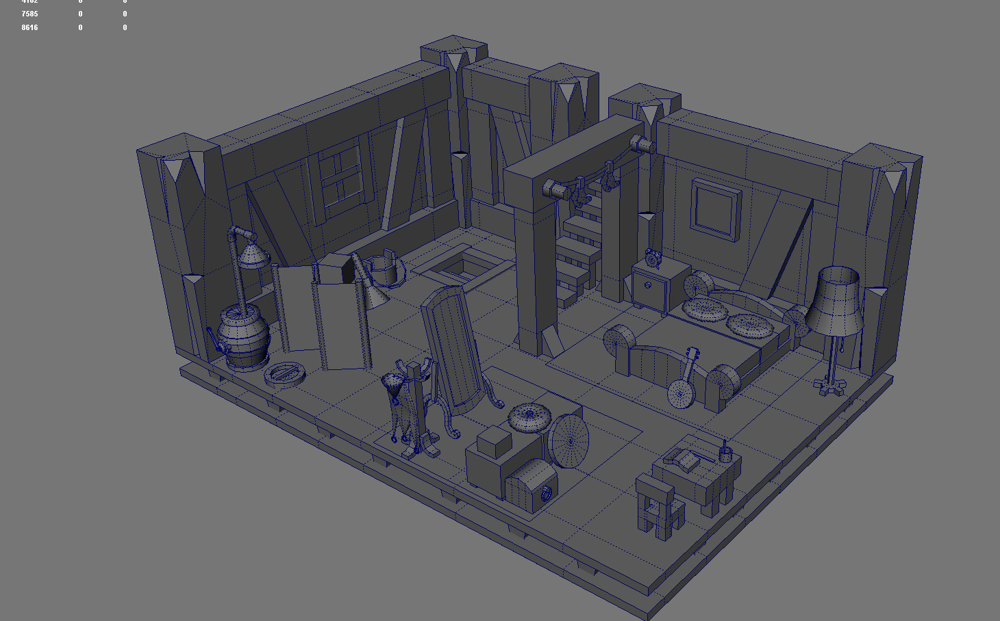
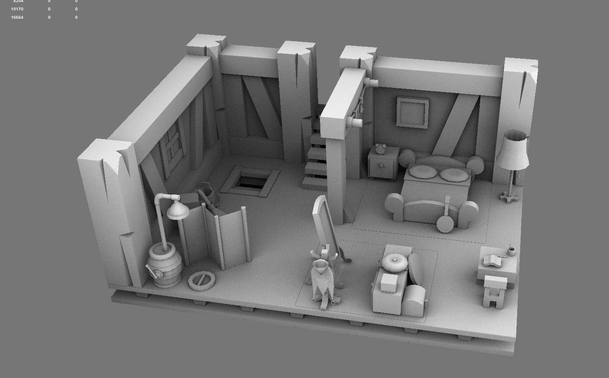
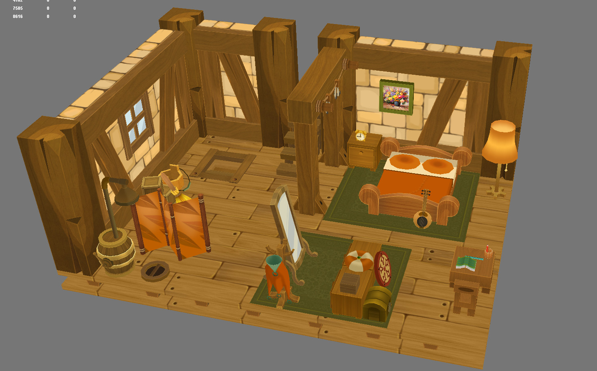
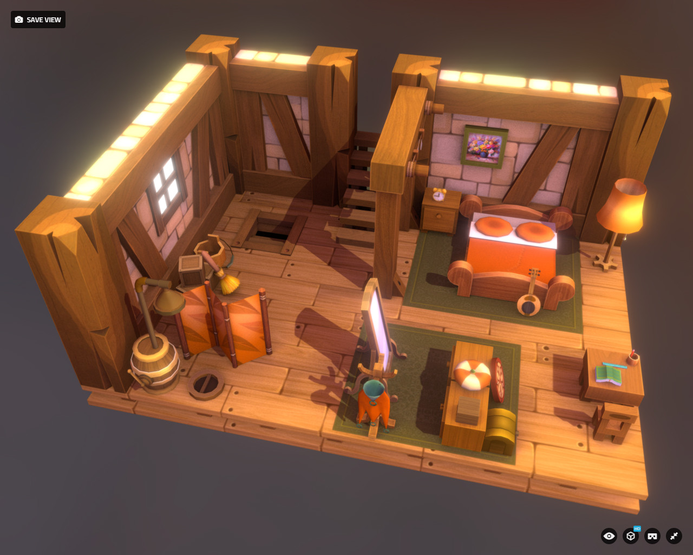
