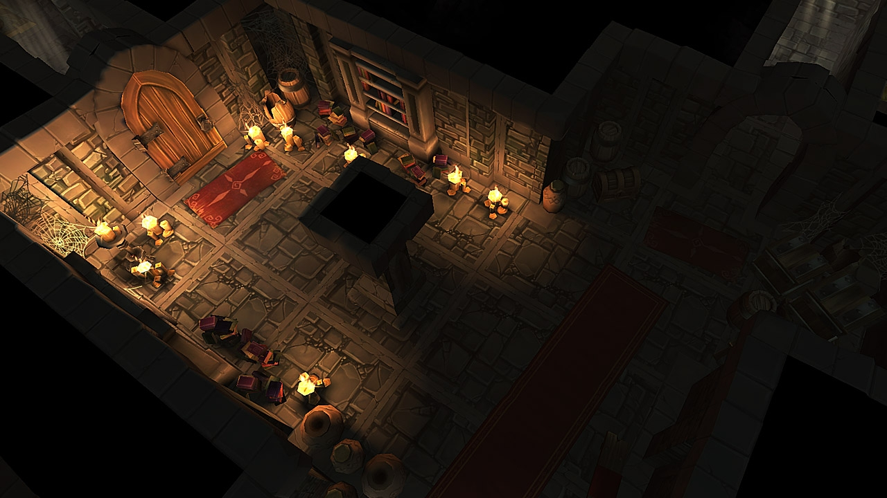
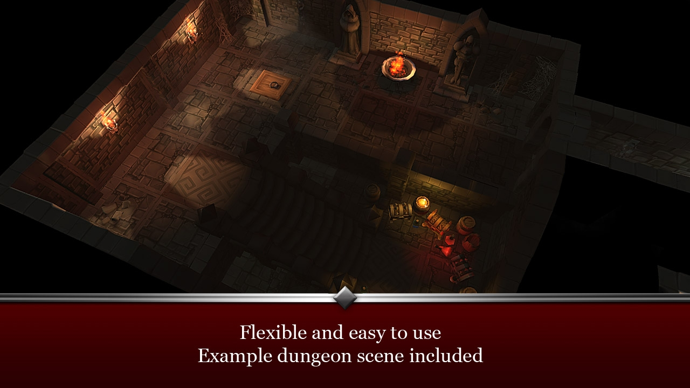
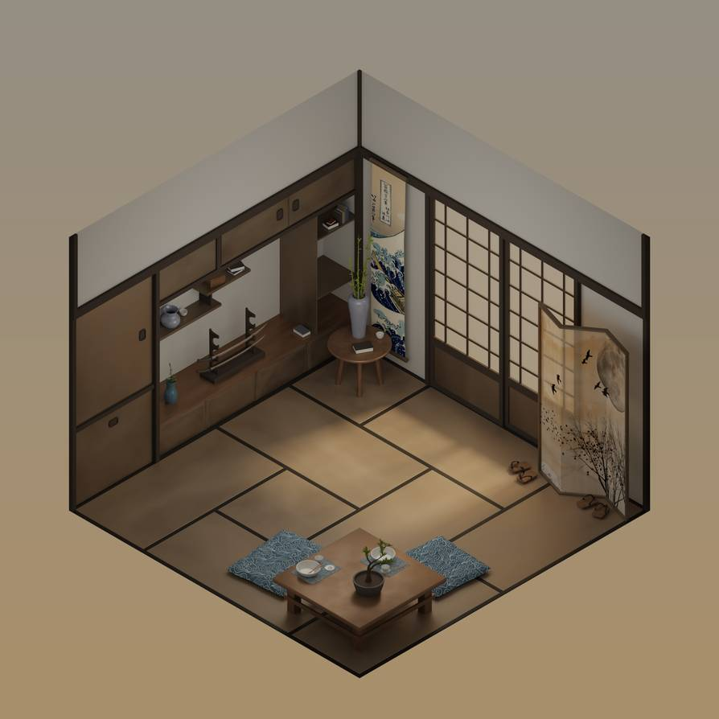
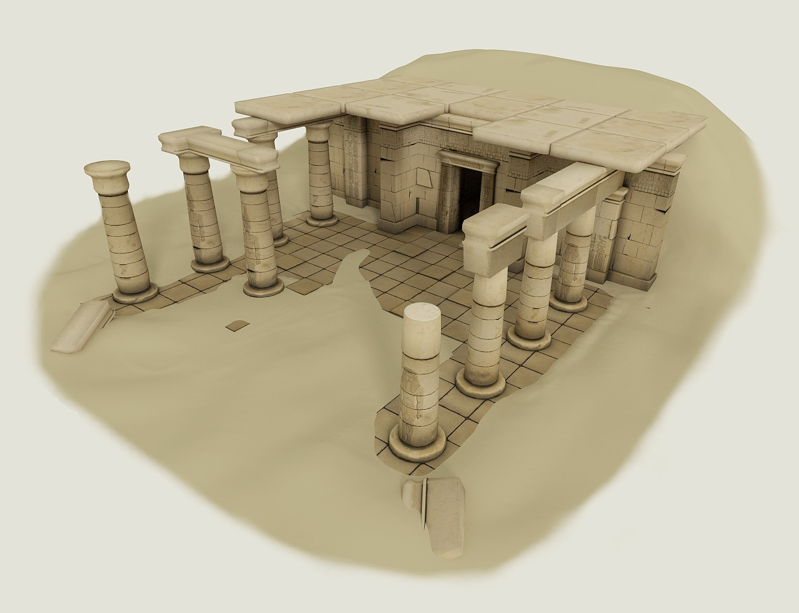
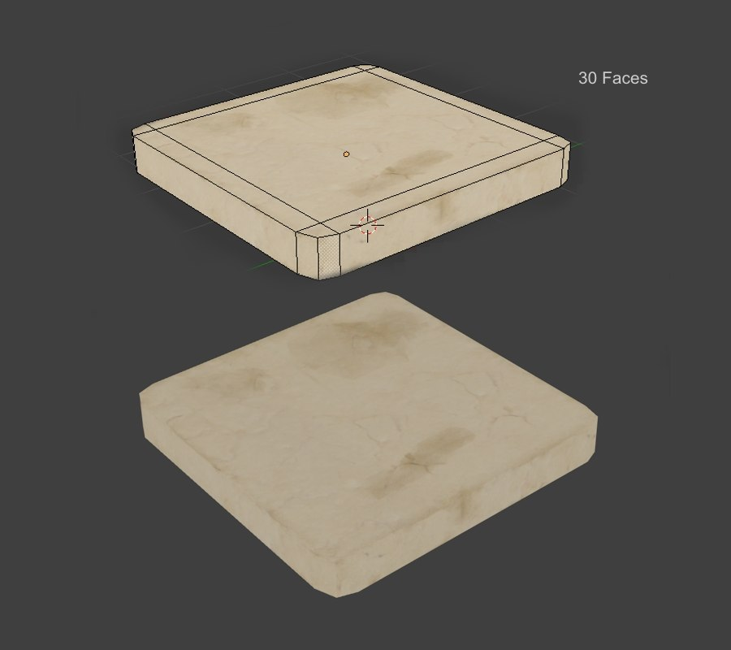
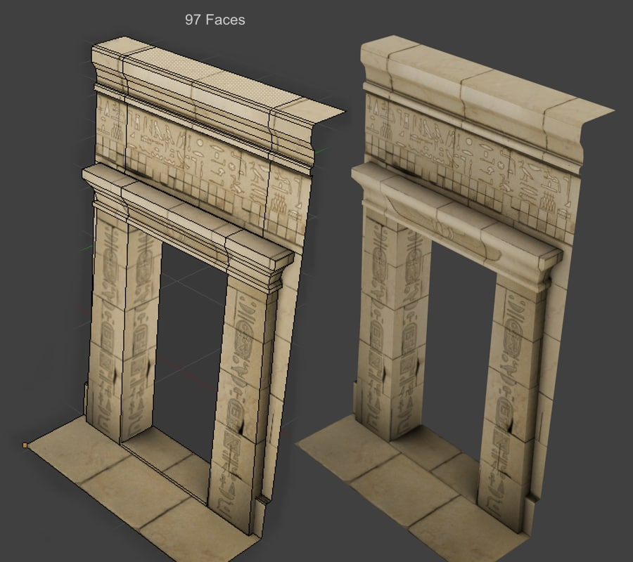

---
html:
  embed_local_images: false
  offline: false
export_on_save:
  html: true
---

# ACR103 Week 5

<!-- @import "[TOC]" {cmd="toc" depthFrom=1 depthTo=2 orderedList=false} -->

<!-- code_chunk_output -->

1. [ACR103 Week 5](#acr103-week-5)
   1. [Assessment 1 Received](#assessment-1-received)
   2. [Weeks 5-8, modeling game environments](#weeks-5-8-modeling-game-environments)
   3. [Assessment 2: Level Modeling](#assessment-2-level-modeling)
   4. [How will we do it all?](#how-will-we-do-it-all)
   5. [This week](#this-week)
   6. [Next week (w6)](#next-week-w6)

<!-- /code_chunk_output -->

## Assessment 1 Received 

Thanks for assessment 1 submissions.
* A couple issues, i’ve messaged those people about correcting submission

## Weeks 5-8, modeling game environments

We'll learn about:
#### Modular modelling
  - Assembling usable level pieces from basic components
  - components like floors, walls, columns, doors
  - level pieces like repeating wall with floor, corner of room etc

**Modular (simple) in the real world:**

_Bunnings modular storage_

**Modular level construction:**

Examples by [Glenatron](https://polycount.com/discussion/158818/another-modular-dungeon-tileset):

**Components for making modules**

**Levels made from modules:**

| pieces      | makes
|---          |---
| wall        | basic component 
| floor       | basic component 
| wall+floor  | wall_floor module
| 2 walls + floor | wall_floor_corner module
| 5 x wall_floor  | one side of a corridor? | 

**NEEDS PICTURE** - Table here is fine but not alone

#### Texturing
  - uv unwrapping
  - Applying textures
  - Creating/editing textures
  - Using wacom tablets
  - 3d coat and painter

_Low poly dagger with hand painted texture (diffuse)_

**ATTACH MAYA PROJECT**

## Assessment 2: Level Modeling

(I'll provide a few concepts. You will be designing an environment based on the elements and style in them. You can modify the scene from say a level 1 dungeon to level 5 dungeon, or a lounge room to an attic bedroom). You can add elements that aren't there, but aim to match the style as if the game exists)
Designing and creating environment for game based on scope sheet from teacher

**Scope will include:**
1. Existing or theoretical world (ie strategy in world of paper blocks)
2. Creative expects: C.D., genre, texture quality/style, model quality/style.
3. Tech spec: poly count, texture specs, topology (quads or tris)

**10-15 modular assets! **

Lighting: export to Unity and bake in ambient occlusion.

DELIVERABLE: 
* Unity project
* Interactive level scene
I'll provide a unity project with the camera already set up.

## How will we do it all?

- Choose and modify/extend a concept
- Model and uv unwrap in Maya
- Test with a texture designed to help uv mapping
- Export to 3D Coat/Photoshop for texturing.
- Import components to Unity
- Make simple prefabs
- Snap pieces together

## This week

### Styles
levels

### Choose concept

### Rough design of your level

### Figure out components you'll be making.

### model and texture a wall and floor 

Some simple, effective construction:

*ATTACH A MAYA SCENE WITH EXISTING MODULES FROM COMPONENTS, ALREADY SET UP WITH PIVOT POINTS AND GRID**

Make some modules by duplicating (ctrl-d) and moving components:
  - select translate tool (w)
  - enable grid snapping (hold down x)
  - click and drag the translate handle

**GIF OF DRAGGING COMPONENT AND SNAPPING** 

* Make a wall plane, a floor plane
* Make a column
* Move our pivot points using d (modify pivot)
* Place our objects

**GIF OF DUPLICATE, DRAG, SNAP**
Screen cap showing keypresses would be ultimate
  
## Next week (w6)

#### Assessment deliverable: present your designs in class
Work along as we uv unwrap a model, apply uv texture.
Pick simple component to model
