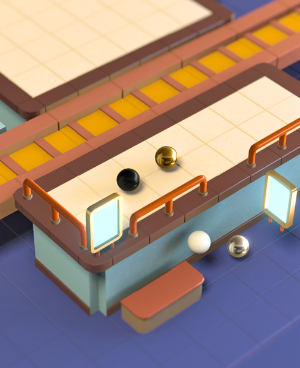
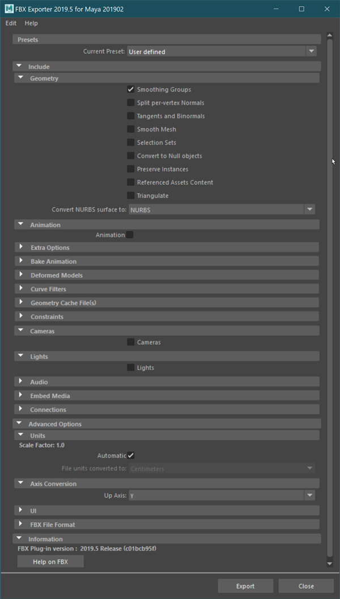
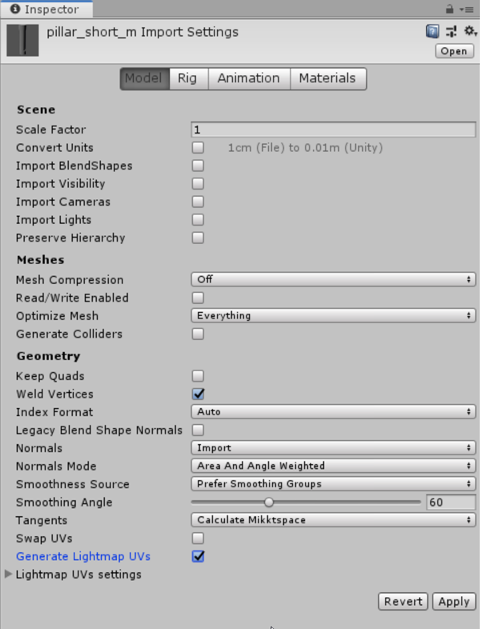

---
html:
  embed_local_images: false
  offline: false
export_on_save:
  html: true
---

# Week 7: Maya To Unity

<!-- @import "[TOC]" {cmd="toc" depthFrom=1 depthTo=3 orderedList=false} -->

<!-- code_chunk_output -->

- [Week 7: Maya To Unity](#week-7-maya-to-unity)
  - [Realtime vs offline rendering](#realtime-vs-offline-rendering)
  - [New Videos](#new-videos)
  - [Short getting started videos](#short-getting-started-videos)
  - [Prepping for export](#prepping-for-export)
  - [The Unity Project](#the-unity-project)
  - [Exporting to Unity](#exporting-to-unity)
  - [Making Modules](#making-modules)
  - [Prefabs](#prefabs)

<!-- /code_chunk_output -->

## Realtime vs offline rendering

3D rendering isn't defined by a single piece of software or target use/audience. It's the many ways that data definining 3D scenes/objects (in text or binary files) can be converted into viewable images.

**Arnold:** Offline renderer supported by Maya and other 3D programs.

**Unity:** A game engine and editing environment that uses a realtime renderer to create many frames per second.

> **Offline rendering** is the generation of images from a 3D scene to be used either statically or assembled into a video sequence. It can take seconds, minutes or hours to generate a single image.

> **Realtime rendering** is the very fast generation of images from a 3D scene to display games (or other experiences) at up to hundreds* of frames per second

_60 frames per second enables exciting experiences like 'dwarf glowers at camera' and 'zombie council worker encounter'_

_* A realtime game engine could in theory generate thousands of frames per second, but our monitors wouldn't make use of them._ 

## New Videos

I've recorded some new, more in depth videos since class. These first few deal with adding the stairs to the Unity scene.

### Stairs

Grab the [new scene here](https://www.dropbox.com/s/zwh16jj6i2qhpim/ACR103_Lastname_Firstname_Level_RENAME.zip?dl=1) 
- **Sift through the content** and see if it answers (or provokes) any questions 
- Use it as the base for your assessment. **import your own meshes** and delete mine.

#### The scene, the task, the plan:
<iframe width="720" height="480" src="https://www.youtube.com/embed/X1XSW7XNOu4" frameborder="0" allow="accelerometer; autoplay; encrypted-media; gyroscope; picture-in-picture" allowfullscreen></iframe>

#### Tweaking, prepping, crashing, pushing through:
<iframe width="720" height="480" src="https://www.youtube.com/embed/6YUW9998U80" frameborder="0" allow="accelerometer; autoplay; encrypted-media; gyroscope; picture-in-picture" allowfullscreen></iframe>

#### Exporting, crashing,
<iframe width="720" height="480" src="https://www.youtube.com/embed/93SVx4B9htc" frameborder="0" allow="accelerometer; autoplay; encrypted-media; gyroscope; picture-in-picture" allowfullscreen></iframe>

## Short getting started videos

The videos in the sections below are unchanged from class. 

## Prepping for export

Each piece needs to arrive in Unity ready to use: 
* It has a reasonable name
* It appears at the origin if zeroed out
* If it's one 1m grid unit in Maya, it matches that in Unity

<iframe width="720" height="480" src="https://www.youtube.com/embed/Gzi4g21NnM8" frameborder="0" allow="accelerometer; autoplay; encrypted-media; gyroscope; picture-in-picture" allowfullscreen></iframe>

**To add:**
// Insert short video on adding to and removing from display layers
// Grouping to organise
// How much prefabbing/modularity req'd
// More on Materials

## The Unity Project

1. Grab my (updated) [lit unity scene here](https://www.dropbox.com/s/zwh16jj6i2qhpim/ACR103_Lastname_Firstname_Level_RENAME.zip?dl=1)
2. Unzip it and rename the folder inside so it has your Lastname and Firstname. Erase the "RENAME" bit. You should be renaming a folder that contains the Assets, Library etc folders.

## Exporting to Unity

Next we'll import your level pieces into it.

<iframe width="720" height="480" src="https://www.youtube.com/embed/N0rx9-CBhBw" frameborder="0" allow="accelerometer; autoplay; encrypted-media; gyroscope; picture-in-picture" allowfullscreen></iframe>

#### File export settings

#### File import settings

## Making Modules
<iframe width="720" height="480" src="https://www.youtube.com/embed/52moIwsKpIc" frameborder="0" allow="accelerometer; autoplay; encrypted-media; gyroscope; picture-in-picture" allowfullscreen></iframe>

## Prefabs
<iframe width="720" height="480" src="https://www.youtube.com/embed/UeC2UtKhnk4" frameborder="0" allow="accelerometer; autoplay; encrypted-media; gyroscope; picture-in-picture" allowfullscreen></iframe>

