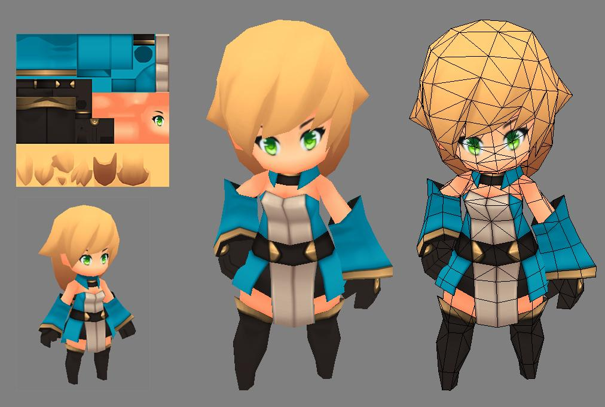
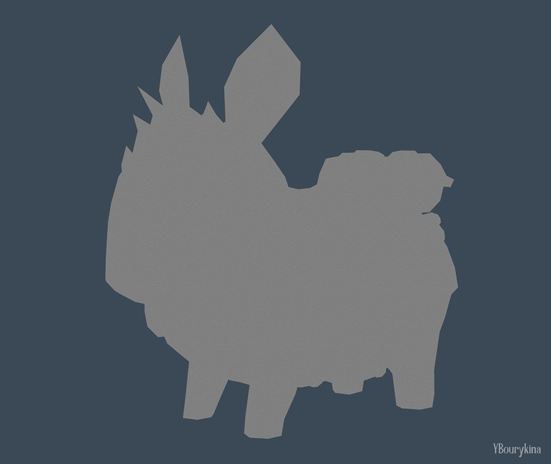
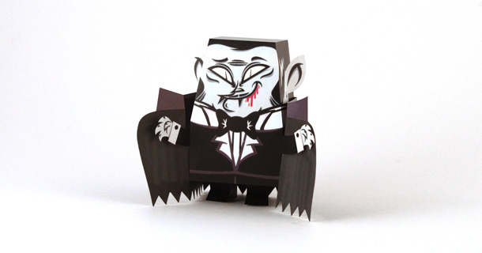
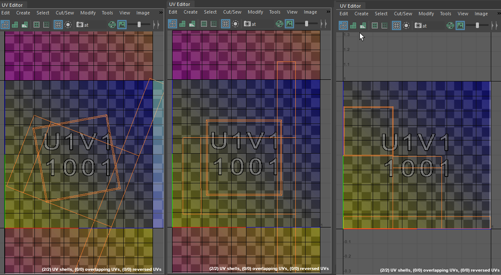

---
html:
  embed_local_images: false
  offline: false
export_on_save:
  html: true
---
# Week 9: Modeling Characters

<!-- @import "[TOC]" {cmd="toc" depthFrom=1 depthTo=3 orderedList=false} -->

<!-- code_chunk_output -->

- [Week 9: Modeling Characters](#week-9-modeling-characters)
  - [Character modeling!](#character-modeling)
    - [Biting off what you can chew](#biting-off-what-you-can-chew)
  - [Assessment 3](#assessment-3)
    - [Deliveries by week](#deliveries-by-week)
  - [// DISCUSSION LINK](#discussion-link)
    - [Week 11](#week-11)
  - [Model with me](#model-with-me)
  - [// FILE LINK](#file-link)
    - [Priority 1: Folder organisation](#priority-1-folder-organisation)
    - [Pureref refresher](#pureref-refresher)
    - [Maya project setup refresher](#maya-project-setup-refresher)
  - [Choose your concept](#choose-your-concept)
    - [Style reference](#style-reference)
  - [Texturing and UVs](#texturing-and-uvs)
  - [Textured characters: like vinyl wrapping](#textured-characters-like-vinyl-wrapping)
  - [UV with me](#uv-with-me)
    - [Bad UVs](#bad-uvs)
  - [IMAGES // Unfold and Layout settings](#images-unfold-and-layout-settings)
  - [Resources](#resources)
    - [Uv tutorials](#uv-tutorials)
    - [Krita painting app](#krita-painting-app)
    - [Kelvin Tan teaches 3D Coat](#kelvin-tan-teaches-3d-coat)

<!-- /code_chunk_output -->

## Character modeling!

_Mira by [EelGod on Deviantart](https://www.deviantart.com/eelgod/art/Mira-Model-570220497)_

It's a deep subject
It includes:
* Prop and hard-surface modeling skills
  - They have props on them, they wear armor/tech
* Knowledge of anatomy, and mechanics of movement 
* Understanding of facial expressions and how to support them
* Great subtlety: the brain dedicates a lot of neurons to recognising human faces and forms. Tiny differences stand out.

>**Anyone\* can learn**, it's just practise + study:
>- Anyone who is super invested
>- It requires a disgusting amount of hours put in
>- That's before and during a career, at work and at home

### Biting off what you can chew

We're learning a bunch at once: 
1. how to model a character from concept + style reference 
2. How to uv unwrap.
2a. How to uv unwrap a character, which is specialized
3. How to use 3D coat and photoshop in texturing
4. How to paint stylized characters for games
  
**That's more topics than we have weeks.**

The answer: choose and model simpler, stylised characters with low polygon counts.

## Assessment 3

Modeling, texturing and exporting a character to a game engine.

### Deliveries by week

I'll be tracking discussion post updates week by week, and this will feed into your marks on discussion participation and use of in-class techniques (30% of assessment marks)

Several will be via discussion group
## // DISCUSSION LINK

#### Week 10

Due **Weds 20/11**. Update discussion post with:
* A screenshot of pureRef displaying your :
  - 2D Concept image
  - 3D modeling/texturing style reference
* Discussion of what attracts you to the character concept and why you chose the style reference
* Screenshots of your 3D model in Maya showing its topology and form.

### Week 11

Due **Weds 27/11**. Update discussion post with:
* Feedback on two other students' model topology from week one
* Two Maya screenshot of your UV unwrapped character
  * In Maya's UVS workspace: perspective panel, uv editor.
  * With _image->dim_ enabled in uv settings so wires are clear
  * All character pieces selected so all uv wires are shown.
  * One shot with checkerboard turned on to show even coverage
  * Another shot with stretch/distortion hilighting enabled 
* A screenshot of your character in 3D Coat with baked ambient occlusion and first pass flat colours.

## Model with me

Grab this download:
## // FILE LINK
PureRef portable, .pur file with images already in.

### Priority 1: Folder organisation

If you go in without a strategy, files and folders for even a single application like Maya or Unity get messy fast. 

> "Mess is the enemy of productivity." - every professional ever.

Let's start by making a folder structure

- acr103
  - assess
    - a3_character
      - 

### Pureref refresher

### Maya project setup refresher
Modeling a basic character for texturing

* Identifying what needs geometry, what can be painted in.
* Minimum geometry for maximum value
* Poly count HUD
* Importance of hard vs soft normals

## Choose your concept

We won't be using our own concepts for this.

Here's a discussion between the Flipped Normals guys (industry pro character modelers and teachers) about why modeling from your own concepts is a bad idea for early learning and making portfolio pieces:

_The meant to say: don't (or rarely) use your own concept art for 3D modeling when learning_

### Style reference

Style reference is critical
* You don't have one yet
* There are maaaany ways to translate 2D to 3D
* It's often not covered in the concept, and never 100% covered
* You will usually model to a style guide for a game
  

Images of concepts
Images of style reference

Choose your concept.
Choose your style reference.
Load into PureRef
Screenshot
Post to discussion.

## Texturing and UVs

Textures are 2D images wrapped around 3D objects. Think of a cereal box: if you open the ends and cut down one long edge of the box, it can all be layed out flat.

To see the cereal box taken to fun places, check out papercraft toys:

_Click unfolded Dracula to download a pdf pattern_

_Click unfolded monster to download a pdf pattern_

_No PDF: just download this picture to make a lootbox_

## Textured characters: like vinyl wrapping

_Various layers of pbr texturing applied to DVa as images_

## UV with me

Let's uv the guy we modelled. 

### Bad UVs

Objects have a default uv layout when Maya creates them. Usually they become badly distorted as you model.

Think of when you try to wrap a christmas present. Wrapping paper has no stretch to it, so it wants to crunch up in some places and threatens to tear in others. If it was stretchy and sticky, you could get it to follow the surface.

When we uv unwrap we have that sticky, stretchy material. The challenge is to find ways to reduce that without stretching the image too much. Picture stretched reindeers or bent, skinny santa. 

_One side looks blank, the other is striped and full of errors_

#### Create new starting UVs:
  
  - Go into Maya's UV workspace
  
  - In the perspective view, tumble and look the model from above at 45 degrees, like in the image below
  - UV Tookit -> Create -> Camera-based
  
  
The new UVS are distorted in 2D to resemble what the camera saw. They're all joined together like the mesh too. We need to cut it like papercraft.

#### Cutting and unfolding
  - In edge mode, select (and shift select) edges to cut
  
  - UV Toolkit -> Cut and Sew -> Cut
  
These next steps were all done by hand previously (and often still are):
  - Select all edges
  - Uv Toolkit -> Unfold -> Unfold
  - Uv Toolkit -> Arrange and Layout -> Auto Orient
  - Uv Toolkit -> Arrange and Layout -> Layout
    - We'll try to roll with default here
  
  _Unfolded, oriented, then laid out. Colours altered in photoshop._

Unfold and Layout have plenty of settings. Lets have a look at good settings to start with.

## IMAGES // Unfold and Layout settings 

- [Download Krita portable for Uni workstation](https://sourceforge.net/projects/portableapps/files/Krita%20Portable/)

## Resources 

### Uv tutorials

I haven't watched yet:

[
_Bunny unwrap tute made in 2018_](https://www.youtube.com/watch?v=VHUJ-kte1n8)

### Krita painting app
If you don't have photoshop at home, Krita is a great free alternative. 
* For your own machine you can download the full installer, 
* On a uni workstation you'll need the portable (runs without install) version:
  - [Download Krita portable for Uni workstation](https://sourceforge.net/projects/portableapps/files/Krita%20Portable/)

### Kelvin Tan teaches 3D Coat

I first learned how to texture in 3D coat from Kelvin's sci fi gun tute. He's a (former?) Blizzard artist who worked on WoW. Along the way he drops knowledge on lighting, design, readability and more.

[His tutes on Gumroad](https://gumroad.com/turpedo#uYYtu) are paid ($10 US for the gun tute) so I can only suggest that it's very, very worth your money. And more.

