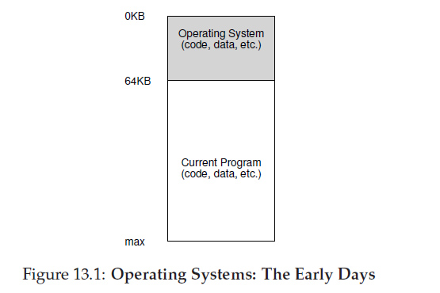
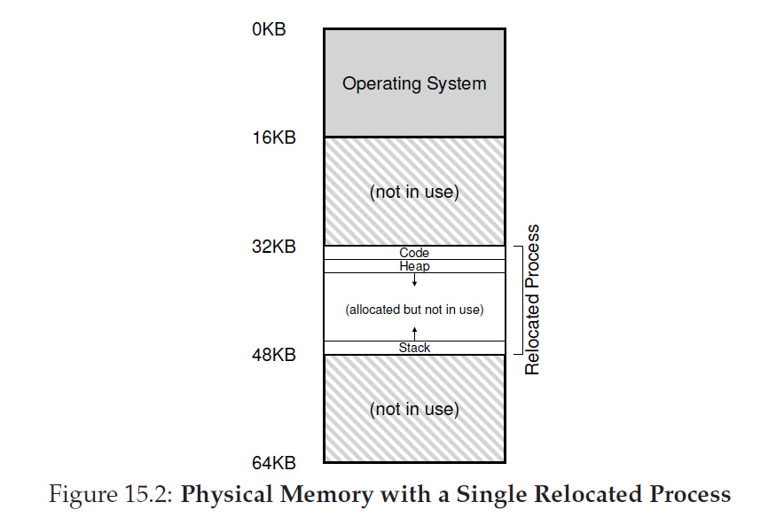
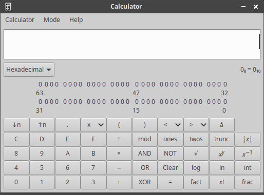
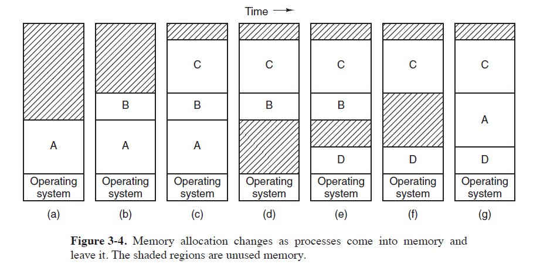
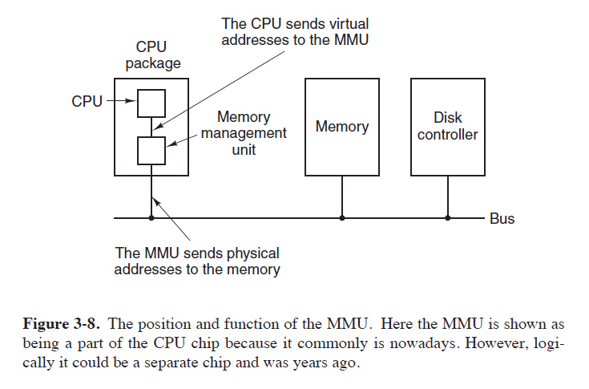

# Week 11 - Virtual Memory

## Policy and Abstraction

We've talked about:

* the nitty gritty, hardware side of virtual memory as a **practise**
* Why it's **useful**. 

Now, it's on to the operating system's job.

> Operating systems present **complex hardware and complex code as real functionality**. 
> 
> Much like government taking ideas like public health care and ideal traffic management and putting them into practise, an operating system needs **policies**.
> 
> When we present overwhelming complexity in an understandable service, we define **abstractions.**

---
## Memory Abstraction

At home, we probably think of ourselves as the OS's client. 

In practise you might say **processes are the real clients**, and the programmers who write them. We're inputs to those processes.

> To make hardware devices simple and useful to processes, they are presented as **abstractions**.

> Virtual memory is the use of memory abstractions to provide a **useful, simple, safe living space** to running processes. The abstraction: an **address space**



_Early machines: one os, one process_

---

## Base and Bounds

Assign a starting address and a total size allowance.

 * **Base**
	* Beginning address in memory
 	* The program sees this as zero
 	* Code here followed by heap
   * It's kept in a register in the CPUs mmu
 * **Bounds**
   * How far you can expand
   * Stack starts here, builds toward heap.



### Linux Time
Exploring a model of a base and bounds

```bash
student:$ cd CAO201/repos/
student:$ ls 
"ostep-code-dmac  ostep-projects-dmac  ostep-python-sims-dmac"

## If you don't find the ostep-python-sims-dmac folder, pull it from git like so:

student:$ git clone https://github.com/DannyMcGillick/ostep-python-sims-dmac.git ostep-python-sims-dmac

## Things download
student:$ cd ostep-python-sims-dmac/module_6
student:$ python3 relocation.py
student:$ python3 relocation.py -a 16k -p 32m

```

Hex calculator time:



_mate_calc in programmer mode_

___________________________

## Dynamic Relocation and Swapping

What if a process is right in the middle of the big chunk we need to load photoshop?

> **Dynamic relocation:**
> * Moving the process in memory. 
> * Can provide more room for process, or make room for incoming.
> * With base/bounds, all we need to do is change the base address and bounds (if size grows)



> **Swapping:**
> * System extended from swapping memory spaces to swapping with slower storage
> * Simplest: whole process memory space eitherin ram or disk
> * Virtual memory: when you slice into sub-process slices

---

## Managing Free Memory

We’ve had magical knowledge of free space and used space. How does OS know in reality?


### Bitmaps

Directly maps the used state of multiple bytes to a single bit. If you allocated each bit 1/2 of your RAM you'd need two bit.

*  More realistic eg: 1 8 byte word? 2 KiB?
* Similar to cluster size when formatting.
* A long list of bits.
* Sequential data of a fixed size.
* What happens each time a process requests contiguous mem?


### Linked lists

A list of runs/stretches of contiguous memory that is either free (a hole, **H**) or allocated (to a process, **P**).

* Each listed record also has a start point and length. 
* First Fit. Repurcussions?
* Next Fit. First fit without backtracking.
* Best fit. Preserve big holes -what costs?
* Quick fit: lists of fits. Tailor vs S M L

## VM Recap

Treating memory as a series of slices, rather than process sized chunks, is mate from module 3: paging




* Page tables
  - pic of table
  - pic of address translation figure 3-11

* Page tables for lots of memory (multi level?)

* TLB for speeding up access.
  What does it do and what happens when it fails?


## Page Replacment - Technically next wk.

When you need a page that isn't in memory you have to load it in. Conversely, a page in memory has to get the boot. How do you choose?

> **The dream: last pick gets the boot**
>
>If you tag each page with the milliseconds from now till the time it will finally be called on, the one with the highest number is the obvious candidate.
> 
> * Something is wrong with this solution. What?
> * Yet it's actually useful. How?

> **Not Recently Used**
>
> Not that popular. Technically someone invited you, but she hasn't talked to you all night.
> * Class based. 
>   0: not referenced, not modified 
>   1: not referenced, modified 
> 	2: referenced, not modified
> 	3: referenced, modified
> * Random 0 class page is asked to leave.
> * Better to remove modified but unreferenced than one heavily referenced.. it has about 20ms.