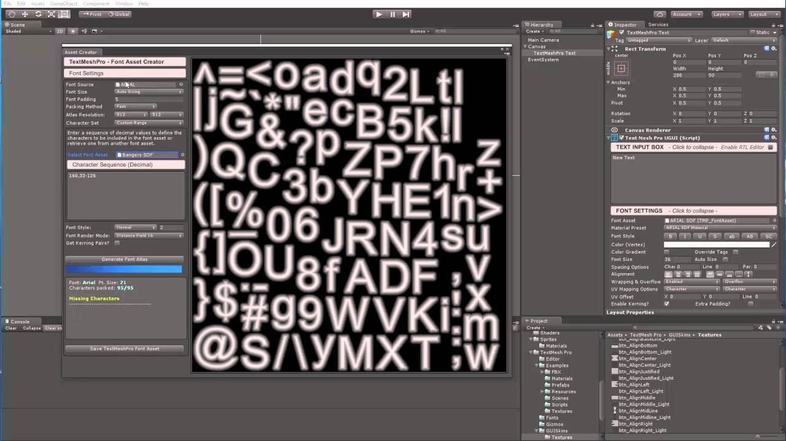
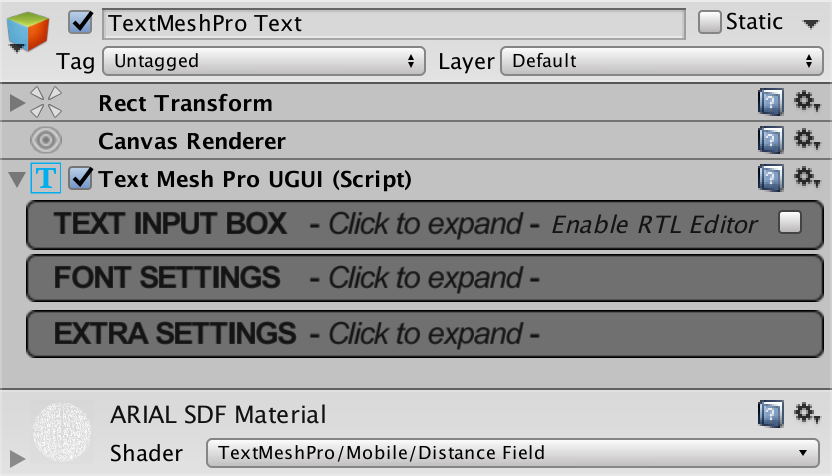

# Week 11 - Time, text, collisions

Hitting as many useful assignment-finishing tools as we can.


<!-- @import "[TOC]" {cmd="toc" depthFrom=1 depthTo=6 orderedList=false} -->

<!-- code_chunk_output -->

1. [Week 11 - Time, text, collisions](#week-11---time-text-collisions)
   1. [Todo](#todo)
   2. [Resources](#resources)
   3. [Scoring/Displaying text](#scoringdisplaying-text)
      1. [Adding UI canvas and text](#adding-ui-canvas-and-text)
   4. [Doing things over time](#doing-things-over-time)
      1. [Things that need timing](#things-that-need-timing)
      2. [Ways to time](#ways-to-time)
         1. [Invoke](#invoke)
         2. [Update and time.deltaTime.](#update-and-timedeltatime)
         3. [Coroutines](#coroutines)
      3. [Time with a coroutine](#time-with-a-coroutine)
      4. [More info on coroutines and threads](#more-info-on-coroutines-and-threads)
      5. [Releasing waves - spawning](#releasing-waves---spawning)
      6. [Psuedocoding the waves](#psuedocoding-the-waves)
   5. [Missiles](#missiles)
      1. [Aiming things at things](#aiming-things-at-things)
      2. [Moving things at a given speed](#moving-things-at-a-given-speed)
      3. [Colliding things](#colliding-things)
      4. [Missile explosions](#missile-explosions)

<!-- /code_chunk_output -->


## Todo

* Finalise, as much as you can, hacknplan tasks
  - You'll notice the burndown doesn't progress if you're still adding new tasks at the rate you're finishing others
* Game should be basically done by next class.

## Resources

Collisions:
  - Official docs https://docs.unity3d.com/ScriptReference/MonoBehaviour.OnCollisionEnter2D.html
  - Colliders and triggers https://youtu.be/RxG7YYEdmVE

Timers:
  - Blog tute: [Build a reusable timer](https://medium.com/@jaredehalpern/build-a-reusable-timer-in-unity-to-control-explosions-and-other-fun-stuff-too-1689210b733)
  - Docs: [StartCoroutine](https://docs.unity3d.com/2017.4/Documentation/ScriptReference/MonoBehaviour.StartCoroutine.html)
  - Docs: [Waiting for game seconds](https://docs.unity3d.com/2017.4/Documentation/ScriptReference/WaitForSeconds.html)
  - Docs: [Waiting for real world seconds](https://docs.unity3d.com/2017.4/Documentation/ScriptReference/WaitForSecondsRealtime.html)

TextMeshPro:
  - Unity Blog: <https://blogs.unity3d.com/2018/10/16/making-the-most-of-textmesh-pro-in-unity-2018/>

## Scoring/Displaying text

We're used to text being an everyday thing in our apps. Word, web browsers, photoshop and so on. But these are inherently 2D apps. How are fonts drawn in a world of polygons and textures?

Traditionally:
1. Use an image editor to **place all the characters and symbols you want in a bitmap**
2. Arrange them all to fit in a power of 2 square (256x256, etc)
3. **Define rectangles for each letter** in your game engine
4. Create a material with the font atlas as a teture
5. For each letter in a string **generate a quad with UV coordinates** to match the letter's rectangle, add the font material.


That's a lot of work. So someone made TextMeshPro for Unity, and Unity bought it.

> TextMeshPro has an atlas generator for the first 3 steps, and components for the rest.




### Adding UI canvas and text

Unity UIs are contained within a component called a **canvas**. It does a lot, including fitting our UI to our window and adapting to resolution changes.

* Creating a UI Canvas
* Creating tex mesh pro (TMP) label
* Editing TMP text in script

```cs
// Code from unity incoming

```

## Doing things over time

We've all played games where time is critical. Time to finish a level, time per lap, time to get out of a space station before it blows.

Timings affect us in lots of other scenarios. Cooldown times, facility/vehicle upgrade and repair times, rounds fired per second.

### Things that need timing

Potential things that need timing

> - From press play 
> - From level finish (last missile destroyed) till next level, showing results
> - From game over till game over graphics appear, play out and show play again or return to home screen

How do we specify a series of times, say:
 1. 0s
 2. 1.3s, 
 3. 3.1s

### Ways to time

#### Invoke

Invoke will call a function after a given delay. This doesn't pause your program like sleep would in c++. Execution continues.

From [Stack Overflow](https://stackoverflow.com/questions/30056471/how-make-the-script-wait-sleep-in-a-simple-way-in-unity)
```cs
void Start()
{
    Invoke("feedDog", 5);
    Debug.Log("Will feed dog after 5 seconds");
}

void feedDog()
{
    Debug.Log("Now feeding Dog");
}
```

#### Update and time.deltaTime.

Basically counting time as update executes over and over. Then after a certain time, doing something. 
* This is okay for the same thing happening at intervals.
* A sequence of things happening with various timings gets trickier/messier. Maybe a combo of a list and a function?

From [Stack Overflow](https://stackoverflow.com/questions/30056471/how-make-the-script-wait-sleep-in-a-simple-way-in-unity)
```cs
float timer = 0;
bool timerReached = false;

// Modified from stackoverflow a little
void Update()
{
  if (!timerReached)
    timer += Time.deltaTime;
    if (timer > 5)
    {
      Debug.Log("Done waiting");
      feedDog();

      //Set to false so that We don't run this again
      timerReached = true;
    }
  }
}

void feedDog()
{
    Debug.Log("Now feeding Dog");
}
```

#### Coroutines

What if we could pause a function and come back to it after a given interval. That way our timed things could all be encapsulated in one function, and we could do stuff while it's paused. A coroutine is a function, but it's also a similar to a process that can be stopped and started, returning control to our main execution.

From [Stack Overflow](https://stackoverflow.com/questions/30056471/how-make-the-script-wait-sleep-in-a-simple-way-in-unity)

### Time with a coroutine

```cs

private List<float> _times;

void Start() {
  TriggerAWave();
}

// Regular old routine kicking off a special routine, one that can stop and start.
void TriggerAWave()
{
  List<float> times = new List<float>() { 0.0f, 4.0f, 2.5f, 6.0f };
  Debug.Log("We'll call the wave releaser");
  StartCoroutine(ReleaseWaves(times));
  Debug.Log("While it does its wave thing we keep going.");
}

private IEnumerator ReleaseWaves(List<float> waitTimes)
{
  Debug.Log("ReleaseWaves here, starting.");
  foreach (float waitTime in waitTimes)
  {
    yield return new WaitForSeconds(waitTime);
    Debug.Log("Waited for " + waitTime + " seconds");
  }
  Debug.Log("Releasewaves done, signing off");
}

```

### More info on coroutines and threads
Coroutines: multiprocessing/multitasking within the main game engine loop/thread. Doesn’t establish a system thread.
Up: doesn’t risk race conditions, threads corrupting data, easy to follow, allows multitasking. Before multi core processors and multithreaded applications,all multitasking was achieved like this. Most games still rely on single core performance like this.

Down: not a true thread so can’t run on a separate core for performance boost, will bog down all code if heavy

Coroutines: asynchronous things, simple timers
Threads: long intense operations like file save, AI, path finding. If you’ve studied threading. They are simple in concept and stupendously complex in action. The bugs they generate are capricious in the extreme.

You cant necessarily prove that threads are bug free/safe, because the scenarios that can affect them (stopping in the middle of any of millions of individual machine code instructions in any order) aren’t realistically reproduceable.

### Releasing waves - spawning

> Within each wave you can spawn your missiles. It's just a matter of knowing how many you want to launch, from where, and in what direction. 

* Some sort of WaveManager could handle this
* Or code in GameManager, a GameModel or elsewhere.

### Psuedocoding the waves

```
//////// LevelManager -

A MissileShot has a launch angle and position
A Wave has all the missile shots for one wave and a duration
A Level has all the waves for a level
A list of levels exists

When asked to:
  
  grab next level from list
  while there are waves left in level
    
    for each MissileShot
      create an alien missile from a prefab, add to a list
      add listener for demise of any missiles, which removes from list
      Rotate and position it accordingly
      Fire it
      Publicise the info with a link to the missile
      
    Wait for wave duration

  loop for remaining waves

  while there are still missiles in list
    listen for and remove any remaining missiles
  loop while
  announce level complete

//////////////// Game Manager/Model:
start game

While player isn't dead
  Ask Level Manager to kick off a level
  Listen for level complete
  Show results of level, wait a bit
loop

show final result.
play again?
```

## Missiles

Firing at targets. Maybe at the start of a wave all 3 volleys of missiles are aimed and prepped? If the city is destroyed before they arrive/fire so be it.

### Aiming things at things

Remember when we're doing trig in a 2D plane, 0 rotation points us along the x axis to the right. Positive rotation goes anti clockwise. If you want a sprite to point at things properly, have their axis at 0,0 and their pointy end along the x axis.


### Moving things at a given speed

2D objects can't use transform.forward, because that's the Z axis. Use transform.right.

### Colliding things

### Missile explosions

* spawn where our rocket stops (ie where we clicked)
* instantiate/spawn an explosion
  
Explosions can be grown
* with unity animation tools
* Lerp(linear interpolation/tweening)
* just scaling over a series of frames in Update.

Colliding things: our missiles grow, so must their collider. Check for a hit. We meed to know what hit what, to assess damage.

Options: triggers, colliders. Throw events that game sim and scoremanager hear. Maybe scoremanager hears it from sim

