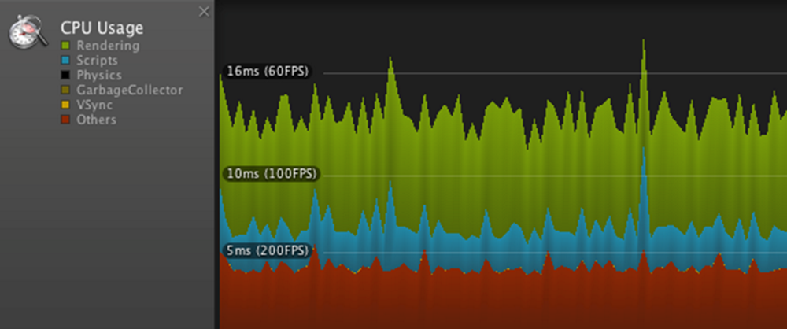

# Week 12 - Performance, debugging

## Resources

* Unity 3D college on debugging:
  - https://www.youtube.com/watch?v=y3kqIlLzIig
* Unity official: optimization garbage collection
  - https://unity3d.com/learn/tutorials/topics/performance-optimization/optimizing-garbage-collection-unity-games

## Squashing bugs

The types of bugs in our code seem to be at least as numerous as the tools available to us. So far we've had a pretty limited set of techniques for finding them: logging to console, running the build often, working in small scale/isolation when trying something out.

Eventually though, you get 
* big games that are slow to build
* things that can be only run amid complexity
* restricted by the limits of the console

### Enter the debugger

A debugger is a shockingly powerful program that can look into the **memory used by** and **execution of your program** in real time. It can
* step over line by line, 
* *stop at breakpoints. 
* give you access to variable values as they're changed, including lists and objects, without console
* often include a few performance stats 

Some of you will have used a debugger in say visual studio for c++/c sharp, or elsewhere for python. You might think 

## Spaceship earth

As wave after wave of death dealing alien hardware is flung at the homes and businesses of everyday earthlings, **masses of resources are going into the creation of weapons and cleaning up in their aftermath.**

This isn't just in the fantasy of the game. 

> We're instantiating human and alien missiles, trails and explosions for potentially hunderes of waves. Each one uses memory and processor time, and it takes time and effort for unity to recover resources when each is finished with.

### Limited resources

You might think about this much on quade core Windows machines with 16GB of RAM, but if you're outputting to other platforms this becomes critical
* Mobile phones/handhelds: Not much ram, not much processing power. Do not spend it all on disposable assets.
* Console: At the start of a generation these specs seem pretty nice, but can become very constraining as people come to expect more.
* VR users can be very sensitive to frame rate changes. If your game makes them sick, it doesn't matter how fun it is.

### Manual Memory Management

What we had. Malloc, dealloc.

### Garbage Collection

Let the garbage man decide what's unwanted and take it away.

Obvious upside:
Almost no manual memory management!

Dangers for the inexperienced: Garbage collection tends to take what would have been done manually, spread out over time, and lump it into passes. 
* Fine if they're not cleaning up too much. 
* Give them a lot to clean up and like anyone else, they need time and resources. And that causes stutters in your game's frame rate and response.  

## Looking at performance

Profiler!
Last week I gave you guys a function to move a missile over time, and it used time.elapsedTime to make sure things moved well regardless of how long frames took to render. 
Today we talked about how garbage collection can impact your game.

How can we visualise it?

## Optimising

How can we manage problems like big garbage collection hits and constant resource creation

### Object pooling!

Concept of object pooling.

### implementation of object pooling?

Go with simple example. Link to old mate.