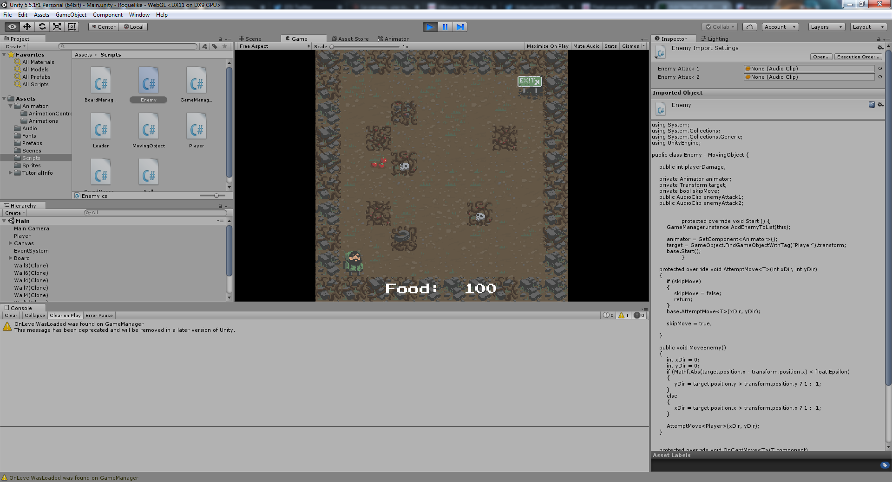
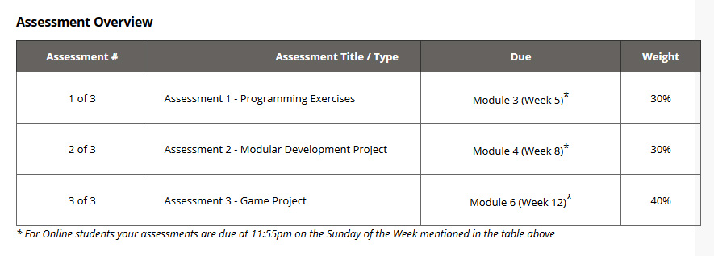
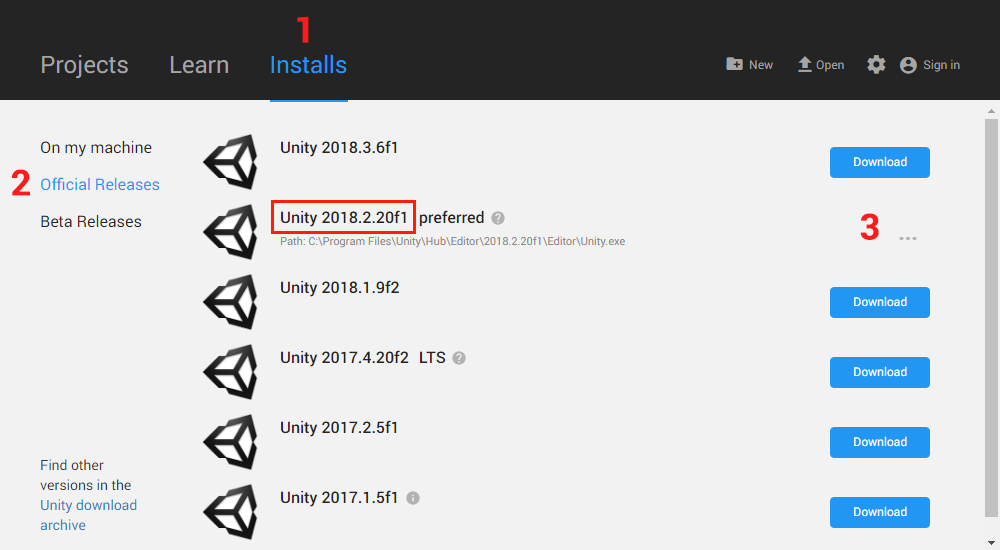
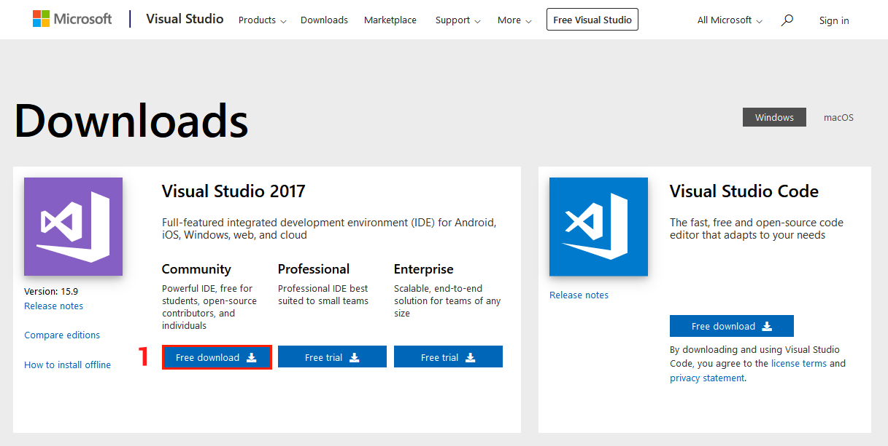

# GPR103 Week 1

Welcome, Object Oriented Design, C#


<!-- @import "[TOC]" {cmd="toc" depthFrom=1 depthTo=6 orderedList=false} -->

<!-- code_chunk_output -->

- [GPR103 Week 1](#gpr103-week-1)
  - [Part 1 - Studying 2D Games Programming](#part-1---studying-2d-games-programming)
  - [Who are we?](#who-are-we)
  - [How will we make 2D games?](#how-will-we-make-2d-games)
    - [C++?](#c)
    - [Unity, C#?](#unity-c)
    - [Visual Studio Community](#visual-studio-community)
  - [Dammit Jim! I'm a programmer, not an artist.](#dammit-jim-im-a-programmer-not-an-artist)
  - [Dammit Jim! I'm an artist, not a programmer!](#dammit-jim-im-an-artist-not-a-programmer)
  - [Hour splits and thriving in 2D Games Programming](#hour-splits-and-thriving-in-2d-games-programming)
    - [Blackboard is your friend](#blackboard-is-your-friend)
    - [My notes are your friends](#my-notes-are-your-friends)
  - [Assessments](#assessments)
    - [Assessment 1 - Programming Exercises](#assessment-1---programming-exercises)
    - [Assessment 2 - Character Customiser](#assessment-2---character-customiser)
    - [Assessment 3 - Missile Command](#assessment-3---missile-command)
  - [Part 2: Programming and Unity](#part-2-programming-and-unity)
    - [Installing Unity](#installing-unity)
    - [Installing Visual Studio](#installing-visual-studio)
  - [Sign up to the Unity Asset Store](#sign-up-to-the-unity-asset-store)
  - [Tute](#tute)
  - [So, what is programming?](#so-what-is-programming)

<!-- /code_chunk_output -->

## Part 1 - Studying 2D Games Programming

Exploring 2D games programming.

> * Core concepts of game programming
> * `C++` or `Unity c#`
> * You should have basic programming, but there will be revision revision, and `c#` is much more welcoming than `c++`

---

## Who are we?

**Me:** Danny McGillick. Computer Science @ UTS, Web dev, Creative technologist in advertising (flash/actionscript, unity), 2D and 3D artist for Torus, Halfbrick, Wayforward L.A., Blowfish studios. Keyboard enthusiast, bits maker.

https://cargocollective.com/dmac/ - advertising
http://www.artstation.com/dmacdraws/ - game art

**You:** The next makers with long futures.

---

## How will we make 2D games?

Two options:
* Unity engine and C#. In-class choice.
* C++ in Visual Studio with an engine. An option for those who have c++ experience and great optimism.

---

### C++?

* Bigtime game engines are written in C++, C.
* Fast, low level.
* ON it's own doesn't offer any game making tools, you'll need a basic multimedia engine like olcConsoleGameEngine.
* Students who choose C++ can use Simple and Fast Multimedia Library (SFML), a library to provide windowing, graphics, audio and networking functionality.

```c++
int main()
{
    cout << "Battle Royale Game." << endl;
}
```  
_c++ main function_


SFML tutes and downloads for all platforms - _https://www.sfml-dev.org_

---

### Unity, C#?

A full 2D/3D game development IDE with models, sprites, physics, sound, input, c# scripting, cross platform building and more. For free.

```c
void Start()
{
    Debug.Log("Battle Royale Game");
}
```


_Unity engine downloads - https://unity3d.com/get-unity/download_

---

### Visual Studio Community

Regardless of which option you pick, you'll need Microsoft Visual Studio Community. It's the free version of their high end development IDE. Not to be confused with Visual Studio Code, their open source text editor.

>Whether you're coding c# for Unity or C++, we'll be using Visual Studio to do it.

Download VS Community 2017 here: https://visualstudio.microsoft.com/downloads/

___

## Dammit Jim! I'm a programmer, not an artist.


That's okay, we're here to focus on the building of games. The [asset store](https://assetstore.unity.com/categories/2d) is full of sprites for people like us.


___

## Dammit Jim! I'm an artist, not a programmer!
 


Unity makes programming life a lot easier than starting out in C++.

* No compiler, command line! Very visual.
* Unity's API/engine does most of the dirty work, we just have to order it around.
* Drag and drop used for lots of things you'd normally have to manage in code.
* Code can run in the editor each time we save and scripts can be disabled with a check box. Testing becomes much easier.


---

## Hour splits and thriving in 2D Games Programming

> **30%** class hours.
> **70%** studying, programming, gaining experience. 

The benefit of these courses comes from putting in work between classes. In class I can show you where to direct your efforts. But it'll just be concepts that fall away if you don't work between classes. The work between classes is what turns them into things you can do.

### Blackboard is your friend

Blackboard is where you find assignment briefs, due dates, slides, programming tutes/samples and much more. 

> Digging through Blackboard material is the second key to coming out ahead in these subjects, just below practising the skills between classes.


_Grab the subject outline and subject planner_


_Every subject has modules in the left menu. Click one for important info_


_The blue button, top of screen, takes you to more info and resources. Don't skip the learning resources_

### My notes are your friends

The original course notes are in powerpoint, and available from the module pages in Blackboard. I write up new ones (like the one you're reading) for most lessons and post them on Git. The url pattern is:

https://dmcgits.github.io/mds/GPR103/week1_notes.html

> If I post an announcement before class I will often post an html notes link.

___

## Assessments


_Assessments as shown on Blackboard_


### Assessment 1 - Programming Exercises
3 programming challenges completed during the first 2 modules (first 4 weeks). Topics are _encapsulation_, _polymorphism_ and _engine calls_. **Due end of week 5**

### Assessment 2 - Character Customiser

You will develop a single module for a theoretical game. The character customiser lets you change appearance and stats. **Due end of week 8**


_An example 2D character customiser_

### Assessment 3 - Missile Command

You'll be making a whole game: a clone of arcade classic, Missile Command. 


_Missile command screenshot - for gameplay description see [wikipedia](https://en.wikipedia.org/wiki/Missile_Command#Gameplay)_

---

## Part 2: Programming and Unity

> Let's learn by doing. We'll create a unity project, add something to our game, and give it behaviour.

### Installing Unity 

1. Head over to https://unity3d.com/get-unity/download and download the Unity Hub, then install it. 
2. Run Unity Hub, choose Installs from the top menu, then official releases on left, and finally click Download next to 2018.2.20f1. The download button is missing below because I've installed already.

1. When it the Add Components window appears make sure documentation is checked, click the "Done" button and wait for it to install.


### Installing Visual Studio

If you already have Visual Studio: search for and run the Visual Studio Installer, select More > Modify (next to the launch button), then go to step 2. 

1. Go to https://visualstudio.microsoft.com/downloads/ and, under "community", click Free Download.
 
2. Under _Workloads_ scroll down to _Mobile and Gaming_ and check the **Game development with Unity** option.
3. Select _install while downloading_ and click _modify_. Or Install if that's what you have instead of modify.

---

## Sign up to the Unity Asset Store

---

## Tute
1. Create a new Unity project. 2D.
2. Add sprites to the game.
3. Make the sprites do something with a script.


**CUT THESE UP INTO TWO SPRITES**
**Make a radial gradient bg also**

## So, what is programming?

SOURCE

* What is this course teaching?
* Who am I?
* Who are you?
* What is unity? C#? C++?
  * Did any of you know those things
* What are 2D games?
* What assignments will there be? What language?
* How much will assignments be in class vs at home?
* How can we check assignment/course info ourselves or ask for help (blackboard review)
* How does the class load work (i am with your for 3 hrs and you are expected to do at least 7 hours follow up to understand and practise what we learned, and to read through next week’s lecture slides).

* Oo programming review
* Unity + visual studio or code intro/review
* C++ visual studio review
* How unity composition differs from object oriented code.
* I won’t be teaching how to do composition in c++, but i can answer c++ language questions. If you find a technique or guide for composition/decorator we can chat. 

* Do i need to be a 2d artist? Asset store!