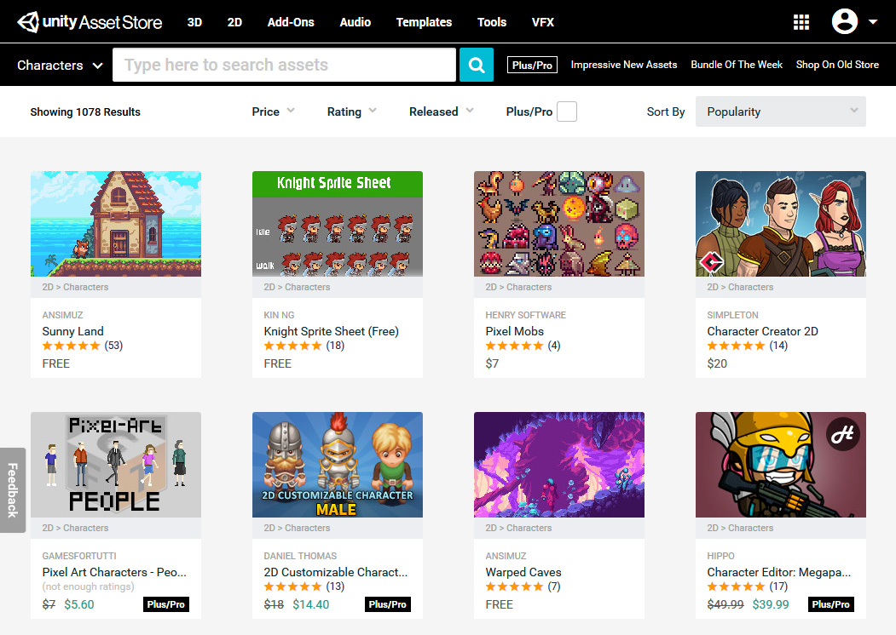
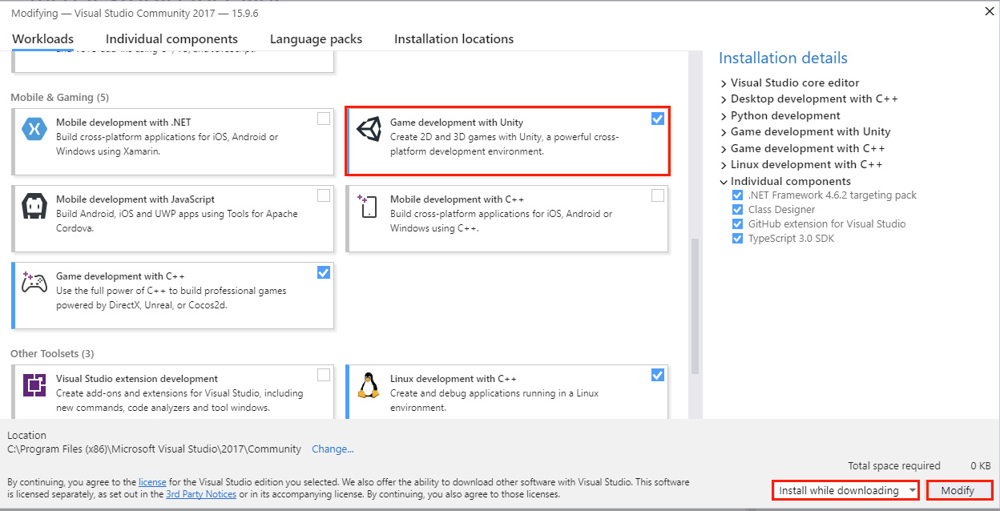
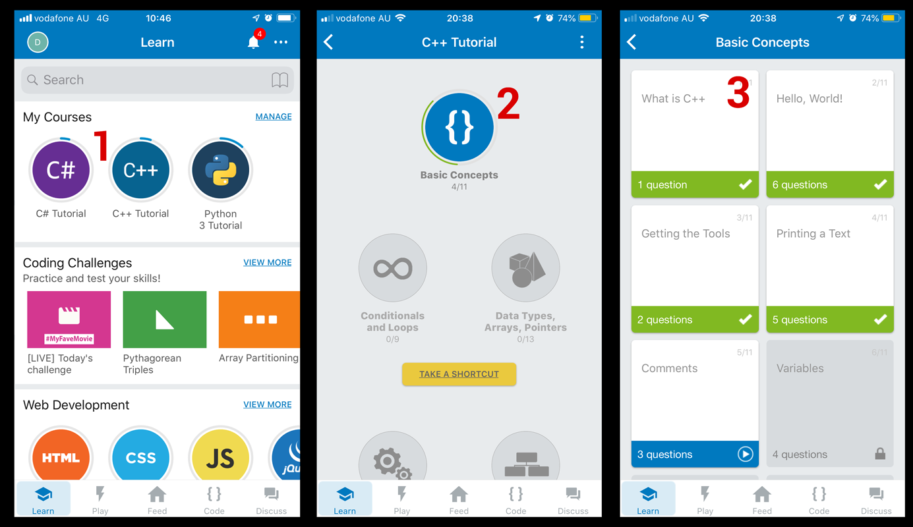

---
html:
  embed_local_images: false
  embed_svg: true
  offline: false
  toc: undefined
export_on_save:
  html: true
---
# GPR103 Week 1

Welcome, Object Oriented Design, C#


<!-- @import "[TOC]" {cmd="toc" depthFrom=1 depthTo=6 orderedList=false} -->

<!-- code_chunk_output -->

* [GPR103 Week 1](#gpr103-week-1)
	* [Part 1 - Studying 2D Games Programming](#part-1-studying-2d-games-programming)
	* [Who are we?](#who-are-we)
	* [How will we make 2D games?](#how-will-we-make-2d-games)
		* [C++?](#c)
		* [Unity, C#?](#unity-c)
		* [Visual Studio Community](#visual-studio-community)
		* [Mixing Worlds](#mixing-worlds)
			* [Dammit Jim! I'm a programmer, not an artist.](#dammit-jim-im-a-programmer-not-an-artist)
			* [Dammit Jim! I'm an artist, not a programmer!](#dammit-jim-im-an-artist-not-a-programmer)
	* [Hour splits and thriving in 2D Games Programming](#hour-splits-and-thriving-in-2d-games-programming)
		* [Ask questions!](#ask-questions)
		* [Blackboard is your friend](#blackboard-is-your-friend)
		* [My notes are your friends](#my-notes-are-your-friends)
	* [Assessments](#assessments)
		* [Assessment 1 - Programming exercises](#assessment-1-programming-exercises)
		* [Assessment 2 - Character customiser](#assessment-2-character-customiser)
		* [Assessment 3 - Missile Command](#assessment-3-missile-command)
	* [Part 2: Programming and Unity](#part-2-programming-and-unity)
		* [Installing Unity](#installing-unity)
		* [Installing Visual Studio](#installing-visual-studio)
		* [Hello Unity.](#hello-unity)
	* [New design pattern, Composition!](#new-design-pattern-composition)
	* [Why not just inheritance?](#why-not-just-inheritance)
		* [Inheritance in Unity](#inheritance-in-unity)
		* [Limits of Inheritance](#limits-of-inheritance)
	* [Composition saves the day:](#composition-saves-the-day)
		* [Put your components on GameObjects](#put-your-components-on-gameobjects)
	* [Making a rifle with inheritance and composition](#making-a-rifle-with-inheritance-and-composition)
		* [Inheritance: From Monobehaviour to Rifle and Pistol.](#inheritance-from-monobehaviour-to-rifle-and-pistol)
		* [Composition: add ons](#composition-add-ons)
		* [Handy tip: RequireComponent](#handy-tip-requirecomponent)
	* [Part 3: Exercises](#part-3-exercises)
			* [1. Learn Unity Fundamentals](#1-learn-unity-fundamentals)
			* [2. Learn C# fundamentals with Sololearn](#2-learn-c-fundamentals-with-sololearn)

<!-- /code_chunk_output -->

## Part 1 - Studying 2D Games Programming

Exploring 2D games programming.

> * Core concepts of game programming
> * Structuring a project
> * `C++` or `Unity c#` options
> * Required knowledge: you should have basic programming knowledge and have written code in an object oriented language. 
> The good news is, if you struggled with `C++`, you'll find `c#` much more welcoming.

---

## Who are we?

**Me:** Danny McGillick. Computer Science @ UTS, Web dev, Creative technologist in advertising (flash/actionscript, unity), 2D and 3D artist for Torus, Halfbrick, Blowfish studios. Keyboard enthusiast, bits maker.

https://cargocollective.com/dmac/ - advertising
http://www.artstation.com/dmacdraws/ - game art

**You:** The next makers with long futures.

---

## How will we make 2D games?

Two options:
* Unity engine and _C#_. This is what I'll teach in class.
* _C++_ in Visual Studio with an _SFML_. An option for those who have c++ experience and great optimism.

---

### C++?

* Big-time game engines are written in _C++_, _C_.
* Fast, low level.
* No game making tools by default.
* You can use _Simple and Fast Multimedia Library (SFML)_, a library to provide windowing, graphics, audio and networking functionality.

```c++
// c++ main function
int main()
{
    cout << "Battle Royale Game." << endl;
}
```


SFML tutes and downloads for all platforms - _https://www.sfml-dev.org_

---

### Unity, C#?

A full 2D/3D game development IDE with models, sprites, physics, sound, input, c# scripting, cross platform building and more. For free.

```c
// Unity Start function
void Start()
{
    Debug.Log("Battle Royale Game");
}
```


_Unity IDE_

---

### Visual Studio Community

Either way, you'll need Microsoft Visual Studio Community. Not to be confused with Visual Studio Code.


___

### Mixing Worlds

The Unity IDE is used by artists, programmers and game designers, and blends a lot of disciplines. This class gets students from art and software engineering streams too, and you might have reservations.

There's nothing to worry about. I'll let two generations of a fictional space doctor explain.

#### Dammit Jim! I'm a programmer, not an artist.


That's okay, we don't have to create art for the games we're making this trimester. The [asset store](https://assetstore.unity.com/categories/2d) is full of sprites, both free and paid, and so is [opengameart.org](http://opengameart.org)

Also, assessments won't be marked on quality of art.



___

#### Dammit Jim! I'm an artist, not a programmer!
 


Unity makes programming life a lot easier for artists or casual scripters than starting out in, say, C++.

* We can add scripts to things in our scene by hitting "add component", get away with writing just one line of code, and hit "Play"
* The Unity team already wrote code to do most of the dirty work, we just script on top of it. All the image/model/sound/physics/input stuff is there
* Drag and drop or editing text fields/forms can change your variables without having to go back to the code.
* Compiling happens in the background. 
* You can disable scripts and objects by just clicking a checkbox. Testing becomes much easier.


---

## Hour splits and thriving in 2D Games Programming

> **30%** class hours.
> **70%** studying, programming, gaining experience. 

The benefit of these courses comes from putting in work between classes. What we learn in class won't stick if you don't work and experiment at home.

### Ask questions!

Come to class, and when you're working at home send me questions.

My:
* uni email: daniel.mcgillick laureate edu au
* discord server: https://discord.gg/xEh5J4J
* discord name: DMacMakes#3457 (case sensitive)


### Blackboard is your friend

Find assignment briefs, due dates, slides, programming tutes/samples and much more. 

> Digging through Blackboard material is the second key to coming out ahead in these subjects, just below coding at home.


_Grab the subject outline and subject planner_


_Every subject has modules in the left menu. Click one for important info_


_The blue button, top of screen, takes you to more info and resources. Don't skip the learning resources_

### My notes are your friends

The original course notes are in powerpoint, and available from the module pages in Blackboard. I write up new ones (like the one you're reading) for most lessons and post them on Git. The url pattern is:

https://dmcgits.github.io/mds/GPR103/week1_notes.html

> If I post an announcement before class I will often post an html notes link.

___

## Assessments


_Assessments as shown on Blackboard_


### Assessment 1 - Programming exercises
3 programming challenges completed during the first 2 modules (first 4 weeks). Topics are _encapsulation_, _polymorphism_ and _engine calls_. **Due end of week 5**

### Assessment 2 - Character customiser

You will develop a single module for a theoretical game. The character customiser lets you change appearance and stats. **Due end of week 8**


_An example 2D character customiser_

### Assessment 3 - Missile Command

You'll be making a whole game: a clone of arcade classic, Missile Command. **Due end of week 12**


_Missile command screenshot - for gameplay description see [wikipedia](https://en.wikipedia.org/wiki/Missile_Command#Gameplay)_

---

## Part 2: Programming and Unity

Let's learn by doing. We'll create a unity project, add something to our game, and give it behaviour.

### Installing Unity 

Important note: we'll be using **2018.2**, not the latest unity editor.

1. Head over to https://unity3d.com/get-unity/download and download the **Unity Hub**, then install it. 
2. Run Unity Hub, choose Installs from the top menu, then official releases on left, and finally click Download next to **2018.2.21f1**. This will not be the latest version, so pay attention to this step. **If you install the wrong version and then submit an assignment that doesn't compile in 2018.2 it'll cost you marks**. 


_You'll see 21f1 rather than 20f1 in hub now_

1. When the "Add Components" window appears make sure documentation is checked, click the "Done" button and wait for it to install.

### Installing Visual Studio

We also won't be using the latest Visual studio, **we'll use Visual Studio Community 2017** (not 2019) so be careful.
If you already have Visual Studio: search for and run the Visual Studio Installer, select More > Modify (next to the launch button), then go to step 2. 

1. Go to https://visualstudio.microsoft.com/vs/older-downloads/. Don't click "Download Visual Studio", scroll down and expand "2017" to download.
2. Under _Workloads_ scroll down to _Mobile and Gaming_ and check the **Game development with Unity** option.
3. Select _install while downloading_ and click _modify_. Or Install if that's what you have instead of modify.



---

### Hello Unity.

I'll be running through this in class. For online students it'll move fairly quickly but you can re-watch the video.

1. Create a new 2D project
2. Drop in a square, add a talking script.
3. Log hello world, I am square
4. Add a collider, log hello world on click.
5. Add a shy circle, with a collider, add a script.
6. Give circle a public variable talker.
7. Have shy circle pass call a function on square.
8. Cube says "hello world, she is circle."


___

## New design pattern, Composition!

That was probably easier than you expected. It was **easy but also strange** when you think about it.

1. We made a Class/Object and.. 
2. put on another class already in the scene? It's not like inheritance!

> This design pattern is called **composition** and it's less **Rifle is a Gun (inheritance)** and more **Rifle has a Laser Sight and Bayonet**. 


_Multiple components on TalkySquare not just our Talk script._


---

## Why not just inheritance?

We learned inheritance last trimester in c++, and you may have seen it in other languages. 
* Its the **"is a" relationship**. 
* Human -> Mammal -> Animal is a classic example

```dot
digraph graphname {
     LivingThing -> Animal -> Mammal -> Human;
     Mammal -> Racoon; 
     Animal -> Reptile -> NinjaTurtle;
     Reptile -> Gecko;
 }
```

### Inheritance in Unity

Our `Rifle` can still be a `Gun`, gaining useful things, **c# and Unity are fine with inheritance.**

```dot
digraph Rifle{
  Weapon -> RubberHulkFist
  Weapon -> Gun -> Rifle;
  Gun -> Pistol
}
```

```cs
// The syntax is familiar to c++ users, minus all the header nonsense
public class Rifle : Gun { // Rifle is a gun

	void Start () {		
	}
}

// Your inheritance has to start with Monobehaviour if you want to use it in the inspector.
public class Gun : MonoBehaviour { // Gun is a component

	void Start () {		
	}
}
```

### Limits of Inheritance

Thing is, when you add _optional_ things rather than _evolving_, inheritance gets.. silly.

* To equip **multiple options in combination** do you try to inherit from multiple classes?
```dot
digraph Rifle{
  Gun -> Rifle -> RifleWLaser
  Rifle -> RifleWBayonet->RifleWNadesAndBayonet
  Rifle -> RifleWNades
  RifleWLaser -> RifleWLaserAndBayonet
  RifleWNades -> RifleWNadesAndLaser
  RifleWLaser -> RifleWNadesAndLaser
  RifleWBayonet -> RifleWLaserAndBayonet
  RifleWNades -> RifleWNadesAndBayonet
}
```

* Or do you
  1. Build a big dumb class with everything
  2. Pretend all that stuff isn't there, using just bits you want? Sort of de-evolving?


```dot
digraph Rifle {
  Gun -> Rifle
  Rifle -> RifleWBayonet->RifleWNadesAndBayonet -> RifleWNadesAndBayonetAndLaser
  RifleWNadesAndBayonetAndLaser -> RifleWLaserAndBayonet
  RifleWNadesAndBayonetAndLaser -> RifleWLaserAndNades
  RifleWNadesAndBayonetAndLaser -> RifleWLaser
}
```

No.
___

## Composition saves the day: 

This sort of thing matters when making games, so Unity loves components.

* inheritance defined an "is a" relationship
* **composition defines the "has a" relationship**. Has a collider, has a sprite renderer. 
* Great, a rifle can just be a rifle and _have_ a grenade launcher and/or a sight. 

But how to do? 

* You've already made one, by extending _MonoBehaviour_

**A MonoBehaviour is, for our purposes, the same thing as a Component.** 

___

### Put your components on GameObjects

In Unity, everything on the stage extends `GameObject`.
* When you select a thing in your Unity scene, the Inspector is showing the **GameObject.**
* Each panel in the inspector is a **component**, added to the GameObject
* **If your script extends MonoBehaviour, it's a component you can add!**


_Look again. See them, see the components/MonoBehaviours_

## Making a rifle with inheritance and composition

Here's the combo that really gets work done in Unity: use inheritance to make the components you want, and then add them in combination!

1. A `Rifle` is a `Gun` is a `Monobehaviour`, thanks to inheritance
2. Add `Rifle` to a sprite plus `GrenadeLauncher`, `LaserSight` and `Bayonet` thanks to composition!


### Inheritance: From Monobehaviour to Rifle and Pistol.

Just like we'd have done in c++ or another OO language.

```dot {engine="dot"}
digraph Gun
{
  MonoBehaviour -> Gun -> Rifle;
  Gun -> Pistol;
}
```

```cs
using System.Collections;
using System.Collections.Generic;
using UnityEngine;

// Gun is a component
public class Gun : MonoBehaviour {

	// Use this for initialization
	void Start () {
    Debug.Log("pew");
	}
	
}

// Rifle is a gun. Dead easy inheritance.
public class Rifle : Gun {

	void Start () {
		
	}

}
```

### Composition: add ons

Season our gameobject with components like Nade, Laser, Bayonet in any combination.

```dot {engine="dot"}
digraph Rifle
{
  MonoBehaviour -> Gun -> Rifle;
  Gun -> Pistol;
  Pistol -> LaserSight [dir=none, style=dotted];
  Rifle -> LaserSight [dir=none, style=dotted];
  Pistol -> GrenadeLauncher [dir=none, style=dotted];
  Rifle -> GrenadeLauncher [dir=none, style=dotted];
  Pistol -> Bayonet [dir=none, style=dotted];
  Rifle -> Bayonet [dir=none, style=dotted];
}
```

That looks noodley as a diagram, but as you saw it's clear in Unity:


_Inheritance isn't directly visible, except that these all must be descended from MonoBehaviour_

1. Obviously `LaserSight`, `GrenadeLauncher` and `Bayonet` all extend `MonoBehaviour` too.

```dot {engine="dot"}
digraph GunAddOn
{
  MonoBehaviour -> LaserSight
  MonoBehaviour -> GrenadeLauncher;
  MonoBehaviour -> Bayonet ;
}
```

But would add an evolution between them say `GunAddOn`, to add things common to all addOns. Still using inheritance where it helps!

```dot {engine="dot"}
digraph GunAddOn
{
  MonoBehaviour -> GunAddOn -> LaserSight
  GunAddOn -> GrenadeLauncher;
  GunAddOn -> Bayonet ;
}
```

___

### Handy tip: RequireComponent

GunAddOns are all going to need a gun to be useful right? What if someone tries to delete the Rifle component?

```cs
using System.Collections;
using System.Collections.Generic;
using UnityEngine;

// This line means you can't have a GunAddOn component unless 
// another component is descended from Gun.
[RequireComponent(typeof(Gun))]

public class GunAddon : MonoBehaviour {
  //no functions at all  
}

```

```cs
public class GrenadeLauncher : GunAddon {

	// Use this for initialization
	void Start () {
    Debug.Log("I spew pineapples");	
	}
	
}
```

---

## Part 3: Exercises

#### 1. Learn Unity Fundamentals

Unity is deep, and the interface might seem deceptively minimal. In order to get on with the fun stuff in class, you'll need to get a familiar with the basics at home. These official Unity tutorials will get you across the fundamentals quickly. There are maybe 2 hours of videos here total, and they'll save you loads of time.

These Unity official tutorials have embedded Youtube videos. Make sure you click the cog and set them to 1080 quality and go full screen to clearly see the interface. You can also click the Youtube logo to launch it there.

* "Using the Unity Interface"
  <https://unity3d.com/learn/tutorials/topics/interface-essentials>
* "Basic Game Objects and Components"
  <https://unity3d.com/learn/tutorials/topics/interface-essentials/game-objects-and-components?playlist=17090>
* "Beginner Gameplay Scripting". Watch **1-8, 10, 11, 18, 19, 22**. "Intermediate Gameplay Scripting" Watch **1, 6**.
  <https://unity3d.com/learn/tutorials/s/scripting>
  
#### 2. Learn C# fundamentals with Sololearn

We'll be focussing in the class on higher level programming concepts of designing programs/games, so there **won't be a lot of in-class explanation of basic c#.** For c++ coders a lot will be familiar in c#, but there are also significant differences (no .h files!). These quizzes will check how you went with the unity tutes above.

If you've taken this elective without c++ and **if you haven't coded, learning the fundamentals at home quickly will be critical**. 

Sololearn tutorials teach you the language while providing low pressure quizzes that help you retain what you've read.

1. Install Sololearn for [android](https://play.google.com/store/apps/details?id=com.sololearn) or [ios](https://itunes.apple.com/us/app/sololearn-learn-to-code/id1210079064). 
2. Register
3. Go to the _learn_ section and select the _C# Tutorial_ under programming languages. 
4. Work through Module 1 "Basic Concepts". They are short and you can stop and start when you need to.


