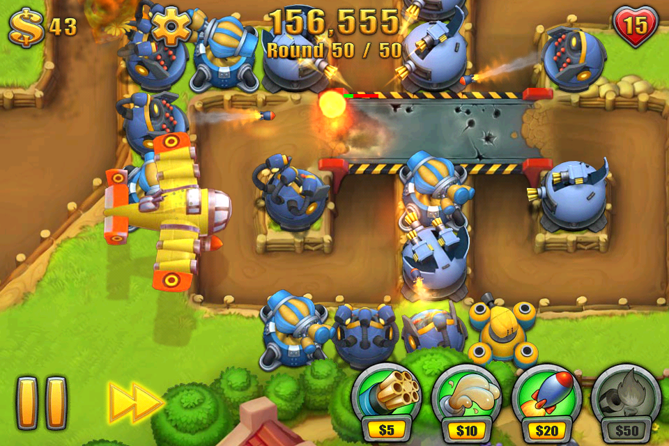
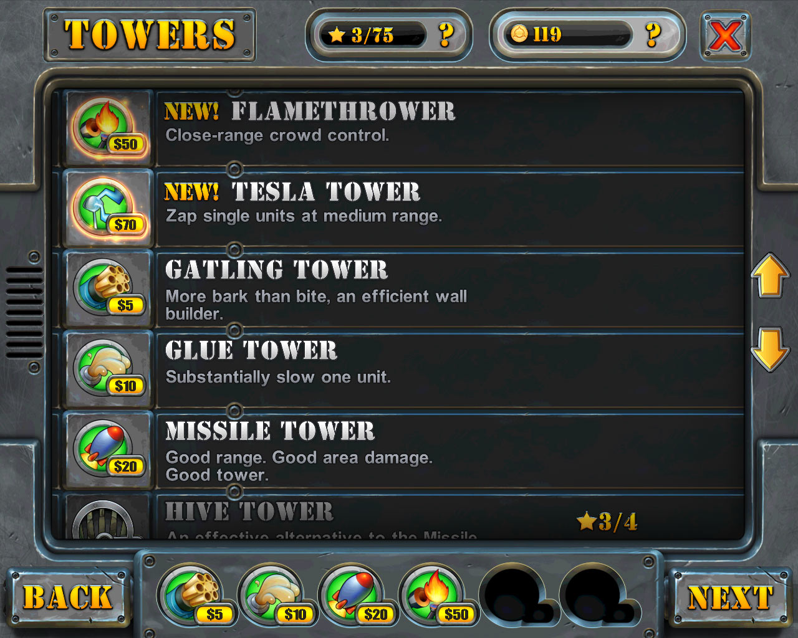

# GPR103 Week 2 (module 1.2)


<!-- @import "[TOC]" {cmd="toc" depthFrom=1 depthTo=6 orderedList=false} -->

<!-- code_chunk_output -->

- [GPR103 Week 2 (module 1.2)](#gpr103-week-2-module-12)
  - [Object oriented design principles.](#object-oriented-design-principles)
    - [What is encapsulation?](#what-is-encapsulation)
  - [Encapsulation in practice](#encapsulation-in-practice)
    - [Classes and Objects refresher](#classes-and-objects-refresher)
    - [Scope in _C#_ and _C++_](#scope-in-_c_-and-_c_)
    - [Access modifiers](#access-modifiers)
    - [Using functions to hide variables](#using-functions-to-hide-variables)
    - [Access functions aka properties](#access-functions-aka-properties)
    - [Constructors and destructors](#constructors-and-destructors)
  - [More detail on Cohesion](#more-detail-on-cohesion)
  - [About Assignment 1 Part 1](#about-assignment-1-part-1)
  - [Reminder of code basics places to learn.](#reminder-of-code-basics-places-to-learn)
  - [Exercises to do before next class](#exercises-to-do-before-next-class)
  - [Resources](#resources)

<!-- /code_chunk_output -->


## Object oriented design principles.
> **Quick definitions:**
> * Encapsulation: putting data/code that go together into a capsule (class).
>    * Cohesion: When the stuff in that capsule really does belong together  
>    * Coupling: when a class reaches too specifically into another can be easily broken by changes in that class.
> * Abstraction: The outside view of encapsulation. You see the simplest controls: the interface.

___

### What is encapsulation? 

It's a long word but it's a simple thing we experience every day. 


_capsule: a thing with things inside_

The objects in our every day life usually **hide the bits we don't need to know about:**


_outside v inside_

#### Goldilocks factor

> How much to hide? The answer is, as with most design questions: it depends.

 If you only open and read things on your computer, the simple magic mouse is a nice thing. If you play MOBAs, you might live or die by the macro buttons on your razer naga. 
 


## Encapsulation in practice

Object Oriented design is all about encapsulation, and classes/objects are made for it.

### Classes and Objects refresher

**Classes** are the basic way we bundle up data, say our player data, with the code that acts on it.

> Classes: thing in itself, the definition. The recipe, the blueprint.

Tower defense tower:




So a `FireballTower` might contain things like `health`, `firingRate`, `shotDamage`, `FireShot()`, `TrackTarget(target)`, `Build()`,`Collapse()`.

```cs
 
Class FireballTower
{
    // stats
    public int health = 100;
    public int firingRate = 0.25;
    public int shotDamage = 30;

    // Upgrades
    public int level = 0;

    public function Tower()
    {
        // Constructor
    }

    public function Build (int xLocation, int yLocation)
    {
        // spell casting code
    }

    public function FireShot()
    {
        // spell casting code
    }

    private function Track ( Transform target)
    {
        // Tracking code
    }
}
```

**Objects** are what we make from classes.

> A unique thing made to the specifications of the class. The dinner made from a recipe.   

The 4 chairs at your dinner table are real objects based on a design. One chair has a slightly softer cushion, one has a ding in the leg, one is mum's favourite. A design can't have these things, it's just specifications.

```cs
    // Create an object/instance of Class FireballTower
    Tower fireball1 = new FireballTower();

    // Ask this object to build itself at a location. 
    // Already it's unlike the Class/design because it has a state:
    // it's built, and has a real location on the map. 
    // When it's destroyed, it's gone forever.
    fireball1.Build(2,3);
```
___

### Scope in _C#_ and _C++_

Scope (simplified) is a way to encapsulate data(variables) to separate areas even inside a class. They're only usable inside the code blocks {} in which they're defined. 

```cs
    Class Missile
    {
        // A value here has class scope. All functions can see it.
        // It is also called a "member variable".
        // public/private doesn't have an effect inside the class.
        private int _damage = 40;

        public function SetDamage(int newValue = 15)
        {
            // Assigning newValue, which is a function argument, to localDamage.
            // localDamage is defined here (because you see the type "int" before
            // the name). localDamage then is only visible to code inside this function.
            int localDamage = newValue;

            // Assigning the local variable's value to the class scoped variable _damage
            _damage = localDamage; 
        }

        public function LogDamage() 
        {
            Debug.Log(localDamage); // error, variable not defined
            Debug.Log(newValue); // same error
            Debug.Log(_damage);  // Logs value of _damage successfully
        }
    }
```
___ 

### Access modifiers 
 
 ..are what we've used so far to allow/bar access to the delicate insides of a class. They're vital, but they're also dumb. Once they're defined they never react to change, like a sign on a gate. 

```c++
    // public: any class has access
    public int health = 100;

    // protected: any class that inherits this one has access
    protected int _shotDamage = 20;

    // private: Only this class has access
    private int _trackingSpeedY = 1.2;

    // no modifier: defaults to private
    int firingRate_ = 0;

    // public const: we can make it public while preventing
    // others changing.. but we can't change it either.
    public const int MAX_HEALTH = 100;

```

___

### Using functions to hide variables
 Instead of a sign, a function can act more like a security guard: they do the same job but can react to changes and apply conditions.

> **In game situation:** An arrow is going to hit our Orc Rogue for 20 damage and she has 15 health. How do we avoid ending up with negative health?

Translated to a **Coding problem:** 
1) Allow only certain changes to shot damage
2) Can't be reduced for example
3) Only allow at certain times 

One way is to **all the object suggesting the change to check**:
  * it looks at our shot damage
  * it checks for permission
  * it makes the adjustment.
  
Maybe it seems ok for the first weapon, the calling object might be friendly and can be trusted with the logic. But it **becomes a huge mess later**: anything damaging the player has to worry about our health range. It also has to be trusted with important rules we want followed. It's risky and there's a mess of redundant code.

**The solution is a private health variable and a public setter function inside our Tower.** We'll need a getter too. Psuedocode:
```
    Class Tower
    ...
    function SetShotDamage ( amount )
        if amount is more than current damage
            set damage to new amount
        otherwise
            don't alter damage

    function GetShotDamage ()
        return shot damage
```
___

### Access functions aka properties

It's such a useful and common solution, c# has built in syntax to tidy it up and make errors less likely. These are officially **Properties**"** but **accessor functions** or plain **getters/setters** is fine.

```cs
using System;

public class Tower
{
    private int _shotDamage;
    private bool _damageBuffAllowed;

    // no need to write SetHealth(int value), GetHealth()
    // with correct function definitions etc
   public int ShotDamage 
   {
        get { return _health };
        set {
                if (_damageBuffAllowed && value > _shotDamage)
                {
                    _shotDamage = value;
                }
             };
   }

   private void buffDamage( int damageIncrease )
   {
       // we can pass use the accessor methods ourselves here
       // It means we only write validation code once. If 
       // If I buff with a negative value, ShotDamage won't let it reduce the damage.
       
       ShotDamage += damage;
   }
```

### Constructors and destructors

The knowledge required to properly set up an object, and to finish it off and clean up its data requires a lot of knowledge of its internals. We're trying to hide that stuff, so the Class defines a **constructor function** and **destructor function.**

```cs

Class Tower
{
    ...
    // A function with the Class's name is the constructor.
    // An invisible, automatic one will be created if you don't define it.
    public void Tower()
    {
        // Initialise variables
        // Collect any information needed
    }

    // The leading ~ (tilda) symbol makes this the destructor.
    private void ~Tower()
    {
        bigMemoryUsingList = null;
    }
    ...
}
```

## More detail on Cohesion

Ideas of what belongs in a class, how big a class should be, that's not set in stone. At home you'll get a feel for it based on projects and experience. At an organised workplace it'll be somewhat defined by coding standards/team lead/existing project code.

We'll get into that more in Design Patterns. For now, it's really just a measure of how much your code/data belongs where you've put it.

#### Medium Cohesion

A tower looks for targets, so it's fair to have targeting here. 

```cs
Class Tower
{
    List<Player> potentialTargets;

    function AquireTarget() {}

    function TrackTarget() {}
    
    function FireAtTarget() {}
}
```

#### High cohesion 
..might look like the following: a targeter that acquires and 
tracks targets. It's more specific, and leaves out firing.

```cs
Class Targeter : public Monobehaviour
{
    List<Trackable> potentialTargets;

    function FindClosestTarget() {}
    function FindRandomTarget() {}
    function GetCurrentTargetVector() {}
}
```

If wanted to use **inheritance**, our Enemy could inherit from Targer. Another approach is **composition**: the Targeter is a component we add to our Tower. We'll keep coming back to inheritance and composition.

## About Assignment 1 Part 1
The exercise: [assess1_ex1.html](assess1_ex1.html)

## Reminder of code basics places to learn. 
Rather than having me speed through conditionals and loops, jump into the sololearn app and drill on these fundamentals. Too fast for new coders, too slow for c++ people.

## Exercises to do before next class

1. Assessment progression - Player Class Exercise.
    * [assess1_ex1.html](assess1_ex1.html)

These exercises will be updates shortly:
2. UML stuff
3. Sololearn

## Resources

1. A video tute and explanation of c# properties