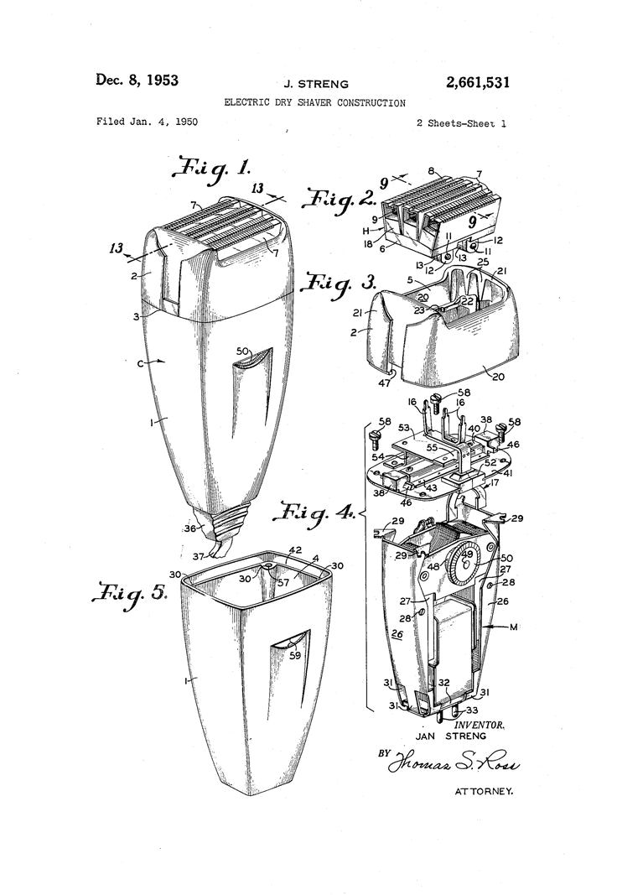

# GPR103 Week 2 (module 1.2)


<!-- @import "[TOC]" {cmd="toc" depthFrom=1 depthTo=6 orderedList=false} -->

<!-- code_chunk_output -->

1. [GPR103 Week 2 (module 1.2)](#gpr103-week-2-module-12)
   1. [Object oriented design principles.](#object-oriented-design-principles)
      1. [Encapsulation](#encapsulation)
         1. [Goldilocks factor](#goldilocks-factor)
      2. [Classes and Objects refresher](#classes-and-objects-refresher)
      3. [Scope](#scope)
   2. [Encapsulation in practise](#encapsulation-in-practise)
      1. [Access modifiers](#access-modifiers)
      2. [Access methods](#access-methods)
      3. [Access modifiers](#access-modifiers-1)
      4. [Access methods](#access-methods-1)
   3. [Did we understand the lingo and ideas of OO design?](#did-we-understand-the-lingo-and-ideas-of-oo-design)
   4. [More detail on Cohesion](#more-detail-on-cohesion)
      1. [Medium Cohesion](#medium-cohesion)
      2. [High Cohesion](#high-cohesion)
   5. [Reminder of code basics places to learn.](#reminder-of-code-basics-places-to-learn)
   6. [Exercises to do before next class](#exercises-to-do-before-next-class)

<!-- /code_chunk_output -->


## Object oriented design principles.
> **Quick definitions:**
> * Encapsulation: putting data/code that go together into a capsule (class).
>    * Cohesion: When the stuff in that capsule really does belong together  
>    * Coupling: when a class reaches too specifically into another can be easily broken by changes in that class.
> * Abstraction: The outside view of encapsulation. You see the simplest controls: the interface.

___

### Encapsulation 

At the heart of OOD is encapsulation. The word has many syllables, but it embodies two simple things we see every day. 


_capsule: a thing with things inside_

And it's what we expect of all the tools in our every day life: **Hide the bits I don't need to know about**



_outside v inside_

#### Goldilocks factor

How much encapsulation? How much to hide? The answer is, as with most design questions: it depends.

 If you only open and read things on your computer, an Apple magic mouse is a very nice thing. If you play mobas, you might live or die by your razer naga. If you live the office live, a microsoft mouse is a safe middle ground. 
 
 > Less good vs bad and more suitable vs unsuitable.


_!!_

### Classes and Objects refresher

> Objects are the basic way we bundle up data, say our player data, with the code that acts on it. A `FireballTower` might have `health`, `firingRate`, `shotDamage`, `FireShot()`, `TrackTarget(target)`, `Build()`,`Collapse()`.

> Classes: thing in itself, the definition. The recipe, the blueprint.

Tower defense tower:


```cs

Class FireballTower
{
    // stats
    public int health = 100;
    public int firingRate = 0.25;
    public int shotDamage = 30;

    // Upgrades
    public int level = 0;

    public function Tower()
    {
        // Constructor
    }

    public function Build (int xLocation, int yLocation)
    {
        // spell casting code
    }

    public function FireShot()
    {
        // spell casting code
    }

    private function Track ( Transform target)
    {
        // Tracking code
    }
}
```

Objects: a physical, individual thing made from a class. So if you have a chair design, you might have 4 real chairs based on that at your dinner table. One has a slightly softer cushion, one has a ding in the leg, one is mum's favourite. The design never has these real world properties, only ideal values.

```cs
    // Create an object/instance of Class Wizard
    Tower fireball1 = new FireballTower();

    // Ask this object to do something
    fireball1.Build(2,3);
```

### Scope

Scope (simplified) is where variables are only invisible inside the code blocks {} in which they're defined. 

```cs
    Class Missile
    {
        // A value here has class scope. All functions can see it.
        // It is also called a "member variable".
        // public/private doesn't have an effect inside the class.
        private int _damage = 40;

        public function SetDamage(int newValue = 15)
        {
            // Assigning newValue, which is a function argument, to localDamage.
            // localDamage is defined here (because you see the type "int" before
            // the name). localDamage then is only visible to code inside this function.
            int localDamage = newValue;

            // Assigning the local variable's value to the class scoped variable _damage
            _damage = localDamage; 
        }

        public function LogDamage() 
        {
            Debug.Log(localDamage); // error, variable not defined
            Debug.Log(newValue); // same error
            Debug.Log(_damage);  // Logs value of _damage successfully
        }
    }
```

## Encapsulation in practise

Tools!

### Access modifiers 
 
 ..are what we've used so far to allow/bar access to the delicate insides of a class. They're vital, but they're also dumb. Once they're defined they never react to change, like a sign on a gate. 

```c++
    // public: any class has access
    public int health = 100;

    // protected: any class that inherits this one has access
    protected int _shotDamage = 20;

    // private: Only this class has access
    private int _trackingSpeedY = 1.2;

    // no modifier: defaults to private
    int firingRate_ = 0;

    // public const: we can make it public while preventing
    // others changing.. but we can't change it either.
    public const int MAX_HEALTH = 100;

```

### Access methods
 AKA setters/setters, AKA properties. They're more like a security guard: they do the same job but can react to changes and apply conditions.

> **In game situation:** An arrow is going to hit our Orc Rogue for 20 damage and she has 15 health. How do we avoid ending up with negative health?

Translated to a **Coding problem:** 
1) Control what player health values can be set. 
2) Has a set range 0-100 for example
3) Sometimes though, that's modified by enchancements/poisons. 

One way is to **allow an enemy arrow to do the check**:
  * it looks at our minimum health
  * it adjusts its damage to match health left. 
  
Seems ok for the first weapon, but **becomes a huge mess later**: anything damaging the player has to worry about our health range. It's waaaay to many chances for a human coder to mess up, and not the arrow's problem

**The solution is a private health variable and a public setter function.** We'll need a getter now too. Psuedocode:
```
    Class Player
    ...
    function SetHealth ( amount )
        if amount is outside 0-100 range
            set health to nearest limit of range
        otherwise
            set health to amount    

    function GetHealth ()
        return health
```
It's such a useful and common solution, c# has built in syntax to tidy it up and make errors less likely.

```cs
using System;

public class Player
{
   private int _health;

    // no need to write SetHealth(int value), GetHealth()
    // with correct function definitions etc
   public int Health 
   {
        get { return _health };
        set {
            if (value < 0) _health = 0;
            if (value > 100) _health = 100;
      };
   }

   public void takeDamage( int damage )
   {
       // we can pass use the accessor methods ourselves here
       // It's tidier than calling functions too.
       Health -= damage;
   }
```

### Access modifiers 
 
 ..are what we've used so far to allow/bar access to the delicate insides of a class. They're vital, but they're also dumb. Once they're defined they never react to change, like a sign on a gate. 

```c++
    // public: any class has access
    public int name;

    // protected: any class that inherits this one has access
    protected int weight;

    // private: Only this class has access
    private int health_ = 0;

    // no modifier: defaults to private
    int speed_ = 0;

    // public const: we can make it public while preventing
    // others changing.. but we can't change it either.
    public const int MAX_HEALTH = 100;

```

### Access methods
 AKA setters/setters, AKA properties. They're more like a security guard: they do the same job but can react to changes and apply conditions.

> **In game situation:** An arrow is going to hit our Orc Rogue for 20 damage and she has 15 health. How do we avoid ending up with negative health?

Translated to a **Coding problem:** 
1) Control what player health values can be set. 
2) Has a set range 0-100 for example
3) Sometimes though, that's modified by enchancements/poisons. 

One way is to **allow an enemy arrow to do the check**:
  * it looks at our minimum health
  * it adjusts its damage to match health left. 
  
Seems ok for the first weapon, but **becomes a huge mess later**: anything damaging the player has to worry about our health range. It's waaaay to many chances for a human coder to mess up, and not the arrow's problem

**The solution is a private health variable and a public setter function.** We'll need a getter now too. Psuedocode:
```
    Class Player
    ...
    function SetHealth ( amount )
        if amount is outside 0-100 range
            set health to nearest limit of range
        otherwise
            set health to amount    

    function GetHealth ()
        return health
```
It's such a useful and common solution, c# has built in syntax to tidy it up and make errors less likely.

```cs
using System;

public class Player
{
   private int _health;

    // no need to write SetHealth(int value), GetHealth()
    // with correct function definitions etc
   public int Health 
   {
        get { return _health };
        set {
            if (value < 0) _health = 0;
            if (value > 100) _health = 100;
      };
   }

   public void takeDamage( int damage )
   {
       // we can pass use the accessor methods ourselves here
       // It's tidier than calling functions too.
       Health -= damage;
   }
```

## Did we understand the lingo and ideas of OO design? 


>- Initialising members to appropriate default values. 
>- Constructor and Destructor 
>- Separate interface from implementation
>- "private member variables"
>- "accessor methods (properties)"

I'll let you try it yourself, but if you don't get them just ask.


## More detail on Cohesion

Ideas of what belongs in a class, how big a class should be, that's not set in stone. At home you'll get a feel for it based on projects and experience. At an organised workplace it'll be somewhat defined by coding standards/team lead/existing project code.

We'll get into that more in Design Patterns. For now, it's really just a measure of how much your code/data belongs where you've put it.

### Medium Cohesion

An enemy needs to go after targets, so it's fair to have targeting here. 

```cs
Class Enemy
{
    List<Player> potentialTargets;

    function AquireTarget() {}

    function WalkToTarget() {}
    
    function AttackTarget() {}
}
```
> Though starter: if you inherited it from a parent class, what might that be?


High cohesion might look like the following: a targeter component that acquires and tracks targets. We can then add this component to our GameObject.

### High Cohesion
```cs
Class Targeter : public Monobehaviour
{
    List<Trackable> potentialTargets;

    function FindClosestTarget() {}
    function FindRandomTarget() {}
    function GetCurrentTargetVector() {}
}
```

## Reminder of code basics places to learn. 
Rather than having me speed through conditionals and loops, jump into the sololearn app and drill on these fundamentals. Too fast for new coders, too slow for c++ people.

## Exercises to do before next class

1. Assessment progression - Player Health Exercise
   * The exercise: [week2_exercise_killer_robot.html](week2_exercise_killer_robot.html)
   * You need to use an Enum in this exercise, so have a look at [this enums tute](https://youtu.be/ETy3x4XeK9E?t=58). Skip first minute.

2. UML stuff

3. 