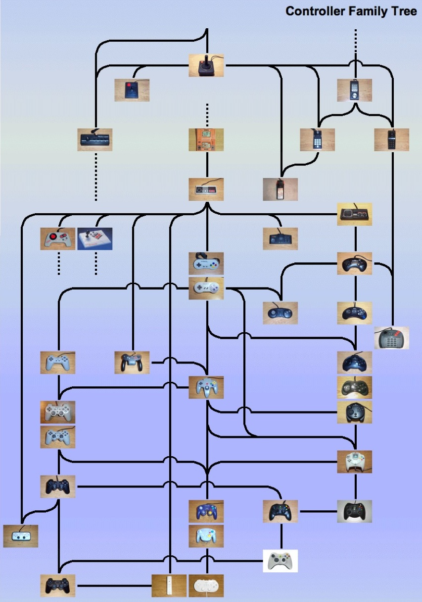
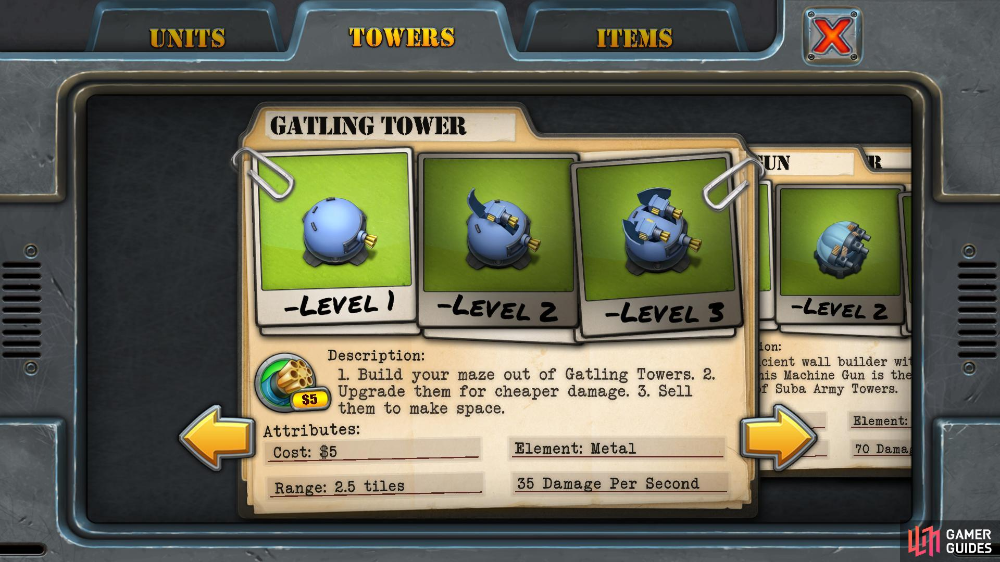
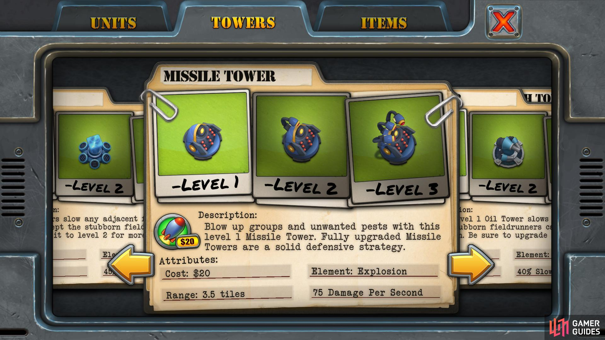
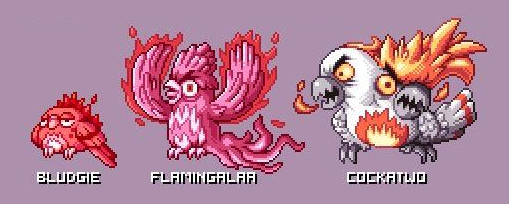

#GPR103 week3 - Inheritance and Polymorphism.

Designing objects with reuse and extension in mind.

<!-- @import "[TOC]" {cmd="toc" depthFrom=1 depthTo=6 orderedList=false} -->

<!-- code_chunk_output -->

* [GPR103 week3 - Inheritance and Polymorphism.](#gpr103-week3-inheritance-and-polymorphism)
	* [Last week and homework](#last-week-and-homework)
	* [Inheritance](#inheritance)
		* [Examples of inheritance](#examples-of-inheritance)
		* [Why inheritance in programming?](#why-inheritance-in-programming)
		* [Towers to build](#towers-to-build)
			* [Base Tower](#base-tower)
			* [Tower.cs](#towercs)
			* [Unique towers](#unique-towers)
			* [GattlingTower.cs](#gattlingtowercs)
			* [MissileTower.cs](#missiletowercs)
	* [Polymorphism](#polymorphism)
	* [Getting Abstract](#getting-abstract)
		* [Overriding functions and the `virtual` keyword](#overriding-functions-and-the-virtual-keyword)
			* [Snippet: Tower.cs](#snippet-towercs)
			* [Snippet: FloatingTower.cs](#snippet-floatingtowercs)
		* [Partial code reuse with the `base` keyword](#partial-code-reuse-with-the-base-keyword)
			* [Snippet: TowerGattling.cs](#snippet-towergattlingcs)
		* [Abstract](#abstract)
			* [What's better than hoping? Spitting out errors!](#whats-better-than-hoping-spitting-out-errors)
	* [Exercises](#exercises)
	* [Resources](#resources)

<!-- /code_chunk_output -->

## Last week and homework

Last week's topic was **Object oriented design**, specifically **Encapsulation through Classes, Access Modifiers, Properties**

Part 1 of assignment. 
* Did we get there? 
* Did it make more sense once you'd translated the ideas to your own Class vs copying the FireballTower.
* Did you come up with questions? If you answered them, where did you go for answers? Unity videos, Microsoft docs?
* Questions about wording?

## Inheritance

Humans are pattern seeking machines. **We look for things that are related, we group them, and then we find heirarchies to put them in**. Inheritance here is less the idea of recieving your parents property and more your inheritance of their genes. You have what they had, modified.

> Inheritance in programming is receiving the properties and abilities of another class/object while adding your own on top, and even modifying/replacing some of what you received.

It's like genetic inheritance, but it's also like how products/designs inherit elements from earlier products. Or how a PC inherits all the stuff Intel put in the CPU and chipset. 

We can do this because of the **encapsulation** we did last week. How on earth would you even approach this if things weren't globbed into Classes?

### Examples of inheritance


_Blurry but lovingly made geneology of controllers - [Casey Bisson](https://www.flickr.com/photos/maisonbisson/2646315272/)_

Nintendo have been real diversity generators of console controllers. The NES pad created a new family, then the SNES pad with shoulder buttons, the N64 controller with its analogue sticks. Each set the stage for the next, old features rarely disappeared.

>Classic programming class examples are `Canine::Dog::Labrador`, `Vehicle::Car::Hatchback::Jazz`. Notice `Canine` and `vehicle` are both fairly abstract; mostly words you see on forms. With each stage you get more concrete.

Game engines evolve too. Here's a link to one tree of FPS engines: [fps engine inheritance](assets/week3/fps_geneology.png)

### Why inheritance in programming?

1. It helps us think about things. We can break a program down into units and understand their relationships. Especially true in games, which are basically simulations of (parts of) worlds.
2. Avoids loads of duplicated code. If you have to change something basic about towers, like the code to click on them or place them, who wants to change every single tower type? 
3. Inheritance gives you stuff for free. Who doesn't love free stuff?
4. Extending (inheriting from) a class lets you take something useful but generic and make it more specific. 
   
### Towers to build

We had a Fireball Tower last week. This week we're cloning Field Runners 2 and want a **Gattling (gun) Tower** and a **Missile Tower**. 


_Gattling guns are the spinny ones_


_Missiles in an array (hint?)_

**1:** Gattling fire is effectively hitscan (instant hit), missiles are projectiles
**2:** Bullets travel in a straight line. Missiles can course correct, home in.
**3:** Gattling fire is nonstop. Missiles fire in volleys.
**4:** Gattling towers add guns. Missile towers just shoot faster.

___

#### Base Tower

It's pretty obvious that we'll be starting from the base `Class Tower` here and extending it. What's common to both towers? 

**Class: Tower**
* Attributes (information):
  * `health`, `position`, `currentLevel`, `ready` (not building/levelling up)
* Functions:
  * `build()`, `collapse()`, `levelUp()`
  
We won't go nuts and define a full game ready tower for this exercise.

#### Tower.cs
```cs
using System.Collections;
using System.Collections.Generic;
using UnityEngine;

public class Tower : MonoBehaviour
{
	protected int _health 		= 100;
	protected int _level 		= 1;
	
	protected Vector2 _position;
    
	public void Build(Vector2 position)
    {
        _position = position;
    }

    public void LevelUp()
    {
        Debug.Log("Levelling up");
    }
    
    public int CurrentLevel
    {
        get { return _level; }
    }

	public int Health
	{
		get { return _health; }
		set { _health = value; }
	}

    private void Collapse()
    {
        Debug.Log("Collapse.");
    }

}

```

> Some **terms used for a base class**: parent, ancestor, base, super.

___
#### Unique towers

Now our derived classes. Each is "derived" from Tower.

>**Class GattlingTower**:
>  * `turrets`, `damagePerSecond`
>
>**Class MissileTower**:
>  * `pods`, `firingRate`, `damagePerProjectile`, `fire()`


#### GattlingTower.cs

```cs
using System.Collections;
using System.Collections.Generic;
using UnityEngine;

public class GattlingTower : Tower {

    protected int _turrets = 1;
    protected int _damagePerSecond = 8;

    // Use this for initialization
    void Start() {
        Debug.Log("I am Gattling.");

    }

    public int DamagePerSecond
    {
        get { return _damagePerSecond; }
    }
}

```

#### MissileTower.cs

```cs
using System.Collections;
using System.Collections.Generic;
using UnityEngine;

public class MissileTower : Tower
{

    private int _firingRate = 1;
    private float _damagePerProjectile = 1.0f;
    private const int NUM_PODS = 9;

    void Start()
    {
        Debug.Log("I am Missile.");
    }

    public float DamagePerProjectile
    {
        get { return _damagePerProjectile; }
    }

    public int FiringRate
    {
        get { return _firingRate;  }
    }

    protected void Fire()
    {
        Debug.Log("Fire!");
    }
}

```
 
> **Food for thought:** both towers **track** their opponents, but some won't. Where do we implement it? Doesn't really belong in a generic tower, but also duplication is bad. This is where `Class TrackingTower` might come up. Or we might want to mix inheritance and composition designs.

## Polymorphism

One thing taking on multiple forms.


_They're all Bludgie though really - Aussie Pokedex by Paul Robertson_

A bunch of towers can all return a type, a cost, an id, a footprint. They can be asked to level up, take damage, build, collapse/refund. We don't need to know what type of tower we have for those generic things. That means we can handle them in a collection as plain old Towers - using them as their base class.

Here's how it might look if we were using basic classes like last week:

```cs
// List uses base type `Tower` even though we never make an instance of `Tower` directly.
List<Tower> towers = new List<Tower>();

// We can add in anything that extended/derived from `Tower`
towers.add(new GattlingTower());
towers.add(new MissileTower());

towers[0].build();
```

Here's how it looks in the TowerMaster class I've provided in the Unity demo scene. This uses a public list to hold the Towers, and we fill it using the Inspector.

```cs
// Usual Unity includes go here
public class TowerMaster : MonoBehaviour {

    public List<Tower> towers;

	void Start () {

        Debug.Log("TowerMaster says hi");
        Debug.Log("towers.Count = " + towers.Count);
        int i=0;

        // do this until we run out of towers
        while (i < towers.Count)
        {
            // Call Build on all our towers
            towers[i].Build(new Vector2(1.0f, 2.0f));
            i++;
        }
    }
}
```

A bit like boxes can be stacked regardless of contents, or a bottle of softdrink stored, cooled, poured.

## Getting Abstract

There are a few reasons want to make a base class, and they aren't all covered by simple inheritance of variables and functions. We need more flexibility.

>Reasons we might want to inherit include:
> 1. So we don't have to write the same code over and over. We just call the function, say`Build(position)`, in the base. 
> 2. Because we know all `Tower` objects will do a thing. The problem is we only know the first bit of how they'll do it.
> 3. Aaactually maybe we don't know how to do any of it yet. But we definitely want them all to `Build(position)`.

### Overriding functions and the `virtual` keyword

If you want the base class to define the function and then change how it works, you can **override the function**. This is common to many languages but uses differing syntax. In _c#_ we add `virtual` to the function definition in the base class, and the same function definition with `override` in the derived class.. then we change the contents.

Here's an example where a FloatingTower stores its position in a variable called `_currentPosition`, since it's moving, and also in `_landingPosition` so it can return there.

#### Snippet: Tower.cs

```cs
// Note the virtual keyword. It allows overrides.
public virtual function Build (Vector2 position)
{	
	Debug.Log("Building Tower");
	_position = position;
}
```

#### Snippet: FloatingTower.cs

```cs
// note override in place of virtual here
public override function Build (Vector2 position)
{
	 _landingPosition = _currentPosition = position;
}

```

> Say you have a list of type `Tower` and you call Build on a `FloatingTower` in that list. If you get the output from `Tower.Build` instead of `FloatingTower.Build` you've probably left out `override`.

### Partial code reuse with the `base` keyword

Overriding the function has come at a cost: no free code from the parent class! At least for that function. What if we could have it both ways?

How can we alter our `Build(position)` function to set the position but also set up the specifics for a GattlingTower? We can **call functions in the base class with the `base` keyword**.

#### Snippet: TowerGattling.cs

```cs

// We can call it explicitly.
    public override void Build(Vector2 position)
    {
        // Use base to call Build on Tower()
        base.Build(position);

		// Do Gattling specific things
        Debug.Log("Gattling.Build() here, just logging.");
    }

// I removed the : base (position) example here because it only worked on constructors.

```

Output: 
```
Building Tower
Gattling.Build() here, just logging.
```

### Abstract

When none of the code in the base is useful, we an just override the whole `virtual function`. We can even leave the `virtual function` empty in base. The problem of course, is making sure the next coder to inherit your class actually does it. How?

> We could make an empty function and put a comment asking all other coders to make sure to override it with their own code. But they might miss/ignore the comment.

#### What's better than hoping? Spitting out errors!

The `abstract` keyword lets us define a function with no content. It also fails to compile unless the function is overriden by any Class that inherits from it.

`abstract` is like virtual in that it allows methods to be overridden. It's much more useful though, in that it can be used for Classes and variables. 

> Objects can't be made from abstract classes. Only classes derived from them can be made. `new Tower()` won't work. `new GattlingTower()` will.

```cs

abstract class Tower
{
	public abstract void Build (Vector2 position);
}

// ---

public class TowerGattling
{
	public override void Build(Vector2 position)
	{
		// build
	}
}

```

## Exercises

1. Assignment 1, exercise 2. 
   * [Direct blackboard Link](https://laureate-au.blackboard.com/bbcswebdav/pid-7197505-dt-content-rid-11808948_1/xid-11808948_1)
   * As you come across issues, or even before you start, watch the unity videos in 2.
2. Unity tutorial videos covering this week
  	* [the scripting section](https://unity3d.com/learn/tutorials/s/scripting) 
  	* Tutes: _Inheritance_, _Polymorphism_, _Overriding_ and _Lists & Dictionaries_.
   * Watch the videos, and type in the code so you really remember it.

## Resources

1. [Download my TowerInheritance Unity project](assets/week3/TowerInheritance.zip)
2. Microsoft c# docs. This isn't a complete list: you should be getting in the habit now of looking these up for specifics and handy extras.
   * [virtual](https://docs.microsoft.com/en-us/dotnet/csharp/language-reference/keywords/virtual)
   * [abstract](https://docs.microsoft.com/en-us/dotnet/csharp/language-reference/keywords/abstract)
   * [List](https://docs.microsoft.com/en-us/dotnet/api/system.collections.generic.list-1?view=netframework-4.7.2)
