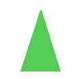
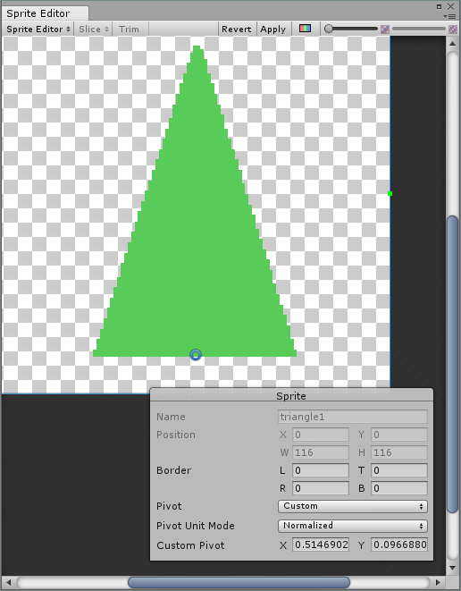

# Demo: Utility class with static function


#### FollowTheMouse.cs

Make a sprite, use the _knob_ circle from the sprite library. Scale it up a bit and add a script to follow the mouse.

```cs
// FollowTheMouse.cs
using System.Collections;
using System.Collections.Generic;
using UnityEngine;

public class FollowTheMouse : MonoBehaviour {

    protected Transform myTrans;
    protected Camera cam;
    protected Vector3 mousePoint;
	// Use this for initialization
	void Start () {
        myTrans = gameObject.transform;
        cam = Camera.main;    
	}
	
	// Update is called once per frame
	void Update () {
        mousePoint = Handies.MousePosToWorldVec();
        myTrans.position = mousePoint; 
	}
}
```
#### LookAtAThing.cs


Make a `graphics` folder in the `assets` folder in your Unity project window. Put this amazing triangle in there. Click the sprite once it's there and use the sprite editor (in the inspector) to put the blue pivot point circle at the bottom middle of the triangle. 

Make sure to hit the badly placed **"**apply** button up top.



Put it on your stage and then make  a new script, `LookAtAThing.cs`.

```cs
// LookAtAThing.cs
using System.Collections;
using System.Collections.Generic;
using UnityEngine;


public class LookAtAThing : MonoBehaviour {

    [SerializeField]
    protected Transform targetTransform;

    protected Transform myTransform;

    void Start()
    {
        myTransform = gameObject.transform;
    }

    // Update is called once per frame
    void Update () {
        Handies.PointObjectAtAnother(myTransform, targetTransform);     
	}
}
```

#### Handies.cs

None of that worked. Because those components are lazy. Handies is going to do the hard work. 
>Is this class cohesive? Maybe?

```cs
//Handies.cs
using System.Collections;
using System.Collections.Generic;
using UnityEngine;

public class Handies {

    public static void PointObjectAtAnother(Transform o1, Transform o2)
    {
        //o1.LookAt(o2);
        float angleRad = Mathf.Atan2(o2.position.y - o1.position.y, o2.position.x - o1.position.x);
        float angleDeg = Mathf.Rad2Deg * angleRad;

        o1.rotation = Quaternion.Euler(0, 0, angleDeg-90);
        //Debug.Log(angleDeg);
    }

    public static Vector3 MousePosToWorldVec()
    {
        Camera cam = Camera.main;
        Vector3 mousePoint = cam.ScreenToWorldPoint(new Vector3(Input.mousePosition.x, Input.mousePosition.y, 0));
        mousePoint.z = 0; // ScreenToWorld sets z to -10, which is makes the sprite invisible
        return (mousePoint);
    }
}
```