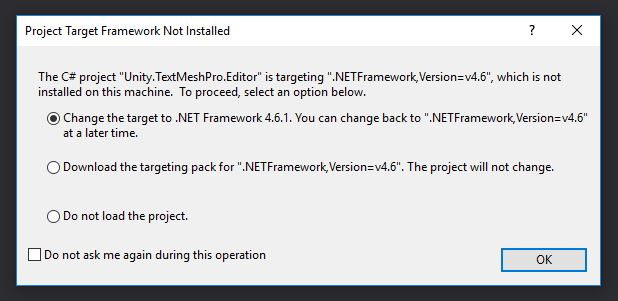
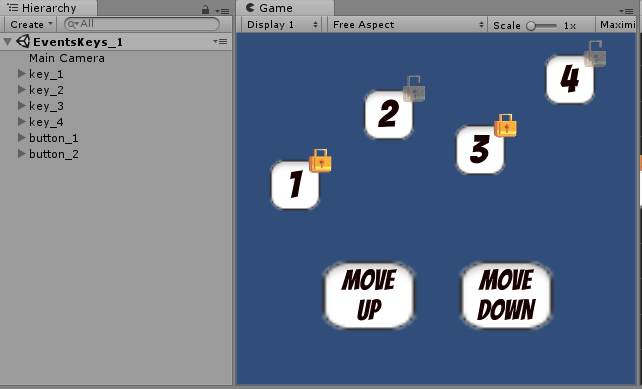
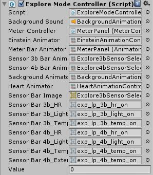
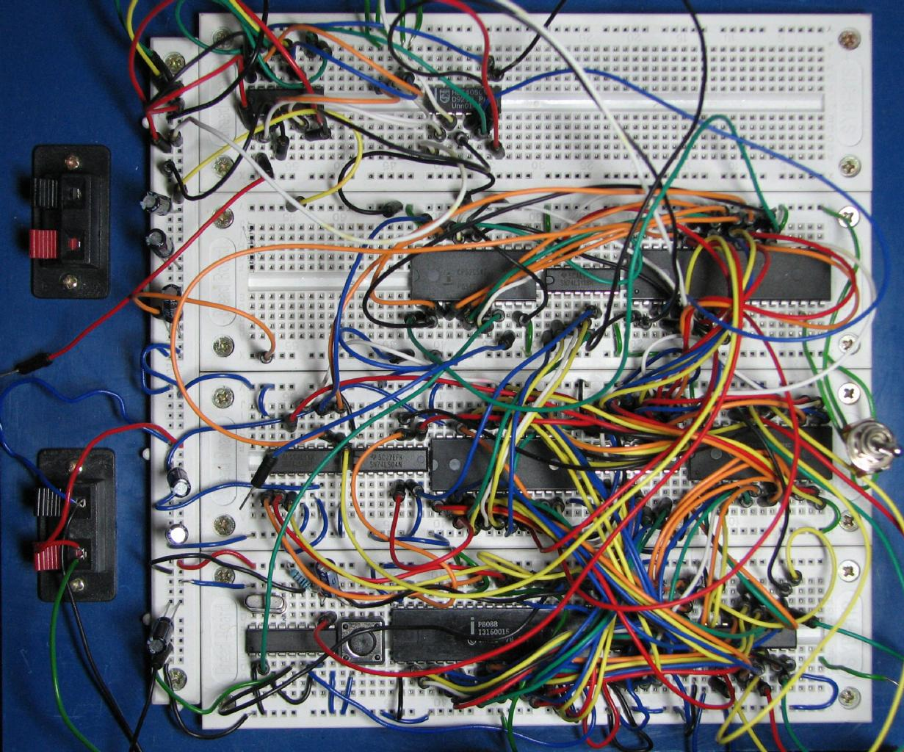
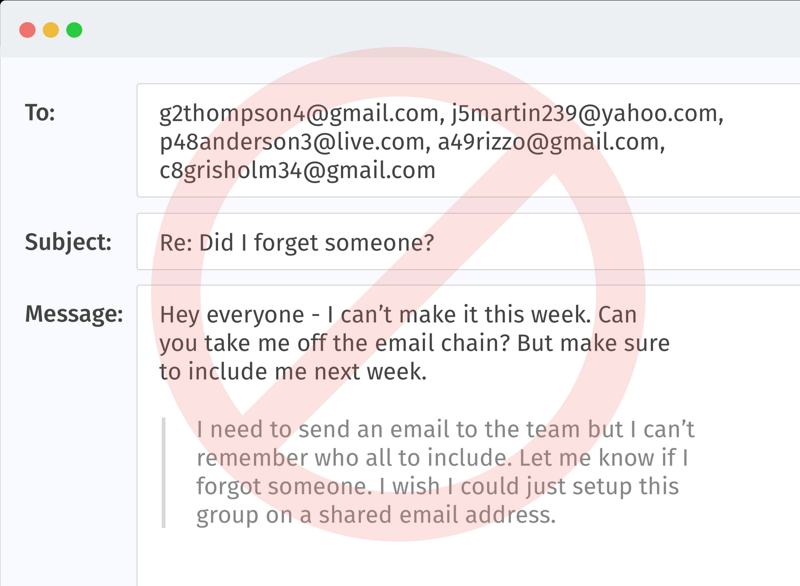

---
html:
  embed_local_images: false
  embed_svg: true
  offline: false
  toc: undefined
export_on_save:
  html: true
---
# GPR106 Week 6 notes

Sharing, decoupling and triggering in Unity. No, this is not relationship advice. We're talking **events**, **delegates** and **messages**.


<!-- @import "[TOC]" {cmd="toc" depthFrom=1 depthTo=6 orderedList=false} -->

<!-- code_chunk_output -->

- [GPR106 Week 6 notes](#GPR106-Week-6-notes)
  - [New Unity!](#New-Unity)
    - [Visual Studio .net 4.6 targeting](#Visual-Studio-net-46-targeting)
  - [Today: Avoiding noodly code in a GUI](#Today-Avoiding-noodly-code-in-a-GUI)
    - [Managing complexity.](#Managing-complexity)
    - [Decoupling is really about communication](#Decoupling-is-really-about-communication)
    - [We learned variables and lists, are they bad?](#We-learned-variables-and-lists-are-they-bad)
    - [Have you ever built a pc, expecting this?](#Have-you-ever-built-a-pc-expecting-this)
    - [One more time: direct versus broadcast](#One-more-time-direct-versus-broadcast)
  - [Boss mentality](#Boss-mentality)
    - [SendMessage](#SendMessage)
    - [BroadcastMessage](#BroadcastMessage)
  - [Events](#Events)
    - [Events driving a GUI](#Events-driving-a-GUI)
    - [Throwing an event](#Throwing-an-event)
    - [Listening for an event](#Listening-for-an-event)
    - [Reacting to an event](#Reacting-to-an-event)
  - [How did that actually happen?](#How-did-that-actually-happen)
    - [Function delegates](#Function-delegates)
    - [Generics aka what is `<that>`?](#Generics-aka-what-is-that)
    - [How do we structure it?](#How-do-we-structure-it)
  - [How to make your assignment!](#How-to-make-your-assignment)
    - [Step 1: Scamp up the interface](#Step-1-Scamp-up-the-interface)
    - [Step 2: Plan up your broad structure/strategy](#Step-2-Plan-up-your-broad-structurestrategy)
    - [Step 3: Classes/components](#Step-3-Classescomponents)
    - [Step 4: Build something and iterate](#Step-4-Build-something-and-iterate)
  - [To do / exercises](#To-do--exercises)
  - [Resources](#Resources)

<!-- /code_chunk_output -->

___

## New Unity!

We have 2019.1.7 installed and working in lab 2:04 in Ultimo, so we can all update and enjoy the new features. You can submit Assignment 2 using 2019.1 or 2018.2 if you'd rather not upgrade.

Unity old versions in the Download Archive
<https://unity3d.com/get-unity/download/archive>

Direct Unity Hub link to 2019.1.7f1  
<unityhub://2019.1.7f1/f3c4928e5742>

### Visual Studio .net 4.6 targeting

You might find that opening a unity c# script in VS gives you an error dialogue.



Select "Download the targeting pack" and install the downloaded file, restart unity and VS.

## Today: Avoiding noodly code in a GUI

Clone this project from my Github for today's exercise:
**https://github.com/dmcgits/locks_broadcasting_unity.git**



### Managing complexity.

Lots of elements in your game using code results in lots of classes. 

**Classes can end up tightly coupled, or connected all over the place** 

> Tightly coupled: classes that use lots of features of another, and can break with a small change to the other.

Things we want to avoid:
* having to find and store too many other gameObjects in variables
* needing to know and use loads of functions and variables on other objects
* very long classes which have lots of functions just to modify or read from other objects.
* exposing lots of variables/methods and inviting dependency


_It's also crappy work having to drag in all these dependencies.

### Decoupling is really about communication

A game is a big system, and lots of objects need to talk to eachother. Too much _direct_ communication makes things rigid, and that creates.. friction!

> **Friction:** A resisting force. Anything that makes it harder for us to do something.

When things start to scale up, we don't want our software design to limit our imaginations:


_Moar units_

### We learned variables and lists, are they bad?

No! 
* As with anything, the poison is in the dose. 
* Create too many direct connections, too much association, it gets inflexible

In circuit board design the view for laying out the direct connections is literally called a **ratsnest.** Because no matter how nicely you lay things out, it's a hairy situation. 


_Even a nicely routed pcb has a lot of connections running in multiple layers_


_Birect connections: pretty in moderation_


_Prototyping a circuit board: making connections with wires_


_These are the logical connections. In code we try to avoid the next stage, routing._

### Have you ever built a pc, expecting this?


_Cable management_

##### and ended up with this?


_Madness_

___

### One more time: direct versus broadcast

1: Less like email:



more like Twitter.


2: Less like direct ethernet wiring your network:


more like Wifi:


___

## Boss mentality

Let's be honest, parts of your game aren't doing their job if they're not reacting to change. The score text and energy bar, the mini map etc. You shouldn't have to tell them directly.


_Cake is amazing! Whoever doesn't clap for cake better have kneck armour!_

Events, SendMessage, Broadcast Message

> We need some sort of system where we can yell variables into the air and leave it to other desperate objects to listen and know what to do about it. 
Unity and c# provide some great tools for broadcasting and listening in. We'll have a look at three of them.

___

### SendMessage

Talking to components indiscriminately.

### BroadcastMessage

Talking to components on all children indiscriminately!


_Clicking to lock things in place, with the lock state visible_

___

## Events

One of the most common ways to broadcast in code is via `Events` and event listeners (aka event handlers).

> Events are your object's broadcasted information. Event Listeners in other objects hear them and do what they think is best.

### Events driving a GUI


Here I've just made a project to move a few things up and down, when they are unlocked. 
* Even on this teeny thing, look at the heirarchy on the left there.
* How much do you like repeating the same action on 20 things. 


_Let's watch this in action_

Up the top are just some rectangles with numbers. I was thinking of them as keyboard keys (visually) at the time. Move Up and Move Down are buttons to control them.

How it's put together:
1. The **move buttons** are saying to the twitterverse **"I Request a move"**
2. The **keys are listening** out for those events
3. They then individually **choose what to do.** If they are locked, they simply ignore the request.

Imagine having to code all this from the button perspective, each button needing four references to the keys. Then imagine if there were 16 or 128 keys. 

### Throwing an event

Buttons have my TriggerMoveEventOnClick Component. I should have called it MoveRequesterClickable maybe.

```cs
// I make a component to put on my buttons. Nothing special, 
// just a class that coule be called anything. 
// I want it to trigger a move event on click, so I called it:
public class TriggerMoveEventOnClick : MonoBehaviour {

	// set up an event called OnMoveRequested. It's static, 
	// so it can be accessed from other  classes. Don't worry about 
	// "delegate" for now
	public static event Action<string> OnMoveRequested = delegate {};
```

```cs
	// In the same componentI trigger the event on a mouse click,
	// but it could be triggered anywhere for any reason you like.
	private void OnMouseUpAsButton() {
		// Call the event like a normal function. It instead is
		// sent out to any listening objects, for them to handle.
		OnMoveRequested("up");
	}
```

### Listening for an event

Keys, the guys up top, have a KeyMover:

```cs
// On each key is a component: the KeyMover class.
// In start is this line, which means:
// When a move is requested, I want my function
// (MoveRequestedHandler) to handle it.

TriggerMoveEventOnClick.OnMoveRequested += MoveRequestedHandler;

```

### Reacting to an event

Again, KeyMover

```cs
// Here's the function, further down in keyMover. Notice it
// has signature that matches the event's: 
// Action<string> where Action means function and string is the // //// argument type
private void MoveRequestedHandler(String wayToMove)
    {
        if (wayToMove == "up") transform.position += transform.up;
    }
```
___

## How did that actually happen?

`event` is a built in keyword and part of how it happened is just, that's a thing c# can do. But it depends on some new we just wrote, and we need to understand those.
___

### Function delegates

Have you ever made a windows folder shortcut? No matter where the shortcut is on your drive, it'll open the folder it was created from.


Same same with function delegates. When you call them, they call another function with the same signature, and it does the work. They delegate the work to others.

```cs
// This code makes a delegate Type BossWork. This is a bit like making shortcut folders available
delegate void BossWork(string task);

// Then you have to make a real delegate function. A bit like making 
// an actual shortcut, but not yet assigned a target folder.
// In this case A boss, Sandra, has been given work, and seen fit 
// to delegate it. 

BossWork bossSandrasWork;

// Other functions are assigned to receive the work delegated.
// Witness Boss Sandra deciding the best way to "do" her work.
bossSandrasWork = GeraldsTimeEnergy;
// Look, she's "working"
bossSandrasWork("writing her proposals.");
```

Why do we see this output of bossSandrasWork?
> "Sandra drives me mental. All my time and energy is spent writing her proposals" grumbles Gerald to noone.

```cs

// Notice the delegate has to have the same function signature as
// the function that delegated the work. If not you'd have random 
// errors trying to pass the wrong parameters, expecting the wrong 
// returns.

void GeraldsTimeEnergy(string task)
{
	Debug.Log("\"Sandra drives me mental. All my time and energy is spent " + task + "\" grumbles Gerald to noone.");
}
```
___

### Generics aka what is `<that>`?

Rather than start with a theoretical description, be relieved that you've already used generics and it wasn't that hard.

> * Here in _c#_ you've used `List<Tower>`, maybe `Dictionary<Weapon>`.
> * In _c++_ some of you used `vector<string>` 

The **generic** bit means:
* Someone was able to write the `List` class not knowing what type of object you'd store in it. They did that by **putting** `<T>` **for type** wherever you would put your object type.


Notice when I hover over "List" in VS I see `List<T>` and `T is string`

### How do we structure it?

This is why we just learned events. When you make classic examples of inheritance, like a library system they have a natural heirarchy. 

The relationships between character parts and the controls are are more like the readouts and controls in a car:
> readouts are all doing a similar job but aren't really related
> readouts have a closer relationship to distant parts of the car than eachother and very different sensors
> the controls don't control the readouts.. the control fuel entering a cylinder, or wheels turning, or lights toggling.

If we tried to make this into a heirarchy it just wouldn't make much sense. You often end up with a big god class trying to control all this stuff with loads of references to things that behave differently. It gets unwieldy and, worst, hard to change or debug.

## How to make your assignment!

Here's a handy guide to pushing forward with your assignment.

### Step 1: Scamp up the interface

You can't plan your code till you plan your program

### Step 2: Plan up your broad structure/strategy

* How will the big pieces be arranged? 
* Which will need events and which will be directly referenced?
* What will our model look like
* How will you configure things in the long run?

### Step 3: Classes/components

What classes/components will we need to make it all happen?

### Step 4: Build something and iterate

1. Make a very simple beginning. 
2. Begin to map out the structure in stubs with dummy return info
3. Build and test.
4. Refine/expand a bit
5. Build and test.
6. Loop 4,5 till finished.

## To do / exercises

This 3 week assignment is serious go time. If you don't work hard this week you'll be in pretty bad shape. At a minimum do the first four.

1. Type in my Event code and run it, understand it.
2. Type in my delegates code, run and understand it.
3. Write down assessment 2 in your own words to get your head around the details. Do it on paper if it helps you think/break things down.
4. Scamp out the interface. Scamping is drawing it in line art for our purposes.
5. Make cards for it on your hacknPlan board.

## Resources

Helpful things

* Making a broader event manager for unity with special Unity events
  * <https://learn.unity.com/tutorial/create-a-simple-messaging-system-with-events#5cf5960fedbc2a281acd21fa>
* Unity official _delegates_ tutorial video.
  * https://unity3d.com/learn/tutorials/topics/scripting/delegates?playlist=17117