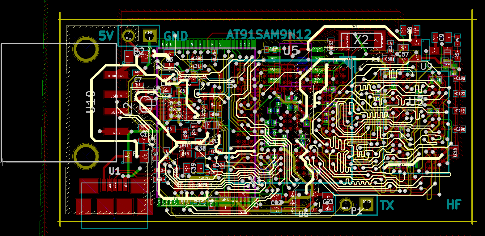
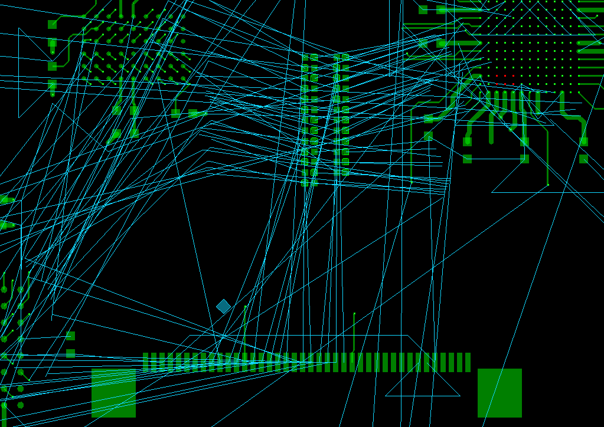
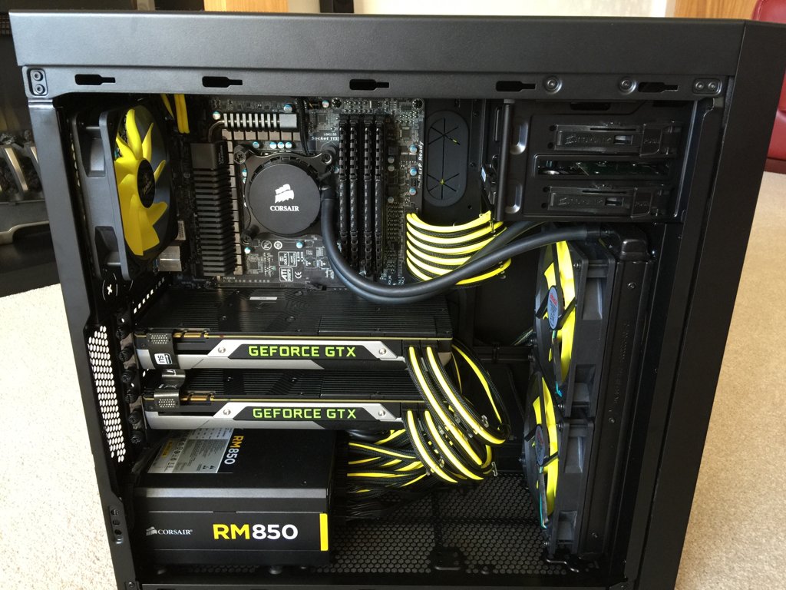

---
html:
  embed_local_images: false
  embed_svg: true
  offline: false
  toc: undefined
export_on_save:
  html: true
---
# GPR106 Week 6 notes

Sharing, decoupling and triggering in Unity. No, this is not relationship advice. We're talking **events**, **delegates** and **messages**.


<!-- @import "[TOC]" {cmd="toc" depthFrom=1 depthTo=6 orderedList=false} -->

<!-- code_chunk_output -->

1. [GPR106 Week 6 notes](#GPR106-Week-6-notes)
   1. [Decoupling: what](#Decoupling-what)
      1. [I thought variables and lists were good](#I-thought-variables-and-lists-were-good)
      2. [What else is there?](#What-else-is-there)
      3. [When games need less wiring](#When-games-need-less-wiring)
      4. [A simpler example](#A-simpler-example)
   2. [Events](#Events)
      1. [Throwing an event](#Throwing-an-event)
      2. [Listening for an event](#Listening-for-an-event)
      3. [Reacting to an event](#Reacting-to-an-event)
   3. [How did that actually happen?](#How-did-that-actually-happen)
      1. [Function delegates](#Function-delegates)
      2. [Generics aka what is `<that>`?](#Generics-aka-what-is-that)
      3. [How do we structure it?](#How-do-we-structure-it)
      4. [The self propelled vehicle is the real system](#The-self-propelled-vehicle-is-the-real-system)
   4. [System, Controls, Readouts applied](#System-Controls-Readouts-applied)
      1. [System: The model/simulation](#System-The-modelsimulation)
      2. [Controls](#Controls)
      3. [The Readouts](#The-Readouts)
      4. [Configuring](#Configuring)
   5. [How to make it](#How-to-make-it)
      1. [Step 1: Scamp up the interface](#Step-1-Scamp-up-the-interface)
      2. [Step 2: Plan up your broad structure/strategy](#Step-2-Plan-up-your-broad-structurestrategy)
      3. [Step 3: Classes/components](#Step-3-Classescomponents)
      4. [Step 4: Build something and iterate](#Step-4-Build-something-and-iterate)
   6. [To do / exercises](#To-do--exercises)
   7. [Resources](#Resources)

<!-- /code_chunk_output -->

___


## Decoupling: what

**Tightly coupled:** classes that are codependent. If you change one it can easily break the other.

**Decoupling is really about communication**. How can we make objects useful without hooking them all directly into eachother.

If things become a ratsnest and adding a new type of hat to your game requires changes in 7 places.. you probably won't do it.

This means
* limiting access to other objects via variables.
* limiting direct function calls

### I thought variables and lists were good

They are. But when we get lots of things needing to talk, and needing direct lines of communication, we get a ratsnest.


_direct connetions: pretty in moderation_


_breadboarding a circuit board: pain is beginning_


_It starts to get really tough_


_Connections before being routed_

Have you ever tried building a pc, expecting this?


_Cable management_

and ended up with:


_Madness_

___

### What else is there?

Instead of having references to objects and calling functions on them all (literally assessment 1 exercise 3), we're going to broadcast our requests and hope someone is listening.

1: Less like email:


more like Twitter.


2: Less like direct ethernet wiring your network:


more like Wifi:


___

### When games need less wiring

When things start to scale up, we don't want our software design to limit our imaginations:


_Moar units_

In the short term, even our next assignment will quickly become a ratsnest if we don't ditch the direct wires.

### A simpler example 


Here I've just made a project to move a few things up and down, when they are unlocked. 
* Even on this teeny thing, look at the heirarchy on the left there.
* How much do you like repeating the same action on 20 things. 

> What decoupling does is 
> 1. **Add a little friction at the start** of our project to **avoid massive friction later ** when changing or adding anything.
> 2. Lets us dream big and make mental games!

## Events

* Door to door knocking is slow
* Getting people to your house is hard and complicated
* Clever people instead broadcast indiscriminately on  _Twitter_


_Let's watch this in action_

Up the top are just some rectangles with numbers. I was thinking of them as keyboard keys (visually) at the time. Move Up and Move Down are buttons to control them.

How it's put together:
1. The **move buttons** are saying to the twitterverse **"I Request a move"**
2. The **keys are listening** out for those events
3. They then individually **choose what to do.** If they are locked, they simply ignore the request.

Imagine having to code all this from the button perspective, each button needing four references to the keys. Then imagine if there were 16 or 128 keys. 

### Throwing an event

Buttons have my TriggerMoveEventOnClick Component. I should have called it MoveRequesterClickable maybe.

```cs
// I make a component to put on my buttons. Nothing special, 
// just a class that coule be called anything. 
// I want it to trigger a move event on click, so I called it:
public class TriggerMoveEventOnClick : MonoBehaviour {

	// set up an event called OnMoveRequested. It's static, 
	// so it can be accessed from other  classes. Don't worry about 
	// "delegate" for now
	public static event Action<string> OnMoveRequested = delegate {};
```

```cs
	// In the same componentI trigger the event on a mouse click,
	// but it could be triggered anywhere for any reason you like.
	private void OnMouseUpAsButton() {
		// Call the event like a normal function. It instead is
		// sent out to any listening objects, for them to handle.
		OnMoveRequested("up");
	}
```

### Listening for an event

Keys, the guys up top, have a KeyMover:

```cs
// On each key is a component: the KeyMover class.
// In start is this line, which means:
// When a move is requested, I want my function
// (MoveRequestedHandler) to handle it.

TriggerMoveEventOnClick.OnMoveRequested += MoveRequestedHandler;

```

### Reacting to an event

Again, KeyMover

```cs
// Here's the function, further down in keyMover. Notice it
// has signature that matches the event's: 
// Action<string> where Action means function and string is the // //// argument type
private void MoveRequestedHandler(String wayToMove)
    {
        if (wayToMove == "up") transform.position += transform.up;
    }
```
___

## How did that actually happen?

`event` is a built in keyword and part of how it happened is just, that's a thing c# can do. But it depends on some new we just wrote, and we need to understand those.
___

### Function delegates

Have you ever made a windows folder shortcut? No matter where the shortcut is on your drive, it'll open the folder it was created from.


Same same with function delegates. When you call them, they call another function with the same signature, and it does the work. They delegate the work to others.

```cs
// This code makes a delegate Type BossWork. This is a bit like making shortcut folders available
delegate void BossWork(string task);

// Then you have to make a real delegate function. A bit like making 
// an actual shortcut, but not yet assigned a target folder.
// In this case A boss, Sandra, has been given work, and seen fit 
// to delegate it. 

BossWork bossSandrasWork;

// Other functions are assigned to receive the work delegated.
// Witness Boss Sandra deciding the best way to "do" her work.
bossSandrasWork = GeraldsTimeEnergy;
// Look, she's "working"
bossSandrasWork("writing her proposals.");
```

Why do we see this output of bossSandrasWork?
> "Sandra drives me mental. All my time and energy is spent writing her proposals" grumbles Gerald to noone.

```cs

// Notice the delegate has to have the same function signature as
// the function that delegated the work. If not you'd have random 
// errors trying to pass the wrong parameters, expecting the wrong 
// returns.

void GeraldsTimeEnergy(string task)
{
	Debug.Log("\"Sandra drives me mental. All my time and energy is spent " + task + "\" grumbles Gerald to noone.");
}
```
___

### Generics aka what is `<that>`?

Rather than start with a theoretical description, be relieved that you've already used generics and it wasn't that hard.

> * Here in _c#_ you've used `List<Tower>`, maybe `Dictionary<Weapon>`.
> * In _c++_ some of you used `vector<string>` 

The **generic** bit means:
* Someone was able to write the `List` class not knowing what type of object you'd store in it. They did that by **putting** `<T>` **for type** wherever you would put your object type.


Notice when I hover over "List" in VS I see `List<T>` and `T is string`

### How do we structure it?

This is why we just learned events. When you make classic examples of inheritance, like a library system they have a natural heirarchy. 

The relationships between character parts and the controls are are more like the readouts and controls in a car:
> readouts are all doing a similar job but aren't really related
> readouts have a closer relationship to distant parts of the car than eachother and very different sensors
> the controls don't control the readouts.. the control fuel entering a cylinder, or wheels turning, or lights toggling.

If we tried to make this into a heirarchy it just wouldn't make much sense. You often end up with a big god class trying to control all this stuff with loads of references to things that behave differently. It gets unwieldy and, worst, hard to change or debug.

### The self propelled vehicle is the real system

The engine, the wheels, the chemicals, these are the system. 

> 1. We feed it inputs through the controls
> 2. The system changes
> 3. The sensors perceive these changes and tell us.
> **1 and 3 are the interface. We are the user. What's left is the system.**


## System, Controls, Readouts applied

Our customiser maps well to this setup

### System: The model/simulation

Picturing our program this way, we need a system. We're not making a physical thing, we're making a simulation or model of it. 

> When scientists make a copy of a system to test, like a bacteria or a molecule or global weather system they make a "model" of the system and run a simulation.
 
* _word_ is simulating a **document being edited**.
* _warcraft 3_ is simulating a **great conflict in a (square area) of a distant land**
* _windows_ is simulating a **desktop** where you're doing jobs, and beneath that it's simulating **one computer with many processors (whether you have them or not)** from a bunch of separately sourced constructions of silicon, exotic metals, plastic etc.

A simulation is always in some "state": the result of inputs to the model, and its resulting condition.

### Controls

> The **controls (steering wheel, pedal) are our buttons, text fields etc** that want to change the system. They request changes to the name, gender eyes, hair or shirt. 

Instead of levers, wires and shafts we use can just throw out events. The model listens for them.

```cs
// for example
class GenderButton
...
public static event Action<String> onGenderChanged = delegate {};
```

### The Readouts

>The car readouts (engine light, speedometer, beeping seatbelt warning) are, for us, sprites of our character changes. Pictures of eyes, hair or shirt. Text labels showing name, skill points etc.

Instead of sensors connected by wires, we can listen for for changes in the model. The model announces them as events. 

### Configuring

Next week!

## How to make it

So, applying these ideas in real life to our assignment? 

### Step 1: Scamp up the interface

You can't plan your code till you plan your program

### Step 2: Plan up your broad structure/strategy

* How will the big pieces be arranged? 
* Which will need events and which will be directly referenced?
* What will our model look like
* How will you configure things in the long run?

### Step 3: Classes/components

What classes/components will we need to make it all happen?

### Step 4: Build something and iterate

1. Make a very simple beginning. 
2. Begin to map out the structure in stubs with dummy return info
3. Build and test.
4. Refine/expand a bit
5. Build and test.
6. Loop 4,5 till finished.

## To do / exercises

This 3 week assignment is serious go time. If you don't work hard this week you'll be in pretty bad shape. At a minimum do the first four.

1. Type in my Event code and run it, understand it.
2. Type in my delegates code, run and understand it.
3. Write down assessment 2 in your own words to get your head around the details. Do it on paper if it helps you think/break things down.
4. Scamp out the interface. Scamping is drawing it in line art for our purposes.
5. Make cards for it on your hacknPlan board.

## Resources

Sprites

[Example google search](https://www.google.com/search?rlz=1C1GCEB_enAU837AU837&q=behance+sprite+character&tbm=isch&source=univ&sa=X&ved=2ahUKEwjw1c_e97LhAhWGWisKHW4aBNQQsAR6BAgJEAE&biw=1536&bih=775&dpr=1.25#imgrc=t4ieyaimi7ILVM:)

Helpful things

* Unity official _events_ tutorial video
  * <https://unity3d.com/learn/tutorials/topics/scripting/events>
* Unity official _delegates_ tutorial video.
  * https://unity3d.com/learn/tutorials/topics/scripting/delegates?playlist=17117