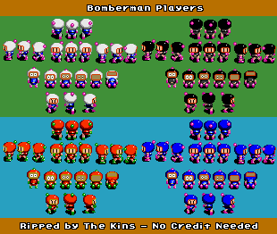
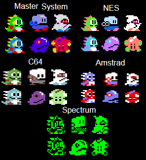
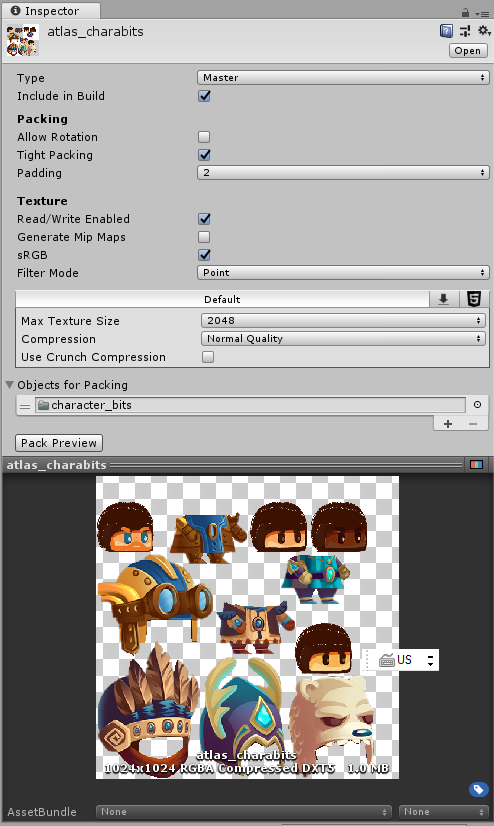
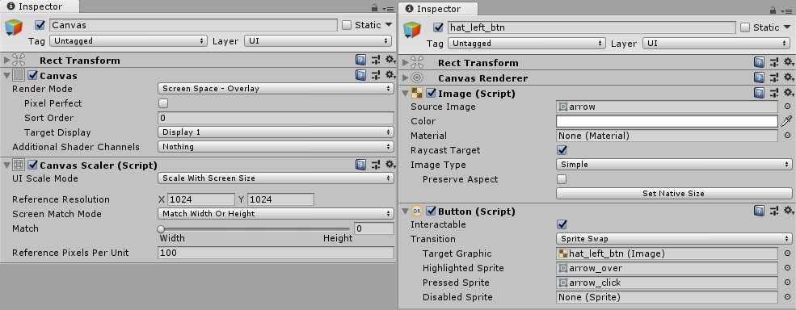
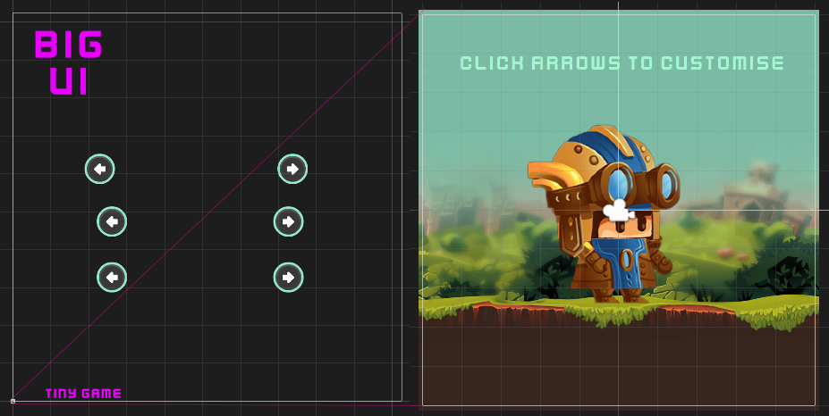

# Week 7: Sprites, managers, models.

This week's lesson uses my example of assignment 2 to explore Sprites, UI and Singleton use. 

<!-- @import "[TOC]" {cmd="toc" depthFrom=1 depthTo=6 orderedList=false} -->

<!-- code_chunk_output -->

* [Week 7: Sprites, managers, models.](#week-7-sprites-managers-models)
	* [Assessment 2 progress Q&A](#assessment-2-progress-qa)
	* [Singleton Game Manager](#singleton-game-manager)
		* [Why Singleton](#why-singleton)
		* [Making the model the heart of our game](#making-the-model-the-heart-of-our-game)
		* [Code Together:](#code-together)
	* [Sprites](#sprites)
		* [Quick history](#quick-history)
		* [Now](#now)
		* [Atlasses, sprite sheets](#atlasses-sprite-sheets)
		* [Unity atlas creator](#unity-atlas-creator)
	* [Unity UI](#unity-ui)
		* [Buttons and states](#buttons-and-states)
		* [UI canvas is huge](#ui-canvas-is-huge)
		* [Uh oh. Different events.](#uh-oh-different-events)
	* [ToDo](#todo)
	* [Resources](#resources)

<!-- /code_chunk_output -->

___

## Assessment 2 progress Q&A

Things to have done by now at minimum

* Scamps
* Written plan
* Final sprite choices

[My demo assessment](https://dmcgits.github.io/mds/GPR103/code/week7/index.html)


## Singleton Game Manager

We only want one game manager. We can make that so with singletons.. A single instance of an object accessible from anywhere through a class static variable.

>The trick with a Singleton: it's a vicious opportunist occupying the only home in its universe (the class it was made from). It's clever and awful.

1. When Unity instantiates the gameObject, it instantiates our component. 
2. When awake is called, our component does something dirty: it stores itself in a static variable in the CustoBrain class it was made from
3. Any future objects check if an instance has taken the only available home, the instance static variable.
4. If the space is taken, they are compelled to destroy themselves.

This is basically all that is needed to make a singleton. 
```cs
public class CustoBrain : MonoBehaviour
{

  public static CustoBrain instance = null;              
	//Static instance of GameManager which allows it to be accessed by any other script.

  //Awake is always called before any Start functions
  void Awake()
  {
      //Check if instance already exists
    if (instance == null)
    {
        //if not, set instance to this
        instance = this;
    }
    //If instance already exists and it's not this:
    else if (instance != this)

    //Then destroy this. This enforces our singleton pattern. Zero mercy.
    Destroy(gameObject);

    //Sets this one to not be destroyed when reloading scene
    DontDestroyOnLoad(gameObject);

    //Call the InitGame function to initialize the first level 
    InitGame();
  }
}
```

Now we can make calls to non static functions like so:
```
	CustoBrain.instance.DoAThing();
```
___

### Why Singleton

* They generally manage all the core stuff for your game.
* There is only one game, it needs only one brain/manager.
* Sort of like a main in c++ but also different
* Accessible anywhere you want to instantiate it
* Copies become references

We don't reeeeally have a game so we could do without it. 
* Mine just creates the model and keeps it in a variable.
* I could have made the model a singleton instead.
* Better though to work as though our game will be a little larger, and not make our model do extra things.

___

### Making the model the heart of our game

In simple terms, when a button is clicked

>1. Buttons yell that something incredible has happened. 
>2. When our model hears this news it is changed forever. It yells to the world about how different it is now.
>3. The sprites, who are gossips, put up big billboards to tell everyone the model's news.

It's a straightforward linear process, glued together with a little event magic:

1. click button
2. button throws event
3. model hears button event and updates 
4. model throws modelUpdated event
5. Sprites hear model event and change to match the new model state


___

### Code Together:

Make a game manager
Make a model
Make a button
Make a sprite

click button, change model, sprite changes.

___

## Sprites

What are they? How to use?


_Bomberman Super Nintendo sprites_


_Sonic by Neweegee!_

___

### Quick history
Sprites are just 2D drawings. 
* Screens were low resolution, so sprites were too. 
* Memory was precious, power was limited, so very few frames and a limited palette 
* 1, 4, 8, 16 colours, 1 taken for transparency
* Things often in powers of 2 due to binary and registers/memory. Anything that leaned on what a computer was best at gained performance.


Sprites grew larger and more complex as 2D hardware improved and memory grew. 




___

### Now

Sprites aren't really drawn to the screen pixel by pixel, 1:1 as they used to be. The hardware 

___

### Atlasses, sprite sheets

Keeping draw calls, memory usage, file size down. 

### Unity atlas creator

They're created like materials and sprites, then you populate them:

1. In project window right click->create->sprite atlas 
2. In the atlas under _Objects For Packing_ you can add folders, sprites, 2D textures. **I added my folder and it auto packs my sprites as I add images**
3. Set _Filter Mode_ to _Point_ if you are using pixelated art and might scale.



___

## Unity UI

I started to make the buttons manually, to stick with just using sprites and code, but no need to reinvent that on assessment 2. I used the unity UI goodies.

### Buttons and states

We can create a button by:
1. Creating a Canvas _GameObject -> UI -> Canvas_.
2. Tweak canvas settings (picture below)
3. With canvas selected, _GameObject -> UI -> Button_

The easy part was using a UI button to drop in the states of my button sprite.



___

### UI canvas is huge
Working in a big off screen thing that it projects back to screen space. 
* a lot of power
* a little odd to work with at first



___

### Uh oh. Different events.

Yeah the UI stuff doesn't use the same events, or box colliders. So, how do we integrate it into our controls->model->readouts design.

Good news: the model doesn't care, it looks like we'd expect. These code snips are from PrevNextItemOnClick, a monobehaviour component I add to any gui buttons with left or right arrows.

```cs
PrevNextItemOnClick.OnPrevNextRequested += OnPrevNextHandler;
```

The tricky bit isn't too tricky either.

```cs
	// Set up an outgoing event just like last week
	public static event Action<string> OnPrevNextRequested = delegate { };
	// Get ready to store a button
    private Button btn;
	...
	private void Start()
	{
		// On Start, grab the button component
		btn = gameObject.GetComponent<Button>();
        
		// Use the special onClick events "addListener" function 
		// every button exposes. I just googled this till I figured it out.
		btn.onClick.AddListener(OnMouseClick);
	}

	// In OnMouseClick do exactly what we did last week with OnMouseUpAsButton
	void OnMouseClick()
    {
        //Debug.Log(gameObject.name);
        OnPrevNextRequested(item + "_" + previousOrNext);
    }
```

___
## ToDo

1. Watch Unity video on Singletons (resources)
2. Build your prototype! 
   * Your final sprites must be chosen.
   * Rough cut outs of chosen sprites, enough to test pivot points, fit, code
   * UI elements throw events, model hears, sprites hear from model.
   * You can't plan everything fully in advance, you need a prototype early to test and inform your ideas.
3. Read up on atlasses

___

## Resources

1. Game Manager singleton class at Unity _Roguelike 2D tutorial_:
   <https://unity3d.com/learn/tutorials/projects/2d-roguelike-tutorial/writing-game-manager>
2. Here's the week 7 Unity project, puts a simulation of our game world (the model) between the controls and visual output. It has cleaned up code, piles of comments and icons where the coloured UI sprites were.
   [assets/week7/MoveIconsGame.7z](assets/week7/MoveIconsGame.7z)

