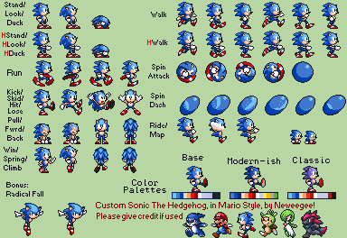

# Week 7: Sprites, managers, models.

This week's lesson uses my example of assignment 2 to explore Sprites, UI and Singleton use. 

<!-- @import "[TOC]" {cmd="toc" depthFrom=1 depthTo=6 orderedList=false} -->

<!-- code_chunk_output -->

* [Week 7: Sprites, managers, models.](#week-7-sprites-managers-models)
	* [Sprites](#sprites)
		* [Quick history](#quick-history)
		* [Atlasses, sprite sheets](#atlasses-sprite-sheets)
		* [Unity atlas creator](#unity-atlas-creator)
	* [Unity UI](#unity-ui)
		* [Button states](#button-states)
		* [Oddness](#oddness)
	* [Singleton Game Manager](#singleton-game-manager)
		* [How/why Singleton](#howwhy-singleton)
	* [ToDo](#todo)
	* [Resources](#resources)

<!-- /code_chunk_output -->

## Sprites

What are they? How to use?

_Bomberman Super Nintendo sprites_

_Sonic by Neweegee!_

### Quick history
Sprites are just 2D drawings. 
* Screens were low resolution, so sprites were too. 
* Memory was precious, power was limited, so very few frames and a limited palette 
* 1, 4, 8, 16 colours, 1 taken for transparency
* Things often in powers of 2 due to binary and registers/memory. Anything that leaned on what a computer was best at gained performance.

### Atlasses, sprite sheets

Keeping draw calls, memory usage, file size down. 

### Unity atlas creator

Take multiple sprites and generate a packed atlas. Save the work.
(how do names/replacement work? 2D texture or sprite?)

## Unity UI

About the UI, why I used it

### Button states

Don't want to reinvent the wheel.

### Oddness
Working in a big off screen thing that it projects back to screen space. 
* a lot of power
* a little odd to work with at first

## Singleton Game Manager

Adding a game manager to your scene

### How/why Singleton

* There is only one game, it needs only one brain/manager.
* Sort of like a main in c++ but also different
* Accessible anywhere you want to instantiate it
* Copies become references

## ToDo

1. Watch Unity video on Singletons (resources)
2. Build your prototype! 
   * Your final sprites must be chosen.
   * Rough cut outs of chosen sprites, enough to test pivot points, fit, code
   * UI elements throw events, model hears, sprites hear from model.
   * You can't plan everything fully in advance, you need a prototype early to test and inform your ideas.
3. Read up on atlasses

## Resources

1. Game Manager singleton class at Unity _Roguelike 2D tutorial_:
   <https://unity3d.com/learn/tutorials/projects/2d-roguelike-tutorial/writing-game-manager>