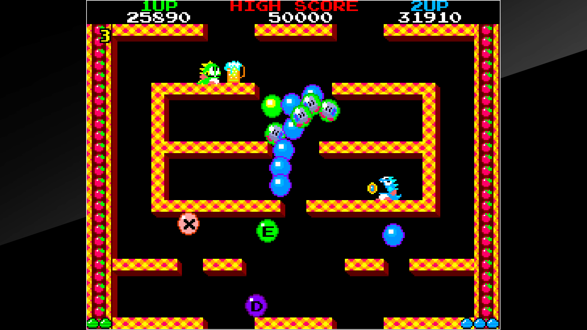
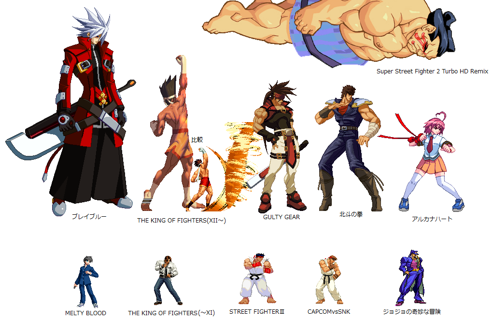
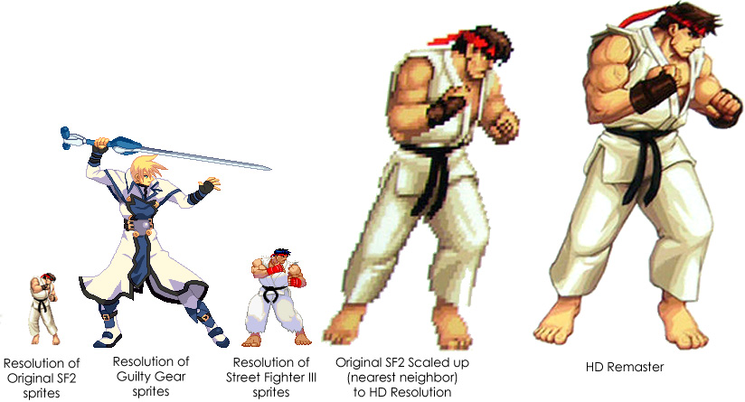

# Week8: Sprites, saving state

Atlasses, loading and swapping sprites, loading and saving to JSON.


<!-- @import "[TOC]" {cmd="toc" depthFrom=1 depthTo=6 orderedList=false} -->

<!-- code_chunk_output -->

* [Week8: Sprites, saving state](#week8-sprites-saving-state)
	* [Sprites](#sprites)
		* [Quick history](#quick-history)
		* [Now](#now)
		* [Atlasses, sprite sheets](#atlasses-sprite-sheets)
		* [Unity atlas creator](#unity-atlas-creator)
	* [Unity UI](#unity-ui)
		* [Buttons and states](#buttons-and-states)
		* [UI canvas is huge](#ui-canvas-is-huge)
		* [Uh oh. Different events.](#uh-oh-different-events)
	* [Load/Save](#loadsave)
		* [What? (state)](#what-state)
		* [Parser/JSON](#parserjson)
	* [Resources](#resources)
	* [Todo](#todo)

<!-- /code_chunk_output -->


## Sprites

What are they? How to use?


_Bomberman Super Nintendo sprites_


_Sonic by Neweegee!_

___

### Quick history
Sprites are just 2D drawings. 
* Screens were low resolution, so sprites were too. 
* Memory was precious, power was limited, so very few frames and a limited palette 
* 1, 4, 8, 16 colours, 1 taken for transparency
* Things often in powers of 2 due to binary and registers/memory. Anything that leaned on what a computer was best at gained performance.



Sprites grew larger and more complex as 2D hardware improved and memory grew. 





___

### Now

Sprites aren't really drawn to the screen pixel by pixel, 1:1 as they used to be. The hardware 

___

### Atlasses, sprite sheets

Keeping draw calls, memory usage, file size down. 

### Unity atlas creator

They're created like materials and sprites, then you populate them:

1. In project window right click->create->sprite atlas 
2. In the atlas under _Objects For Packing_ you can add folders, sprites, 2D textures. **I added my folder and it auto packs my sprites as I add images**
3. Set _Filter Mode_ to _Point_ if you are using pixelated art and might scale.


___

## Unity UI

I started to make the buttons manually, to stick with just using sprites and code, but no need to reinvent that on assessment 2. I used the unity UI goodies.

### Buttons and states

We can create a button by:
1. Creating a Canvas _GameObject -> UI -> Canvas_.
2. Tweak canvas settings (picture below)
3. With canvas selected, _GameObject -> UI -> Button_

The easy part was using a UI button to drop in the states of my button sprite.


___

### UI canvas is huge
Working in a big off screen thing that it projects back to screen space. 
* a lot of power
* a little odd to work with at first


___

### Uh oh. Different events.

Yeah the UI stuff doesn't use the same events, or box colliders. So, how do we integrate it into our controls->model->readouts design.

Good news: the model doesn't care, it looks like we'd expect. These code snips are from PrevNextItemOnClick, a monobehaviour component I add to any gui buttons with left or right arrows.

```cs
PrevNextItemOnClick.OnPrevNextRequested += OnPrevNextHandler;
```

The tricky bit isn't too tricky either.

```cs
	// Set up an outgoing event just like last week
	public static event Action<string> OnPrevNextRequested = delegate { };
	// Get ready to store a button
    private Button btn;
	...
	private void Start()
	{
		// On Start, grab the button component
		btn = gameObject.GetComponent<Button>();
        
		// Use the special onClick events "addListener" function 
		// every button exposes. I just googled this till I figured it out.
		btn.onClick.AddListener(OnMouseClick);
	}

	// In OnMouseClick do exactly what we did last week with OnMouseUpAsButton
	void OnMouseClick()
    {
        //Debug.Log(gameObject.name);
        OnPrevNextRequested(item + "_" + previousOrNext);
    }
```

## Load/Save


### What? (state)

### Parser/JSON

## Resources

## Todo