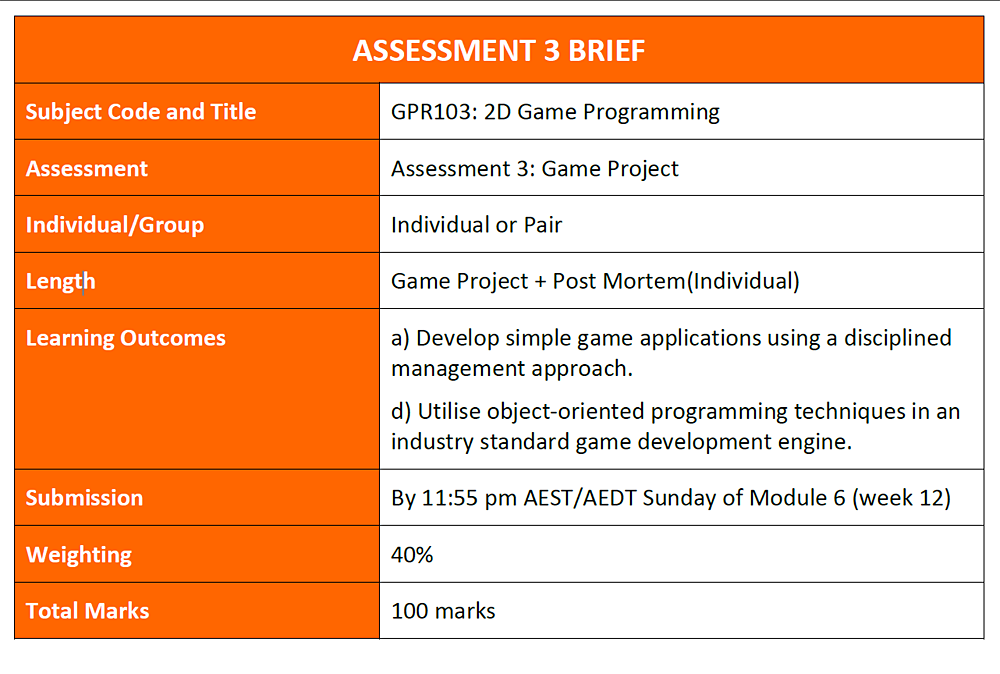
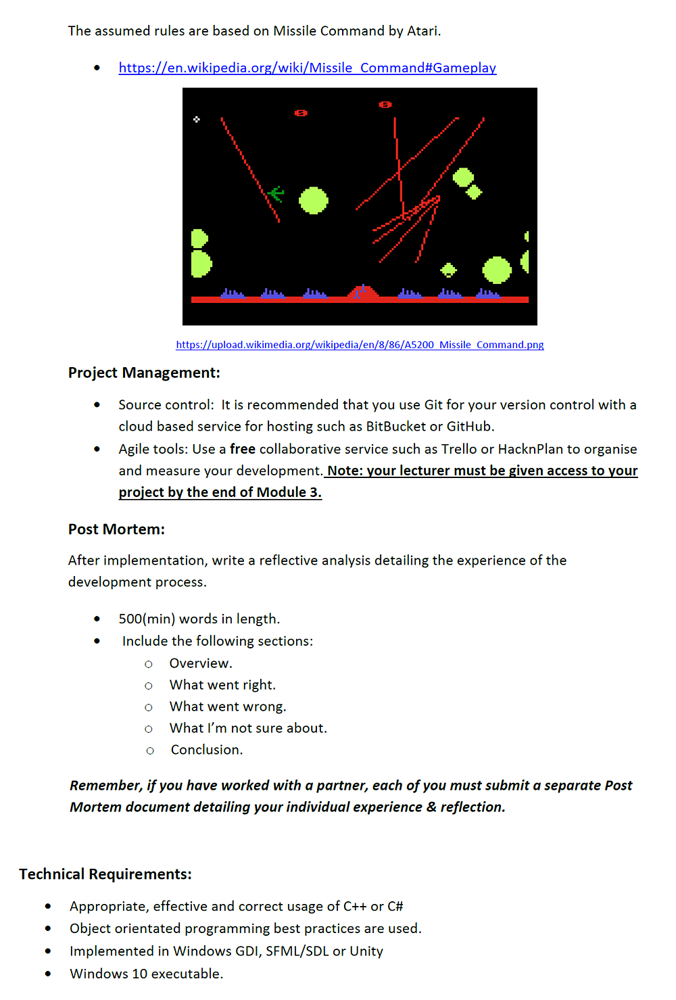
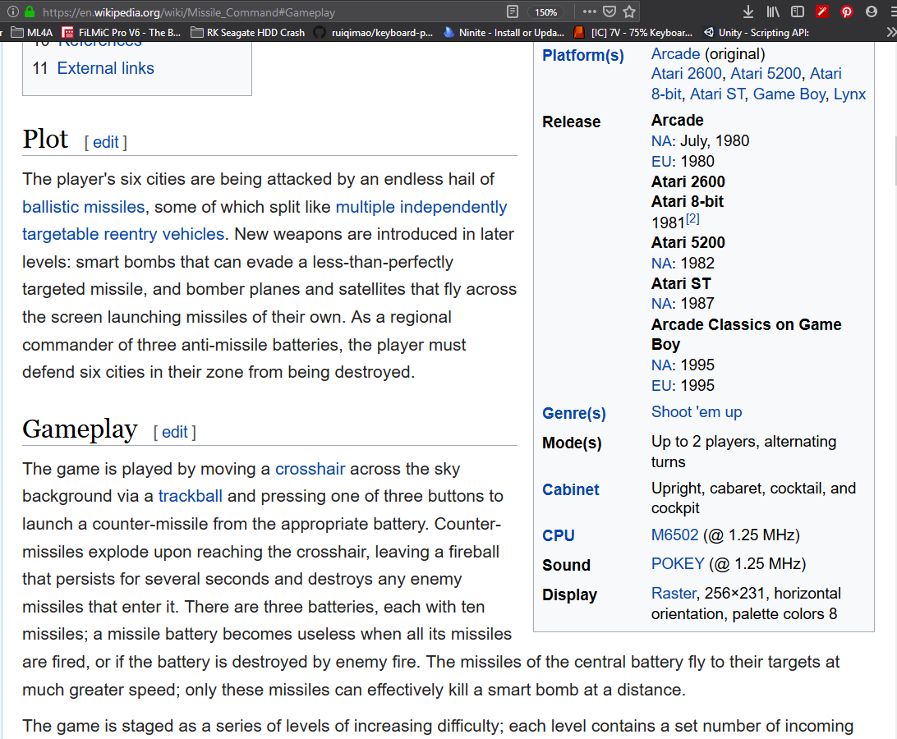
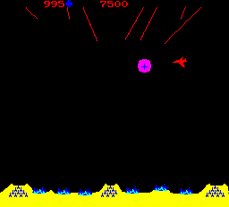
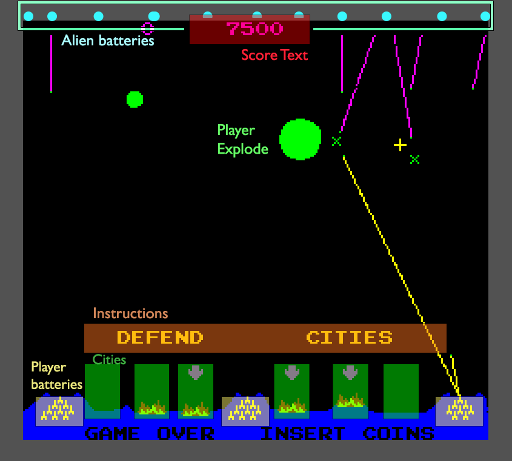

---
html:
  embed_local_images: false
  embed_svg: true
  offline: false
  toc: undefined
export_on_save:
  html: true
---
# Week 9

Recap A2.

Look at A3, get a base.

<!-- @import "[TOC]" {cmd="toc" depthFrom=1 depthTo=6 orderedList=false} -->

<!-- code_chunk_output -->

- [Week 9](#week-9)
  - [Your todos for next week](#your-todos-for-next-week)
  - [Assessment 2](#assessment-2)
  - [Assessment 3](#assessment-3)
    - [Game Play](#game-play)
    - [Breaking down the assessment in bullet points](#breaking-down-the-assessment-in-bullet-points)
    - [Cloning missile command](#cloning-missile-command)
    - [DELIVERY REQUIREMENTS](#delivery-requirements)
    - [How to submit](#how-to-submit)
    - [Gameplay](#gameplay)
    - [Git project](#git-project)
    - [Project folders](#project-folders)
  - [Art](#art)
  - [Can these screens help us plan?](#can-these-screens-help-us-plan)
    - [Figuring out the things in our game](#figuring-out-the-things-in-our-game)
    - [A partial list of them](#a-partial-list-of-them)
  - [Systems and Psuedocode](#systems-and-psuedocode)

<!-- /code_chunk_output -->

## Your todos for next week

The Unity3D College videos below are more advanced than things I've shared before, but you don't have to understand every part of his videos to benefit.

* Set up your hacknplan, message me a screenshot on blackboard.
* Watch finding objects video
  - [5 ways to reference gameobjects by Unity3D College](https://www.youtube.com/watch?v=ymq2AUckws0)

* Prefabs! The new method is "nested" prefabs, meaning you can have them within one another.
  - [This is an initial intro to prefab concepts](https://learn.unity.com/tutorial/essential-unity-concepts#5c7f8528edbc2a002053b6c7) by Unity. If you don't already have an idea what a prefab is, look here before you watch the next two videos. _The parts on editing after 0:37 are out of date_.
  - As they're now nested, watch this [great video on their usage](https://www.youtube.com/watch?v=SMH8wY4HQ0I) by Unity College 3D.
  - A unity sponsored and very informative [intro to nested prefab workflows](https://youtu.be/6_gAiPPKyUg?t=36) by Brackeys. Awkward intro (0-0:36) skipped.
  - I haven't watched this yet but I watch his videos on everything, he's great. [prefabs 101 on Unity3D College](https://www.youtube.com/watch?v=46BxZNP0WXk)
* If you like Unity3D College guy, watch his top unity mistakes video and some others. 

## Assessment 2

Questions

A look at my old implementation

Good/bad.

## Assessment 3

Missile command! Using what we've learnt, and keeping our work safe in Git.

[PDF brief on blackboard](https://laureate-au.blackboard.com/bbcswebdav/pid-7197509-dt-content-rid-11808950_1/xid-11808950_1)

Let's do a quick read through, then we'll really dig into it.

### Game Play

**Visuals:** The atari home version was a little under powered, so here's part of a guy's run on the arcade machine. It's a bit potatocam but the smoothness of the arcade version and the sounds come across. https://youtu.be/PKUDCPHlCvI?t=43

**Play:** The brief contains a [link to the wikipedia entry for Missile Command](https://en.wikipedia.org/wiki/Missile_Command#Gameplay) where the stages of gameplay and the rules are outlined.  

_Rules of the game [on wikipedia](https://en.wikipedia.org/wiki/Missile_Command#Gameplay)_

### Breaking down the assessment in bullet points

Making sure we don't miss easy stuff!

### Cloning missile command

Missile command is a game that was made with gameplay and feel in mind. The game didn't follow what was codeable: the code serves the game.

For this you can relax and put aside the game design side of the course, and just put on your gameplay coder hat. We're attempting to reproduce the feel and timings, the rules of the original, and to unity to that purpose.

> You have a near perfectly designed game. Can you, as a programmer, implement it?

### DELIVERY REQUIREMENTS

* **Use Unity 2019.1.x**. I believe the labs mostly have 2019.1.10 installed. Try not to go more recent than that, though it shouldn't make a huge difference.
  - [Click here to install 2019.1.10](unityhub://2019.1.10f1/f007ed779b7a) with Unity Hub.
* If you use 2018.2 (as we did previously) you'll be very confused because **prefabs, which you will need, work differently** now. TextMeshPro too is handled a bit differently. Save the stress, use 2019.1.x.
* **DO NOT use Unity 2019.2.x**. Things will change in unpredicable ways and you have no idea if it will run when I mark your assessment.
* Name your project for delivery from the start. **GPR103_Lastname_Firstname_MissileCommand**. Use it as your git repo name too. We'll do this tonight.
* **Use git!!** Then no one will have to send messages about losing files at the end or wishing they'd stopped before x or y happened. That'll also mean more marks because you submit your best work.

### How to submit

1. Right click the assets folder in your project view 
2. Open in explorer
3. Use the up arrow next to the explorer address bar (or press alt+up arrow to go to the folder above, containing your unity project folder.
4. Right click the project folder and either `7Zip->Add To GPR103_Smith_John_MissileCommand.7z` or `Send To -> Compressed (zip) folder`. I prefer 7z because it's smaller and you'll have a better chance of uploading a smaller archive.

### Gameplay

<https://en.wikipedia.org/wiki/Missile_Command#Gameplay>

A few design points:
* One trackball, 3 buttons
* 3 batteries have 10 missiles each, each controlled by one button.
* central battery is fastest
* If you're out of missiles before the attack stops, you must watch helplessly.

### Git project

We'll set up a project on Github using the naming specified in [How to submit](#how-to-submit)

Next, clone it using SourceTree.

### Project folders

Start out with an organised folder structure and you have a better chance of making it to the finish line.

Create a unity 2d project in a temporary folder, and then move the contents into our git repo folder.

* Changes appear in sourcetree
* Stage all the files, commit, push.

## Art

Here's some pixel art cut from the arcade/atari original. They're tiny, so you want to scale them up in _photoshop_ or _krita_ using the  _nearest neighbour_ resampling option. Otherwise you can bring them into Unity at this tiny size and set _filtering_ to _point_.

[arcade art starter zip](assets/week9/arcade_art.zip)

More screens to pull from:

## Can these screens help us plan?

Sometimes we can't solely create everything in our game model/manager and adjust the stage to suit. It's handy to lay out things visually.

### Figuring out the things in our game

First here's a drawover of things we might see in this game. This picture isn't just a lecture aid, I'll draw over a design like this to see the game world itself, rather than the final graphics. Remember we're simulating a world, and the job of the graphics is to communicate that world. How will that world be structured? 

>Luckily you don't have to be an coder to figure out the things in your game: just a gamer. Imagine the game playing, and think about the things that happen. Write down the things that do those things.

___

### A partial list of them

* alienBatteries
  - Grouped under stomething? Select a subset of arranged points, or generate random ones? Or pull from a level definition?
* playerBatteries
* cities
* AlienMissile
* PlayerMissile
* Planes
* ScoreText
* DefendPrompt

Later we'll look at how to find and these pre-layed-out elements. First we need a scene to work with.

## Systems and Psuedocode

Before figuring out classes needed, write down all the systems you can think of in this game

* level setup and oversight: level manager. runs the model, starts stops game.
* game world model: contains entities and updates them, notifies listeners.
* Enemy attack spawner - wave
  * incoming missiles
  * planes
* player missile firing
* scoring system
* hud 
* gameplay physics: 
  * enemy missiles colliding with explosions, cities
  * planes being destroyed

Try writing basic pseudocode, just to get your brain going, starting with simplest form of game.
