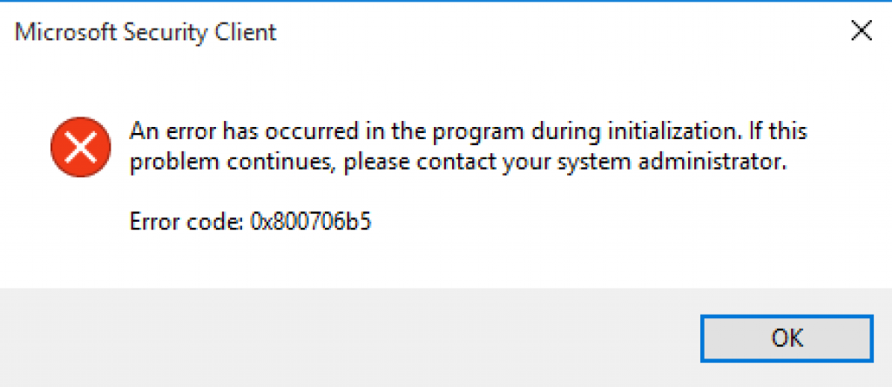

#### What is `using namespace`

```c++
using namespace std;
```

This lets us use code written by other people without having to put a path before it. `cout`, `endl` are in the _c++_ standard library, so..

```c++
    // without "using namespace std" we'd get a compile erour /// .. unless we do this:

    std::cout << "Hello world!" << std::endl;   // gross

    // The prefix std is the name of the library, and the
    // double colon :: is the syntax for accessing a library
    // function or variable.
```

### Why return zero?

```cpp
return(0);
```


_The whole operating falls over_

_Just your application falls over_

---

## Computer can do maths for us.

Computers (analogue and digital ) were designed by mathematicians and logicians like Alan Turing and John Von Neumann, based on centuries of theory by their predecessors. 

* The military wanted lots of maths done very fast, so you could fire shells accurately with new guns, and testing explosives without blowing stuff up. 
* The scientists wanted to do zany stuff like create simulations of life to figure out how living things work.

As a result, they can do all our maths for us, so long as we write out the expression/formula for them.
>Within a code block `{ .. }` C++ is, mostly, a series of statements. A statement brings to mind a mathematical/logical expression, or physics equation.
>
> On the left is a symbol for the result. On the right, an expression which is solved, collapsed into a result. 

### Equations in mathematics / physics

Einstein’s baby:

\[ E=mc^2 \]

A solution for a parabola:

\[ y=x^2 \]

### Equations in a slot machine

When you gamble, you hand over your bet. That is gone, you are down to your starting cash - bet. Anything you win is added to that. If a win (2 of a kind, 3 of a kind) returns your bet multiplied by a whole number (say 3x, 5x) then:

\[ myCashAfter = (myCashBefore - bet) + (bet * winMultiplier)\]

### In C++

These formulas/functions in C++ statement form
  * a variable on the left. A symbol to store your answer in.
  * an equals sign denotes assignment: assigning the right side to the left
  * an expression on the right side. This reduces to a solution like our line equation above.

```cpp

int main()
{
  int playerCash = 2000;      // Create variables that can hold information. We can
  int bet = 0;                // assign values to them if they are on the left of an "="    int winMultiplier = 3;      // We read their value by using their name anywhere else.
        

  cout << "Please enter a bet ($10-$500):" << endl;   // Print text asking the user clearly for a bet within a range

  // One more way to change a variable is to accept console input with 'cin'. This command lets
  // the player input a number at the console and hit enter to finish.
  cin >> bet;        // 'cin >>' means "send the console intput to the variable 'bet'"                                

  playerCash = (playerCash - bet) + (bet * winMultiplier);
  
  cout << "You won 3x your bet! Now you have $" << playerCash; // Display the result
}
```

E = m * pow(c, 2);