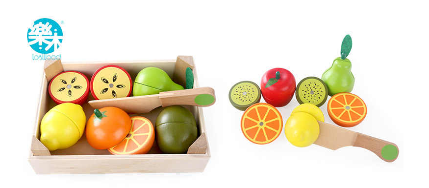
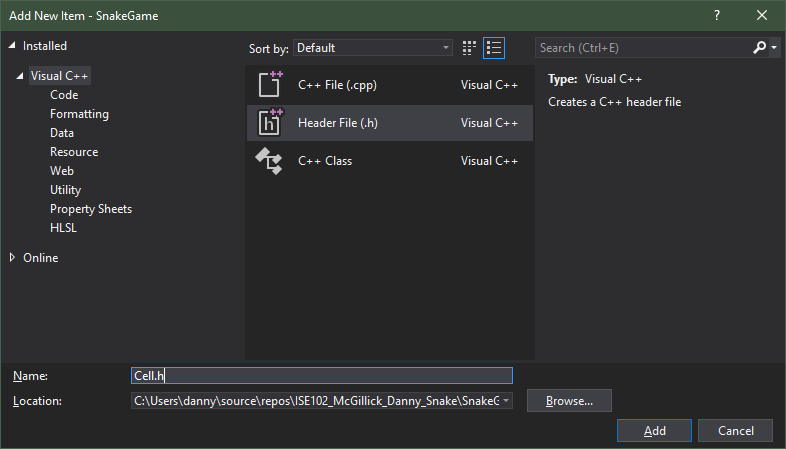

---
html:
  embed_local_images: false
  offline: false
export_on_save:
  html: true
---
# Week 10: Objects and movement
<!-- @import "[TOC]" {cmd="toc" depthFrom=2 depthTo=3 orderedList=false} -->

<!-- code_chunk_output -->

- [Week 10: Objects and movement](#week-10-objects-and-movement)
  - [Last week](#last-week)
    - [Exam comments](#exam-comments)
    - [Slots comments](#slots-comments)
  - [This week](#this-week)
    - [Resource: New eightiesGame.h](#resource-new-eightiesgameh)
  - [Snake: Problems to solve](#snake-problems-to-solve)
  - [Displaying and updating text](#displaying-and-updating-text)
  - [Snake as a board game](#snake-as-a-board-game)
    - [1. Board](#1-board)
    - [A scorekeeper?](#a-scorekeeper)
    - [Pieces](#pieces)
    - [Pieces, objects](#pieces-objects)
  - [Classes: Defining things a better way](#classes-defining-things-a-better-way)
    - [Classes in C++](#classes-in-c)
    - [Exercise: Make and use the Cell class](#exercise-make-and-use-the-cell-class)
    - [Condensing down to a Fruit class](#condensing-down-to-a-fruit-class)
  - [Continue at home](#continue-at-home)
    - [Random fruit](#random-fruit)
    - [Snake Class?](#snake-class)
    - [Defining a segment](#defining-a-segment)

<!-- /code_chunk_output -->


## Last week
We created a template and began drawing in code.

Tasks I laid out for people to work through at home:

Draw a border around a coloured background
Make the border flash
Draw cell numbers in the top and left margin (partial code provided)

**How did we do?**

### Exam comments

Questions that caught people:
1. Which is the not operator?
2. What are the values of these enums?
3. Values of b1, b2, b3, b4?
4. How many times will "hello" be printed?
5. Switch fall through

### Slots comments

1. Never use rand() without using srand() to seed it.
2. Don't use a series of ifs without else if unless you're dead certain of logic.

## This week

- Problems that must be cracked to make Snake
- Custom objects - How can objects help
- Let's move a thing with code
- Let's use key presses to change how a thing moves

### Resource: New eightiesGame.h

Grab the [Updated eightiesGame.h](assets/week10/eightiesGame.h)

* Intellisense now shows proper names for function arguments
* Colours constants reduced from `(short) Color::FG_YELLOW` to `FG_YELLOW`
* fgColor and bgColor for text

## Snake: Problems to solve

We can do things like fill the screen and draw a border. There are new problems that need resolving: What are they?

**Showing and updating a score**
A score is an amount that grows as you play and appears on screen all the time.  

**Making Fruit**
- Defining fruit 
- We've drawn random pixels, apply it to generating fruit locations 

**Moving a snake 1**
A Snake is made of at least 1 segment and moves around the screen at speed. It has a location and appearance. It reacts to inputs.

**Moving a snake 2: segments**
The snake has more than one segment. It has to be able to grow. It has to turn corners and have the body follow the path of the apparent 'head'
- Defining a snake as many segments
- Segments appearing to following snake head


## Displaying and updating text


## Snake as a board game

Board games. They have two basic parts minimum, usually.

### 1. Board

The board in snake is just a bunch of squares things can be in. Maybe you print it green so it looks like grass. 

It has a width and height, measured in cells, and a cell size.

 
_A gameboard with some example coordinates (green on green)_

#### Our board

We already have something in _eightiesGame_ with those exact properties, it's our window. 

```cpp
  // From week 9's code
  setupWindow(WINDOW_WIDTH, WINDOW_HEIGHT, PIXEL_SIZE, PIXEL_SIZE);

  // We can just define our constants in terms of our game board
  setupWindow(GARDEN_WIDTH, GARDEN_HEIGHT, CELL_SIZE, CELL_SIZE);

```

### A scorekeeper?

A score is an amount that grows as you play and appears on screen all the time. It's also an easy win, let's start with that.

a. Adding a score variable
b. Drawing "Score: x" to screen every frame

### Pieces

When we play a board game we often have physical chips or figures that we move around the board to signify players, enemies, props. What pieces would you need? Where do they go?


_We'd need some **snake segments**. We can probably ditch the head and tail for now._


_**Fruit pieces**. A single apple or orange might do for starters_

One of the extra mentioned features was a deadly obstacle.. A **killer block or a snake trap**.

### Pieces, objects

It makes sense to think of things as complete objects (fruit) or whole concepts (a cell). 


New classes of thing would beat what we had to do in the slots game.

> **So far in C++ we've been imagining complete things and having to define their properties in amongst other things.**

## Classes: Defining things a better way
<!-- 
Video on OO, what are objects? That people can watch later to get it.
Link to book chapter, people can research to get the details.
We'll push through so they have a code base and are gomitted to that over downloading a tute.
I've written it several times, grab something.
-->

Our game had, at miminum,
1. A slot machine
2. A player
3. A menu.

**They were all just ideas though.** Something we made out of variables and functions. They were **all thrown in** there together, we had to join them in our mind and with our variable/function naming.


// NEEDS PICTURES: Colour hilight variables/functions relating to slots, to menu, to player.

That would get really rough when you're defining game modes, character types, levels, weapons, etc etc. 

It would be a **better if those things could be bundled up somehow:** 
- if a slotmachine was a thing, defined in its own file. It could have a number of wheels, winning combos, payout rates. Then you could just use that slotmachine somehow as a variable, even have multiple slot machines! 
- A player could be defined in a file, and they could have money and a name.

// NEEDS PICTURES: class diagram or drawing

### Classes in C++

C++ is object oriented. Now we finally get to what that means. 

> An Object Oriented language lets you define classes of objects, like a SlotMachine or a Snake, with all their properties and abilities. Once you have a class you can make and use as many of those new types of objects as you like

For now we can think of a Class like so:

> **A class is a way of defining all the variables and functions a thing would have**, all in a file, and bundling them into **a new data type**. It's the **recipe** from which you can make many cakes. The **plan** from which you can make many of the same house.

### Exercise: Make and use the Cell class

**A cell is an x,y position** on our game board, defined as a whole number starting from 0. That's really all we need to know. All our gamepieces would have a cell they're located in.

Let's start with a `Cell` called `fruitCell`. We could use its `x` and `y` location to draw the fruit.

```cpp
Cell fruitCell;
fruitCell.x = 5;
```

#### Create a new project

Create a new eightiesGame **project called SnakeGame** in a **solution called ISE102_Lastname_Firstname_Snake**.

Enter this in main.cpp:


#### Create the Cell.h header file
It's looking good, except there's no such file as `"Cell.h"`. Since Classes are defined primarily in header files, there's no such datatype as `Cell` either. 

1. In solution explorer, right click Header files
2. _Add -> New Item.._
3. Add a header file called `Cell.h` (capital C)



#### Enter the code for `class Cell`

> `__CELL_H__` has double underscores at either end, single underscore in the middle.
>  Just get the spelling right for now, we'll cover the details later.


#### Wrapping up Cell and Color in `Fruit`

This stuff starts to make sense really quickly. Look at these lines..

```cpp
Color fruitColor = FG_YELLOW;
Cell fruitCell;

// ...

drawPixel(fruitCell.x, fruitCell.y, fruitColor);
```

Knowing that we can condense things into classes, doesn't it already look messy to be stuck with `fruitCell` and `fruitColor` and `fruitWhateverElse` variables?

### Condensing down to a Fruit class

Modify your `main.cpp` to create a `Fruit` called `lemon1`.


#### Create the missing class

Create the `Fruit` class and get rid of the squigglies.
1. Make Fruit.h in the headers part of the solution explorer
2. Copy the contents of Cell.h and paste them in, replacing all.
3. Change "Cell" to "Fruit" and "CELL" to "FRUIT"
4. Add the right (including a cell)
5. What includes do you need?

## Continue at home

### Random fruit

We've drawn random pixels to the screen before, try adding some random fruit.

### Snake Class?

Have a go at a Snake class with the following in mind:

**What properties does our snake have?**

1. Position of its "head" in x, y
2. Direction it is traveling.Axis and plus-minus?
3. Speed it is moving?
4. segments to its body (collection with a length)
5. A colour/colours.
6. Alive or dead state
7. 
### Defining a segment
  A segment is a pixel being drawn in a part of the snake. It has a cell location. Maybe it has a colour, or colour is just a factor of how far through the collection we are?

  Maybe segments is just a collection of cell locations? The rest is the snake?
  
  It has maybe a colour
  Moving a snake (on segment)
  e. Refreshing screen
  f. Controlling game speed/update
