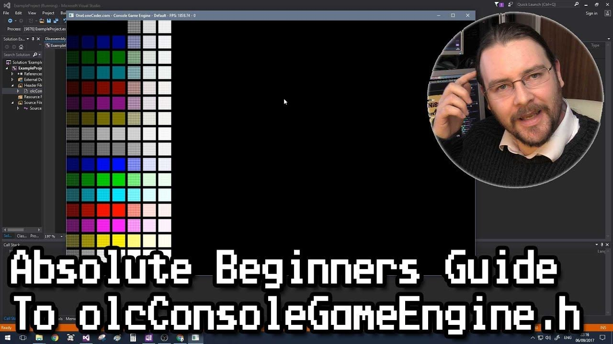

Making Games
=============

So how do it turn things like `for` and `Class` and `const unsigned long int` into actual games?

By doing thse few things in a loop. Each step through this loop is a frame of the game.

* While (playerIsAlive() && playerHasntQuit())
    * check for user input
    * move anything that is supposed to move
    * trigger spells, weapons, traps
    * check how everyone coped
    * draw the results to the screen (and play sounds)
* End While

Frames
------

Games are frames! Snapshots of time. _olcConsoleGameEngine_ will do that for us by calling the ```OnUserUpdate()``` function. Put code in there to do things each frame.

Checking Inputs
---------------

_olcConsoleGameEngine_ supplies an array of key (keys on the keyboard) states called ```m_keys```. In ```OnUserUpdate()``` we can check their states like so: 

```C++
bool isLeftKeyPressed = (m_keys[VK_LEFT].bPressed)
```

##Drawing

This can be 3D, 2D, Virtual Reality, text in a terminal, whatever. You've already figured out what to draw. We'll use _olcConsoleGameEngine's_ ```Draw()```, ```Fill()``` and ```DrawString()``` functions. 

* Things to draw:
  * Background
  * Border
  * Character and objects

## Frog Code From Week 10 Class

In here we've extended the game engine class and overridden a few functions. For the full instructions, watch One Lone Coder's getting started guide:

[](https://www.youtube.com/watch?v=u5BhrA8ED0o)

And here's the code:


**frogGame.cpp**

```C++
#include <iostream>
#include "olcConsoleGameEngine.h"

class Engine : public olcConsoleGameEngine
{
public:

private:
	struct Frog {
		int posX = 20;
		int posY = 20;
	};

	Frog frog_;
	bool isUpKeyHeld_ = false;
	bool isDownKeyHeld_ = false;


protected: //bouncer
	
	// OnUserCreate runs once when the game starts
	bool OnUserCreate()
	{
		// Initialise my game
		return true;
	}

	bool OnUserUpdate(float fElapsedTime)
	{
		// Check Inputs -----
		// Ternary (3) operator or inline if.
		// If this test is true, myVarValue = trueData.
		// If this test is false, myVarValue = falseData.
		// myVarValue = (test) ? trueData : falseData;
		//bool aGreaterThanB = (a > b) ? true : false;

		isUpKeyHeld_ = (m_keys[VK_UP].bHeld || m_keys[VK_UP].bPressed ) ? true : false;
		isDownKeyHeld_ = (m_keys[VK_DOWN].bHeld || m_keys[VK_DOWN].bPressed) ? true : false;
		

		// Move things -----
		if(isUpKeyHeld_) frog_.posY -= 1;

		// Draw Things ------
		drawThings();

		return true;
	}

	void drawThings()
	{
		// Screen background and frog
		Fill(0, 0, ScreenWidth(), ScreenHeight(), 0x2588, BG_BLACK);
		Draw(frog_.posX, frog_.posY, VK_SPACE, BG_RED);
		
		// Write key status top left
		if (isUpKeyHeld_)
		{
			DrawString(0, 0, L"Up", FG_DARK_YELLOW);
		}

		if (isDownKeyHeld_)
		{
			DrawString(0, 1, L"Down", FG_DARK_YELLOW);
		}
	}
};

int main()
{
	// make an instance (object) of your engine
	Engine myEngine;

	// Draw the console
	myEngine.ConstructConsole(60, 60, 16, 16);

	// Kick things off. This will call OnUserCreate() 
	// and then continuously call OnUserUpdate()
	myEngine.Start();

	// Main returns 0 eventually.
	return 0;
}
```


