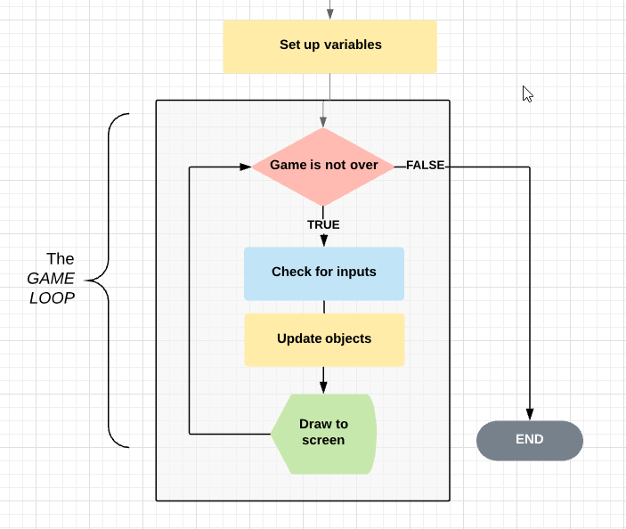
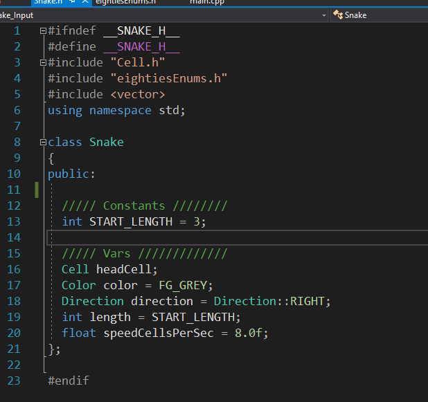
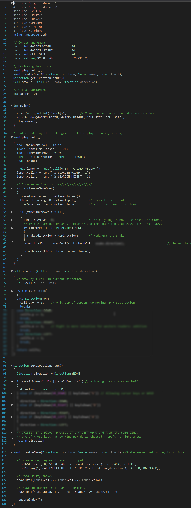
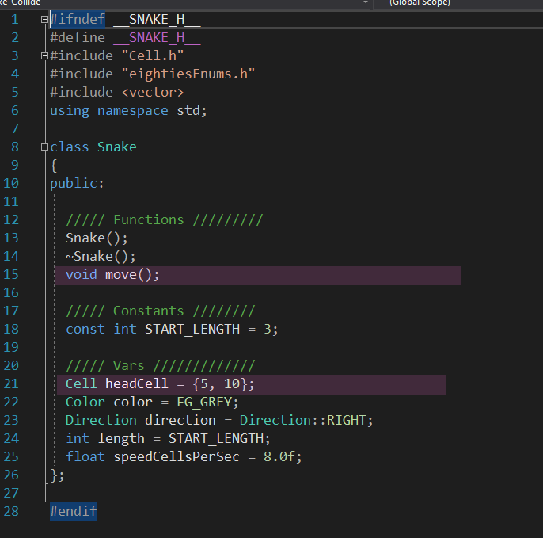
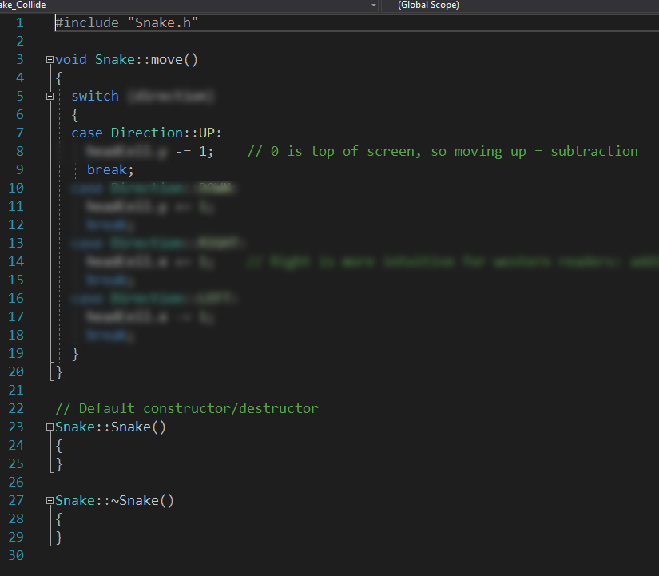
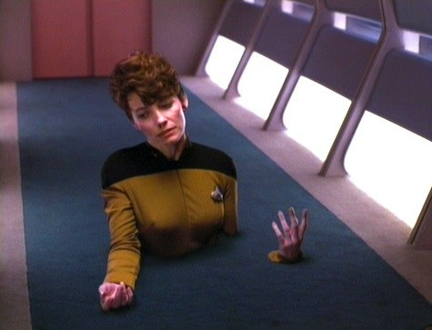
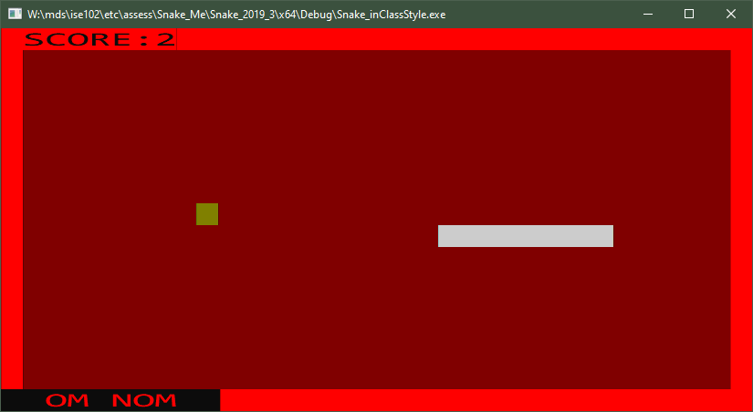
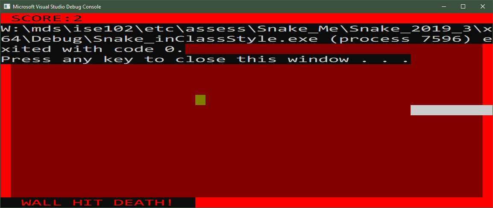
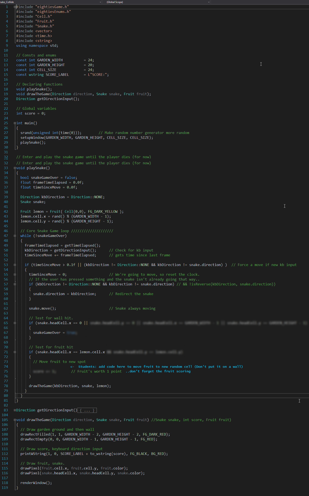

---
html:
  embed_local_images: false
  offline: true
export_on_save:
  html: true
---
# Week 11: A working game


<!-- @import "[TOC]" {cmd="toc" depthFrom=2 depthTo=2 orderedList=false} -->

<!-- code_chunk_output -->

- [Completing the game loop](#completing-the-game-loop)
- [Drawing and moving a one pixel snake.](#drawing-and-moving-a-one-pixel-snake)
- [Refresher: How to submit assessment:](#refresher-how-to-submit-assessment)
- [Adding functions to classes!](#adding-functions-to-classes)
- [The middle of the game loop: Collisions!](#the-middle-of-the-game-loop-collisions)
- [Thoughts: Messaging for start/end game](#thoughts-messaging-for-startend-game)
- [Thoughts: Menus in frame based game](#thoughts-menus-in-frame-based-game)
- [Game over](#game-over)

<!-- /code_chunk_output -->

## Completing the game loop

Everything comes back to the game loop.



We've learned about classes and objects, which is critical. 

### Last weeks code
The task during the week was to add a Snake class to your code.

Check yours against mine:


_Today's code below will expect this snake.h, but you can modify yours or the code a bit._

### Input and update
For the game loop though, so far **we only have setup and output/display**.

It's time to **capture input** and **update our objects.**

First, save the latest version of [the eightiesGame headers](assets/week11/eightiesGame_week11.zip) to your downloads folder.

### Listening for keys
  You can use a char for a alphabetic/numeric/punctuation keys:
  - `keyIsDown('A')`
  
  For specials, use a Microsoft-defined constant called a Virtual Keycode:
  - `keyIsDown(VK_SPACE)` for example, or `keyIsDown(VK_RIGHT)` 
  List of **virtual keycodes** provided by Microsoft:
  https://docs.microsoft.com/en-gb/windows/win32/inputdev/virtual-key-codes
  

_We'll use it to check for arrow keys and WASD_

### Exercise: Capturing keypresses

Here's where I've taken the code we did last week. If yours is quite different now, start a new project to follow along today, then you can integrate the changes later.
Otherwise, you can update yours to match this.

#### Main.cpp 1: Snake Input

If the code text isn't sharp, right click the image and open it in a new tab/window.


## Drawing and moving a one pixel snake.

Your task during this week was to, at minimum, make a Snake class. It should have a location for the snake's head and a color for the snake,along with speed and direction. 
  - In my example, I have headCell and color. 
  - To draw it, we call drawpixel.

```cpp
drawTheGame(Snake snake)
{
  drawPixel(snake.headCell.x, snake.headCell.y, snake.color);
}
```

### Ticking stopwatch
The main loop of a game has different names in game engine making. 
* You might call it a _frame_, or an _update_.
* Unreal Engine calls it a **tick**, which is instructive. The game  loop isn't stopping and waiting for you, it's the march of time.
  


### Controlling speed

The _game loop_ runs as fast as the computer can run, often ticking much faster than we want to move something or draw to the screen.
  - This simple game can loop over 1000x a second.
  - Moving every frame would be insane. The snake would be moving at over 1000 cells per second.

  Instead, lets move x times per second, say 10. That means we'd need to wait 1/10 = 0.1 seconds to move.
  - Code is already in RandomPixel.
  - Apply it to our game.
  
### Catching most input

Notice we're listening for inputs all the time, not just when it's move time.
  - We're only moving and drawing about 10 frames per second out of maybe 1000. 
  - 10 out of 1000 frames, as a percentage is 10/1000 = 0.01 = 1/100th of a second.
  - **If we only listened at move time we'd be deaf to inputs 99% of the time.**
* 
So, we check for inputs every frame.
  - We can still only move at our slower rate
  - Since nothing changes unless the snake moves, we only need to update the screen when our snake moves.




#### Clearing is filling

> Clearing the screen is just filling all cells with background colour.

I've added functions to eighties game to clear draw filled rectangles and empty ones.


## Refresher: How to submit assessment:
 Remember:
  - Check your naming conventions
  - Do not rename your project folder, main.cpp, or move any files around before submitting. Don't break stuff!
  - Make sure your delivered files work. Unzip the zip you made into a temporary folder, then go in and double click the sln file. Test that it all opens and compiles properly.
  
#### Conventions
Week 6 notes cover the [naming conventions](https://dmcgits.github.io/mds/ISE102/week6_notes.html#checking-your-coding-conventions). Do it, it's worth good marks!
  
#### Zipping and naming
Zipping your files and naming the zip file is the same as in Assessment 1, but with "SnakeGame" or "Snake" instead of "SlotsGame".
    - Instructions for how to find and zip your solution folder are [here in the week 6 notes.](https://dmcgits.github.io/mds/ISE102/week6_notes.html#delivering-assessment-1-files)


## Adding functions to classes!

Our main.cpp is getting a little too hands on with our Snake. 

> Main.cpp is telling the snake how to move using the snake's own direction, speed, headCell.
> If the Snake already knows all it needs to, let it move itself.

To add functions to a class you:
1. Declare the function in the .h file



2. Create a Snake.cpp file in _Solution Explorer: Source Files_
3. Include `Snake.h` in the cpp file
4. Define the body of the function, making sure to use the `Snake::` class identifier so c++ knows what you're doing.



5. Bring over the code from `moveCell` (currently in main.cpp) into Snake.cpp but use the snake's variables locally (instead of, say, `snake.direction`)

Now try defining a Snake::grow() function. For the body of the function, just type in a comment: "// Snake growing code goes here."

### Missing fast inputs

Wait! **If people input too quick, we'll still miss key presses!** How?
  - Imagine moving up screen to get a fruit, you have to turn super quickly to avoid hitting the wall.
// PICTURE:: Snake approaching fruit on wall.
  - People going up screen will rapidly press LEFT, then DOWN to turn around, by "drumming" their fingers down. Move your hand down in one movement but have the index land on _LEFT_ first, your middle finger on _DOWN_ a fraction of a second later. In fighting games it's called _plinking_.

By listening every frame, we should never miss an input; but we only USE that information when we move.
 
> **The scenario:**
> 1. We're going UP, and the user enters `LEFT` followed by `DOWN` between moves.
> 2. `LEFT` is written to `kbDirection`, and then `DOWN` overwrites it.
> 3. When it's time to move, `kbDirection` holds only `DOWN`
> 

// PICTURE:: frames being drawn over time down the screen, move only happening occasionally, and key presses next to it. Easy to understand.
  
 So `DOWN` now follows `UP`.  Reversing direction will eighter:
    - run the head into the body, causing death.
    - be ignored, if you don't think it should be a game-ending offense.

#### Forcing the issue
Force a move & draw as soon as a key is pressed
 


### Drawing a clean frame each time
Our snake leaves an endless trail if we don't clear the screen. How do we clear the screen?


## The middle of the game loop: Collisions! 

Collisions happen when two solid objects, say a hatchback and an SUV, try to occupy the same space. When it happens, there are repurcussions.

#### Game loop w collisions:  
1. Check for inputs 
2. Update objects
  2a. move things
  2b. Check if things occupy the same space
  2c. Decide the repurcussions (benefit or cost?)
3. Draw the screen


_There's a reason Star Trek was on at 11PM, kids._

### Collisions in Snake

1. Snake tip sharing cell with wall
   1a. Consequence: Snake succumbs, game ends.
2. Snake sharing cell with fruit
   2a. Consequence: Snake grows a segment, score increases by 1, Fruit relocates
3. Snake tip sharing cell with own body
   3a. Consequence: Snake succumbs, game ends.


_Snake to fruit collisions = noms_


_Snake to wall collisions = rip_

### Exercise: Check for things in the same cell

Remember: if this is too small, right click the image and view (firefox) or open in new window (chrome etc)


## Thoughts: Messaging for start/end game

You could just display a click to play message in the draw routine in stead of drawing the score, snake, fruit etc. 
That could be playState == TAP_KEY_TO_PLAY, playState == GAME_OVER
Maybe you need a different loop for the menu, and PlaySnakeGame is called from that outer menu loop.

## Thoughts: Menus in frame based game
It's a fancy version of the messaging with better key handling.
  1. write strings
  2. Wait for keypress (just like movement)
  3. Change to new game state (playing, or quit)

Menu showing vs Snake game showing can be handled by keeping the current state of the game/application in a avariable.  
  - Display menu if `currentScreen == MENU_SCREEN`
  - Display snake if `currentScreen == SNAKE_SCREEN`
  
## Game over
Our game simply stops right now. To get a polished result, you'll need to put a message on screen indicating the game is over, and make sure people looking at the defunct snake can see why.