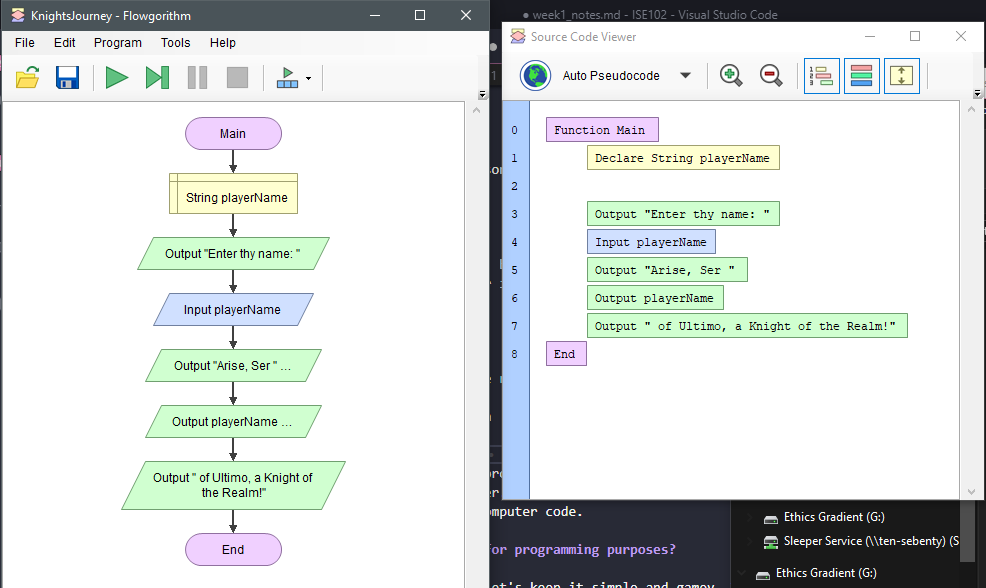
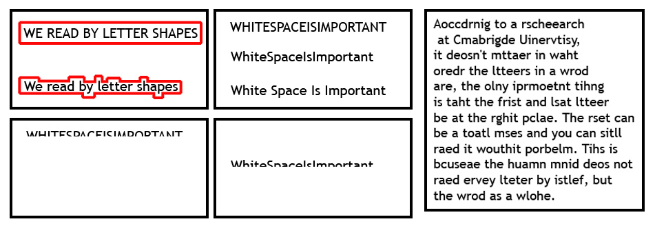
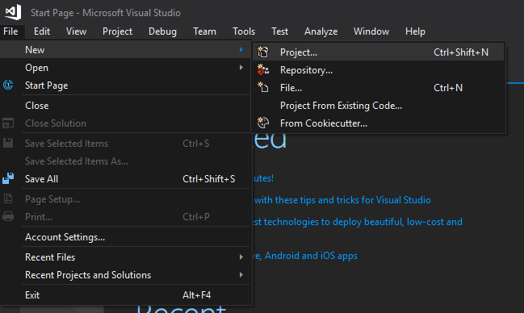
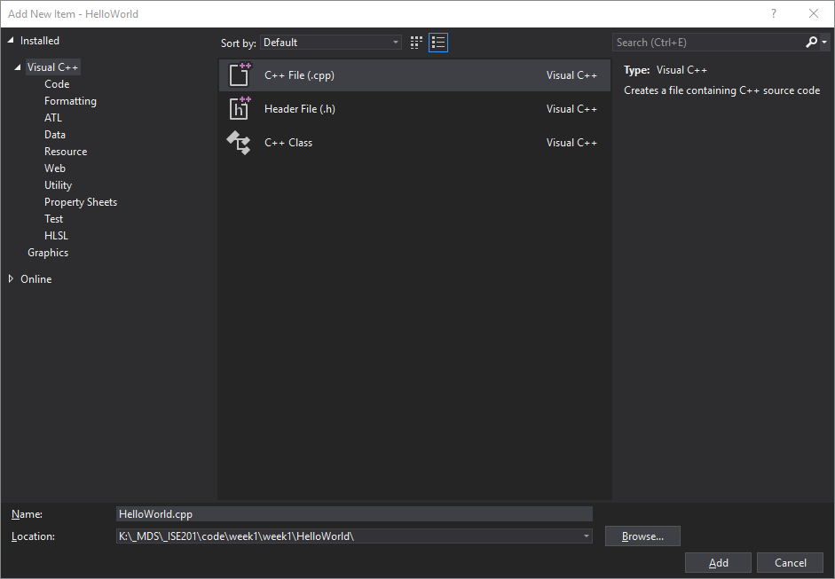
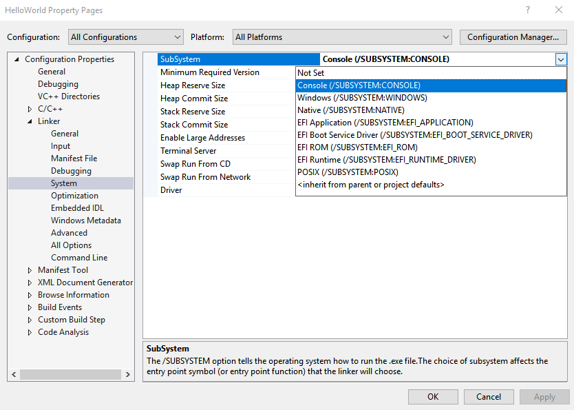
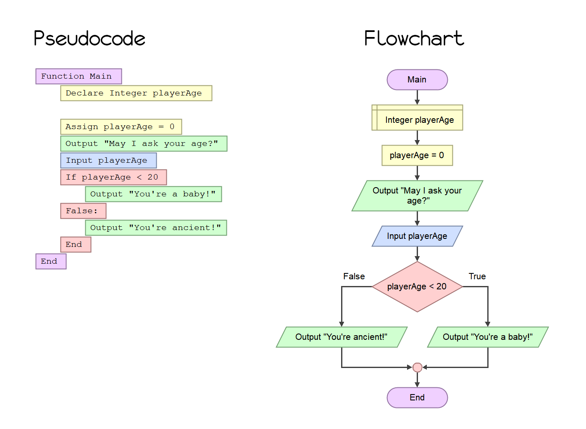
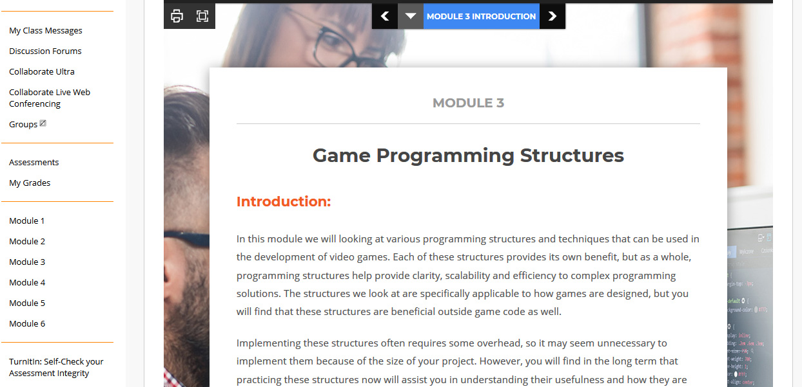

---
html:
  embed_local_images: false
  embed_svg: true
  offline: false
  toc: undefined
export_on_save:
  html: true
---
# ISE102 Week 1


<!-- @import "[TOC]" {cmd="toc" depthFrom=1 depthTo=6 orderedList=false} -->

<!-- code_chunk_output -->

1. [ISE102 Week 1](#ise102-week-1)
   1. [TO ADD](#to-add)
   2. [Part 1: Studying Software Engineering](#part-1-studying-software-engineering)
      1. [Who are we?](#who-are-we)
      2. [C++ in a nutshell](#c-in-a-nutshell)
   3. [Starting blind](#starting-blind)
   4. [Programming is bossing around](#programming-is-bossing-around)
   5. [Pogramming Knights Journey](#pogramming-knights-journey)
      1. [Flow](#flow)
      2. [Pseudocode by hand](#pseudocode-by-hand)
      3. [What is a computer, for programming purposes?](#what-is-a-computer-for-programming-purposes)
   6. [DIAGRAM IN/OUT/STORE/PROCESS](#diagram-inoutstoreprocess)
      1. [Those things in Knights Journey](#those-things-in-knights-journey)
      2. [Why not just write it directly in c++?](#why-not-just-write-it-directly-in-c)
   7. [Writing a program in C++](#writing-a-program-in-c)
      1. [Open visual studio and a default project](#open-visual-studio-and-a-default-project)
      2. [Write knights journey in c++](#write-knights-journey-in-c)
      3. [Run your program](#run-your-program)
      4. [Running Knights Journey](#running-knights-journey)
   8. [Breaking down the code](#breaking-down-the-code)
      1. [Whitespace](#whitespace)
   9. [Problem solving tools](#problem-solving-tools)
      1. [This is the key to coding.](#this-is-the-key-to-coding)
   10. [From pseudocode to source code](#from-pseudocode-to-source-code)
      1. [Hello world](#hello-world)
         1. [Let's code that!](#lets-code-that)
      2. [Let's understand that!](#lets-understand-that)
         1. [Blocks {} and ending a line of code ;](#blocks--and-ending-a-line-of-code-)
         2. [What is `using namespace`](#what-is-using-namespace)
         3. [C++ Comments](#c-comments)
      3. [Flow and Pseudocode](#flow-and-pseudocode)
   11. [How can we succeed learning c++ in this class?](#how-can-we-succeed-learning-c-in-this-class)
      1. [Hour splits and thriving in 2D Games Programming](#hour-splits-and-thriving-in-2d-games-programming)
      2. [Recommended texts](#recommended-texts)
      3. [My notes are your friends](#my-notes-are-your-friends)
      4. [Assessments](#assessments)
         1. [Assessment 1](#assessment-1)
         2. [Assessment 2](#assessment-2)
         3. [Assessment 3](#assessment-3)
   12. [Blackboard](#blackboard)
   13. [Part 3: Exercises](#part-3-exercises)
         1. [1. Basic input/output documentation](#1-basic-inputoutput-documentation)
         2. [2. Sololearn quiz](#2-sololearn-quiz)
         3. [3. Optional: review textbook chapter 1](#3-optional-review-textbook-chapter-1)
   14. [Appendix 1: Install Visual Studio Community](#appendix-1-install-visual-studio-community)

<!-- /code_chunk_output -->


## TO ADD

Get into programming quickly. start right away with input, test, output. That has to be every program.
Less time on hellos
Don't discuss assessments till week 2. Just explain a1 in week 2 and go hard into not googling tutes on slot machines, not scoring 0 for your assignment. Instead, google "generating random numbers in c++", "comparing numbers in c++".

Flowcharts to match psuedocode? Help everyone understand that decisions are key. If, then.
Get past hello world: do a simple app that says hello, asks how old you are.

If you're older than x, say "you're old". If younger, "you're young".

Also "What is a console??" Console leads to 'cin', 'cout'.

The flow of the arrows tell us where the info goes, especially if we add more

`>>>>>>>>>`  - looks like its going right
`<<<<<<<<`   - left

Look at pseudocoding and flowcharting here:
<https://www.codeavengers.com/notes/planning/flowcharts>

Flowgorithm could be perfect, it even outputs c++.

## Part 1: Studying Software Engineering

Learning about programming through _C++_.

> * What is programming? Structured problem solving.
> * Where did _C++_ come from, and what is it used for?
> * A little high school maths and organised thinking. If you understand computer hardware it won't hurt.

---

### Who are we?

**Me:** Danny McGillick. Computer Science @ UTS, Web dev, Creative technologist in advertising (flash/actionscript, unity), 2D and 3D artist for Torus, Halfbrick, Blowfish studios. Keyboard enthusiast, bits maker.

https://cargocollective.com/dmac/ - Flash/Unity 
http://www.artstation.com/dmacdraws/ - game art

**You:** The next makers with long futures.

--

### C++ in a nutshell


_Bjarne Stroustrup_

* Made by Bjarne Stroustrup in the 80s. Extended C. Still going.
* C was written for computer scientists to compile the same code on most any hardware.
* Big-time game engines, operating systems, your windows apps are written in _C++_, _C_. 
* Planes and fridges and satellites and watches and particle colliders and power stations. (picture)
* Fast, low level aka "close to the metal"
* No game making tools by default.
* There is free code out there in "libraries" that can help us when it comes to drawing graphics.
* It's what's called an Object Oriented language. C was procedural.

## Starting blind

Start with making a flowgorithm:
Ask a question
Get Input
Respons with text that includes their response.

Show that as pseudocode


## Programming is bossing around

When your parents withold your next blizzard game unless  you wash the dishes, they don't just tell you to do it. Not if they want clean plates. They leave you instructions.

Programming is just ordering a computer around. If you want it to do the right thing, you have to tell it exactly what you want. 

## Pogramming Knights Journey

Making a game, then, is a lot like a kid making up a game where they're the hero, then forcing a friend to play the monsters they terrorise and the people who thank them for being so heroic.

Knights journey is a game where you are Knighted for being amazing:

> 1. Program Knight's Journey in flowgorithm.
> 2. Play Knight's Journey.
> 3. Look at Knight's Journey pseudocode.

### Flow



### Pseudocode by hand

```
start program KnightAPerson

  string personName;
  string personSuburb;

  output "Enter thy name, brave person."
  personName = get player input
  output "Arise, Ser " 
  output playerName 
  output " of " 
  output suburb
  output ", Knight of the realm".

end program KnightAPerson
```

We can all understand a program written like this. We tell a a player something, get and store their answer. We then output a message using their answer. It's an essential tool for thinking out our problem without our brain being bogged down with the syntax (words and symbols) of computer code.

### What is a computer, for programming purposes?

That's pretty broad, so let's keep it simple and gamey. It's a lot like a person. It's a thing that has
1. (User) Input
2. Storage
3. Processing
4. Output.

## DIAGRAM IN/OUT/STORE/PROCESS

What are those?
1. Keyboard, mouse, camera, network user. 
2. Memory, cache, hdd, ssd, usb stick, network storage. All storage, just different speeds and retention.
3. Processing: Taking information from input, combining it with stored info, checking things, testing values and changing things. 
4. Output to world: screen, printer, network user/scoring table etc.

### Those things in Knights Journey

1. Input
   - User typing name in the chat box
2. Storage
   - Storing user name in a "variable"
3. Processing
   - Nothing here really, just goes straight to output
4. Output
   - Printing "Enter thy name..", "Arise" etc to the 

### Why not just write it directly in c++?

C++ is a way of telling a computer what to do. As a result, when you write it you have to use a lot of symbols and weird words for the computer's sake. This isn't especially hard on it's own, it's like any language: you just have to learn the grammar and the syntax (symbols, order of things). Still, it takes up brainspace.

> Solve the program problems away from c++ first. On paper or computer write plain english, pseudocode, draw diagrams and flow charts.

Lots of different languages are out there with lots of different syntax. Learn to think about and solve the problems, the rest is details you can pick up.

Well, here are programming languages that _github_ can hilight for you:
 [https://github.com/github/linguist/blob/master/vendor/README.md](https://github.com/github/linguist/blob/master/vendor/README.md)

All of them amount to a) telling a computer what do with it's input, processing, storage and output, b) in a language they acn read. So do A and B separately, because you'll never be as comfortable thinking in code as thinking in human language and knowledge.

## Writing a program in C++

### Open visual studio and a default project

### Write knights journey in c++

Open main.cpp and write our program there.


### Run your program

```cpp { .line-numbers }
#include <iostream>
#include <string>

int main()
{
  string playerName;

  cout << "Enter thy name: ";
  cin >> playerName;
  cout << "Arise, Ser ";
  cout << playerName;
  cout << " of Ultimo, a Knight of the realm";
}
```

### Running Knights Journey

A lot goes on before it runs, but we'll do it via a feature called **start without debugging**
  * Go to top menus:  **Debug -> Start without Debugging**
  * Hit the keyboard shortcut: **Ctrl-F5**

It should **build** your program and open the **console**, also known as the windows command prompt. Your program will run in text mode in this console.

When prompted, type in your name and hit enter.

## Breaking down the code

There's quite a bit to take in there, so lets start with something humans are very good at. Shapes!

### Whitespace
Whitespace is the empty space on your page. It's created by pressing **space**, **tab**, **enter** and more.

Why did I tab out a lot? **Whitespace** really helps us understand things, more than just adding more characters.



---

## Problem solving tools

```
    If I got some on my shirt:    <-- First check
    
        If I'm in public:         <-- Second check
        Wipe it a bit with a serviette.     <-- action
```

We check something, and based on the result, we act. This is called a **conditional**. Our check evaluates to **true or false**: true, I do have coffee on my shirt. true, I am in public. I better perform an action, hand me that serviette.

```
    While I can still see coffee:
        Rinse it with a bit of water
        Pat with a paper towel
```
Sometimes one action isn't enough. It's a repeated process of checking, acting, checking again. While something is true, keep doing this action. This is a **loop**.

```
start program I_SPILLED_COFFEE
...
end program I_SPILLED_COFFEE
```
A **situation** occurred. Our response is a **program**. Is there a better way to describe what the brain is full of? A whole bunch of responses to things we experience. I'm hungry! I'm tired! I want to browse the web! A car is coming at me!

We have a **program** to handle the situation **I spilled my coffee**. It has:
* **Information** (the state of our shirt and coffee, our location)
* **Conditionals** (checking those states and deciding on a path)
* **Actions** (Things that we do in response to the check results)
* **Loops** (A combination of a check and some things to do, repeated)
* **A Beginning And End**

### This is the key to coding.

The problem solving tools above are common across programming languages.

> _Coding is, first, problem solving_. This means dissecting the problem and creatively solving it. The syntax is just a way of communicating that solution to the computer, and you'll use multiple languages/syntaxes through your career.

---

## From pseudocode to source code

Like all languages, a programming language has
> Vocabulary -> Keywords
> Grammar -> Syntax
> A file with syntax and keywords in it contains.. source code! 

Keywords are words that have a special meaning to the compiler, like `int` and `using`. Wikipedia defines syntax for us:
> the syntax of a computer language is the set of rules that defines the combinations of symbols that [make a working program]

Good news is, once you've learned a language it's not nearly as hard to switch as the spoken ones:

> There are only 73 special or reserved words in C++
>There are on average 20,000 words a native English speaker uses.

---

### Hello world

Our situation is waking up, our problem is: how should I face the world? Solution? I'm going to greet it. Our _psuedocode_:

```
start program I_WAKE_UP
    
    Say hello to the world.

end program I_WAKE_UP
```

Our _c++_ code for that solution:

```c++
#include <iostream>
using namespace std;

int main() {

    cout << "Hello world!" << endl;
}
```

#### Let's code that!







_This setting will keep the console from closing when your program ends_

I recommend pausing your antivirus. For example, I turn off avast shields for 1 hour. Otherwise it'll intercept your new code.

Even something this brief is less clear in code, so make your life easy.

---

### Let's understand that!

What was the syntax? What were the keywords? You can play with the code along with me, or watch and do it later.

#### Blocks {} and ending a line of code ;

The _C++_ compiler mostly doesn't think about whitespace like us. Some languages do, but not _C++_. It would actually be happy with this:

```c++
#include <iostream>
using namespace std; int main() { cout << "Hello world!" << endl; }
```

..but we would be very sad. Thankfully, the _c++_ syntax for blocks and lines of code is pretty easy 

```c++
// We use the curly braces { } to define a block of code that should be grouped together. This includes all the code inside the main() function.

int main() {
    // all your code here
}
```
So use tabs, enter and space to make your code clear, and always remember `;` to end your lines.
```c++
    // When c++ finds a semi colon, that's a finished line of code.
    int ageOfBarry = 47;

    cout << "Barry's age is" << ageOfBarry << endl;
```

---

#### What is `using namespace`

```c++
using namespace std;
```

This lets us use code written by other people without having to put a path before it. `cout`, `endl` are in the _c++_ standard library, so..

```c++
    // without "using namespace std" we'd get a compile erour /// .. unless we do this:

    std::cout << "Hello world!" << std::endl;   // gross

    // The prefix std is the name of the library, and the
    // double colon :: is the syntax for accessing a library
    // function or variable.
```

#### C++ Comments

> There is only so much you can work out from reading someone else's code. Intent and thinking can be lost in translation.

Especially if the coder made mistakes. That's why we use comments. Think of them like footnotes in a book, or the margin comments in a textbook. Except even more important.

```c++
    #include <iostream>
    #include <string>
    
    // Anything written on one line after a double slash is ignored by the compiler
    
    /* 
    Anything written between these two slash and star symbols
    will be a comment over two lines. We can comment out whole blocks of code this way during testing
    */

    using namespace std;

    int main()
    {    
        // Here's a variable to store the user's first name 
        String firstName = "";

        // cout will output information to the user
        cout << "Enter your first name: ";

        /* cin will wait for the user to type a word and press enter, then
            assign the result to a variable after the >> symbol. */
        cin >> firstname;

        cout << "Hello " << firstName << endl;

    }

```
___

>We'll be using _Microsoft Visual Studio 2017_, an Integrated Development Environment, to write, compile and debug all our code. 


_The whole operating falls over_

_Just your application falls over_

---

Draw over that code what each bit was: 
allocate storage, 
print things to console, 
get input and put it in storage, 
produce output using what we stored

> graph computers: get input, store things, process things, store more., output.

### Flow and Pseudocode

**replace with genre flowchart**



Build it together in flowgorith.
Have everyone build another program in flowgorithm.
Then we export psuedocode to use as comments.
Write the c++ together.
Check answer

link to flowgorithm. 

## How can we succeed learning c++ in this class?

How are MDS subjects designed, and what do I need to do to get the most from them?

### Hour splits and thriving in 2D Games Programming

> **30%** class hours.
> **70%** studying, programming, gaining experience. 

The benefit of these courses comes from putting in work between classes. What we learn in class won't stick if you don't work and experiment at home.

### Recommended texts

_Beginning C++ Through Game Programming_ is available free when you're logged in to black board. Go to <https://ebookcentral-proquest-com.ezproxy.laureate.net.au/lib/think/detail.action?docID=3136727> and download chapters as free pdfs.

### My notes are your friends

The original course notes are in powerpoint, and available from the module pages in Blackboard. I write up new ones (like the one you're reading) for most lessons and post them on Git. The url pattern is:

https://dmcgits.github.io/mds/ISE102/week1_notes.html

> If I post an announcement before class I will often post an html notes link.

### Assessments

3 Assessments. It'll require a solid effort at all 3 to pass. 

#### Assessment 1

Text based slot machine. **Due end week 6**

#### Assessment 2

Exam covering material from mostly first 2 modules (first 4 weeks). **Due end of week 7**

#### Assessment 3

Snake game with ascii graphics. **Due end of week 12**


_Yes that snake game_

___


## Blackboard

Find assignment briefs, due dates, slides, programming tutes/samples and much more. The screenshots are from GPR103 but the structure is cross-subject.

> Digging through Blackboard material is the second key to coming out ahead in these subjects, just below coding at home.


_Grab the subject outline and subject planner_


_Every subject has modules in the left menu. Click one for important info_


_The blue button, top of screen, takes you to more info and resources. Don't skip the learning resources_

---

## Part 3: Exercises

#### 1. Basic input/output documentation

Read through <http://www.cplusplus.com/doc/tutorial/basic_io/> and try the different variations provided in the _Standard output (cout)_ and _Standard input (cin)_ sections.


#### 2. Sololearn quiz

Attempting to recall this info in different contexts will help you retain it. Sololearn quizzes are great for low pressure review.

1. Install **Sololearn** for [android](https://play.google.com/store/apps/details?id=com.sololearn) or [ios](https://itunes.apple.com/us/app/sololearn-learn-to-code/id1210079064). 
2. Register
3. Go to the **learn** section and **select the C++ Tutorial** under programming languages. 
4. Select **Basic Concepts** and work through the **first 5 sections (up to and including comments)** to revise today's learnings
5. Continue through the **next 4 sections on variables and basic maths** to be ready for next week's topics.


#### 3. Optional: review textbook chapter 1

Make sure you're logged in to blackboard and visit: <https://ebookcentral-proquest-com.ezproxy.laureate.net.au/lib/think/detail.action?docID=3136727>

___

## Appendix 1: Install Visual Studio Community

_Microsoft's longer, more detailed version of the following instructions is here: <https://docs.microsoft.com/en-us/cpp/build/vscpp-step-0-installation?view=vs-2017>_ 

If you already have Visual Studio: search for and run the Visual Studio Installer, select More > Modify (next to the launch button), then go to step 3. Otherwise,

1. Go to https://visualstudio.microsoft.com/vs/older-downloads/. Don't click "Download Visual Studio", instead scroll down and expand "2017" to download.
2. Run the installer. At a point it will ask you to select a _workload_.
3. Under _Workloads_ you'll see the _Windows_ section. Select _**Desktop development with C++**.
   
4. At the bottom right set _install while downloading_ and click _modify_ or _install_ (whichever you have). 