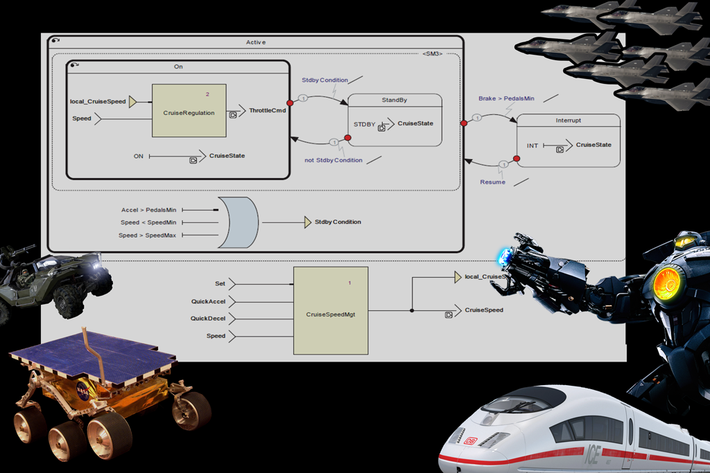
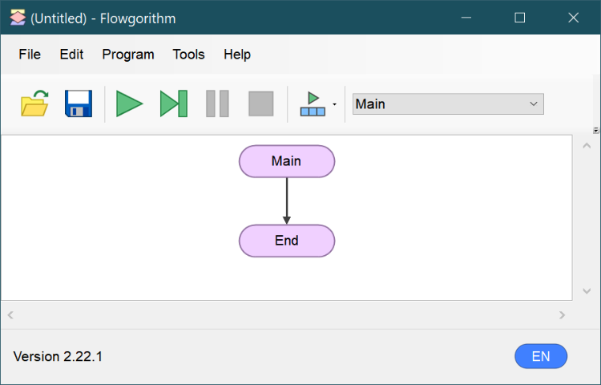
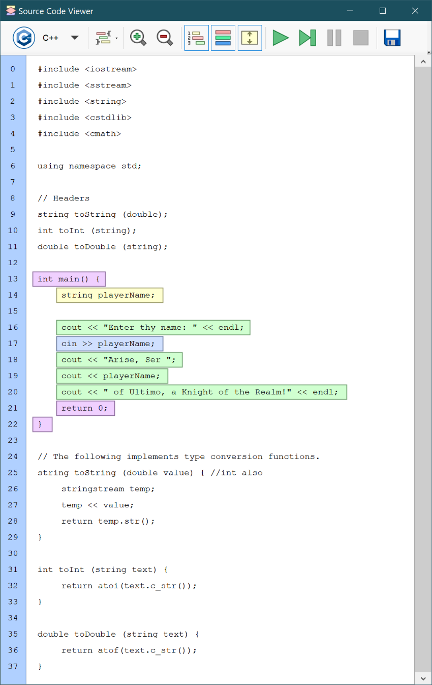

---
html:
  embed_local_images: false
  embed_svg: true
  offline: false
  toc: undefined
export_on_save:
  html: true
---
# ISE102 Week 1


<!-- @import "[TOC]" {cmd="toc" depthFrom=1 depthTo=6 orderedList=false} -->

<!-- code_chunk_output -->

- [ISE102 Week 1](#ise102-week-1)
  - [Who are we?](#who-are-we)
    - [C++ the language](#c-the-language)
      - [Cpp looks like this](#cpp-looks-like-this)
      - [Bjarne looks like this:](#bjarne-looks-like-this)
  - [Programming: it's just bossing around](#programming-its-just-bossing-around)
    - [So let's make Knights Journey](#so-lets-make-knights-journey)
    - [Programming by charts](#programming-by-charts)
    - [Programming in Flowgorithm](#programming-in-flowgorithm)
      - [Get and open flowgorithm](#get-and-open-flowgorithm)
      - [Instructions](#instructions)
    - [Exporting to pseudocode](#exporting-to-pseudocode)
    - [What is a computer, for programming purposes?](#what-is-a-computer-for-programming-purposes)
      - [Real examples](#real-examples)
      - [In Knights Journey](#in-knights-journey)
  - [Writing a program in C++](#writing-a-program-in-c)
    - [Open visual studio and a default project](#open-visual-studio-and-a-default-project)
    - [Write knights journey](#write-knights-journey)
      - [Running it](#running-it)
  - [Breaking down some of the code](#breaking-down-some-of-the-code)
    - [Input and Output](#input-and-output)
      - [cin](#cin)
      - [cout](#cout)
    - [Storage aka variables](#storage-aka-variables)
    - [Whitespace](#whitespace)
    - [Blocks of code and ending a line](#blocks-of-code-and-ending-a-line)
    - [Export c++ from flowgorithm](#export-c-from-flowgorithm)
  - [Thriving in ISE102](#thriving-in-ise102)
    - [Write loads of code.](#write-loads-of-code)
    - [Reading and working through the textbook](#reading-and-working-through-the-textbook)
    - [Refer to the notes!](#refer-to-the-notes)
  - [Exercises](#exercises)
    - [1. Sololearn quiz](#1-sololearn-quiz)
    - [2. Read textbook chapter 1](#2-read-textbook-chapter-1)
  - [Resources](#resources)
    - [Installing Visual Studio Community](#installing-visual-studio-community)
    - [cin and cout documentation](#cin-and-cout-documentation)

<!-- /code_chunk_output -->

## Who are we?

**Me:** Danny McGillick. Computer Science @ UTS, Web dev, Creative technologist in advertising (flash/actionscript, unity), 2D and 3D artist for Torus, Halfbrick, Blowfish studios. Keyboard enthusiast, bits maker.

https://cargocollective.com/dmac/ - Flash/Unity 
http://www.artstation.com/dmacdraws/ - game art

**You:** The next makers with long futures.

---

### C++ the language

C++ is a programming language. You write text files using the c++ language, and with some computer magic you get executable programs.

* Created by Bjarne Stroustrup in the 80s. 
* Built on C
* It's what's called an Object Oriented language. C was procedural.
* Triple-A games, operating systems, word, photoshop are written in _C++_ and  _C_. 
* Planes, fridges, satellites, watches, particle colliders. (picture)
* Fast, low level aka "close to the metal"
* No game making tools by default.
* Quite familiar to _Java_, _C#_, _ActionScript_ programmers.
* Somewhat familiar to _Python_ coders, and in some ways strange.

____

#### Cpp looks like this

```cpp {.line-numbers}
#include <iostream>
#include <string>
using namespace std;

int main()
{
  string message = "Hello!";

  cout << message << endl;

  return(0);
}

```


#### Bjarne looks like this:


___

## Programming: it's just bossing around

When your parents withold your next blizzard game unless  you wash the dishes, they don't just tell you to do it. Not if they want clean plates. They give you **instructions** and locations of **resources**.

Programming is just **ordering a computer around**. If you want it to do the right thing, you have to tell it 
1. What to do
2. Where to find stuff it needs.

### So let's make Knights Journey


**Making a game**, then, is a lot like a kid making up a game where they're the hero, then **forcing a friend to play the monsters** that lose. Or to **bestow many honours** on you

_Knights Journey_ is a game where you are Knighted for being amazing. We'll:

> 1. **Program** Knight's Journey in **Flowgorithm**.
> 2. **Play** Knight's Journey.
> 3. Look at Knight's Journey **pseudocode**.
> 4. **Write it** in C++
> 5. **Break down** the C++

---

### Programming by charts

We don't have to start straight in with code. In fact that's almost never the case.

You can:
  * Mind map
  * Plan out bits on Trello or some other project organising tool
  * Draw up diagrams
  * Build flow charts

Some tools are used to plan out your system as a chart, then export code! Critical transport systems where operation has to be absolutely understood and reliable. It's not bleeding edge performance or super flexible.



___ 

### Programming in Flowgorithm

I've already spent many hours designing this game, so we're going to the charting stage. Flowgorithm is kind of amazing: the flowchart you make can run as a program.


#### Get and open flowgorithm

1. [Download](assets/index/flowgorithm_micro.zip) Flowgorithm.
2. Unzip it to a folder you'll remember. Say, Documents/ISE102/Software
3. Jump into the flowgorithm folder. Ignore Micro for now.
4. Double click flowgorithm.exe.



#### Instructions

Here's **what I need the computer to know** about Knights Journey:
1. You ask me my name
2. I tell you my name
3. You tell me I'm a Knight of the realm, using my name.


---

---

---

---

---

---

---

---

---

---

---


### Exporting to pseudocode


That psuedocode is super easy to follow! The only weird bit is `String`. 

> A **string is a collection of letters, numbers, spaces, punctuation. Anything you might write in a comment,** for example. It could be a single letter/number/punctuation mark, a sentence, a long email. Put "double quotes" around stuff that goes in a string.

Pseudocode is super easy to read. It's an essential tool for thinking out our problem without our brain being bogged down with the syntax (words and symbols) of computer code.

### What is a computer, for programming purposes?

Complicated things are easier to understand when we break them into bits. A computer, and thus a  program, are just:

1. (User) **Input**
2. **Storage**
3. **Processing**
4. **Output.**

Not that different to people, except we move around and watch Netflix. 

**If we remember those four things, it's easier giving a computer things to do.**

---

#### Real examples

They're easier to remember when you realise they're all things you
> **Input:** Keyboard, mouse, camera, network user.
**Storage:** Memory, cache, hdd, ssd, usb stick, network storage. All storage, just different speeds and retention.
**Processing:** Things we do with the stored information. In games we usually do it based on input. Moving a character/vehicle, taking away mana when a spell is cast. Compressing files, editing pixels in a photo.
**Output:** Send to world or storage: screen, printer, network user/scoring table etc, write back to disk.

--- 

#### In Knights Journey

1. **Input**
   - **User typing** name in the chat box
2. **Storage**
   - Storing **playerName** in a "variable"
3. **Processing**
   - Nothing here really, just goes straight to output
4. **Output**
   - Printing "Enter thy name..", "Arise" etc to the **screen**

___

## Writing a program in C++

Writing a program involves:
1. **Creating a project** in a development environment. There are many, we'll used **Visual Studio**.
2. Figuring out how your **instructions convert to c++** instructions
2. Writing them in plain text files called **source files**. eg: main.cpp.
3. Telling Visual Studio to turn those files into an executable (*.exe)
5. Running your new  program.

### Open visual studio and a default project

We'll get into the nitty gritty later.
1. Download (VS_quickStart.zip)[assets/index/VS_QuickStart.zip] and unzip it
2. Rename the _QuickStart_ folder to _KnightsJourney_
2. Jump in to the folder and double click the `quickStart.sln` file.

### Write knights journey

Open main.cpp and write our program there.

```cpp { .line-numbers }
#include <iostream>
#include <string>

int main()
{
  string playerName;
 
  cout << "Enter thy name: ";
  cin >> playerName;
  cout << "Arise, Ser ";
  cout << playerName;
  cout << " of Ultimo, a Knight of the realm";
}
```

___

#### Running it

A lot goes on behind the scenes when we convert source files to an executable.

We'll do it by asking Visual Studio to **start without debugging**
  * Go to top menus:  **Debug -> Start without Debugging**
  * Hit the keyboard shortcut: **Ctrl-F5**

It should **build** your program and open the **console**, also known as the windows command prompt. Your program will run in text mode in this console.

When prompted, type in your name and hit enter.

---

## Breaking down some of the code

There's quite a bit to take in there, so lets start with something humans are very good at. Shapes!

### Input and Output


`cin` and `cout` are commands. They mean **console in** and **console out**. The console is the windows command prompt: the black window we saw. We'll get into it more. 

#### cin

* The `<<` operator streams any information after it into `cout`.
* `cout` is fairly powerful tool that prints the info to the display.

#### cout
 
* `cin` sucks information from the console when a user types input
* The `>>` operator sends that info to a variable or anything else on the right side.

---

### Storage aka variables

We had to store the player's name when they typed it in. That way we could print it out again when knighting them. We stored it in a **variable** called `playerName`.

* A variable is like **a little box that holds** a certain piece of **information**
* **It's labelled with a name**, so we can get stuff from it, or put stuff in.
* Different variables can hold **different types of information**.


**Variables have a**
1. **name:** a label, like `playerName`
2. **type:** what kind of info it can hold. **words (strings)**, whole numbers, decimals, colours etc 
3. **value:** real info you currently have stored in it. 

_In this example, the bits after `//` are comments. Visual studio ignores them. They're just for humans.

```cpp
// A variable in the middle of an expression lets you access its value
cout << playerName << endl;

// A variable on the left of a single equals sign lets us write to it.
playerName = "Perry Pink";

// Cin is an unusual, it can write console input to the variable coming *after* it.
cin >> playerName;
```

---

### Whitespace
Whitespace is the empty space on your page. It's created by pressing **space**, **tab**, **enter** and more.

Why did I tab out a lot? **Whitespace** really helps us understand things, more than just adding more characters.


---

### Blocks of code and ending a line

The _C++_ compiler mostly doesn't think about whitespace like us. Some languages do, but not _C++_. It would actually be happy with this:

```c++
#include <iostream>
using namespace std; int main() { cout << "Hello world!" << endl; return(0); }
```

So we use `{}` curlybraces for blocks of related code, and `;` semicolon to end a statement or line of code. 


Tabs (spaces at start of line) are for our human brains to quickly group code visually.


// a keyboard with code punctuation hilighted would be nice

---

### Export c++ from flowgorithm

It can actually export c++! We ddn't do that immediately, because we need to type code to retain it.

It's a great tool though for checking your work, planning things out, or even generating snips of code to integrate.



---

## Thriving in ISE102

**Hour splits:**

> **30%** class hours.
> **70%** studying, programming, gaining experience. 

The benefit of these courses comes from putting in work between classes. What we learn in class won't stick if you don't work and experiment at home.

### Write loads of code.

### Reading and working through the textbook

_Beginning C++ Through Game Programming_ is available free when you're logged in to black board. 

* Go to <https://ebookcentral-proquest-com.ezproxy.laureate.net.au/lib/think/detail.action?docID=3136727> and download chapters as free pdfs.
* Download pdfs [I've linked from the ISE102 index page.](index.html)

### Refer to the notes!

I've written my own notes for the course, based on the powerpoint notes on Blackboard. 

* I pepper them with code and info that will help you pass assessments
* If you like passing subjects, you like assessment help. Read the notes!
* Same url format each week: https://dmcgits.github.io/mds/ISE102/week1_notes.html

The original course notes are in powerpoint, and available from the module pages in Blackboard. 

> If I post an announcement before class I will often post an html notes link.

---

## Exercises

### 1. Sololearn quiz

A great way to remember things:
1. Regular low friction, low stakes quizzes
2. Answering different questions, posed different ways. Correctly or not.
3. Checking if you got them wrong or right!

**Sololearn** is a phone app that does these things brilliantly.

1. Install **Sololearn** for [android](https://play.google.com/store/apps/details?id=com.sololearn) or [ios](https://itunes.apple.com/us/app/sololearn-learn-to-code/id1210079064). 
2. Register
3. Go to the **learn** section and **select the C++ Tutorial** under programming languages. 
4. Select **Basic Concepts** and work through the **first 5 sections (up to and including comments)** to revise today's learnings
5. Continue through the **next 4 sections on variables and basic maths** to be ready for next week's topics.


### 2. Read textbook chapter 1

Make sure you're logged in to blackboard and visit: <https://ebookcentral-proquest-com.ezproxy.laureate.net.au/lib/think/detail.action?docID=3136727>

___

## Resources

### Installing Visual Studio Community
* [Instructions here](install_vs.html)

### cin and cout documentation
<http://www.cplusplus.com/doc/tutorial/basic_io/> has more info on _Standard output (cout)_ and _Standard input (cin)_.

