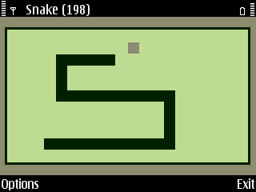
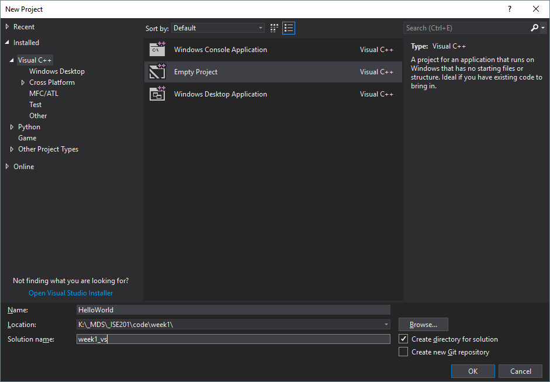
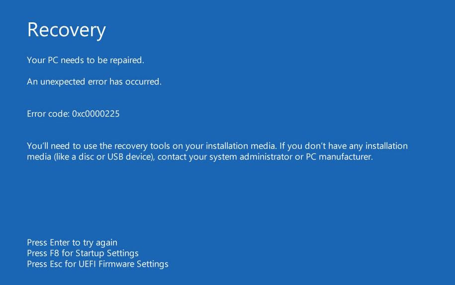
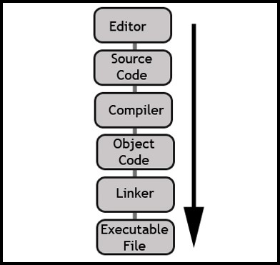

---
html:
  embed_local_images: false
  embed_svg: true
  offline: false
  toc: undefined
export_on_save:
  html: true
---
# ISE102 Week 2

<!-- @import "[TOC]" {cmd="toc" depthFrom=1 depthTo=6 orderedList=false} -->

<!-- code_chunk_output -->

1. [ISE102 Week 2](#ise102-week-2)
   1. [TO ADD](#to-add)
      1. [if](#if)
      2. [Expressions](#expressions)
      3. [Handy functions in flowgorithm.](#handy-functions-in-flowgorithm)
   2. [Assessments](#assessments)
      1. [Assessment 1](#assessment-1)
      2. [Assessment 2](#assessment-2)
      3. [Assessment 3](#assessment-3)
   3. [Making decisions.](#making-decisions)
      1. [Decisions in Flowgorithm](#decisions-in-flowgorithm)
      2. [Deciding by comparing](#deciding-by-comparing)
      3. [Deciding by comparing many things](#deciding-by-comparing-many-things)
   4. [Computer can do maths for us.](#computer-can-do-maths-for-us)
      1. [Slot machine decisions](#slot-machine-decisions)
      2. [More calculations for a slot machine](#more-calculations-for-a-slot-machine)
2. [next bit is bad. replace w "comparing things"](#next-bit-is-bad-replace-w-comparing-things)
   1. [Statement building blocks](#statement-building-blocks)
   2. [Working without quickstart](#working-without-quickstart)
   3. [What is `using namespace`](#what-is-using-namespace)
      1. [Why return zero?](#why-return-zero)
   4. [Why flowchart or pseudocode first?](#why-flowchart-or-pseudocode-first)
      1. [C++ vs spoken languages](#c-vs-spoken-languages)
      2. [How many keywords?](#how-many-keywords)
      3. [Games!](#games)
      4. [Adding conditionals](#adding-conditionals)
   5. [Powerpoint!](#powerpoint)
   6. [Compiling](#compiling)
      1. [Compiling and running your game](#compiling-and-running-your-game)
         1. [1. Source code](#1-source-code)
         2. [2. Compiler](#2-compiler)
         3. [3. Object code](#3-object-code)
         4. [4. Linker](#4-linker)
         5. [5. Executable File](#5-executable-file)
         6. [6. Loader](#6-loader)
      2. [Assessments](#assessments-1)
   7. [Blackboard](#blackboard)
   8. [Exercises](#exercises)
   9. [Resources](#resources)

<!-- /code_chunk_output -->

## TO ADD

Assignment 1 slot machine
 * Tutes: 
   - not googling tutes on slot machines, not scoring 0 for your assignment. 
   - Instead, google "generating random numbers in c++", "comparing numbers in c++", "validating input c++"

 The slot machine and variables/conditionals
 * The slot machine starts with capturing user input and checking if it's valid.

More on console: 
 * Have people download programs to a folder on desktop
 * Our program runs somewhere.. That's the console.
 * Open windows command prompt, cd into the desktop folder, then the folder we created
 * cd into micro
 * dir
 * run micro README.md or other file
   - Hit shortcut to show help file, see how it's like a gui? Graphical User Interface. This is built of text. Tui.
Show far running as example of how different characters and colours contribute to interface just using text.

Other ways to program:
cpp.sh 

LongNamesAreCool
if (Len(playerName>10))
{
  cout << "That's a cool name";
} else
{
  cout << "Who?";
}

### if

If: playerGuess == secretNumber
  true: You win a million moneys
  false: Wrong. My fault, can we play again sometime? Please?

Diagram.

### Expressions
Flowgorithm asks us to enter expressions when we assign, when we output.
- We've used "strings like this" or variableName. 
- But what is an expression?
  
  output: variableName + 3;
  assign: health = health - arrowDamage;
  if: playerGuess == secretNumber

### Handy functions in flowgorithm.
http://flowgorithm.org/documentation/intrinsic-functions.htm

Includes Random(n): Generate a random number between 0 and (n - 1)

Assign: secretNumber = Random(5);
secretNumber is now a box with a number from 0-4 in it (n-1, 5-1 = 4).

## Assessments

### Assessment 1

Text based slot machine. **Due end week 6**

### Assessment 2

Exam covering material from mostly first 2 modules (first 4 weeks). **Due end of week 7**

### Assessment 3

Snake game with ascii graphics. **Due end of week 12**


_Yes that snake game_


## Making decisions.

We're ordering things around. While they do work for us, they have to make decisions. Since we're in charge, we want them to **decide what we would decide**.

### Decisions in Flowgorithm

Make a decision based on comparing things


### Deciding by comparing

Is greater than, is less than, is equal to, is not.
`>`, `<`, `==`, `!`. 

### Deciding by comparing many things

Do you have a **full house**?
  - If you have **3 of a kind _AND_ remaining cards are a pair**.


Can you **go on the ride**?
  - If **playerAge is over 8yo _OR_ playerHeight is over 1.2m**.

___

Deciding by maths:

## Computer can do maths for us.

Computers (analogue and digital ) were designed by mathematicians and logicians like Alan Turing and John Von Neumann.

* They wanted them to make logical decisions and do loads of arithmetic to test theories, also the government gave them money if the maths could aim bombs.
* As a result, they can do our maths.
* All they need is the expression written out.

### Slot machine decisions

We need to decide if our 3 random numbers are the same. Or two of them are etc.

Rules here.

Lets do a flowgorithm for one of those.

You do another one.

### More calculations for a slot machine

When you gamble, you hand over your bet. That is gone, you are down to your starting cash - bet. Anything you win is added to that. If a win (2 of a kind, 3 of a kind) returns your bet multiplied by a whole number (say 3x, 5x).

Let's make a flowgorithm for one of those.

Now you do one.


\[ myCashAfter = (myCashBefore - bet) + (bet * winMultiplier)\]


# next bit is bad. replace w "comparing things"
## Statement building blocks

Storage, maths, logic and decision making, all in c++.

> **Variables:** defining values like `5`, `"Kendrick"`, `true`, `35.5`
> **Logic Operators:** How to compare/test values.
> **Math Operators:** +, -, = and all the rest.
> **Conditionals:** Choose what to do next, based on a value or test. 
> **Statements:** A line of code that does something
> **Enums** Defining a few constants at once

We'll start with simple variables and types, get into decision making and comparison, and then dive further into types and assignment.


## Working without quickstart





_This setting will keep the console from closing when your program ends_

Test it by writing hello world.

> I recommend pausing your antivirus. For example, I turn off avast shields for 1 hour. Otherwise it'll intercept your new code.


```cpp { .line-numbers }
#include <iostream>
#include <string>
using namespace std;

int main()
{
  string message = "Hello!";

  cout << message << endl;

  return(0);
}

// prints Hello! to screen

```

## What is `using namespace`

(replace with hilighted code?)

```c++
using namespace std;
```

This lets us use code written by other people without having to put a path before it. `cout`, `endl` are in the _c++_ standard library, so..

```c++
    // without "using namespace std" we'd get a compile erour /// .. unless we do this:

    std::cout << "Hello world!" << std::endl;   // gross

    // The prefix std is the name of the library, and the
    // double colon :: is the syntax for accessing a library
    // function or variable.
```

### Why return zero?

(hilighted image)

```cpp
return(0);
```


_The whole operating falls over_

_Just your application falls over_

---

## Why flowchart or pseudocode first?

**Written code is a way of telling a computer what to do**. A computer likes symbols and keywords we're not used to.

* It takes **brain resources** to **convert from our language to computer** language.
* It takes brain resources turning a task into a **formal list of instructions**
* **Don't do those two things at the same time!**

Solve the program problems away from C++ first. 
* Do it paper or computer, but write **plain english, pseudocode, draw diagrams** or **flow charts** first.

### C++ vs spoken languages

Like all languages, a programming language has
> **Vocabulary:** Words you need to know
> **Grammar:** How to arrange arrange and punctuate words so they make sense.

**Keywords** are the vocabulary of _C++_:
  - `int`, `return`, `using`, `namespace` and more.  

**Syntax** is the grammar of C++:
  - `=`, `{}`, `;`, `<<`, `()` and more
  
### How many keywords?

Luckily, there are **a lot fewer words to a programming language**.

* There are only 73 special or reserved words in C++
* There are on average 20,000 words a native English speaker uses.

---


### Games!

Let's look at this psuedocode.

```
start program LOW_HEALTH_ENCOUNTER

	I have: red mana, blue mana
  I know: Spells require an amount of mana of a certain colour

	If I have enough red mana: 
		cast healing spell
	Otherwise:
		If I have enough blue mana
			cast invisibility spell
		Otherwise:
			Well we're out of options. Good luck.

	let's run away no matter what

end program LOW_HEALTH_ENCOUNTER
```

>I added something new to the pseudocode this time: explicit information. Things I have, things I know.
>
> In my `spilled_coffee` week 1 example it was implied: the shirt's dirtiness, the quality of the shirt, my location. This time we have `red mana` and `blue mana`, which are needed for spell casting. They're like variables in c++ but not nailed down yet.

Our psuedocode said we have `red mana, blue mana`. Let's write that in _C++_:

```c++
#include <iostream>

// We define a variable like this:
// (type) (name) = (value);

int redMana = 20;
int blueMana = 100;

int main()
{
	
}
```

### Adding conditionals

We discussed decision making last week. We asked if something is true or false; then we take an action. 

```
	If I have enough red mana: 
		cast healing spell
```
Let's change that to _C++_. We've found more implied information too.. how much red mana is needed for a healing spell? 

```c++
// LowHealth.cpp
#include <iostream>
using namespace std;

// We define a variable like this:
// (type) (name) = (value);

int redMana = 20;
int blueMana = 100;

// A variable that never changes is a constant, or const.
// Write it in capitals so people know.
const int HEALING_RED_MANA = 60;
const int INVISIBILITY_BLUE_MANA = 80;

int main()
{

	cout << "I'm low on health.." << endl;	
	
	// If I have enough red mana:
	if ( redMana > HEALING_RED_MANA )
	{
		// cast healing spell
		cout << "Magic bandaid!!" << endl;
	}
	
}
```

That's if our "if" taken care of. What about our otherwise?

```c++
	if ( redMana > HEALING_RED_MANA )
	{
		// cast healing spell
		cout << "Magic bandaid!" << endl;
	}
	else
	{
		if (blueMana > INVISIBILITY_BLUE_MANA)
		{
			//cast invisibility spell
			cout << "Magic blindfold!" << endl;
		}
	}
```

Take away the white space, the specifics, and you get:

```c++
// Basic fork in the road. Based on a test, we choose one of two outcomes.
if (test) { code A } else { code B}
```

The code up there gets a bit ugly with the extra parentheses. It's common to put conditions on the `else`, so _c++_ lets us shorten it to "else if". We'll add the `run away no matter what` too.

```c++
// LowHealth.cpp
#include <iostream>

using namespace std;

// We define a variable like this:
// (type) (name) = (value);

int redMana = 20;
int blueMana = 100;

// A variable that never changes is a constant, or const.
// Write it in capitals so people know.
const int HEALING_RED_MANA = 60;
const int INVISIBILITY_BLUE_MANA = 80;

int main()
{

	cout << "I'm low on health.." << endl;

	// If I have enough red mana:
	if (redMana > HEALING_RED_MANA)
	{
		// cast healing spell
		cout << "Magic bandaid!" << endl;
	}
	//Otherwise:
		//If I have enough blue mana
			// cast invisibility spell
	else if (blueMana > INVISIBILITY_BLUE_MANA)
	{
			// cast invisibility spell
			cout << "Magic blindfold!" << endl;
	}

	// run away no matter what.
	cout << "Run away!" << endl;
}

```

## Powerpoint!
Switch, while, for, enum.
Logical and mathematical operators.
ints, floats, longs, shorts, char.

## Compiling

### Compiling and running your game



#### 1. Source code
Instructions for a computer to handle given situations and perform certain tasks. The source code will be written in the syntax and grammar of a particular programming language; in our case, the language is c++. 
  
#### 2. Compiler
A compiler reads your source code and usually converts it into machine code. This will be the specific instructions for a target computer and operating system, say windows x86 intel.
  
#### 3. Object code
The machine code output by the compiler, often with a .o extension. Your c++ compiler will also have on hand object code for the libraries it includes

#### 4. Linker
The linker takes your object code and looks for references to other code. This can be your own from multiple c files, or references to standard/downloaded libraries. It then inserts the referred-to machine code into your own and creates a single .exe file. There are other types that can be created, like dynamic libraries, but we'll discuss those later.

#### 5. Executable File
This is your finished product. It's ready to be double clicked, run from the command line, launched from Steam/Battle.net or any other way you begin loading it.

#### 6. Loader
The operating system executable that will load your executable into memory and begin execution. This is how it goes from instructions on an SSD/HDD to a running, interactive program.


### Assessments

3 Assessments. It'll require a solid effort at all 3 to pass. More details next week.

## Blackboard

Find assignment briefs, due dates, slides, programming tutes/samples and much more. The screenshots are from GPR103 but the structure is cross-subject.

> Digging through Blackboard material is the second key to coming out ahead in these subjects, just below coding at home.


_Grab the subject outline and subject planner_


_Every subject has modules in the left menu. Click one for important info_


_The blue button, top of screen, takes you to more info and resources. Don't skip the learning resources_

---

## Exercises

1. Code from the text book:
   * [week2_book_bits.html](week2_book_bits.html)
2. Type out and run some of the [week 2 exercises](week2_code.html). I recommend at minimum `2.1`, `2.5`, `2.6`, `2.7`. 
   * The handy bit in `2.6` is understanding the fall through option in switch statements. Super useful, people always miss it at first. There are few other ways to handle options with so little code.
   * It's good if you get bored defining variables and typing cout. Also good to get bored of trying logical comparisons. If you can get to where this stuff is easy and obvious you're on your way.
3. Work through sololearn c++ part 2: Conditionals and Loops.

## Resources

1. The book:
   * [chap 1](book_1/cppgameprog_1_variables_io.pdf)
   * [chap 2](book_1/cppgameprog_2_conditionals_game_loop.pdf)
   * [chap 3](book_1/cppgameprog_3_loops_strings_arrays.pdf)
