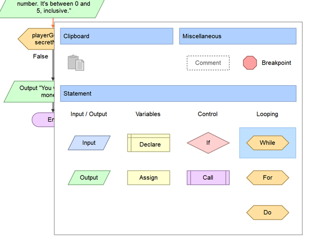
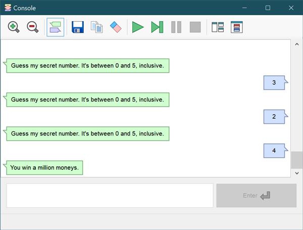

---
html:
  embed_local_images: false
  embed_svg: true
  offline: false
  toc: undefined
export_on_save:
  html: true
---
# ISE102 Week 3 - Loops, basic functions

<!-- @import "[TOC]" {cmd="toc" depthFrom=1 depthTo=2 orderedList=false} -->

<!-- code_chunk_output -->

- [ISE102 Week 3 - Loops, basic functions](#ise102-week-3---loops-basic-functions)
  - [Repeating!](#repeating)
  - [While In _C++_](#while-in-c)
  - [Limiting guesses with logic](#limiting-guesses-with-logic)
  - [Exercise: Menu Fighter](#exercise-menu-fighter)

<!-- /code_chunk_output -->

## Repeating!

Games are built on loops within loops.


We select something in the **main menu**, and eventually **return**: 


On the **"arcade" screen in _Overwatch_ we choose a game mode** and enter a queue. We'll either **cancel back** to this screen or **play a game** and return to the screen.


In Street Fighter we **play the best of 3 rounds**, in each of which we recover all our health and fight again.

### Guess Again: while loops

Our guessing game wasn't much fun when you had a 5 in 6 chance of losing. 

Let's add extra chances with higher/lower prompts until you get it. We need a way to **do things repeatedly**. 


Repeating/looping in flowgorithm is handled by **the while loop**, along with other loops. To make loops useful, **they can be stopped** eventually. 
* **Loops take a condition** in flowgorithm (and _C++_)
* just like an `if` statement it **only executes when the condition is true**. 
* **Enter** the conditional expression: check that playerGuess **is not equal to** secretNumber. 


### We need repeated user input

Our prompt and input is missing. Add that, and play your game.


What you'd see if **secret number is 4**.



### Exercise: Add higher/lower

* If the playerGuess is less than the secret number, print out "Higher." after their guess.
* Add "Lower." if they guess high.

## While In _C++_

```cpp {.line-numbers}
#include <iostream>
#include <string>
using namespace std;

int main()
{
  int playerGuess = -1;
  int secretNumber = 2;

  while ( playerGuess != secretNumber)  // Only runs if guess is not equal to secret
  {
    // Display prompt, get input.
  }
  return(0);
}
```

## Limiting guesses with logic

Our **end game** condition is `playerGuess == secretNumber`. Let's also **limit the player to 3 guesses**.

**We need a variable to count guesses:**


Then, increase the count each time someone guesses, using the **assignment operator** to overwrite guessCount.


### Checking two things

We could:
1. **Add an if statement**  to the loop, checking condition 2. if `guesses >= 3` it breaks out of the loop. 
2. More graceful: check both conditions in the loop.

### If A is true _or_ B is true

When we have multiple conditions in life, they.. depend.

> "Okay, I'll go to the party." Sharmeen said, and then "IF Bruno Johnson is going."
> ".. or Claus Hansomme." she further specified, after a pause.

With the help of the **logical operator `||`**, that's two pipe symbols (above `enter`), we can check for **A _or_ B**. 

**C++ uses the same syntax:**

```cpp {.line-numbers}
#include <iostream>
#include <string>
using namespace std;

int main()
{
  bool brunoIsGoing = false;
  bool clausIsGoing = true;

  if (brunoIsGoing || clausIsGoing)
  {
    cout << "\t" << "Looks like Sharmeen is going." << endl; // \t adds a tab at the start.
  }

  return(0);
}
```


More operators are also available here: <http://flowgorithm.org/documentation/operators.htm>


### If A is true _and_ B is true

We don't need `||` though. We need to **continue if the player hasn't guessed the number AND they have guessed less than 3 times**. This requires **logical and:**

> "Okay, I'll go to the party," Jessie flounced, "if you make the DJ play Cardi B."
> "**And** someone else drives." she added.

```cpp {.line-numbers}
#include <iostream>
#include <string>
using namespace std;

int main()
{
  bool brunoIsGoing = false;
  bool clausIsGoing = true;

  if (brunoIsGoing || clausIsGoing)
  {
    cout << "\t" << "Looks like Sharmeen is going." << endl; // \t adds a tab at the start.
  }

  return(0);
}
```


## Exercise: Menu Fighter

1. If noone's quitting, display a menu.  _(begins the loop)_
2. Let me choose an entry.
3. Take me to that option.
   - If play, print "You win! Hit a key to go back."
   - If options print "Your only option is to fight. Hit a key to go back." 
4. If it was "quit", let me do it. (break or set quitting true)
5. Try to return to displaying menu. _(returns to top of the loop)_

Enter options: Your only option is to fight. Return to menu.

Quit: Okay, quitting is another option.

### Adding constants for clarity

Checking if a number is 1, 2 or 3 is fairly meaningless to a human. We call these **magic numbers** because, without context, they could **mean anything**. They **appear and work as if by magic**.