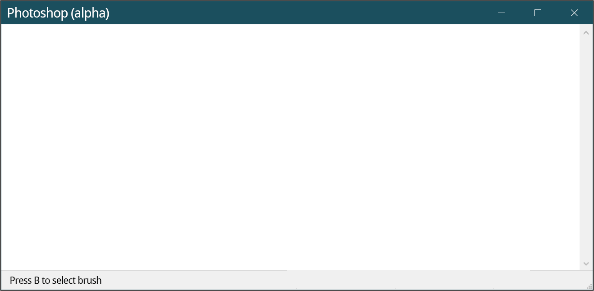
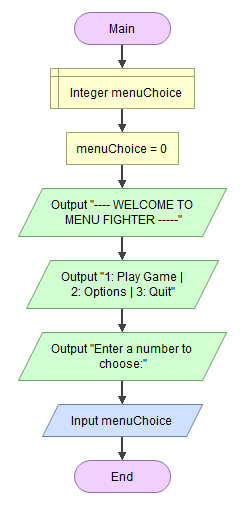
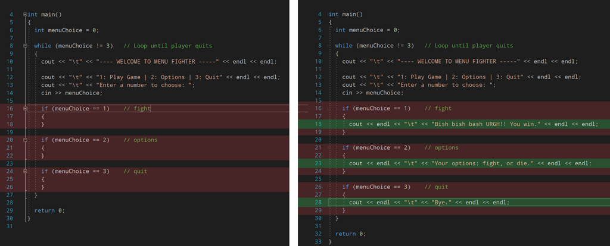
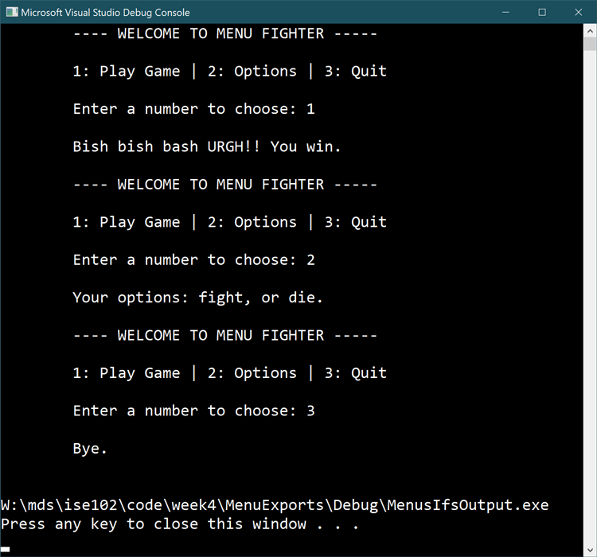
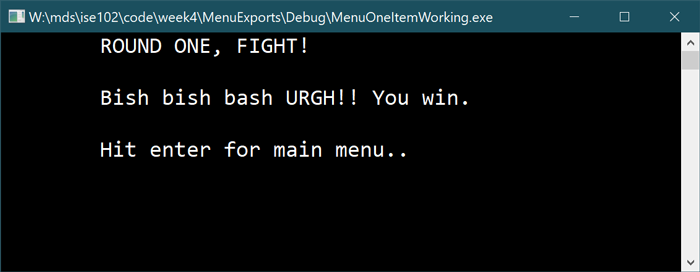
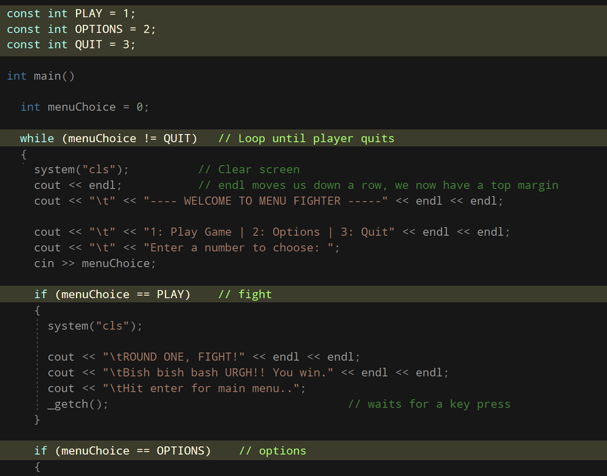
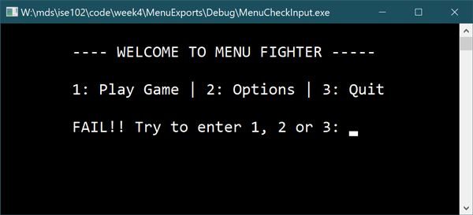
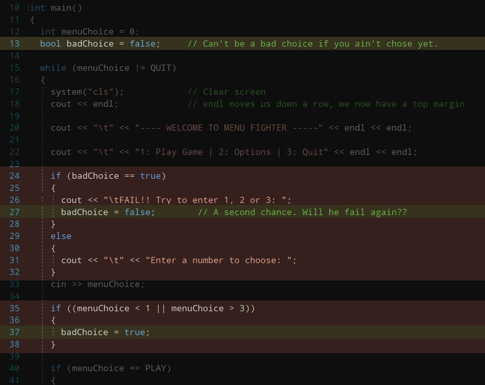

---
html:
  embed_local_images: false
  embed_svg: true
  offline: false
  toc: true
export_on_save:
  html: true
---
# Week 4 ISE102

<!-- @import "[TOC]" {cmd="toc" depthFrom=1 depthTo=3 orderedList=false} -->

<!-- code_chunk_output -->

- [Week 4 ISE102](#week-4-ise102)
  - [Last week's home exercise: Menu Fighter](#last-weeks-home-exercise-menu-fighter)
  - [A pretty easy approach to making a menu](#a-pretty-easy-approach-to-making-a-menu)
  - [Exercise: Exporting the bare bones menu to C++](#exercise-exporting-the-bare-bones-menu-to-c)
  - [Easy programming continued](#easy-programming-continued)
  - [Follow along: back to C++](#follow-along-back-to-c)
  - [Use variables for clarity](#use-variables-for-clarity)
  - [Exercise: Defining constants](#exercise-defining-constants)
  - [Testing inputs](#testing-inputs)
  - [EXTRA READING](#extra-reading)

<!-- /code_chunk_output -->


## Last  week's home exercise: Menu Fighter

### Recap

**Make this amazing game by yourself.** 

You can:
- Write it **directly in _C++_** 
or
- Make it **in _Flowgorithm_** and then **export it to _C++_**. Paste it into a Visual Studio project's main.cpp and **get it running in the console.**


> ---- WELCOME TO MENU FIGHTER -----
>
> 1: Play Game | 2: Options | 3: Quit
>
> Enter a number to choose:

Here are the computer's instructions:
1. If player hasn't quit, **display a numbered menu**.  _(begins the loop)_
2. Let me choose an entry by **inputting a number**.
3. Check their choice and:
   **Play Game**: print `"Round 1, Fight! Bish bish bash URGH!! You win."`
   **Options**: print `"Your only option is to fight."` 
   **Quit**: print `"You quit."` and remember **playerQuit is true**. 
5. Repeat. 

_6: If playerQuit is true, the loop won't run, we'll go to the end of the main function._

### How did you do?

1. Who thought it was an ok task to get through? 
1. Who got a flowgorithm version working?
1. Who exported C++ and got it working?
1. What got people stuck (even if you overcame it)?
1. Questions?

## A pretty easy approach to making a menu

As our games gain features so our code becomes more involved. Even flowcharts get detailed. This is when people start to worry that they can only make bits of code, not a whole program.

### Programs are easier to make in stages

Programmers aren't geniuses who just sit down and write Photoshop by starting at from `main()` and ending at `return 0` a few weeks later.

Making Photoshop like a programmer:
- Create a window 
- Change the title bar text to "Photoshop". 
- Make the status bar say "Hit B to select brush"
- Hook up the close window button so it exits. 

Maybe they're using some include that makes it super simple, like:
```cpp
  MSWindow window = MSWindow("Photoshop (alpha)", "Hit B to select brush"));
  window.show();
```



_**And that's Photoshop 0.001.**_ I'm not even kidding, that's how you start the real coding, after some planning.

### Don't sweat the end product

Not all the time. You make a program with a start and finish, then fill in the bits.

> **No one expects you to understand a program/flow like this at a glance,** or to write one from start to finish in a straight line.


Like building something in the real world, it looks impossible if you take in the whole finished item. Instead, professionals **break projects into manageable chunks**. 

### Take it one challenge at a time

Here's a way to **make the menu** more easiliy. My goal is to get the overall experience working first. 

1. Put in some **variables** for storage: menuChoice. _(yellow)_
2. Add some basic **input** and **output**. _(green and blue)_

1. Add a simple loop, the **processing**, like we did list week. _(orange)_


> It's important to **get your game flow working early**. It reduces surprises and stress. We have an outline, and are just filling in details.

This little diagram already has established the flow of menu fighter: Going to a menu, choosing options, returning to the menu, quiting. The challenge of structuring the program is done!

## Exercise: Exporting the bare bones menu to C++

Our export on the left has storage, processing and input/output hilighted. 


On the right is the very slightly altered code working in Visual Studio.

## Easy programming continued

### Decisions
>When we get to the processing, the decisions, it can be hard to keep things straight in our head if we try to code everything that goes in every if statement. **Throw in the ifs and elses you think you'll need**. 

1. Since we need three choices, I go ahead and throw in the 3 `if` statements. No worrying about else, or proper output yet.
2. Simple output is next: enough to make sure hitting `1` or `2` actually runs the right code.


#### I can read my loop easily
Green **outputs**, a blue **input**, and some red **processing**/decisions for the 3 choices. Forget if-else for now, I want **clarity first**.


#### Step back from the code to see the big picture.
Use the zoom out button on the toolbar. Get away from the syntax. It's no different to when you're drawing something, or trying to hang a frame on the wall at home.

#### Finishing touches.
All it needs now is the right output, maybe an error if it's not 1,2 or 3.

&nbsp;

## Follow along: back to C++

Let's see how we do things a bit differently in C++ to work with our console (vs chat style).

Let's also make things easier on ourselves.

### Adding ifs and basic outputs

I added some ifs, very easy to read and check it makes sense. Then, the output as before.

**Type it in!**





We get the right output for our inputs..

### Clearing the screen/console in C++

..but nobody wants to play **scroll down the screen fighter**.

We need two new things to clear the screen: the **`<stdlib.h>`** library, and the **`system("cls")`** function. No need to type this in, it's just handy to see in its simplest form.

```cpp
#include <iostream>
#include <stdlib.h>
using namespace std;

int main()
{
  cout << "Pointless text." << endl;   // Will never be seen because..
  system("cls");                       // console is cleared by CLear Screen
}
```

### Get it working for one entry first

I'm going to just focus on the first section, _1. Play_, until it works how I want. Don't overcomplicate things


**Add the new code and visual changes above**, including breaking up the _Play_ screen output to three rows. Make sure you include the **`<conio.h>`** library.

**Things I did:**
1. Added the **`cls`** bits to make it feel like the game has screens, and returns to the menu.
2. Added more **`endl`** and **`\t`**. The empty or 'white' space made it easier to read quickly.
2. That first clear before the menu breaks _options_. That's okay, get _Play_ sorted.
3. **`_getch()`** was added to wait for a key press (requires `conio.h`)




## Use variables for clarity

We used 1-3 for the choices. What if we use 1-8 later? These **magic numbers** quickly lose meaning. 

Put your **numbers in variables** with meaningful names.
```cpp
int play = 1
int options = 2
```

#### Use constants for unchanging numbers

Constants are variables in C++.. that don't vary.

* They're useful reference numbers that don't change while the program's running (if ever). **`PI`**, **`LUIGI_JUMP_HEIGHT`**, **`GRAVITY_MS`** are examples
* Write them in **`UPPER_CASE_WITH_UNDERSCORES`** so they stand out to programmers. 
* Add **`const`** before the type declaration (eg `int`)

**Add them in like below, including quit.**



## Exercise: Defining constants

Define constants for each of the following:

### 4 `int` constants
Significant numbers in your **favourite sport/game**
  
  ```cpp
  // Examples (do not use these yourself)
  const int RESERVES_ALLOWED = 3;
  const int SMALL_HEALTH_PACK_HP = 20;
  ```

&nbsp;

### 4 `float` constants:
**Australian average stats**: height in metres for both genders, also average weight in kg. Ask Google.

  ```cpp
  // Example
  const float CM_IN_AN_INCH = 2.54f;
  // Note that you need a trailing f when assigning a value to a float.
  ```
  Floating point numbers are used when you need decimal places.  

&nbsp;

### 4 `string` constants
 Common type-casting in film, and the actors best known for being in those roles. Some ideas: funny when angry lady, always shadey guy, cowboy, queen, goodlooking idiot guy, scary old lady.

  ```cpp
  #include <string>
  
  string SCATTERED_EARNEST_ATTRACTIVE_LADY = "Sandra Bullock";
  string SKINNY_DORK_NICE_GUY = "Michael_Cera";

  ```


## Testing inputs



Let's make sure they enter a menu choice that exists.

1. Set up a variable that remembers if errors were made
2. Set it if their number choice is out of range ( less than 1, more than 3)
3. Tell them about it when they fail, so they can try again.

It's a little weird because we need to print errors at the top of the loop where the menu is. Then get input and remember. 



It's not really that weird.


## EXTRA READING

### More on floating point numbers

**The `float` data type** stores numbers with a decimal point including scientific notation:
* 11.5 
* 1.2*10<sup>-20</sup>
* 0.00000002.


**More info:** https://www.learncpp.com/cpp-tutorial/floating-point-numbers/

### More on Conventions and `CONSTANT_NAME`
There's **no compiler rule saying** `const` names have to be **`UPPER_CASE_WITH_UNDERSCORES`**. It's purely for human eyeballs. We'll know it's an unchanging number **on sight**.

> **Conventions are practises** programmers follow to **make reading code easier** on themselves and others. If we follow conventions that are widely used, and do it consistently:
> 1. **Debugging our code** will be easier
> 2. **Sharing and receiving** code will be easier
> 3. **We can write bigger programs** and more complex games, because we'll **minimise wasted mental energy**. 
> 
> Like a marathon runner with a disciplined stride, we'll go further with the same resources.

### Related constants with **`enum`**

Enumerators provide a shorthand for creating (and grouping) constants with integer values.

```cpp
#include <iostream>
#include <string>
using namespace std;

enum MenuChoices { STORY_MODE, ONLINE_MULTIPLAYER, OPTIONS, QUIT };

int main()
{
  int choice = -1;
  cout << " 1: Play \n 2: Option \n 3: Quit \n Choose: ";
  cin >> choice;
  if ( choice == MenuChoices.PLAY)
  {
    // play
  }
  else if (choice == MenuChoices.QUIT)
  {
    //quit
  }
  return(0);
}
```

I've shown you an **enum defined on a single line** because hopefully it'll **help you remember** you need **a semi colon at the end** of an enum definition.

* Conventionally, an enum definition is **spread over multiple lines** for readability. 
* These curly braces **don't define a code block**. They're actually starting and ending a _set_, a collection. More on this later in data collections.

```cpp

enum MenuChoices    // enums can get long, so they're defined over multiple lines
{ 
  STORY_MODE, 
  ONLINE_MULTIPLAYER, 
  OPTIONS,
  STORE,
  LOOTBOXES,
  CREDITS,
  STATISTICS,
  QUIT 
};              // DON'T FORGET this semi colon. Spoiler: you will.
```

There's **a lot more to enums**, read on: <https://www.geeksforgeeks.org/enumerated-types-or-enums-in-c/>
