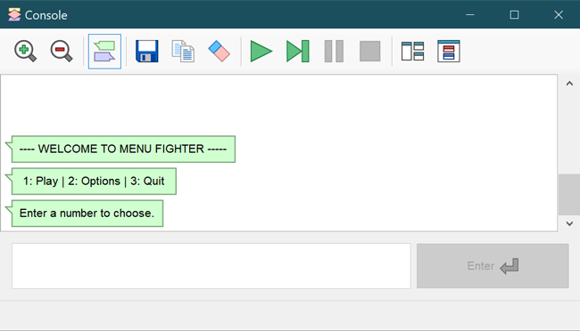
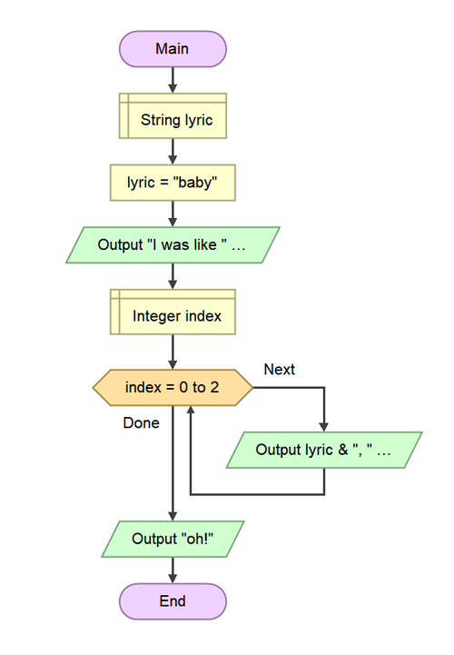

---
html:
  embed_local_images: false
  embed_svg: true
  offline: false
  toc: true
export_on_save:
  html: true
---
## Last  week's home exercise: Menu Fighter

### The brief

**Make this amazing game by yourself.** 

You can:
- Write it **directly in _C++_** 
or
- Make it **in _Flowgorithm_** and then **export it to _C++_**. Paste it into a Visual Studio project's main.cpp and **get it running in the console.**




> ---- WELCOME TO MENU FIGHTER -----
>
> 1: Play Game | 2: Options | 3: Quit
>
> Enter a number to choose:

Here are the computer's instructions:
1. If player hasn't quit, **display a numbered menu**.  _(begins the loop)_
2. Let me choose an entry by **inputting a number**.
3. Check their choice and:
   **Play Game**: print `"Round 1, Fight. Bish bish bash URGH. You win!"`
   **Options**: print `"Your only option is to fight."` 
   **Quit**: print `"You quit."` and remember **playerQuit is true**. 
5. Repeat. 

_6: If playerQuit is true, the loop won't run, we'll go to the end of the main function._

### How did you do?

1. Who thought it was an ok task to get through? 
1. Who got a flowgorithm version working?
1. Who exported c++ and got it working?
1. What got people stuck (even if you overcame it)?
1. Questions?

### How it might look


## Adding constants for clarity

Checking if a number is 1, 2 or 3 is fairly meaningless to a human. We call these **magic numbers** because, without context, they could **mean anything**. They **appear and work as if by magic**.

Constants **are variables** in C++.. **that don't vary**. They mean something like **`PI`**, or **`SECONDS_IN_MINUTE`**. When we use them in an if, it's clear what's happening.

```cpp {.line-numbers}
#include <iostream>
#include <string>
using namespace std;

const int PLAY = 1;
const int QUIT = 2;

int main()
{
  int choice = -1;
  cout << " 1: Play \n 2: Option \n 3: Quit \n Choose: ";
  cin >> choice;
  if ( choice == PLAY)
  {
    // play
  }
  else if (choice == QUIT)
  {
    //quit
  }
  return(0);
}
```

#### The `const` keyword
When the compiler sees **`const`** before **`int`** it means that variable can't be changed. If you **try to assign to**/overwrite a constant, your program **won't compile**.

#### Conventions and `CONSTANT_NAME`
There's **no compiler rule saying** `const` names have to be **`UPPER_CASE_WITH_UNDERSCORES`**. It's purely for human eyeballs. We'll know it's an unchanging number **on sight**.

> **Conventions are practises** programmers follow to **make reading code easier** on themselves and others. If we follow conventions that are widely used, and do it consistently:
> 1. **Debugging our code** will be easier
> 2. **Sharing and receiving** code will be easier
> 3. **We can write bigger programs** and more complex games, because we'll **minimise wasted mental energy**. 
> 
> Like a marathon runner with a disciplined stride, we'll go further with the same resources.

## Clearing the screen/console in C++

Nobody wants to play **scroll down the screen fighter**.

Add **`System(cls)` before showing sub screens**, and **before returning** to the main menu.

## Enumerators: **`enum`**

Enumerators provide a shorthand for creating (and grouping) constants with integer values.

```cpp {.line-numbers}
#include <iostream>
#include <string>
using namespace std;

enum MenuChoices { STORY_MODE, ONLINE_MULTIPLAYER, OPTIONS, QUIT };

int main()
{
  int choice = -1;
  cout << " 1: Play \n 2: Option \n 3: Quit \n Choose: ";
  cin >> choice;
  if ( choice == MenuChoices.PLAY)
  {
    // play
  }
  else if (choice == MenuChoices.QUIT)
  {
    //quit
  }
  return(0);
}
```

I've shown you an **enum defined on a single line** because hopefully it'll **help you remember** you need **a semi colon at the end** of an enum definition.

* Conventionally, an enum definition is **spread over multiple lines** for readability. 
* These curly braces **don't define a code block**. They're actually starting and ending a _set_, a collection. More on this later in data collections.

```cpp

enum MenuChoices    // enums can get long, so they're defined over multiple lines
{ 
  STORY_MODE, 
  ONLINE_MULTIPLAYER, 
  OPTIONS,
  STORE,
  LOOTBOXES,
  CREDITS,
  STATISTICS,
  QUIT 
};              // DON'T FORGET this semi colon. Spoiler: you will.
```


There's **a lot more to enums**, read on: <https://www.geeksforgeeks.org/enumerated-types-or-enums-in-c/>

## Other loop structures

**`for`** loops. **`do..while`** loops. Look into them in _Flowgorithm_ and _C++_

You'll mostly see **`for`** loops used to go through collections of data. We'll get to that next week.



**Note** I joined the `lyric` variable and the string `", "` using a single `&`. That's a flowgorithm thing.

### `for` exported to _C++_

**Note** how in _C++_ `lyric` and `", "` are joined using `<<`. This works when the line starts with `cout`.


