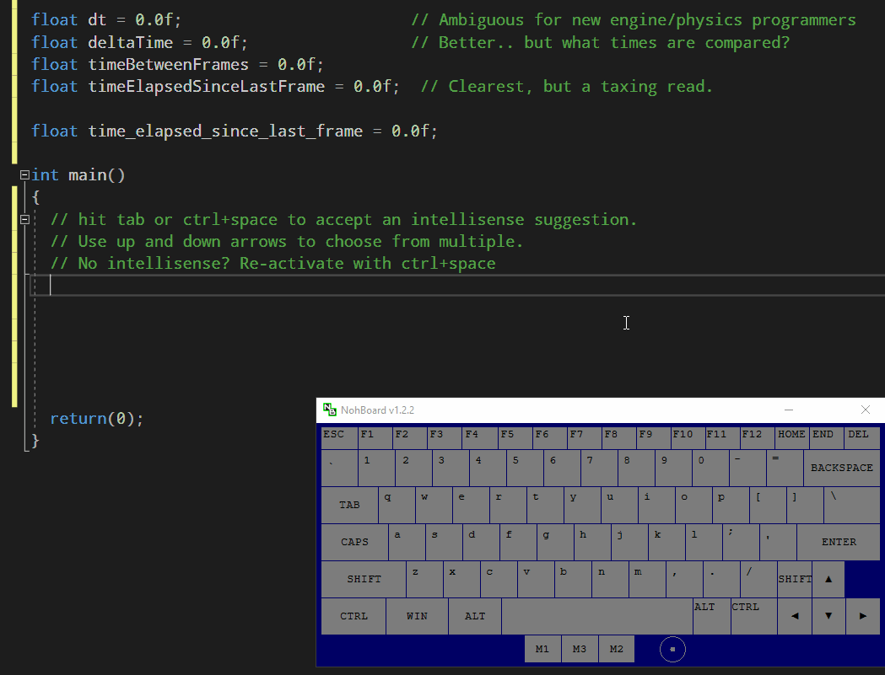
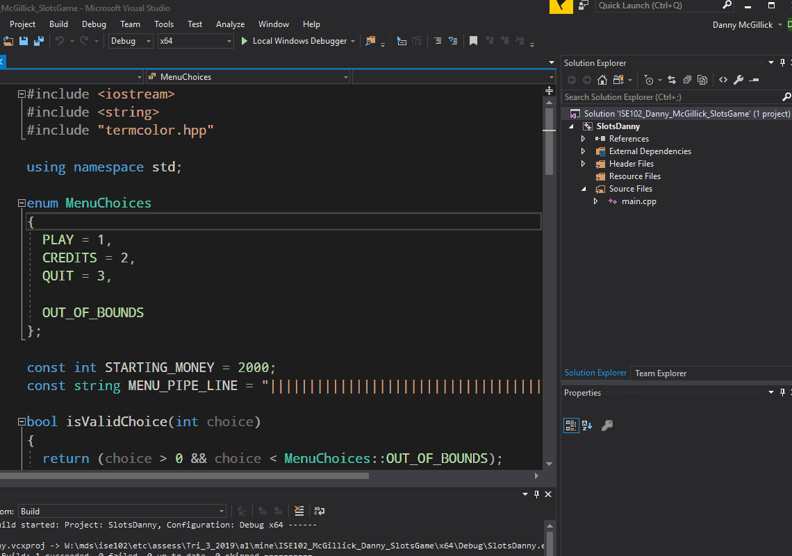
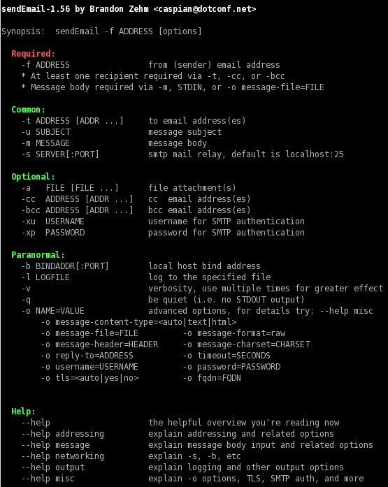
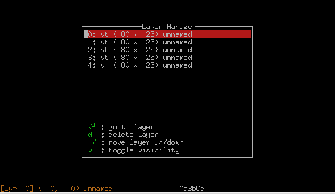
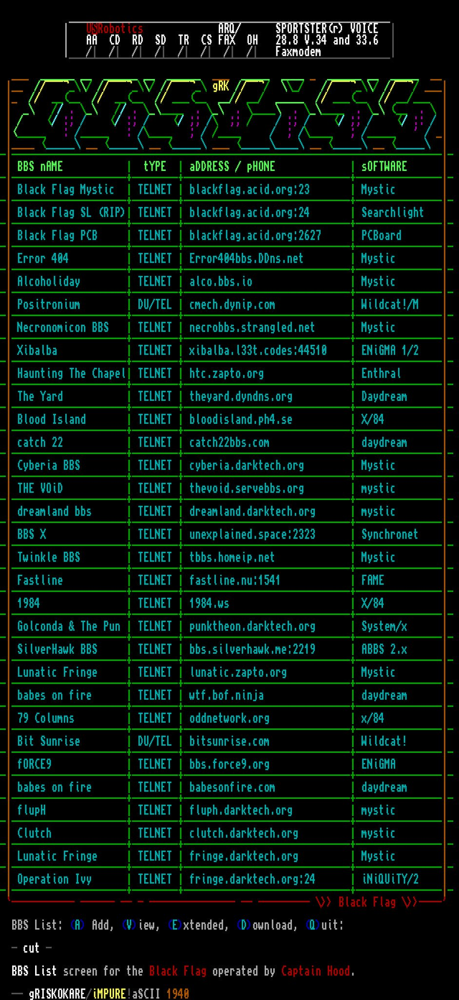
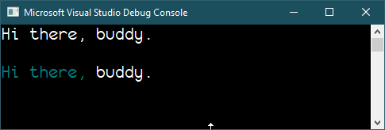

---
html:
  embed_local_images: false
  embed_svg: true
  offline: false
  toc: true
export_on_save:
  html: true
---

# Week 6 ISE102


<!-- @import "[TOC]" {cmd="toc" depthFrom=1 depthTo=2 orderedList=false} -->

<!-- code_chunk_output -->

1. [Week 6 ISE102](#week-6-ise102)
   1. [Covering today](#covering-today)
   2. [Checking your coding conventions](#checking-your-coding-conventions)
   3. [Delivering Assessment 1 Files](#delivering-assessment-1-files)
   4. [Design with whitespace and symbols](#design-with-whitespace-and-symbols)
   5. [Adding Colour](#adding-colour)
   6. [Working on your assessment](#working-on-your-assessment)

<!-- /code_chunk_output -->

## Covering today

* Coding conventions and advice.
  - expanding on if statement usage
* Delivering assessment 1.
* Pretty colours using termcolor. Using colour to communicate.
* Using ascii art make a clearer, more engaging interface.
* Feedback and help with assessment.

## Checking your coding conventions

In every team or project we use coding conventions so we humans can read the code a little better. It helps your debugging and my marking.

**Correct use of coding conventions is in the marking guidelines**, and they're easy marks so go through and check!

#### Naming:
  - **Case:** Use of upper and lower case letters
  - **Choice of name:** Solid function, bool, constant name choices
  
#### Structure:
  - use {} in any multi-line ifs, especially with else! Clarity.
  - Constants/variables can read better with tabbing
    - tabbing for variable comments helps too. Table style.
  - Grouping related variables (constants in one area, regular variables in another) makes code easier to read
  
#### Constants

```cpp
///////// Constants /////////////////////////////
// Numbers that won't change.
// Use ALL_UPPER_CASE with underscores between words

const int MAX_HEALTH                    = 100;
const int JUPITER_MOONS_KNOWN           = 79;       // look it up.
const float HEADSHOT_DAMAGE_MULTIPLY    = 2.5f;
const string DEFAULT_INVITE_TEXT        = "You have been invited to rumble.";

```

#### Variables

```cpp
/////// Regular Variables /////////////////////////////
// Storing data in memory. Read and write.
// Use camelCaseNaming.

int score = 0;
string myTag = "";
string myRealName = "";

// Use a name for booleans that would answer a question, and
// includes the question. Q: Is the tea hot?   A: Yes, the tea is hot.

bool playerHasQuit = false;       
bool allPlayersReady = false;     // Comment about this
bool teaIsHot = true;             // Hot tea comment
bool prefers 

// An adjective using -able or -ible is good for describing an object's capabilities

bool destructable = true;
bool upgradable = false;

// Often, though, people use these adjectives as nouns for categories of things. A gun or armour or vehicle could be known as an "upgradable".
// prefixing with "is" can make it less ambiguous, though a little harder to read.

bool isDestructable = true;
bool isUpgradable = false;
```

#### Clarity beats brevity

Before we had **autocomplete** (called "intellisense" in Visual Studio) short variable names prevailed because they were easier to type. This made sharing code difficult, because variables were ambiguous.

>  * Longer and clearer is better than brief and ambiguous
>  * Within limits.. Too wordy and it becomes hard to understand
>  * We're hunting for a goldilocks zone.

``` cpp
// Each of these are names that might be used for the difference between the 
// time now (delta) and the time the last frame was drawn to the screen. 

float dt                          =0.0f;  // Ambiguous for new engine/physics programmers
float deltaTime                   =0.0f;  // Better.. but what times are compared?
float timeBetweenFrames           =0.0f;  
float timeElapsedSinceLastFrame   =0.0f;  // Clearest, but a taxing read.

// INTERESTING NOTE:
// Google names variables like lower case constants. Long names are a bit easier to read.
float time_elapsed_since_last_frame   = 0.0f;
```
**Autocomplete**

* Hit tab or ctrl+space to accept an intellisense suggestion.
* Use up and down arrows to choose from multiple.
* No intellisense? Re-activate with ctrl+space




<!--
```cpp
// Are the code blocks easier to see with braces on newlines? (yes)
float damagePerSecond() 
{
  int buffedDamage = damagePerAttack;
  
  if (damageBuff > 0.0f)
  {
    buffedDamage *= damageBuff;
  }

  return (_buffedDamage * _attacksPerSecond);
}

// Or mushed onto the end of a line? (noooo)
float damagePerSecond() {
  int buffedDamage = damagePerAttack;
  
  if (damageBuff > 0.0f) {
    buffedDamage *= damageBuff;
  }

  return (_buffedDamage * _attacksPerSecond);
}

```
-->
#### Functions

Naming case conventions for functions, their variables and their arguments.

```cpp
////// Functions //////////////////////////////////////
// Use camelCaseNaming like regular variables.
// 
float damagePerSecond() 
{
	return (damagePerAttack * attacksPerSecond);
}

// function arguments: the same naming convention as regular variables
// local function variables: also uses this convention
float damagePerSecond(int shotType) 
{
  int damage = damagePerAttack * attacksPerSecond;

  if (shotType == HEAD_SHOT) 
  {
    damage *= HEADSHOT_DAMAGE_MULTIPLIER;
  }

	return (damage);
}


```

#### Code blocks with curly braces

These guys **`{}`** are curly braces. They're used in `if`, `while`, `do.. while`, functions and other places to show that a series of code statements belong together.

We'll prefer curly braces on their own lines: they are easier to line up visually. 

> Be aware some companies/projects take the opposite approach. Conventions aren't universal; you'll have to adapt to style of the team you're on, so don't get too precious/attached.


## Delivering Assessment 1 Files

**This is in the marking guide,** so get it right for marks!

* I don't need a build, just your solution and all its contents
* The folder that contains an sln file is the one you want to zip. It also contains the project folder.
* Don't change any folder or project names at this stage, it's just going to end up with a project that doesn't compile. 

### How to zip and submit your project:
  1. In the solution explorer right click your solution (not project), go to _Open folder in file explorer_
  - Your folder contains and sln file.
  - Make sure you can see all hidden files and file extensions (found in explorer window view bar)
  - Delete all debug, .vs, x86, x64 folders in that folder.
  - Double click the folder with your project name in it.
  - Delete all debug, .vs, x86, x64 folders in that folder.
  - Step up to the folder with the sln file, then up one more.
  - Zip up the solution folder.
    - If you have 7zip installed: Right click the folder, go to 7Zip, then Add to (foldername).zip
    - In the gif I have Add To Zip on the top level context menu, just my setup
    - If you have other ways of making zip files, go for gold.
  - Name it for submission (see below)
  - If the folder already had the right name, you're zip is already fine.
  
 
  
### Naming your zip file for submission:

Name your file like so: **_ISE102_Lastname_Firstname_GameName.7z_**

Your game name might be SlotMachine or Slots Game or Millionaire Slots Queen. Just make it clear it's a slot machine game. 

Mine in the example gif was: **ISE102_Mcgillick_Danny_SlotsGame.7z**

## Design with whitespace and symbols

Think about how you can use spaces, tabs, newlines and regular punctuation to create a graphic, readable layout.







## Adding Colour

We're going to use a free header file (.h file) someone has made for easily adding colour to the console. Here's what it can do:


Not everything works in the windows console (I didn't see bold or underline work), but the colours are all good.

### Adding a header to your project

* Right click your **project** in Visual Studio's _Solution Explorer_ (not your solution).
* Click _Open folder in file explorer_. You'll be shown a window containing your cpp files.
* Copy the path of that folder (in the explorer address bar).
* Come back to these notes and right click this link: [termcolor.hpp](assets/week6/termcolor.hpp)
* Click Save file as.. and save it to the folder path you copied (by pasting the path into the save dialogue address bar)
* Make sure the file is named termcolor.hpp
* In VS again, go to the solution explorer and right click _Header Files_
* Click _Add -> Existing item.._
* Choose the _termcolor.hpp_ file

### Including and using _termcolor.cpp_
Now you have the header file available in your project. Our next step is to use it.
We need to:
a) Include it in our project
  - Including a file that is inside your project folder requires `""` instead of `<>`
  
b) use it with a _cout_ statement.

We basically drop colours into our output stream like packets of dye.

```cpp
#include "termcolor.hpp";     // Not <termcolor.hpp> angle brackets
...
// Here's a cout statement without colours added:
cout << "Hi there, buddy." << endl << endl;

// We can add a colour where needed. Remember to reset to the normal console colours when you're done.
cout << termcolor::cyan << "Hi there, " << termcolour::reset << "buddy." << endl << endl;
// Notice I broke up the sentence so I could change colours part way through.
```
_Use termcolor:: to access the colours/commands you need. Intellisense will provide a list._


_Output with some cyan_

See the [termcolor github page](https://github.com/ikalnytskyi/termcolor) for more instructions.

_Some of the help available on the github page. Remember to **scroll down** when you get there_


## Working on your assessment

Tap tap tap.
