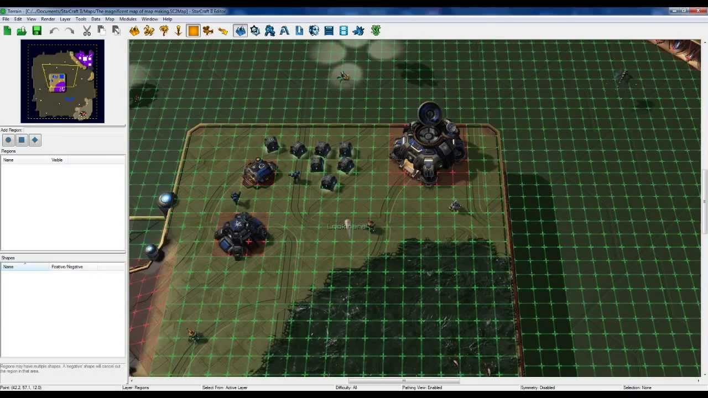
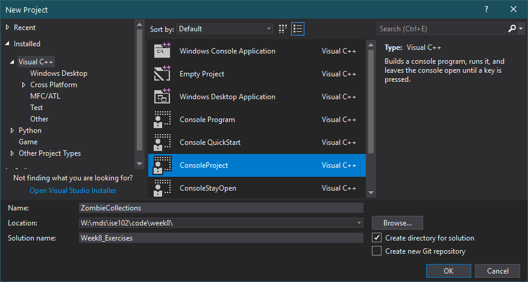
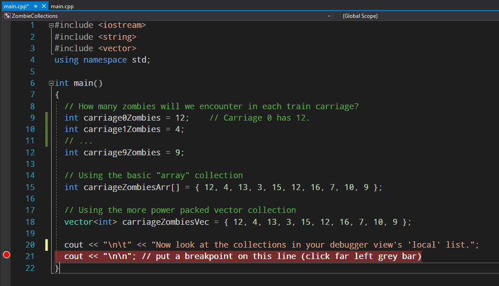
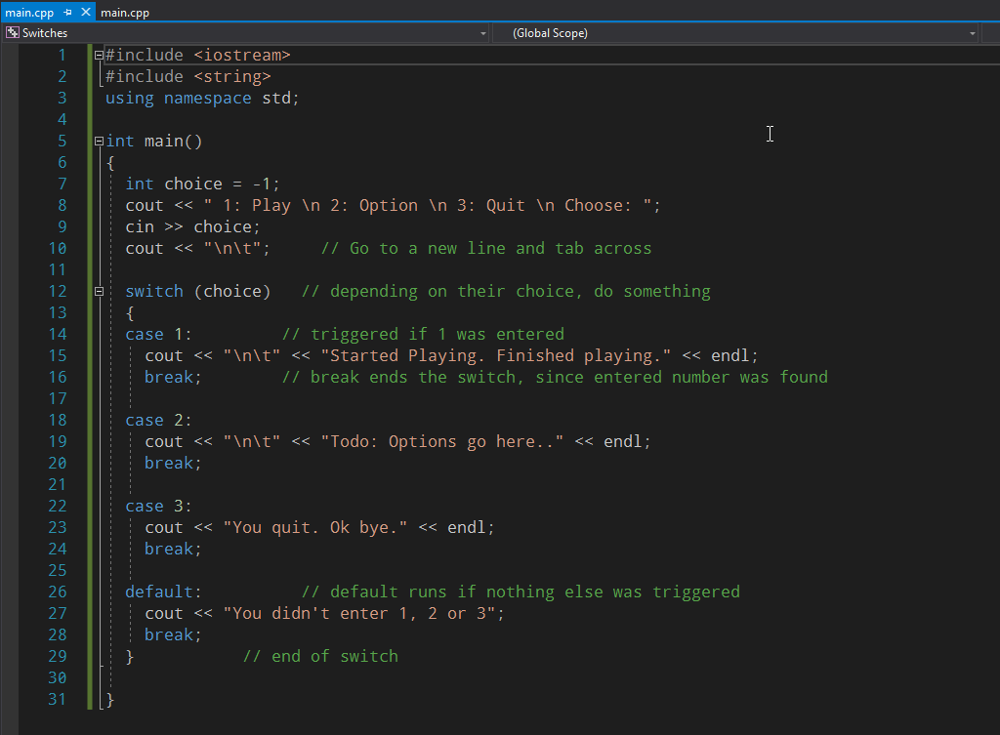
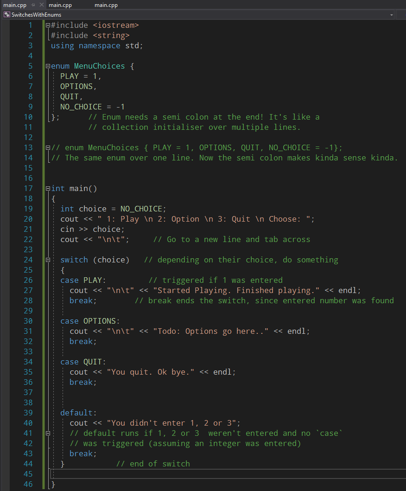

---
html:
  embed_local_images: false
  offline: false
export_on_save:
  html: true
---
# ISE102 Week 8: Collections and Exam

<!-- @import "[TOC]" {cmd="toc" depthFrom=1 depthTo=2 orderedList=false} -->

<!-- code_chunk_output -->

- [ISE102 Week 8: Collections and Exam](#ise102-week-8-collections-and-exam)
  - [This week](#this-week)
    - [Uses for collections in games](#uses-for-collections-in-games)
    - [Exercise: Your collections](#exercise-your-collections)
  - [Big data](#big-data)
    - [Terminology](#terminology)
    - [Exercise: Code zombies](#exercise-code-zombies)
    - [Using the contents of a collection](#using-the-contents-of-a-collection)
    - [Details of for loop](#details-of-for-loop)
  - [Other ways to fool around with vectors](#other-ways-to-fool-around-with-vectors)
    - [Other kinds of collections.](#other-kinds-of-collections)
  - [Switch statements](#switch-statements)
    - [Exercise: A menu using the switch statement](#exercise-a-menu-using-the-switch-statement)
    - [Enums can get spicey when you assign values.](#enums-can-get-spicey-when-you-assign-values)
  - [Break is brutal in For loops](#break-is-brutal-in-for-loops)
  - [Unary operators are complicated](#unary-operators-are-complicated)
    - [Exercise: Testing unary operators](#exercise-testing-unary-operators)

<!-- /code_chunk_output -->

## This week

With a focus on this week exam we'll cover
- For loops
- Switch statements
- Collections! Vectors and arrays
- A bit more on enums
- Unary operators (++, --)

### Uses for collections in games

Contents of a Hearthstone deck, inventory items, equipped items, cars in a race, members of a raiding party, performance stats, types of potions, players to select, game modes available, skins you've bought.

> In a game these collections will usually contain a list of objects, which we'll learn more about later. For our purposes we'll just stick to simple lists of strings, numbers or booleans.


### Exercise: Your collections

Head to this discussion thread and post your own collections:
[Ultimo Class: Collections on Blackboard](https://laureate-au.blackboard.com/webapps/discussionboard/do/message?action=list_messages&course_id=_76681_1&nav=discussion_board_entry&conf_id=_114402_1&forum_id=_728750_1&message_id=_1856292_1)
[Online Class: Collections on Blackboard](https://laureate-au.blackboard.com/webapps/discussionboard/do/message?action=list_messages&course_id=_76906_1&nav=discussion_board_entry&conf_id=_114639_1&forum_id=_726230_1&message_id=_1857597_1)

5 collections from real games you've played:
5 collections in your online life (ie Instagram follows)

## Big data

When you know something about a single thing or creature (hairLength, characterName, speed, hitPercentage) then a named variable for that piece of data makes sense. 

When it's the **number of zombies to battle in each carriage of a train**, or a list of clans you could join, or the contents of each 64x64 pixel cell on a starcraft map, it makes more sense to **treat them as a bunch of values in a list**.

Wouldn't this be handy?

```cpp
  // Saving zombie counts to (many) different variables representing carriages
  carriage7Zombies = 8;
  carriage11Zombies = 3;    
  
  // Saving to slots in a train carriage collection. A little better.
  carriageZombies[7] = 8;
  carriageZombies[11] = 3;

  // Looping through a collection using a (counting) variable. Nice!
  while (carriage < totalCarriages)
  {
    carriageZombies[carriage] = getRandom(20); 
  }
```
_Happily, this exists. Except for that random function._


_**Imagine** stepping through every cell on this grid 60 times a second with cell1, cell2.. cell2322_

### Terminology

> I'll be using list, collection and vector to mean the same thing. In practise we'll implement collections as `vector<type>` mostly.

### Exercise: Code zombies

Create a project in Visual studio and enter the code below, then we'll debug.

Copy my naming, and use 


Enter the code and set the breakpoint:


Run the debugger and, in the _locals_ panel,  expand the collections.


### Using the contents of a collection

- Collections are accessed with some `[]` square brackets containing a numerical index, beginning at `[0]`.
- The last index is size-1: if they contain 9 elements, the last index is `[8]`
- You can use a variable in place of a number to check, for example, how many zombies are in the same carriage as the zombie : `[playerCurrentCarriage]`;

Lets finally use those `for` loops. They're great for filling and reading collections.

**ZOMBIE TRAIN**


### Details of for loop
A for loop is just a while loop with three key parts jammed into the parentheses: setup of a counter variable, testing the end condition, and modifying the counter every loop (up or down usually).

```cpp
for (counter setup; condition we end on; change counter each loop)
{
  // execute this code each loop
}
```
They can be nested like while loops.

> Most often programmers use `i`, `j`, `k` and so on for the name of the counter or _index_ variable. It's a convention that saves thinking of counter names each time.

## Other ways to fool around with vectors

```cpp
carriageZombies.pop_back();   // Remove the last item in list, "popping" it off the end.
carriageZombies.clear();      // Delete everyting. No more train zombie census data.

// Make a vector of strings and initialise it with values.
vector<string> zombieNames = {"Kaarhla", "Braaaeenda", "Eeyeeahghn"};
```

Look up the documentation or youtube for more vector features.

### Other kinds of collections.

There are more than a few specialised collection types in C++. Typically they're referred to as "containers" in the documentation (though it's a bit ambiguous).

`hash`, `unordered_map`, `unordered_set`, `deque` are a few of them.

## Switch statements

Switch is like a series of "if.. else" statements with less curly braces and syntax. Useful for situations where there are many options and one outcome.

```cpp
// Basic syntax of a switch statement.
int thing = 1;

switch(thing)   // like if  (thing == .. )
{
  case 1:
    // if thing is 1
    break;
  case 2:
    // if thing is 2
    break;
  default:
    // otherwise (else, basically)
    break;
}
```

### Exercise: A menu using the switch statement
Create a project called "Switches" in your Week8Exercises solution and enter the following:



#### Break is strange in switch statements

Try this:
1: Remove the `break;` line from the `case 2:` section.
2: Run the program and enter `2`.
3: What?!?

#### Enums make switches easier to use

Now try add in some enums! (put the `break;` back in first).


### Enums can get spicey when you assign values.

/// example with various  numbers thrown in

## Break is brutal in For loops

Try putting one in either of your zombie train loops.

## Unary operators are complicated

`x++` is pretty simple right? 
So `y = x++;` is kinda simple?
Then why is there `y = ++x`? How's it different?

### Exercise: Testing unary operators

Write some code to discover how ++a and b++ are different.
1. Create integers a and b, each equal to 5. Create x, equal to 0.
2. Print the names and values of x, a and b.
2. Assign ++a to x
3. Repeat step 2
4. Assign b++ to x. 
5. Repeat step 2.
6. What's going on?

It's the only operator that comes to mind which represents 2 whole lines of code (2 statements).
```cpp 
  x = ++a;
  // becomes
  a = a + 1;
  x = a;

  x = b++;
  // What do you think it becomes??
```