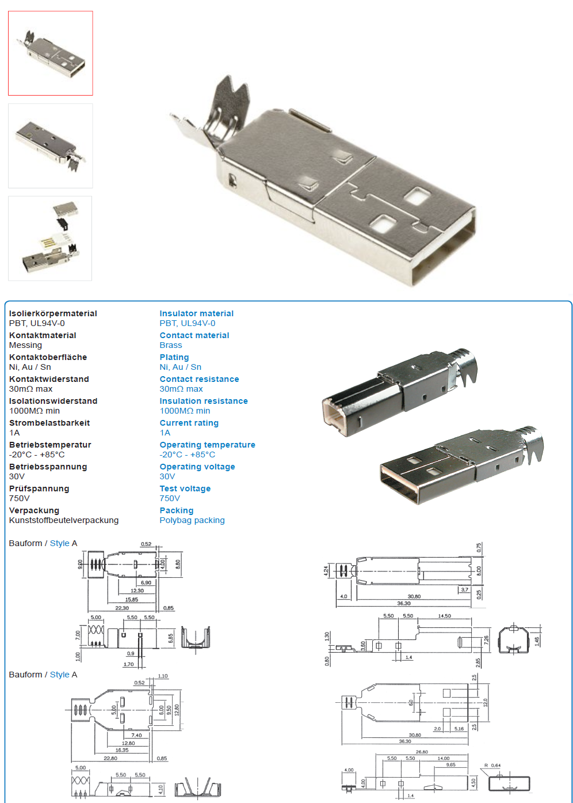
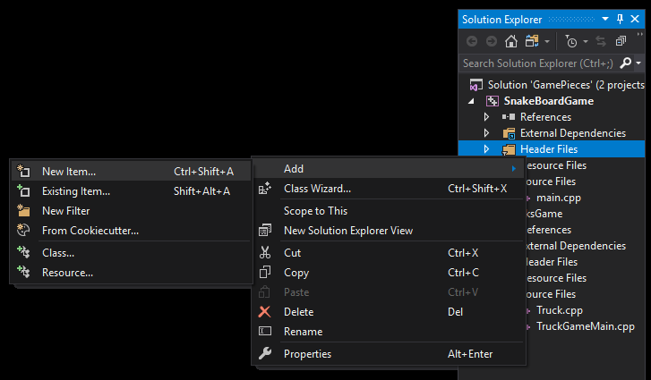

---
html:
  embed_local_images: false
  embed_svg: true
  offline: false
  toc: undefined
export_on_save:
  html: true
---
# ise102 week 8:  Objects and Classes

Intro to Object Oriented Programming.


<!-- @import "[TOC]" {cmd="toc" depthFrom=1 depthTo=6 orderedList=false} -->

<!-- code_chunk_output -->

- [ise102 week 8:  Objects and Classes](#ise102-week-8-objects-and-classes)
  - [Snake as a board game](#snake-as-a-board-game)
    - [Game piece](#game-piece)
    - [Pieces, objects](#pieces-objects)
    - [Designs for objects](#designs-for-objects)
    - [The schematic/plan/design](#the-schematicplandesign)
    - [C++ schematics: `class`](#c-schematics-class)
    - [What were those extra bits?](#what-were-those-extra-bits)
  - [Extending our designs](#extending-our-designs)
    - [Duplication is bad](#duplication-is-bad)
    - [Inheriting from a class/design](#inheriting-from-a-classdesign)
    - [Trucks](#trucks)
    - [Trucks In Code](#trucks-in-code)
    - [Inheriting Truck](#inheriting-truck)
    - [Game controller evolution](#game-controller-evolution)
  - [Debugging](#debugging)
    - [Debugger mode](#debugger-mode)
    - [Stepping](#stepping)
    - [Step into, step out:](#step-into-step-out)
    - [Step over:](#step-over)
    - [Breakpoints](#breakpoints)
    - [Info!](#info)
  - [Resources](#resources)

<!-- /code_chunk_output -->

## Snake as a board game

Board games. They have two basic parts minimum, usually.

1. Board
2. Pieces

We've all played Snake. What happens in the game? 


So maybe we have a **simple board**, divided into a **grid of squares**, in a grassy colour. We can use horizontal (x) and vertical (y) coordinates to identify them.

 

### Game piece 

When we play a board game we often have physical chips or figures that we move around the board to signify players, enemies, props. What pieces would you need? Where do they go?


Whatever they end up being, we could break a snake game piece down to a few basic properties.

> A game piece has a **kind** (fruit, bit of snake) and a **location**

### Pieces, objects

Other objects on our board:
* Fruit has maybe colour? A name?
* A snake needs to go places. What things do we need to know for an object to travel in space?


### Designs for objects
Okay, if we wanted to get our snake board game made, we could go to a maker of game boards and say 
> "Hey, we designed a board game. Make it for us. How much will it cost to make 100 sets?

What will the ask us next? What if we wanted one hundred laptops? Dinner for 12? A fleet of trucks? 10 orc grunts?

> Okay, give me the schematic/design/recipe/cad files.

### The schematic/plan/design

You make things from a design. Maybe there's a prototype object too, which the design describes. A version made from that design, and you will make more.

* 100 cakes: recipe and ingredients please
* 100 mini tower PCs: give me the parts list.
* 100 trucks: give me the schematics and cad files and parts list etc etc.


_Engineers drawings and specs for usb connectors_


### C++ schematics: `class`

Our plan or design, in c++, is called a `class`. A `class` lets us tell c++ how to make variables for us of a whole new type. Just imagine being able create a game piece this easily:

```cpp {.line-numbers}

int main()
{
  GamePiece fruit;
  fruit.xSquare = 2;
  fruit.ySquare = 4;
}
```

> If we want a `GamePiece` with x,y coordinates and a name, well we just make this design or recipe in `class` form. 

Same with trucks: you want them made, you design one in a class. Then you can declare as many variables of type Truck as you want.

They go in a special kind of file called a "header", ending in a .h extension.


_Right click your project, Add -> New Item_


_Visual C++, Header file (.h), name your class with a capital_

```cpp {.line-numbers}
/// File: GamePiece.h
/// Any piece in our snake board game has these properties.
#pragma once
#include <string>
using namespace std;

class GamePiece
{

public:
  int xSquare;
  int ySquare;
  string type = "";
};
```

> Take out the `#pragma once`, `class GamePiece` definition and keyword `public` and this is just like the top of our main file. Include, using, and then some variables or functions defined.

A very basic truck is easy to specify. We can start with a few small attributes.

```cpp {.line-numbers}
/// File: truck.h
#pragma once

class Truck {
  public:
    int speedInKph = 0;
    float weightInTonnes = 3.6;
};
```
Then we can declare them in main just like we would a `string` or an `int`. Just include the .h file, and start declaring `Truck truckname`.
```cpp {.line-numbers}


/// File: world_of_trucks_main.h
#include "Truck.h"

int main()
{
  // Individual trucks made from the Truck design are called
  // `instances` of the Truck class, also `objects`
  Truck soBoringTruck
  Truck dullOscar;

  soBoringTruck.speedInKph = 60;
}

```

### What were those extra bits?

`pragma once` is added automatically by Visual Studio. It means "if this file is included in multiple files, only define it once". It just ensures that there is only one `Truck` design, though many objects can be made.

`public:` means these variables can be seen/used by outside code, like our main function.
`private:` would mean any variables that followed can only be used inside the Truck class. Internal, hidden stuff to make the class work. 

## Extending our designs

Extending a thing to make a similar but fancier thing!

### Duplication is bad

We don't want 50 kinds of trucks all with `int speedKph` in the class file if we have to move to mph. A crane truck is just an extension on the truck design, so is a cement truck. 

### Inheriting from a class/design

> How can I extend a design into something new, while getting all those definitions for free?

In Object Oriented design this is called **inheritance**. You can make a new class that **inherits all the characteristics of the old one**. Then you **add more**! 

### Trucks

Truck -> CraneTruck
Truck -> CementTruck


_Some Truck, CraneTruck, CementTruck property ideas discussed in class_

### Trucks In Code

Look at how `superBeastlyCrane` and `darlene` the cement truck have `speedMph` despite never declaring it. They also have unique properties like  `liftingCapacityKgs` and `mixerCurrentAngle`.

```cpp {.line-numbers}
//trucks_main.cpp
// This is a Tester: it makes some objects from classes/designs,
// Like any scientist it observes, changes, observes again.
#include <iostream>
#include "Truck.h"
#include "CraneTruck.h"
#include "CementTruck.h"

using namespace std;

// Making and testing instances from classes.
int main() {

  // Two boring trucks
  // One crane truck
  Truck soBoringTruck;
  Truck dullOscar;
  CraneTruck superBeastlyCrane;
  CementTruck darlene;

  soBoringTruck.speedMph = 25;
  dullOscar.speedMph = 10;

  superBeastlyCrane.speedMph = 10;
  superBeastlyCrane.liftingCapacityKgs = 5910;
  
  darlene.speedMph = 20;
  darlene.mixerCurrentAngle = 12.0f;
  // print boring truck speeds
  cout << "sbt speed " << soBoringTruck.speedMph << endl;
  cout << "superCrane's lift power: " << superBeastlyCrane.liftingCapacityKgs << endl;

  // print crane trucks lifting capacity.

}
```

Here's truck, which declares `speedMph` as a `public:` property.

```cpp {.line-numbers}
//Truck.h
#pragma once

class Truck
{
public:
  int speedMph = 0;
  float steeringAngle = 0.0f; // straight
  string cabinPuppy = "Leroy";
};

```
### Inheriting Truck

If the `CementTruck` and `CraneTruck` want to extend Truck, all they need to do is
1. `#include "Truck.h"` (note the use of " " instead of < >)
2. add `: public Truck` after the class definition 👌
 
```cpp {.line-numbers}
//CementTruck.h
#pragma once
#include "Truck.h"

class CementTruck : public Truck
{

public:
  float mixerCurrentAngle = 0.0f;

};
```

```cpp {.line-numbers}
//CraneTruck.h
#pragma once
#include "Truck.h";

class CraneTruck : public Truck
{
public:
  int liftingCapacityKgs = 1000;

};
```

### Game controller evolution

One more physical world example of extending a design.

direction + face button + connection -> 
direction + _multi face_ buttons + connection ->
_analogue and digital_ direction + multi face buttons + _wireless_ connection


## Debugging

We’ve been using visual studio to compile our code and run the executable (.exe) file it produces in a separate console window. 
When we’ve been hunting for bugs we’ve used cout to look at changing variables, or to just make sure certain lines (maybe in a for loop or if statement) are being reached.

> There is a better way to catch bugs, and it’s name fits: **debugging mode**

We’ve been using “run without debugging; today we’ll try the alternative.
——
### Debugger mode 

Debugging mode is built around the debugger, a program that can look at and control your program’s memory and execution. Your console window will open as normal, but visual studio will change it’s whole layout to display loads of realtime info from the debugger:


Debuggers are available for most languages, and have a few common features.
—-
### Stepping  
What if you could **watch as your code executes, line by line**, and see the values of all the variables as they change? Would that make life easier than viewing a debug.log here and there?
**Step through** does exactly that.

Insert Pic of step buttons

—-
### Step into, step out:
Go into the function being called on this line, or out of a function

—-

### Step over: 
steps to the next line in current function. Treats lines with function calls like any other line.

—-

###  Breakpoints 

Stepping through is great but has one major down side: it might take a long time to reach a point of interest. What if, instead. You could choose to pause execution only at certain lines?


_breakpoint and hilighted code_

You do that by placing break points in your code, little red dots that appear when you click a space in the left margin of the code window, near the line numbers.

> the _break_ in _breakpoints_ comes from taking a break, pausing, not from breaking/broken.

###  Info!

Loads of info is available in debugger mode, which includes some performance profiling too. 

* Variables and their contents
* the call stack (function calls in sequence), 
* execution time, 
* contents of actual memory 
* more.


_another look at the debugger screen info_

##  Resources

Visual studio docs [debugger page:](https://docs.microsoft.com/en-us/visualstudio/debugger/navigating-through-code-with-the-debugger?view=vs-2019)
