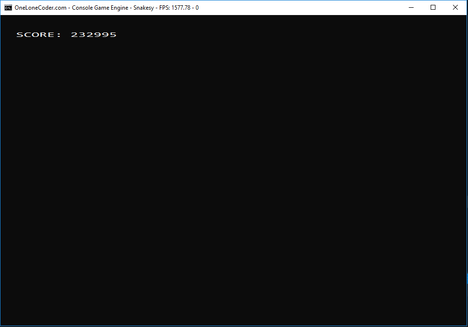

# Using olcConsoleGameEngine


_Hello olc_

## main.cpp

```cpp
#include <iostream>
#include "SnakeGame.h"

using namespace std;

int main()
{
	SnakeGame game;
	game.ConstructConsole(60, 40, 16, 16);
	game.Start();

	return 0;
}

```

## SnakeGame.h

```cpp
#pragma once
#include "olcConsoleGameEngineOOP.h"

class SnakeGame : public olcConsoleGameEngineOOP
{
public:
	SnakeGame();
	~SnakeGame();

protected:
	int _score = 232995;
	
	virtual bool OnUserCreate();
	virtual bool OnUserUpdate(float fElapsedTime);

};
```

## SnakeGame.cpp

```cpp
#include "SnakeGame.h"
using namespace std;

////////// Inherited from olc engine, it runs at the start, letting you initialise things.

bool SnakeGame::OnUserCreate()
{
	m_sAppName = L"Snakesy"; // This variable is supplied by olc.
	return true;
}

//////// Also from olc, runs every frame

bool SnakeGame::OnUserUpdate(float fElapsedTime)
{
	Fill(0, 0, ScreenWidth(), ScreenHeight(), PIXEL_SOLID, 0); // Fill screen with black
	
	DrawString(2, 2, L"SCORE: " + to_wstring(_score)); // Write score 3 pixels right, two pixels down (like arrays, start at 0)
	return true;
}

// Leave these empty
SnakeGame::SnakeGame()
{}

SnakeGame::~SnakeGame()
{}
```