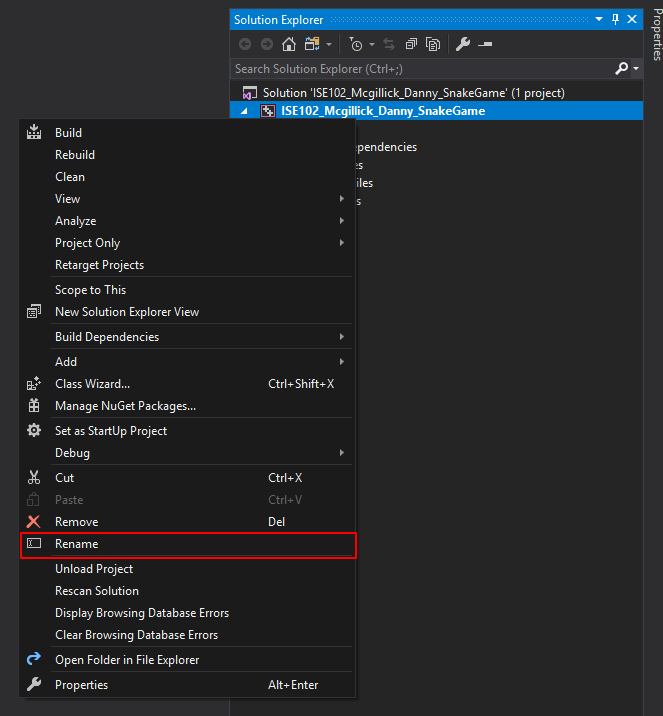
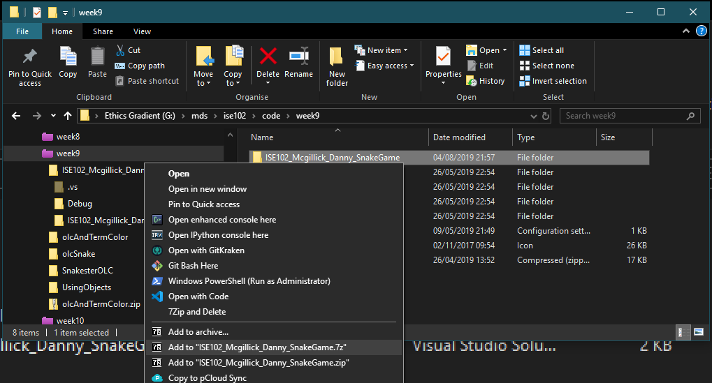
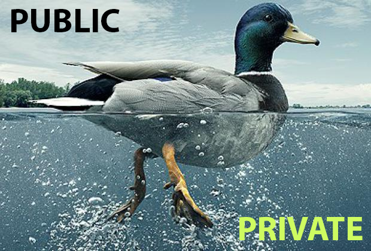
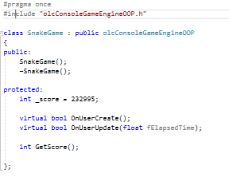

---
html:
  embed_local_images: false
  embed_svg: true
  offline: false
  toc: undefined
export_on_save:
  html: true
---
# Week 9 - Objects/Classes 2, Making Games.

Recapping last week, taking it further. Making games with the game loop.


<!-- @import "[TOC]" {cmd="toc" depthFrom=1 depthTo=6 orderedList=false} -->

<!-- code_chunk_output -->

1. [Week 9 - Objects/Classes 2, Making Games.](#week-9---objectsclasses-2-making-games)
   1. [Assessment 3: Snake](#assessment-3-snake)
   2. [Answering the brief](#answering-the-brief)
      1. [Extras after requirements](#extras-after-requirements)
      2. [Minimum viable product](#minimum-viable-product)
      3. [Extended features](#extended-features)
   3. [Delivering the assessment](#delivering-the-assessment)
      1. [Create your solution with the right name](#create-your-solution-with-the-right-name)
      2. [Find and compress your solution](#find-and-compress-your-solution)
   4. [Objects classes recap](#objects-classes-recap)
   5. [Adding functions to classes](#adding-functions-to-classes)
      1. [Selectively sharing](#selectively-sharing)
      2. [Coding obects (week 8)](#coding-obects-week-8)
   6. [A Game Is A Simulation](#a-game-is-a-simulation)
      1. [Starting at the end: Graphics are just the output](#starting-at-the-end-graphics-are-just-the-output)
      2. [Things happen](#things-happen)
      3. [Input](#input)
      4. [The game loop, then.](#the-game-loop-then)
      5. [Coding in a class instead of main.cpp](#coding-in-a-class-instead-of-maincpp)
   7. [Resources](#resources)
   8. [Todo by week 10](#todo-by-week-10)

<!-- /code_chunk_output -->

## Assessment 3: Snake

## Answering the brief

As a coder, you are a maker. You build things for people, and when you make something for someone it followes a design, a plan, a _brief_. Our's is the assessment 3 brief from blackboard:

The brief: <https://laureate-au.blackboard.com/bbcswebdav/pid-7475676-dt-content-rid-31789150_1/xid-31789150_1>

### Extras after requirements

When someone needs something made, they do enjoy extras. When they are extras. That means they're built on top of the requirements. Do them instead of a requirement and you'll be risking whatever the return was for your work:  marks, payment, promotion.                              
Bullet points:
### Minimum viable product
* Snake never stops moving
* Snake teleports across screen after hitting edge
* Snake has segments aka body parts
* Fruit randomly appears
* Snake can eat fruit,
* Snake gets longer when eating fruit
* Each fruit gives a point
* If snake collides with self it dies.
* Use the good-programming ideas Danny described in class.

### Extended features 
Add some these to do better than pass/credit
* specifically 2-5 extra features
* Diff fruits with diff affects (buff or debuff)
* Obstacles: deadly blocks
* High score that stays through multiple games
* Difficulty settings
* Restart without rerunning the game.

## Delivering the assessment

Not everyone caught the delivery requirements first time round, let's makesure they're here and easy to refer to.

1. Use **Visual Studio 2017**. Not 2019 or 2015.
2. Deliver a Visual C++ project linked for the windows console.
3. 

### Create your solution with the right name

You need to deliver a file named like so:

**_ISE102_Lastname_Firstname_SnakeGame.7z_**

Mine, for example, would be:

**ISE102_Mcgillick_Danny_SnakeGame.7z**

* The best way to achieve that without breaking anything before delivery is to **use this format (without .7z) for your solution name**. 
* Select **_Visual C++_** and **_Empty Project_**. If you already have a template made for this, you can use that.
* Enter ISE102_Lastname_Firstname_SnakeGame as the project name (substituting your own last and first names).


_Use Empty Project unless you have a template (mine is outlined in orange)_

I don't like the long name on the project as well as the solution, so I 
* right click **the project in solution explorer**, not the solution itself
* click **_rename_**
* enter something manageable like SnakeGame_DM


_Rename the project. Don't accidentally rename the solution_


_New, shorter project name_

___ 

### Find and compress your solution

1. Right click your solution in solution explorer (not your project)
2. Select Open Folder In File Explorer


_Opening your solution folder in windows explorer from Visual Studio_


_You should see a folder with your sln file and subfolders_

You will want **everything in this folder and its subfolders**.

3. **Step up one folder higher**, using the white up arrow next to the address bar or by pressing alt + the up arrow key on your keyboard. You're **going up to the folder containing the current one**, NOT down deeper. In my case, that takes me up to my _week9_ folder.
4. Right click the _ISE102_Lastname_Firstname_SnakeGame_ folder and compress it with 7zip (or zip/rar). Your "Add to" options will be in a 7Zip submenu, even though mine is on the top level menu.


_One folder higher in `week9`, I can right click the folder I viewed in step 2_

7zip is my preferred archiving method because the files are smaller. If for some reason you can't use 7zip, rar or zip can be used.

> I would be delivering `ISE102_Mcgillick_Danny_SnakeGame.7z`

Download 7zip 64bit for windows: <https://www.7-zip.org/download.html>
___

## Objects classes recap

We went into objects and inheritance last week. It's so important that I've fleshed out the notes so we can have a quick look through it again.

<https://dmcgits.github.io/mds/ISE102/week8_notes.html>

## Adding functions to classes

We touched on it last week.

### Selectively sharing

You don't need to reach into your engine bay every time you start your car. You just turn the key or push the ignition button.

A well designed class can produce objects just like that: powerful but with a simple interface to the rest of your code. We do that by keeping the working bits private, and sharing the functions we want used.



> Objects are a way of wrapping up loads of specialised stuff in an easy to use package, just like a car or an iphone. Then we stick big steering wheel and gear stick, or touch screen and home button in your face. 

  - [physical objects, encapsulation in week8 notes](week8_notes.html)

___

### Coding obects (week 8)

* Look again at code we wrote
  - [week8 code: objects](week8_code.html)
  - 1: A Struct  2: A Class  3: A class in its own files.
  - If you didn't come last week, start typing that code out now! 

At it's most basic an object happened between our includes area and our main function. Separating it out was mostly pulling that zone out into two files (h, cpp) and then using _#include_, exactly like we do with string and vector objects.

## A Game Is A Simulation

Teaching games programming last year started with the gameloop, but I want to talk about something more fundamental first. A loop is an implementation thing. But what are we impleenting? What is a game?

It's a simulation. Not just the ones with sim in the name, like Sim City and the Sims.

> GTA: _Day to day crook life_ sim.
> Doom: _Escape from sci fi hell with guns_ sim.
> Portal: _Escape from AI captivity with a portal maker_ sim.
> Fifa: _Football_ sim.

We are simulating a snake, and the fruit it will eat, and the world she moves in.

### Starting at the end: Graphics are just the output

The last stage of a game running is drawing to the screen. The temptation is to start trying to draw things right away. First though, we need user input, then things happen in our simulation, finally we draw the outcomes to the screen.

### Things happen

A game is built like a scientist builds a computer model of weather or a microbe community in a computer. That means organising the data/objects that represent real world things and then changing them over time.

> A simulation is stored data being changed by code, over time.

### Input

Our model is different to a scientists.
* Sciency input is a bunch of data defining the beginning conditions of a weather system, or stats of their bacteria colony and environment. Then the sim runs.
  
> Game input (via controller) is present throughout the whole game, putting our player into the sim as a constant affecting force. The rest of the sim, yeah that runs like a sciency one.

### The game loop, then.

The game loop, very simplified, is this:

```
program myGame

  initialise game.

  while game isn't over
    handleInput
    simulate everything else
    draw it all on screen
  loop

end program myGame
```

Here's more detail about those stages

```
  while game isn't over
    Input:
      listen to input (maybe e key or x button) and do player things 
      (like step forward or press accelerator)
    All other things:
      do all npc actions, physics etc. register hits, take hitpoints, do a bit of mining etc. 
      Assess game status (game over, still going, level finished)
    Output:
      draw to screen, play sounds, vibrate controller
  loop
```

Here's a bodge of how it would look in code

```cpp
int main()
{
  bool gameOver = false;

  while (!gameOver) // not game over
  {
    // input and player simulation
    doPlayerInputThings();
    
    // update non-player simulation
    updateAllUpdateableThings(); // move, grow, spawn, brew, mine etc
    checkForInteractions(); // collisions, traps, pickups, level exit etc 
    setNewGameStateIfChanged();

    //
    drawGraphics();
    playSounds();
  }

}
```

### Coding in a class instead of main.cpp

To use olcConsoleGameEngine we will need to code inside a class, which is a bit different to our main.cpp. It can be disorienting if you don't know your way around a class.

We'll be coding from [week9_code.html](week9_code.html)

Here's were we have put our global variables and function declarations in main.cpp


Here I've moved them to the class' .h file, SnakeGame.h:


Here's where you put your full function definitions in a main.cpp, below main:


And here's where they'd go in OO, the class' cpp file:


## Resources

* Grab this: [olc and termcolor include files](assets/week9/olcAndTermColor.zip)

* [week 9 code html](week9_code.html)

## Todo by week 10
* Plan out key parts of your assessment in pseudocode
* Read/code Chapters 8 and 10 and of textbook. Objects, inheritance.
  - <https://ebookcentral-proquest-com.ezproxy.laureate.net.au/lib/think/detail.action?docID=3136727>
