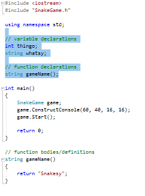
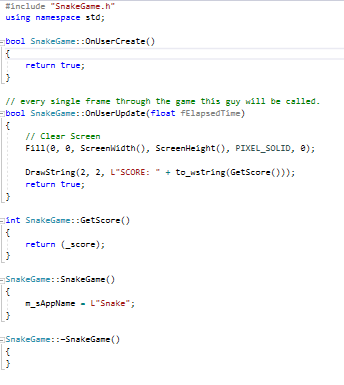

---
html:
  embed_local_images: false
  embed_svg: true
  offline: false
  toc: undefined
export_on_save:
  html: true
---
# Week 9 - Objects/Classes 2, Making Games.

Recapping last week, taking it further. Making games with the game loop.


<!-- @import "[TOC]" {cmd="toc" depthFrom=1 depthTo=6 orderedList=false} -->

<!-- code_chunk_output -->

- [Week 9 - Objects/Classes 2, Making Games.](#week-9---objectsclasses-2-making-games)
  - [Resources](#resources)
  - [Todo by week 10](#todo-by-week-10)
  - [Objects classes recap](#objects-classes-recap)
    - [Hiding complexity](#hiding-complexity)
    - [Objects in code](#objects-in-code)
    - [Coding obects (week 8)](#coding-obects-week-8)
  - [A Game Is A Simulation](#a-game-is-a-simulation)
    - [Starting at the end: Graphics are just the output](#starting-at-the-end-graphics-are-just-the-output)
    - [Things happen](#things-happen)
    - [Input](#input)
    - [The game loop, then.](#the-game-loop-then)
  - [Inheritance](#inheritance)
    - [Coding in a class instead of main.cpp](#coding-in-a-class-instead-of-maincpp)

<!-- /code_chunk_output -->


## Resources

* Grab this: [olc and termcolor include files](assets/week9/olcAndTermColor.zip)

* Doesn't exist yet: [week 9 code html](week9_code.html)

## Todo by week 10
* Plan out key parts of your assessment in pseudocode
* Read/code Chapters 8 and 10 and of textbook. Objects, inheritance.
  - <https://ebookcentral-proquest-com.ezproxy.laureate.net.au/lib/think/detail.action?docID=3136727>

## Objects classes recap

Some missed last week due to maniac at redfern, also objects are so important it's worth a little refresh.

### Hiding complexity

> Objects are a way of wrapping up loads of specialised stuff in an easy to use package, just like a car or an iphone. Then we stick big steering wheel and gear stick, or touch screen and home button in your face. 

  - [physical objects, encapsulation in week8 notes](week8_notes.html)

___

### Objects in code

In our c++ programs **we already use objects**. They're just data types that offer functions: you've seen it on `string` and `vector`.

```cpp
#include <iostream>
#include <string>
#include "termcolor.h"

using namespace std;
using namespace termcolor;

// constants that will be handy.
const int LONG_NAME = 15;
const int REALLY_LONG_NAME = 22;

// Declare functions
string commentOnNameLength(string aName);

int main()
{
	string name = "Aleksandrianakova";
	
	cout << yellow << "My name is " << name << endl << endl;
	cout << white << commentOnNameLength(name) << endl << endl;

	name = "Aleksandrianakovaskayavic";
	
	cout << yellow << "My name is " << name << endl << endl;
	cout << white << commentOnNameLength(name) << endl << endl;

	cout << termcolor::reset;

	return 0;
}

string commentOnNameLength(string aName)
{
	// We're going to call 3 member functions of string objects.
	// if you can type `myVariable.` and a list of variables and functions appears,
	// you have an object.
	string comment = "Oh.";
	if (aName.size() > LONG_NAME)
	{
		if (aName.size() > REALLY_LONG_NAME)
		{
			comment = "I am ded.";
		}
		else
		{
			comment = "That whole thing's your name huh? I'm going to call you ";
			comment.append(aName.substr(0, 5));  // grab first letters of name
		}
	}
	return (comment);
}

```

Looking at that code we can see the user isn't a human driver or phone user, it's our code. **A line of our main function or getValidBet function is the user**. 

> The easy to use package (interface) isn't a touch screen or button, it's a `push_back()` function to add new data to our vector,or a `length()` function telling us how many characters our string has. 

### Coding obects (week 8)

* Look again at code we wrote
  - [week8 code: objects](week8_code.html)
  - 1: A Struct  2: A Class  3: A class in its own files.
  - If you didn't come last week, start typing that code out now! 

At it's most basic an object happened between our includes area and our main function. Separating it out was mostly pulling that zone out into two files (h, cpp) and then using _#include_, exactly like we do with string and vector objects.

## A Game Is A Simulation

Teaching games programming last year started with the gameloop, but I want to talk about something more fundamental first. A loop is an implementation thing. But what are we impleenting? What is a game?

It's a simulation. Not just the ones with sim in the name, like Sim City and the Sims.

> GTA: _Day to day crook life_ sim.
> Doom: _Escape from sci fi hell with guns_ sim.
> Portal: _Escape from AI captivity with a portal maker_ sim.
> Fifa: _Football_ sim.

We are simulating a snake, and the fruit it will eat, and the world she moves in.

### Starting at the end: Graphics are just the output

The last stage of a game running is drawing to the screen. The temptation is to start trying to draw things right away. First though, we need user input, then things happen in our simulation, finally we draw the outcomes to the screen.

### Things happen

A game is built like a scientist builds a computer model of weather or a microbe community in a computer. That means organising the data/objects that represent real world things and then changing them over time.

> A simulation is stored data being changed by code, over time.

### Input

Our model is different to a scientists.
* Sciency input is a bunch of data defining the beginning conditions of a weather system, or stats of their bacteria colony and environment. Then the sim runs.
  
> Game input (via controller) is present throughout the whole game, putting our player into the sim as a constant affecting force. The rest of the sim, yeah that runs like a sciency one.

### The game loop, then.

The game loop, very simplified, is this:

```
program myGame

  initialise game.

  while game isn't over
    handleInput
    simulate everything else
    draw it all on screen
  loop

end program myGame
```

Here's more detail about those stages

```
  while game isn't over
    Input:
      listen to input (maybe e key or x button) and do player things 
      (like step forward or press accelerator)
    All other things:
      do all npc actions, physics etc. register hits, take hitpoints, do a bit of mining etc. 
      Assess game status (game over, still going, level finished)
    Output:
      draw to screen, play sounds, vibrate controller
  loop
```

Here's a bodge of how it would look in code

```cpp
int main()
{
  bool gameOver = false;

  while (!gameOver) // not game over
  {
    // input and player simulation
    doPlayerInputThings();
    
    // update non-player simulation
    updateAllUpdateableThings(); // move, grow, spawn, brew, mine etc
    checkForInteractions(); // collisions, traps, pickups, level exit etc 
    setNewGameStateIfChanged();

    //
    drawGraphics();
    playSounds();
  }

}
```

## Inheritance

We will introduce basic inheritance today. We'll hit it more next week, but first we need to understand it to use olcConsoleGameEngine. 

Olc is an "is a" relationship. 
* A dog is a canine, 
* A person is a human > biped > animal > living thing.

So in a Tower Defense game, for example, a FireballTower is a Tower.

```cpp
#include "Tower.h"
#include "FireballTower.h"

class FireballTower : Tower
{
  // Fireball tower things.
}
```

### Coding in a class instead of main.cpp

To use olcConsoleGameEngine we will need to code inside a class, which is a bit different to our main.cpp. It can be disorienting if you don't know your way around a class.

We'll be coding from [week9_code.html](week9_code.html)

Here's were we have put our global variables and function declarations in main.cpp


Here I've moved them to the class' .h file, SnakeGame.h:


Here's where you put your full function definitions in a main.cpp, below main:


And here's where they'd go in OO, the class' cpp file:



