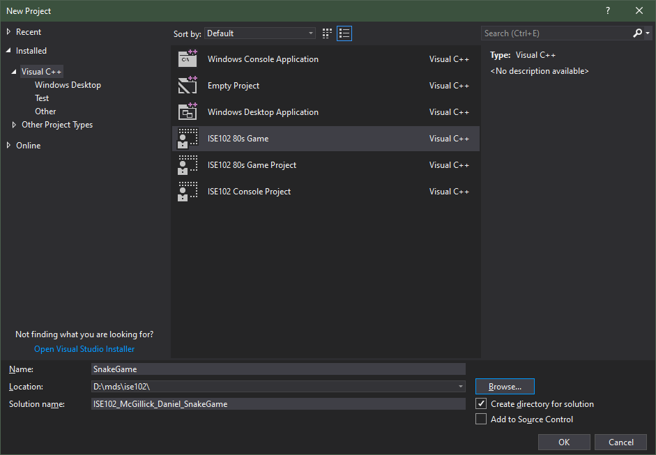
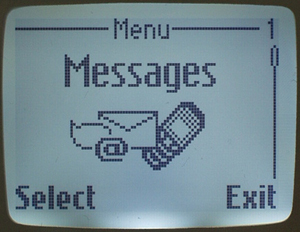
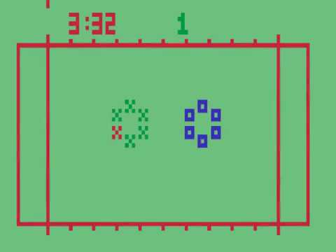
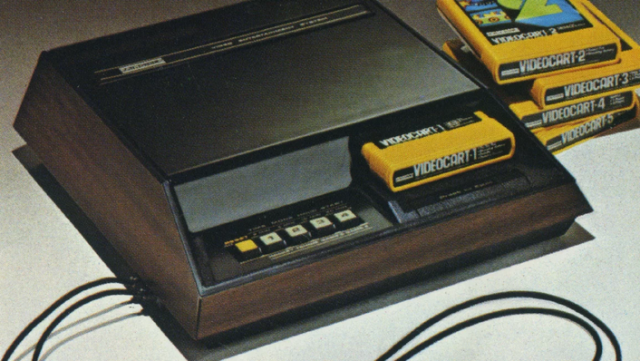
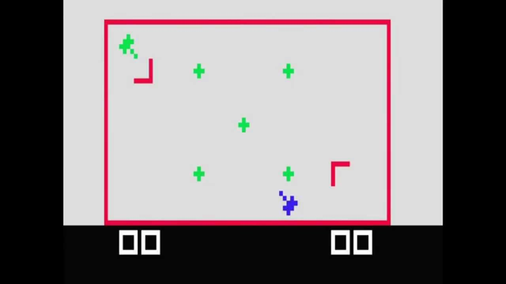
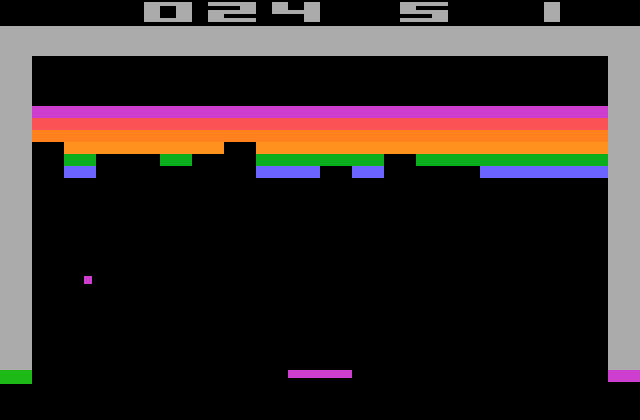
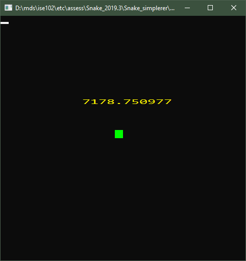

---
html:
  embed_local_images: false
  offline: false
export_on_save:
  html: true
---
# ISE102 Week 9: Snakes, Frames, Objects

<!-- @import "[TOC]" {cmd="toc" depthFrom=1 depthTo=2 orderedList=false} -->

<!-- code_chunk_output -->

- [ISE102 Week 9: Snakes, Frames, Objects](#ise102-week-9-snakes-frames-objects)
  - [Assessment 3: Snake](#assessment-3-snake)
    - [Answering the brief](#answering-the-brief)
    - [Extras after requirements](#extras-after-requirements)
    - [Bullet points:](#bullet-points)
  - [Delivering the assessment](#delivering-the-assessment)
    - [Create your solution with the right name](#create-your-solution-with-the-right-name)
  - [Things to learn while making Snake](#things-to-learn-while-making-snake)
    - [Games with Frames](#games-with-frames)
    - [Drawing big 80s pixels.](#drawing-big-80s-pixels)
  - [Exercise: Making pixel art with `eightiesGame.h`](#exercise-making-pixel-art-with-eightiesgameh)
    - [Part 1: Download and use our new template](#part-1-download-and-use-our-new-template)
    - [Part 2: Draw in code](#part-2-draw-in-code)
    - [Flashing Dot](#flashing-dot)

<!-- /code_chunk_output -->

## Assessment 3: Snake

### Answering the brief

As a coder, you are a maker. You build things for people, and when you make something for someone it followes a design, a plan, a _brief_. Our's is the assessment 3 brief from blackboard:

The brief: <https://laureate-au.blackboard.com/bbcswebdav/pid-7475676-dt-content-rid-31789150_1/xid-31789150_1>

### Extras after requirements

When someone needs something made, they do enjoy extras. When they are extras. That means they're built on top of the requirements. Do them instead of a requirement and you'll be risking whatever the return was for your work:  marks, payment, promotion.                              

### Bullet points:

Write down the requirements in your own language. It helps clarify your own questions.

#### Due date

End of sunday (11:55pm) Module 6.2 (end of week 12).
**1 Sept 2019.**

#### General Requirements
Worth 40% of total marks.
- Object oriented program.
- Console / dos prompt
- Visual Studio 2017

#### Minimum viable product
* Snake never stops moving
* Snake teleports across screen after hitting edge
* Snake has segments aka body parts
* Fruit randomly appears
* Snake can eat fruit,
* Snake gets longer when eating fruit by adding to tail
* Each fruit gives a point
* score must be displayed
* If snake collides with self it dies, ending the game
* Use the good-programming ideas Danny described in class.

#### Extended features 
Add some these to do better than pass/credit.
Alternately, we are allowed to add original new features.
* specifically 2-5 extra features
* Diff fruits with diff affects (buff or debuff)
* Obstacles: deadly blocks
* High score that stays through multiple games. easy = variable. hard = save and load high score.
* Difficulty settings
* Restart without rerunning the game.

## Delivering the assessment

Not everyone caught the delivery requirements first time round, let's makesure they're here and easy to refer to.

1. Use **Visual Studio 2017**. Not 2019 or 2015.
2. Use our new **_ISE102 80s Game_** template.

### Create your solution with the right name

You need to deliver a file named like so:

**_ISE102_Lastname_Firstname_SnakeGame.zip_**

Mine, for example, would be:

**_ISE102_Mcgillick_Danny_SnakeGame.zip_**

* To avoid breaking anything (by renaming)  **use this format (without .zip) for your solution name**. 
* In Visual Studio, go to _File -> New Project_
* Select _Visual C++_ and **_ISE102 80s Game_**. (we'll make that template in this class)
* Enter **SnakeGame** as the project name
* Enter **ISE102_Lastname_Firstname_SnakeGame** as the solution name (substituting your own last and first names).


_Use Empty Project unless you have a template (mine is outlined in orange)

## Things to learn while making Snake

### Games with Frames

Frame based like any console game, not query-response-console based. On console a game refreshes **30 times every second.** On a PC it goes up to 60hz, and in FPS games often as high as 144hz.

Regardless of how it's different, don't forget it's the same four things:

> **1. Storage 
> 2. Input 
> 3. Processing
> 4. Output**


#### Game loop for frame based games:

So it's much like our slot game, but the game continues doing things whether you touch the keyboard or not:
  - We **don't** pause the game every loop to wait for a typed response
  - We **do** check input every loop, but proceed to
    - process what's happening in game world (movement, collisions, pickups, damage)
    - draw whatever has happened

``` { .line-numbers }
Make and initialise variables.      // Storage

While Player Hasn't Quit:
  Check for user input.                 // INPUT
  Process what's happening in game      // PROCESSING
  Draw the outcome.                     // OUTPUT
Loop
```

### Drawing big 80s pixels.

Mobile games in the 90s and early 2000s something common with really early console and computer games. HUGE PIXELS. To make a game, we're going to go for this look.. but without having to leave the console.


_A glorious Nokia 2100 screen_


_Check out 'Pro Football' on the Fairchild Channel F_.

_The Fairchild Channel F console_


_'Desert Fox' for Fairchild.


_'Whizball' for Fairchild.


_An example of huge pixel snake_

## Exercise: Making pixel art with `eightiesGame.h`

We'll use a library that treats the windows console/terminal like low resolution screen, and by drawing a square text character instead of letters, it treats each potential character on screen as a pixel.

**16 colours and big pixels!**




I've taken an engine called _**OLC Console Game Engine**_ by _One Lone Coder_, and chopped it down to a simpler form that we'll just call Eighties (80s) Game.

### Part 1: Download and use our new template

The solution linked below is a kind of hello world for making our frame-based, big pixel games. 

[ISE102_80s_Game.zip](assets/week9/ISE102_80s_Game.zip)

#### Get it running

Download it, open it in Visual Studio, retarget it, and hit ctrl-F5 to see the screen below.


_The green square is a "pixel". The number is the approximate frames per second. It might be wrong._

#### Export yourself a new template

As before, use _Visual Studio's_ **_Project -> Export as Template_**. Call it ISE102 80s Game. 

Now you can start a pixel based game any old from **_File - New Project_**. Be aware though, I'll supply updated versions of the .h file in upcoming weeks.

### Part 2: Draw in code

Using just pixels and some simple maths, we can start drawing patterns.

### Flashing Dot

This code will let you add a little code-based animation to your coloured dot. It also provides:
1. A quick refresher on using a vector collection
2. A way to time things with (more) accuracy

Create a new project called _FlashingPixel_ in a solution called _DrawingInCode_, and **type it in**.


_Notice we're use of `chrono`, `thread` and `vector` libraries here_

#### Vertical stripes

1. Using a loop or two, draw vertical stripes down the screen:
    - Try cyan and green
    - Columns are 2 or more pixels wide.

**Some example psuedocode:**
```
windowWidth, windowHeight
columnWidth is 2
rowHeight is 1

// A 30 pixel screen can hold 15x2 pixel columns, 10x3 pixel columns etc.
numColumns = windowWidth divided by columnWidth 
numrows is windowHeight

set currentColumn to 0
While currentcolumn < numcolumns 
  CurrentRow = 0 
  
  While CurrentRow less than ?? 
    draw a pixel at (x,y) currentRow, currentcolumn
    draw second pixel at currentRow, ??
  loop
wloop
```

#### Border 

1. Again with loops, draw a red border on a dark red background.

2. Change the border colour every 900 milliseconds 

3. Add (0-based) numbers to the top for columns, to the left border for rows.


<!--
2. Every second, swap the column colours

Here's another simple example of using a timer. You only need lines 2,3,4 and 10. 

```cpp { .line-numbers }
#include <iostream>
#include <chrono>		    // Choose time units
#include <thread>		    // Control execution of programs/threads on cpu
using namespace std;

int main()
{
  cout << "\n\t" << "I'll wake up in 1.5...";

  this_thread::sleep_for(chrono::milliseconds(1500));  // put this program to sleep
	
  cout << " seconds. Woah." << "\n\n";
}
```
-->