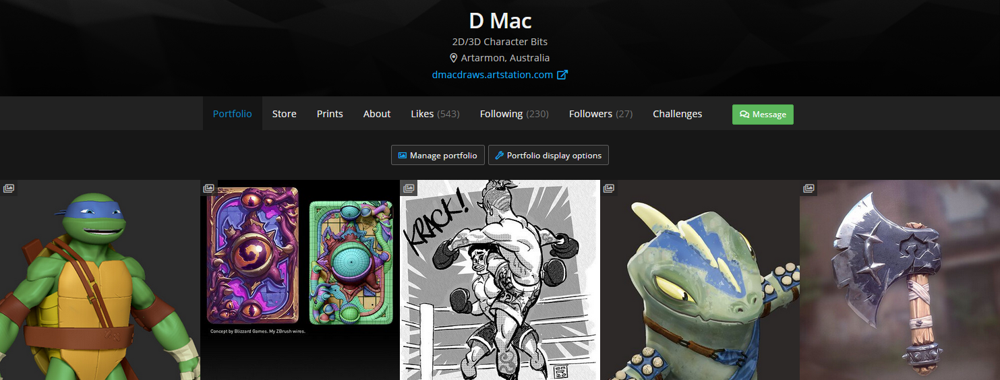
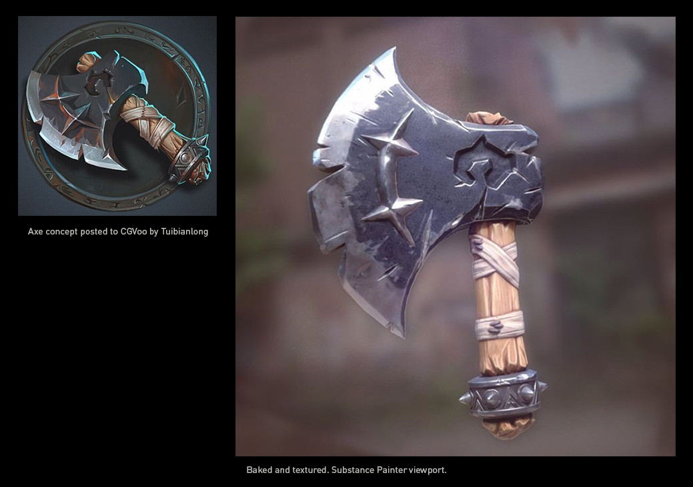
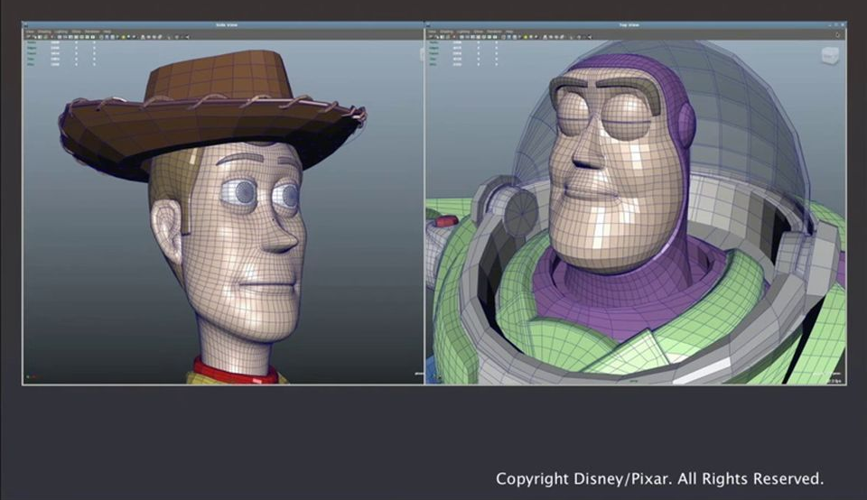
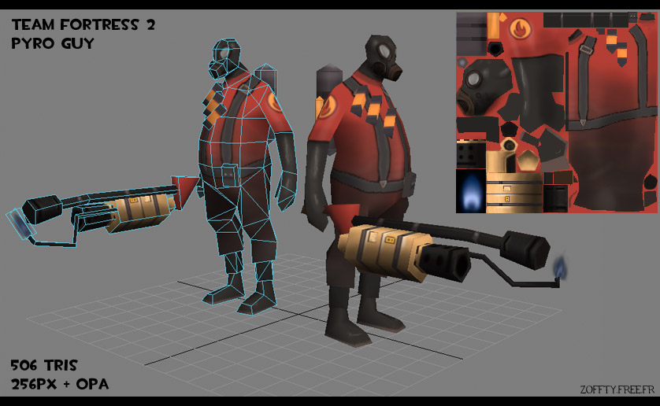
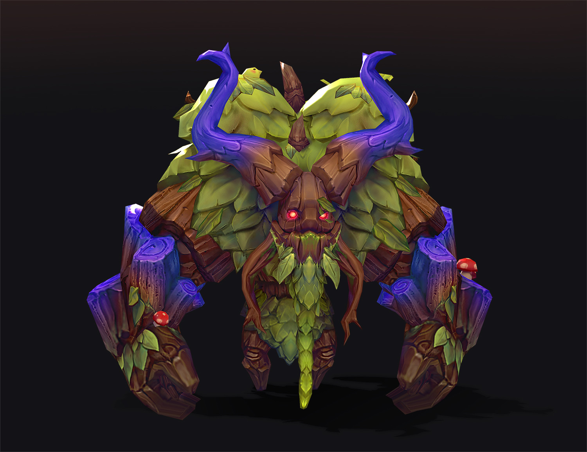
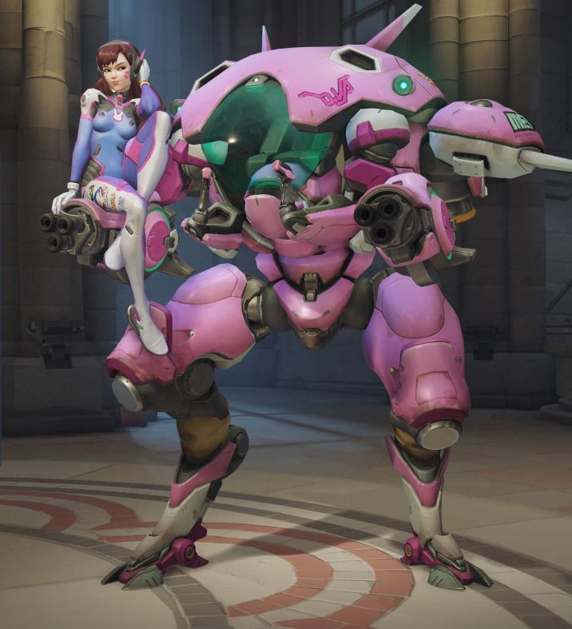
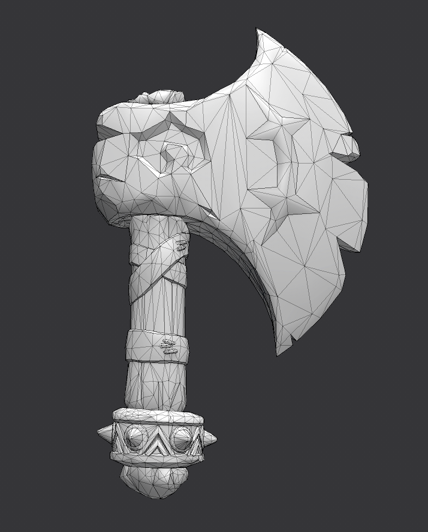
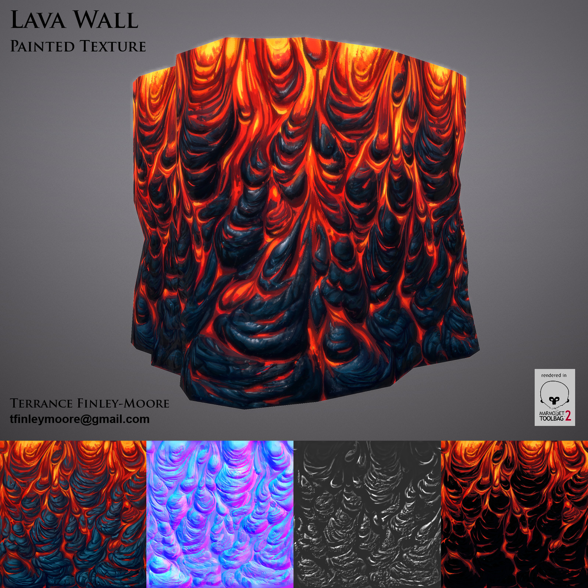

# Substance Painter Workshop

Exploring game asset creation from high res meshes with Substance Painter.

<!-- @import "[TOC]" {cmd="toc" depthFrom=1 depthTo=6 orderedList=false} -->

<!-- code_chunk_output -->

- [Substance Painter Workshop](#substance-painter-workshop)
  - [Welcome](#welcome)
  - [Games](#games)
  - [Today's goal](#todays-goal)
  - [So! How does 3D game art work?](#so-how-does-3d-game-art-work)
    - [Triangles are really flat](#triangles-are-really-flat)
    - [Big triangles plus painting](#big-triangles-plus-painting)
    - [More polys much more paint](#more-polys-much-more-paint)
    - [High poly plus normal maps (and more)](#high-poly-plus-normal-maps-and-more)
    - [Proper high poly](#proper-high-poly)
    - [Getting back the form](#getting-back-the-form)
    - [Apply a few materials](#apply-a-few-materials)
  - [Lighting](#lighting)
    - [Procedural power!](#procedural-power)
    - [Extra flash](#extra-flash)
  - [Take home](#take-home)

<!-- /code_chunk_output -->

___

## Welcome

Who am I?

* Who's here?     
___

## Games
Whatever else we have in common, we're all here because we like games.

Who plays:
  * rts games?
  * moba?
  * fps?
  * racers?
  * lawyering sims?
  * brawlers?

There are a lot of games in a lot of genres, they all need art, and increasingly 3D.

>I'll be showing a stylized axe today that belongs most in maybe a 3rd person fantasy brawler.

___

## Today's goal

Some of you will have done some art or 3D, some of you won't. But whatever your level, whatever part of this resonates with you, I hope you all feel a little walk away feeling a bit of the, sort of buzz I do when I see an idea turning into a real game model. 

Substance Painter doesn't have a magic button by any stretch, even if this demo makes it look like it does, but it still feels a bit like magic. Also, you can screenshot some renders and take them with you on the pen drives on your desks.

___

## So! How does 3D game art work?

**Triangles!**

_the kings of 3D graphics, as shown at [uiuc.edu](http://www.geom.uiuc.edu/~wanous/definitionofatriangle.html)_

* Lot of tools to make these, arrange them and colour them in
* Half a gpu's job is moving these, the other is painting them.
* It's what reviewers are talking about with polygons per frame or per second when a new Playstation is about to drop. We'll come back to those and fill rate.
___

### Triangles are really flat

Triangles, no matter how you abuse them, are flat.

> A triangle is the simplest shape we can make.  

Now, add another triangle, and things start to get interesting. We have a lot of play. then another, we can make a roiling carpet. If you have enough of them, and they're small enough, and you are free to make the edges as long or short as you need, you can make anything.

_Pixar uses smoothed squares, and squares are.. pairs of triangles!_

About half the power of this goes into triangles:

### Big triangles plus painting

Not bad at all! This is how things were done up until around when the Doom reboot came out. It's still how things are done on cute mobile games.

Very low poly might be 500 or fewer! **Tom talian's low poly, painted TF2 characters**. 
* One texture, 256x256.

Low poly and hand painted is nice.. until you try to light it dynamically.
___

### More polys much more paint

Those looked pretty cool, but things got really going when people could paint higher res textures in photoshop and use more polys:

https://www.artstation.com/artwork/DOLmR

Mina Kim hand paint example](https://www.artstation.com/artwork/DOLmR)

Why wasn't this enough? These more detailed, hand painted textures start to really suffer under lights. 
* The shadows and hilights don't match up,everything goes flat. 
* Try taking a flash photo of a real painting: you get a big glossy hilight and the illusion breaks down. 

___

### High poly plus normal maps (and more)

Quite high poly, we have **DVa from overwatch**. 
* 20,000 polys for her, 
* 22,000 for her mech base, 
* 15,000 for mech guns.
* 10 textures just for her body and hair, some asa large as 1024x2048

___

### Proper high poly

The term "high poly" in a game running at 60 or 144fps is not the same as high poly when we're actually sculpting the original. 

> High poly in a game might mean 30,000 or even 200,000. The original model in ZBrush might use 8, 12 million or more.

Let's open substance, look at our sad "high" poly axe. 

Here's the original in ZBrush. See all those little details? A big triangle doesn't have those. 
* Hold one triangle up to a button or an eyebrow. Big flat nothing.

___

### Getting back the form 

We lose a lot of form taking away tringles. How do we get them back? 

Well this thing (a Strix RTX 2080) has two pipelines:
* one that moves triangles
* and the other colours them in with textures. 

The texturing pipeline has power to burn. 
* Way more than needed to just fill in painted textures. 
* Clever people found a way to transcode physical form into bitmaps
* They use extra textures for surface form information, light emission, roughness and more.

It has limits but it's pretty convincing.. and very fast.

> Importing normal map 

___

### Apply a few materials

Let's use basic substance materials! Now we're getting somewhere.

> Try materials, masking with colour

## Lighting

The whole purpose of normal maps and pbr texturing is to react to light in ways hand painted textures can't.

Another key to making that look amazing is **image based lighting**, so lets try some environments.

> First play with environments, shader quality

___

### Procedural power!

Still, these materials just wrap around the shape and make it look shrinkwrapped. There's no wear and tear, no dirt in the crevices, no shine from use or friction. 

These textures encode:
* Areas curving out (ridges) and in (cavities). 
* Areas light struggles to reach.
* Position in the world
* Metalness, smoothness. 
  
> To fix that, we'll apply some of those extra textures we talked about.

It takes a while to bake these maps, but once they're made, painter can drive **smart materials** with them. 

> Customise the textures! Try messing with colours

___

### Extra flash
We're missing something. It doesn't quite look next gen without post-processing filters.

> Turn on some post effects: bloom, contrast, depth of field 

Hooray!

___

## Take home

> Take some screen shots! If you brought a thumb drive, copy your working files.

Try out iRay, use the snipping tool.

