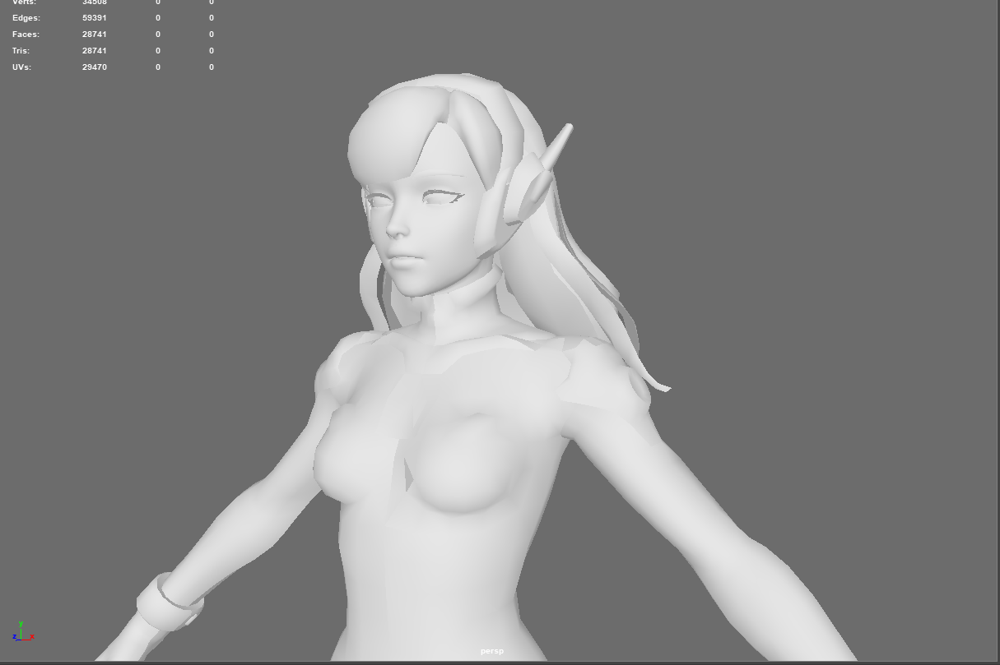
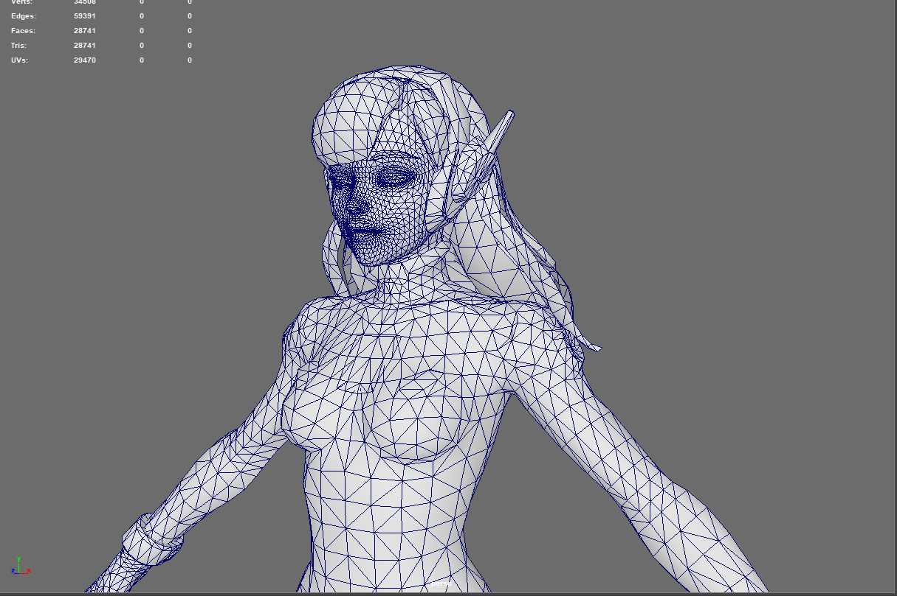
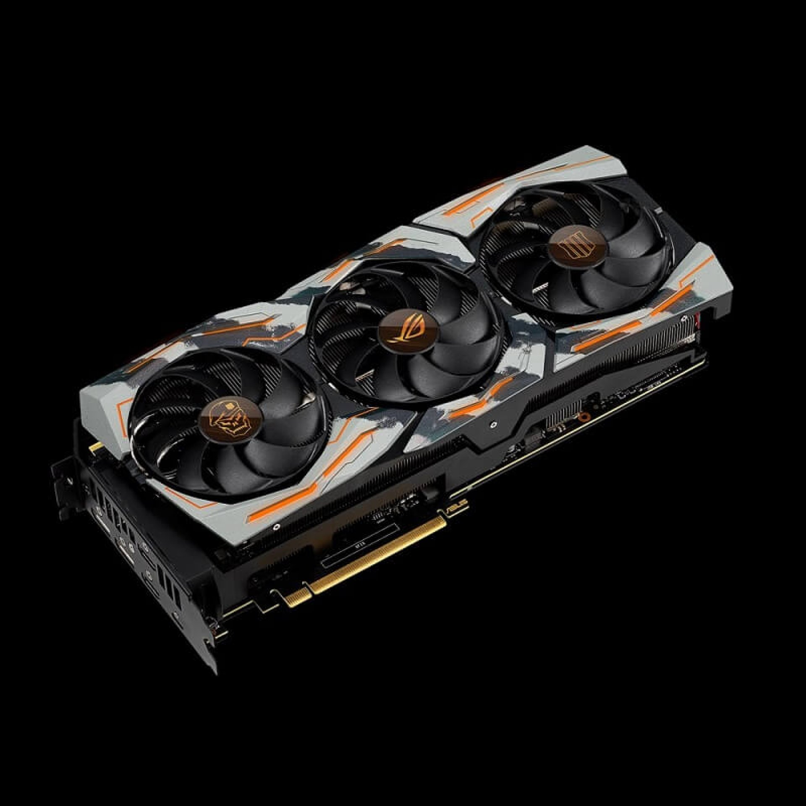
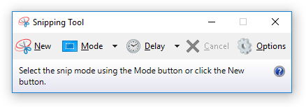

# Substance Painter Workshop

Exploring game asset creation from high res meshes with Substance Painter.

<!-- @import "[TOC]" {cmd="toc" depthFrom=1 depthTo=6 orderedList=false} -->

<!-- code_chunk_output -->

- [Substance Painter Workshop](#substance-painter-workshop)
  - [Welcome](#welcome)
  - [Games](#games)
  - [Today's goal](#todays-goal)
  - [So! How does 3D game art work?](#so-how-does-3d-game-art-work)
    - [Triangles are really flat](#triangles-are-really-flat)
    - [Game resolution info:](#game-resolution-info)
  - [There are in game resolution meshes, and the meshes we really make](#there-are-in-game-resolution-meshes-and-the-meshes-we-really-make)
    - [What we really need is that detail so light can shine on all our nice detail](#what-we-really-need-is-that-detail-so-light-can-shine-on-all-our-nice-detail)
    - [Apply a few materials](#apply-a-few-materials)
  - [Lighting](#lighting)
  - [Procedural power!](#procedural-power)
  - [Finally, we're missing something, this doesn't look like a PS4 game](#finally-were-missing-something-this-doesnt-look-like-a-ps4-game)
  - [take home](#take-home)

<!-- /code_chunk_output -->

___

## Welcome

* Who am I
* Who's here?     
___

## Games
Whatever else we have in common, we're all here because we like games.

Who plays:
  * rts games?
  * moba?
  * fps?
  * racers?
  * lawyering sims?
  * brawlers?

There are a lot of games in a lot of genres, they all need art, and increasingly 3D.

>I'll be showing a stylized axe today that belongs most in maybe a 3rd person fantasy brawler.

___

## Today's goal

Some of you will have done some art or 3D, some of you won't. But whatever your level, whatever part of this resonates with you, I hope you all feel a little walk away feeling a bit of the, sort of buzz I do when I see an idea turning into a real game model. 

Substance Painter doesn't have a magic button by any stretch, even if this demo makes it look like it does, but it still feels a bit like magic. Also, you can screenshot some renders and take them with you on the pen drives on your desks.

___

## So! How does 3D game art work?

**Triangles!**

_the kings of 3D graphics, as shown at [uiuc.edu](http://www.geom.uiuc.edu/~wanous/definitionofatriangle.html)_

* Lot of tools to make these, arrange them and colour them in
* Half a gpu's job is moving these, the other is painting them.
* It's what reviewers are talking about with polygons per frame or per second when a new Playstation is about to drop. We'll come back to those and fill rate.
___

### Triangles are really flat

Triangles, no matter how you abuse them, are flat.

> A triangle is the simplest shape we can make.  

Now, add another triangle, and things start to get interesting. We have a lot of play. then another, we can make a roiling carpet. If you have enough of them, and they're small enough, and you are free to make the edges as long or short as you need, you can make anything.

About half the power of this goes into triangles:

Lets look at our axe as.. triangles a game can push.

### Game resolution info:

Very low poly might be 500 or fewer! **Tom talian's low poly, painted TF2 characters**. 
* One texture, 256x256.

Quite high poly, we have **DVa from overwatch**. 
* 20,000 polys for her, 
* 22,000 for her mech base, 
* 15,000 for mech guns.
* 10 textures just for her body and hair, some asa large as 1024x2048

___

## There are in game resolution meshes, and the meshes we really make

30K vs 12 million

> Open substance, look at our sad low poly axe. 

Now this guy is the original axe. See all those little details? A big triangle doesn't have those. 
* Hold one up to a button or an eyebrow, that's one big flat nothing.

___

### What we really need is that detail so light can shine on all our nice detail

How do we get it back? Well, graphics cards are built to do what you just saw. Put nice textures on as many polygons as possible.

It has two pipelines: 
* one that moves those triangles
* and the other that draws the textures. 

Turns out the texturing circuitry has power left to burn, and clever people found a way to bring back all that physical form by using textures as data rather than paint info, and they can use that data to draw the surface detail.

It has limits but it's close enough! And fast.

> Importing normal map 

___

### Apply a few materials

Materials! We're kinda getting somewhere.

> Try materials, masking with colour

## Lighting

Well, it's all a bit black and white isn't it? Do we have to paint in moodlighting?

> First play with environments, shader quality

___

## Procedural power!

Still, these materials just wrap around the shape and make it look shrinkwrapped. There's no wear and tear, no dirt in the crevices, no shine from use or friction.

* Turned out smart people found other ways to use textures. 
* What sticks out, what's protected? Where can light reach?
* What's up, down? 

> Import the other maps and see some real smart materials in action

It takes a long time to bake these maps, but once they're made, painter can make textures out of them.  And we can bake out the maps that any game engine needs to run quick!

> Customise the textures! Try messing with colorus

___

## Finally, we're missing something, this doesn't look like a PS4 game

> Turn on some post effects: bloom, contrast, depth of field 

Hooray!

___

## take home

> Take some screen shots!

Try out iRay, use the snipping tool.

