# Substance Painter Workshop

Exploring game asset creation from high res meshes with Substance Painter.

<!-- @import "[TOC]" {cmd="toc" depthFrom=1 depthTo=6 orderedList=false} -->

<!-- code_chunk_output -->

- [Substance Painter Workshop](#substance-painter-workshop)
  - [Welcome](#welcome)
  - [What are we talking about?](#what-are-we-talking-about)
  - [Games](#games)
  - [Today's goal](#todays-goal)
  - [So! How does 3D game art work?](#so-how-does-3d-game-art-work)
    - [Triangles are really flat](#triangles-are-really-flat)
    - [Big triangles plus painting](#big-triangles-plus-painting)
    - [More polys much more paint](#more-polys-much-more-paint)
    - [High poly plus normal maps (and more)](#high-poly-plus-normal-maps-and-more)
    - [Proper high poly](#proper-high-poly)
    - [Getting back the form](#getting-back-the-form)
    - [Apply a few materials](#apply-a-few-materials)
  - [Lighting](#lighting)
    - [Procedural power!](#procedural-power)
      - [We need textures to encode](#we-need-textures-to-encode)
    - [Extra flash](#extra-flash)
  - [Take home](#take-home)

<!-- /code_chunk_output -->

___

## Welcome

Who's here today?

    
___

## What are we talking about?

How this axe was made, how we can texture it in Substance Painter.

## Games
> We're all here because we like games.

Who plays:
  * Real time strategy (Civilisation, Total War, Starcraft 2, age of empires
    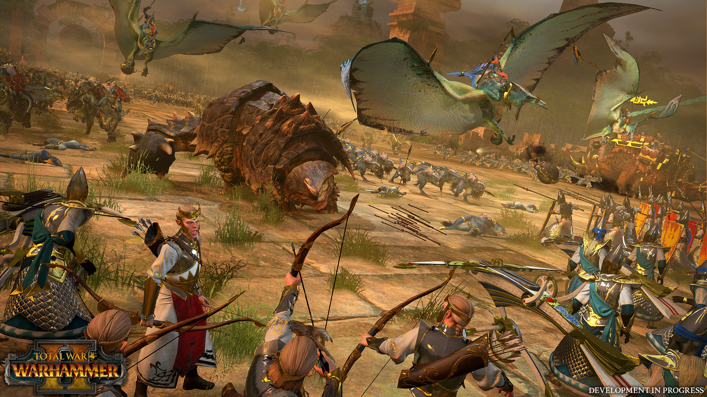
    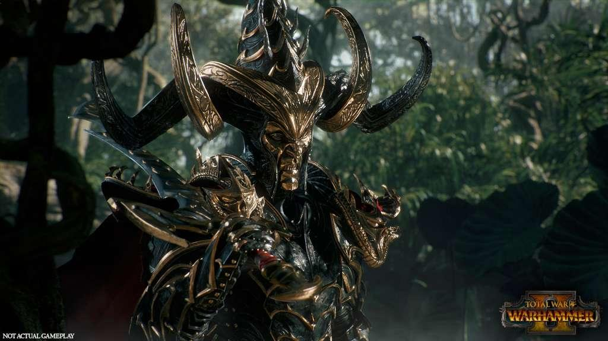
  * MOBA (LoL, Dota 2)
    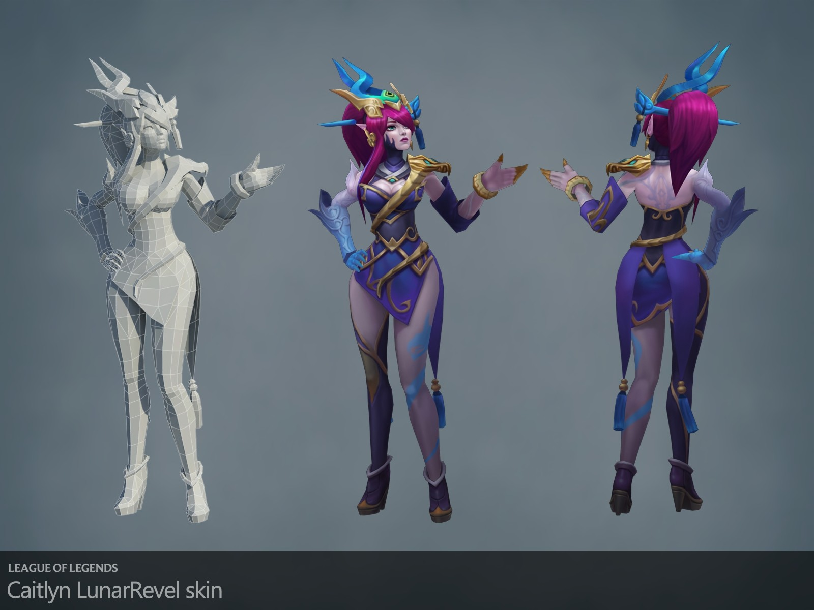
    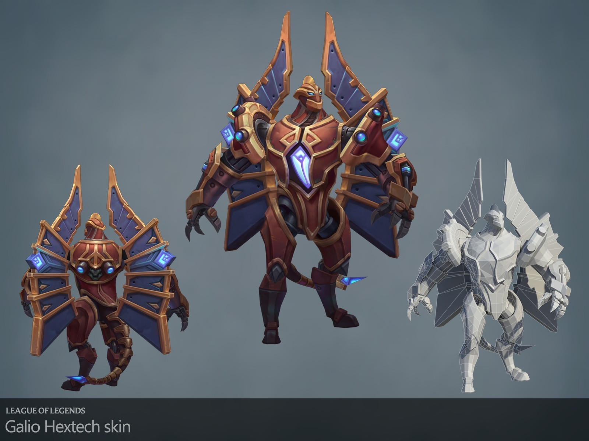
  * Sports (Fifa, NBA 2K)
    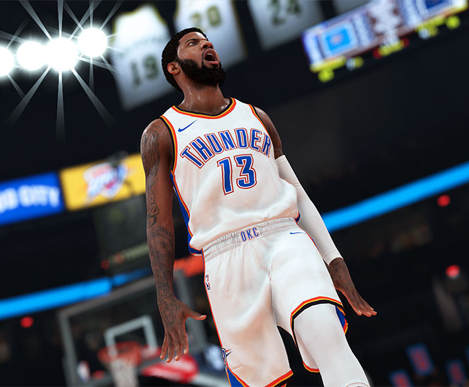
    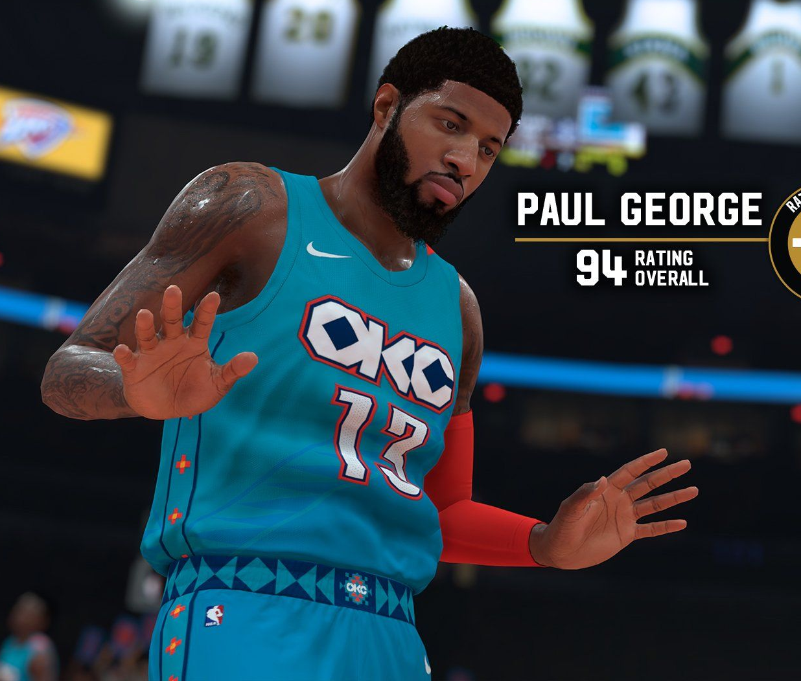
    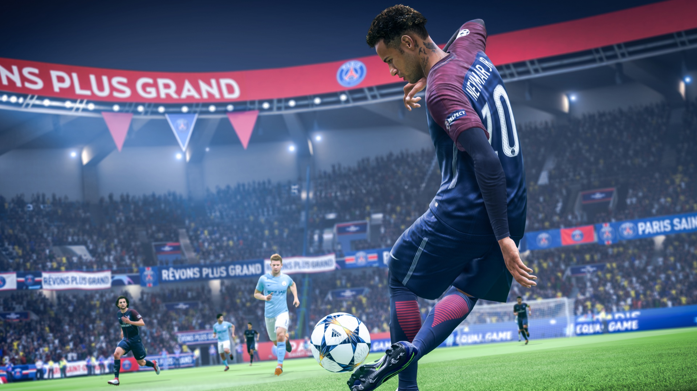
  * FPS (Overwatch)
    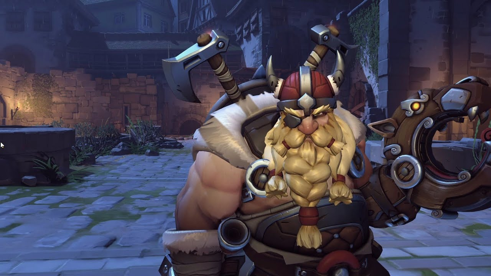
    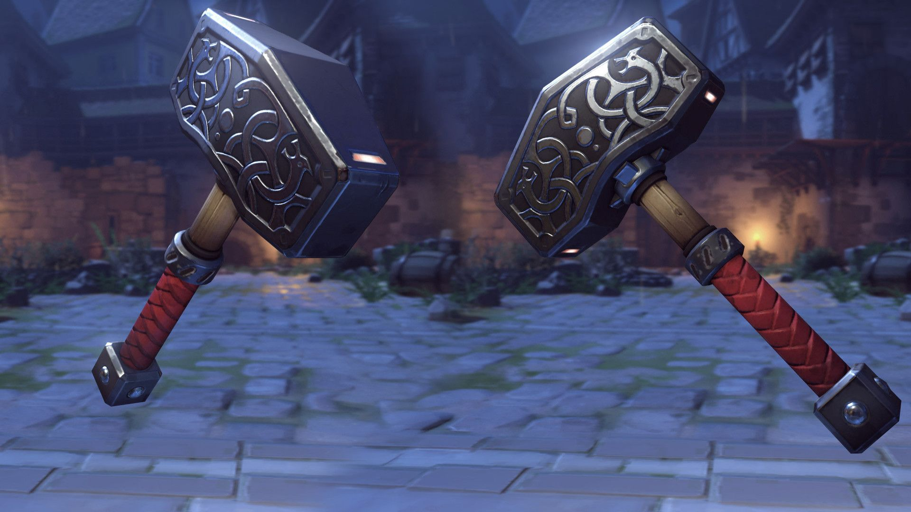
    
  * Survival
    - 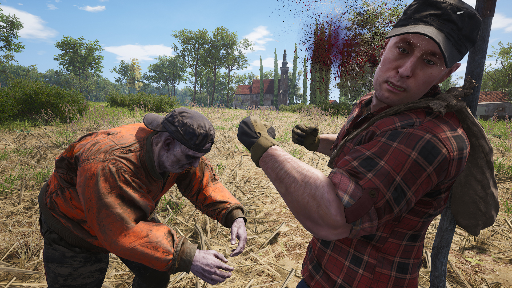
  * Battle Royale (Fortnight)
    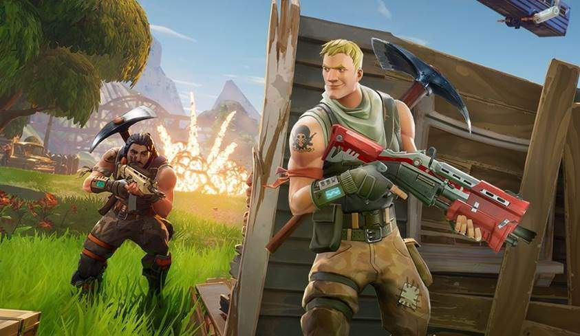
    
  * racers?
  * lawyering sims?
  * brawlers?

There are a lot of games in a lot of genres, they all need art, and increasingly 3D.

___

## Today's goal

I hope you all walk away feeling some of the buzz I do when I see an idea turning into a game model. 

Substance Painter doesn't have a magic button by any stretch, even if this demo makes it look like it does. It does feel a bit like magic though.

___

## So! How does 3D game art work?

**Triangles!**

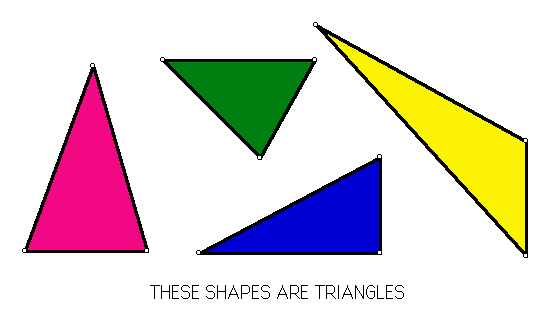
_the kings of 3D graphics, as shown at [uiuc.edu](http://www.geom.uiuc.edu/~wanous/definitionofatriangle.html)_

* **Modelling tools** make them
* **Texturing tools** paint them
* Consoles and gpus have to move them and paint them real quick.
___

### Triangles are really flat

Triangles, no matter how you abuse them, are flat.

> A triangle is the simplest shape we can make.  

If you have a lot of them though, and they're small enough.. you can make anything look good.

_Flat pointy triangles or smooth rolling hills? Both._

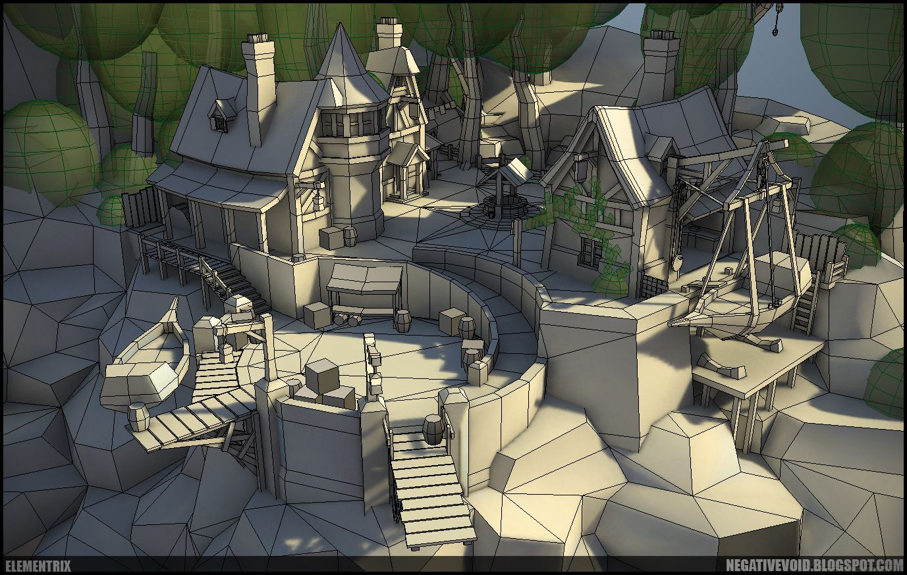
_A village of a few thousand triangles_

_Pixar uses smoothed squares, and squares are.. pairs of triangles!_

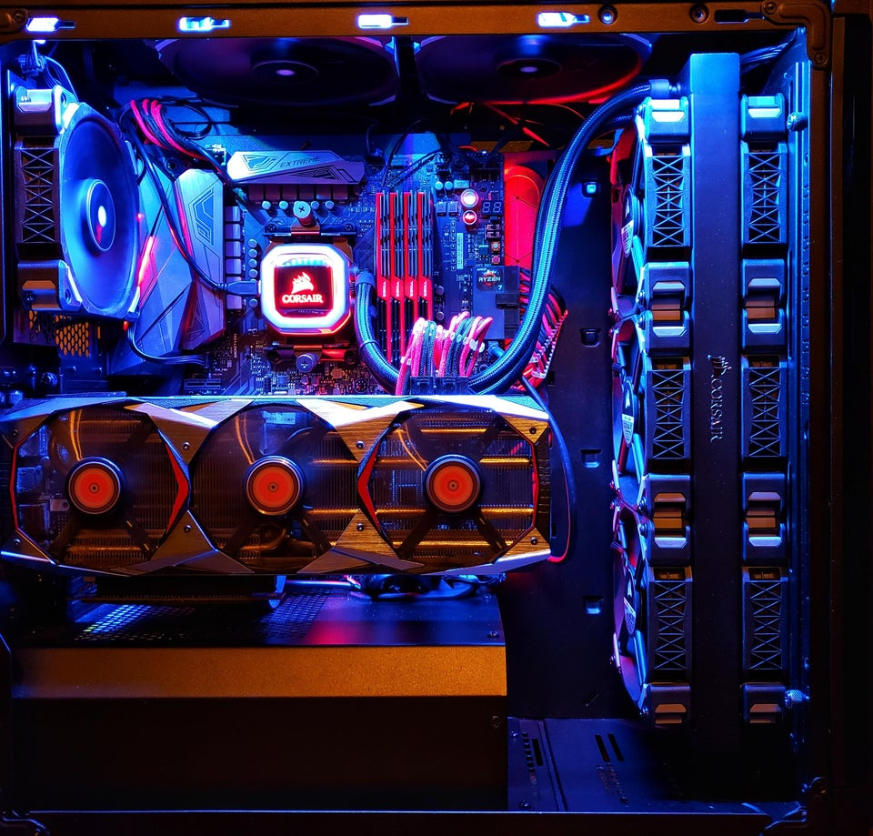
_About half the power of your gpu goes into moving triangles, the rest into colouring them in_

### Big triangles plus painting

Not bad at all! This is how things were done up until around when the Doom reboot came out. It's still how things are done on cute mobile games.

Very low poly might be 500 or fewer! **Tom talian's low poly, painted TF2 characters**. 
* One texture, 256x256.

Low poly and hand painted is nice.. until you try to light it dynamically.
___

### More polys much more paint

Those looked pretty cool, but things got really going when people could paint higher res textures in photoshop and use more polys:

https://www.artstation.com/artwork/DOLmR

Mina Kim hand paint example](https://www.artstation.com/artwork/DOLmR)

Why wasn't this enough? These more detailed, hand painted textures start to really suffer under lights. 
* The shadows and hilights don't match up,everything goes flat. 
* Try taking a flash photo of a real painting: you get a big glossy hilight and the illusion breaks down. 

___

### High poly plus normal maps (and more)

Quite high poly, we have **DVa from overwatch**. 
* 20,000 polys for her, 
* 22,000 for her mech base, 
* 15,000 for mech guns.
* 10 textures just for her body and hair, some asa large as 1024x2048

___

### Proper high poly

The term "high poly" in a game running at 60 or 144fps is not the same as high poly when we're actually sculpting the original. 

> High poly in a game might mean 30,000 or even 200,000. The original model in ZBrush might use 8, 12 million or more.

Let's open substance, look at our sad "high" poly axe. 

Here's the original in ZBrush. See all those little details? A big triangle doesn't have those. 
* Hold one triangle up to a button or an eyebrow. Big flat nothing.

___

### Getting back the form 

Our GPU eventually **chokes on too many triangles**. 

* That happens before we run out of **painting/texturing power**.
* Clever people found a way to turn surface details into bitmaps
* They use extra textures for surface form information, light emission, roughness and more.

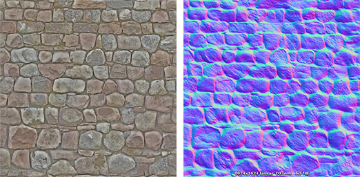

It has limits but it's pretty convincing.. and very fast.

> Painter: Importing our normal maps. Hitting M and C to see them.

___

### Apply a few materials

Let's use basic substance materials! Now we're getting somewhere.

> Try materials, masking with colour

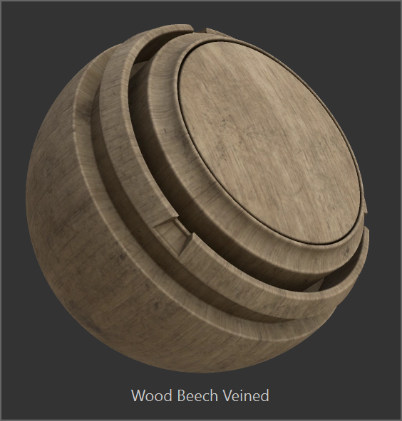

## Lighting

The whole purpose of normal maps and pbr texturing is to react to light in ways hand painted textures can't.

Another key to making that look amazing is **image based lighting**, so lets try some environments.

> First play with environments, shader quality

___

### Procedural power!

Still, these materials just wrap around the shape and make it look shrinkwrapped. There's no wear and tear, no dirt in the crevices, no shine from use or friction. 

Materials can look way better in Substance if they have more info about the surface:

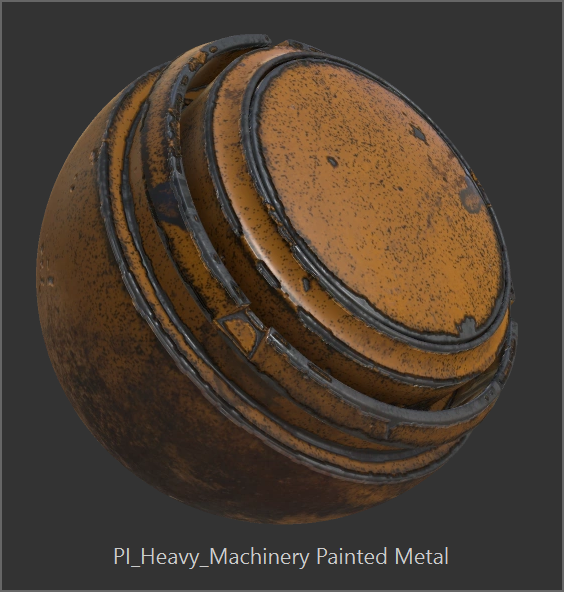

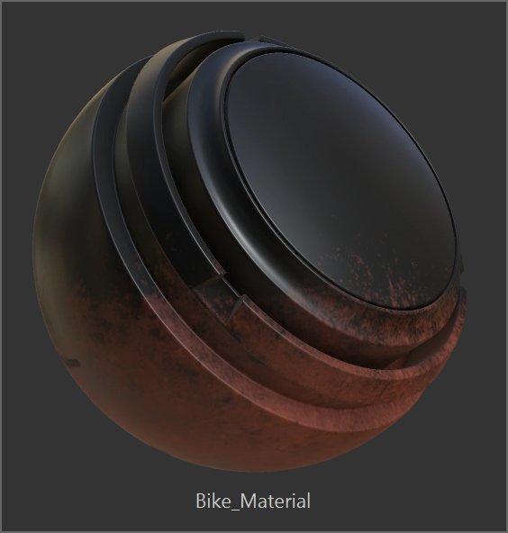

#### We need textures to encode
* Areas curving out (ridges) and in (cavities). 
* Areas light struggles to reach.
* Position in the world

> To fix that, we'll apply some of those extra textures we talked about.

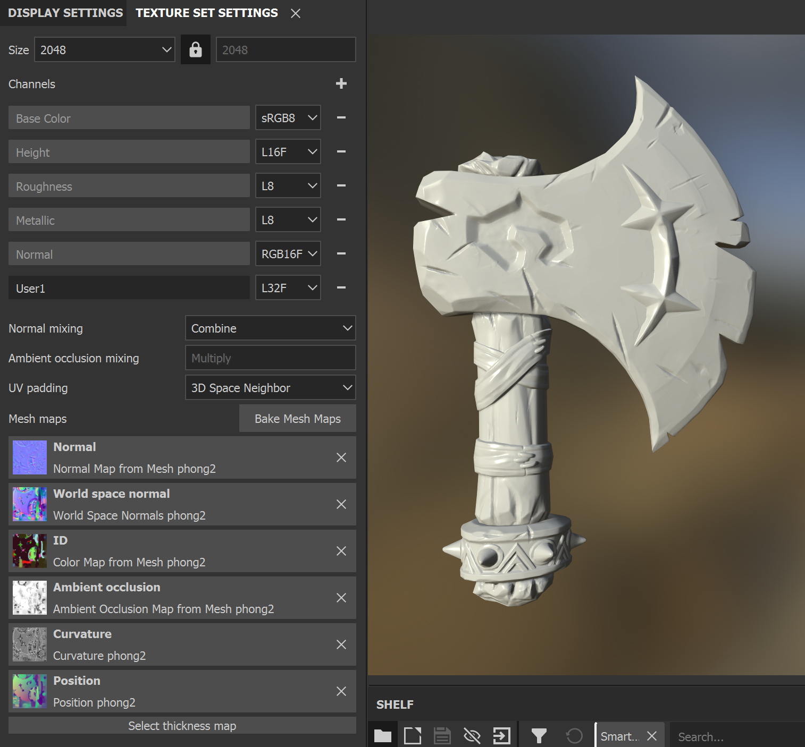
_Applying our surface info images in the texture set settings_

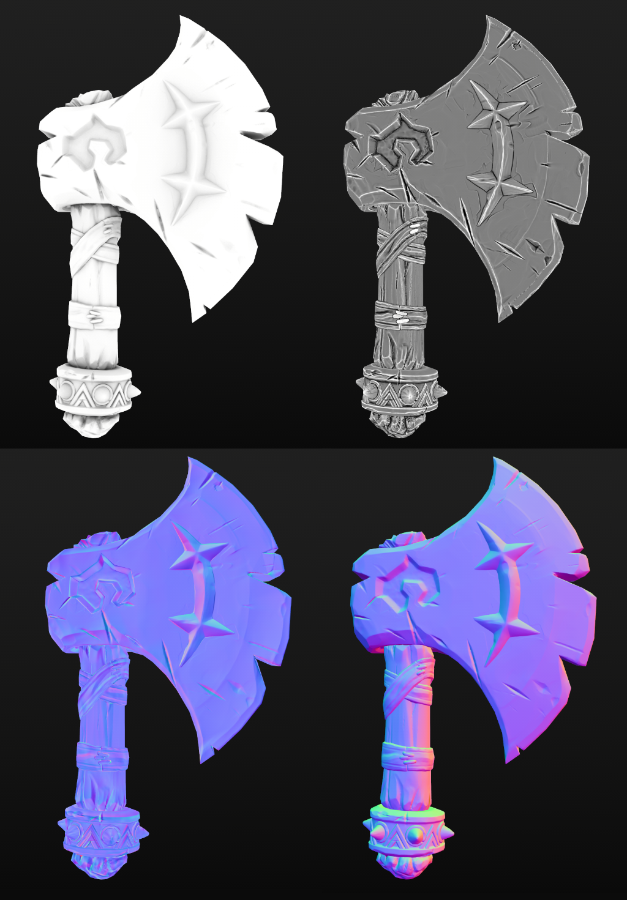
_Here's how they'd look if painted on the surface_

It takes a while to bake these maps, but once they're made, painter can drive **smart materials** with them. 

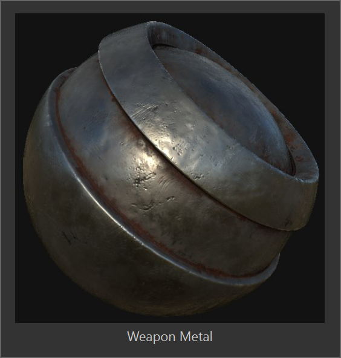
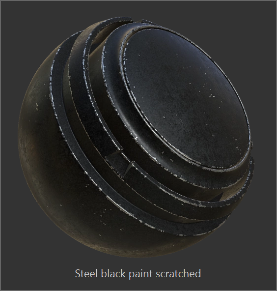
_How our boring materials look once they have surface information_

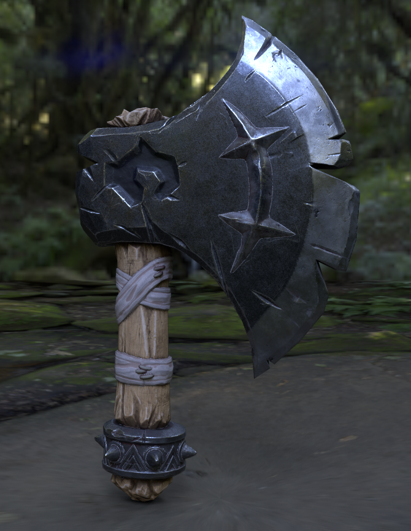

> Customise the textures! Try messing with colours

___

### Extra flash
We're missing something. It doesn't quite look next gen without post-processing filters.

> Turn on some post effects: bloom, contrast, depth of field 

Hooray!

___

## Take home

> Take some screen shots! If you brought a thumb drive, copy your working files.

Try out iRay, use the snipping tool.

