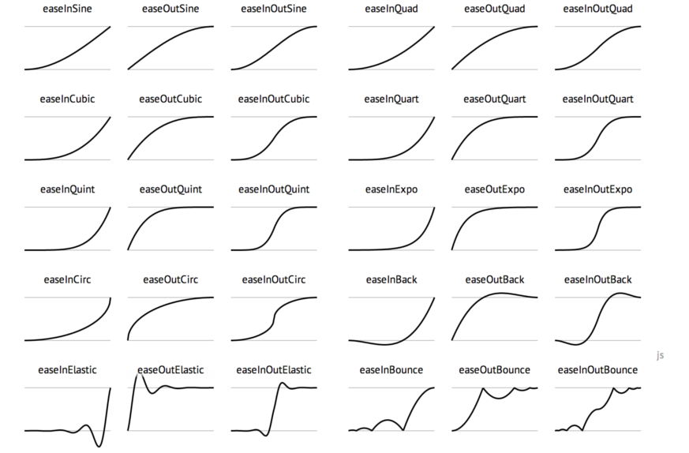
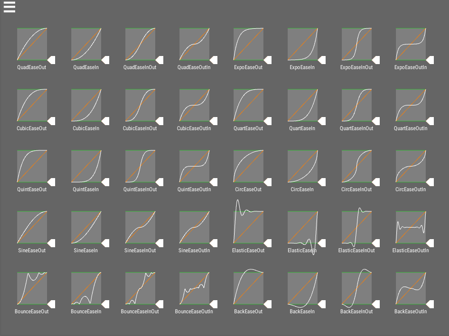

---
html:
  embed_local_images: false
  embed_svg: true
  offline: false
  toc: undefined
export_on_save:
  html: true
---
# Game Design: spice to your games

<!-- @import "[TOC]" {cmd="toc" depthFrom=1 depthTo=6 orderedList=false} -->

<!-- code_chunk_output -->

- [Game Design: spice to your games](#game-design-spice-to-your-games)
  - [Hello](#hello)
  - [Game Design Principles](#game-design-principles)
    - [Feel as fast feedback](#feel-as-fast-feedback)
    - [2D Games with juice](#2d-games-with-juice)
  - [ADD SCREENIES OR SHORT VIDS](#add-screenies-or-short-vids)
  - [Video: Adding Juice GDC](#video-adding-juice-gdc)
    - [Tweens, sound, camera shake, wow!](#tweens-sound-camera-shake-wow)
    - [No juice in old games?](#no-juice-in-old-games)
    - [PIC OF LOW RES ART ON BIG GRID VS HIGH RES LOW RES ON WEE GRID](#pic-of-low-res-art-on-big-grid-vs-high-res-low-res-on-wee-grid)
  - [Video: Your death animation sucks](#video-your-death-animation-sucks)
    - [Try those techniques in FD](#try-those-techniques-in-fd)
  - [Resources](#resources)
  - [Learning paths](#learning-paths)

<!-- /code_chunk_output -->

## Hello

* You
* Me

## Game Design Principles

Many things come to mind when we talk game design. 
* Genres
* world building
* level design
* scripting
* balancing.

There are many practices and principles for each, a million niches to squeeze into.

### Feel as fast feedback

Keeping a user in the pocket. Fast feedback, fast response, immersion. A sense of agency.

A key part of this, explored in explosions and collisions, is that missing element of physical force, of ear splitting sound and blinding light.

How to make them feel like they're out there with Oppenheimer,wearing goggles and being blasted.

* We can't go above the nits of the tv or their volume.
* We have to take away physics, anticipation and follow through in jumps and collsions to keep controls responsive. Instead of 8 frames of wind up, like in a film, you have one or zero frames to leave the ground. Anticipation and follow through create the sense of weight, of physical presence. Critical principle from Disney's 9 old men.

_These tv style keyframes show anticipation. You'd have more in between to smooth it_

_Mega man has to be off the ground almost before you press._

But we can't just shrug our shoulders and accept our characters have no presence.

How do we make up for that? We'll see some things today, but you might remember from playing platformers:
  - camera lag
  - booOIIINg or dooIIIght sounds
  - dust particles on jump?
  - Splats and camera overshoot on land.

<iframe width="854" height="480" src="https://www.youtube.com/embed/dJJnxHcv1z4?start=627" frameborder="0" allow="accelerometer; autoplay; encrypted-media; gyroscope; picture-in-picture" allowfullscreen></iframe>
_Sonic can explain camera lag and dooooIIIght_

<iframe width="854" height="480" src="https://www.youtube.com/embed/dLMvXi_-j2E?start=821" frameborder="0" allow="accelerometer; autoplay; encrypted-media; gyroscope; picture-in-picture" allowfullscreen></iframe>
_Viewtiful Joe demonstrates particles for ground and even air jumps_

* Communicating on multi levels: combining light, sound, shape 

### 2D Games with juice

A very small sample of 2D games with juice.

> What 2D games stand out for juiciness?

#### Donkey kong country?
I remember the ground pound?

## ADD SCREENIES OR SHORT VIDS
#### Rayman Legends

#### Super meatboy

<iframe width="854" height="480" src="https://www.youtube.com/embed/eILvkKnMxWY?start=12" frameborder="0" allow="accelerometer; autoplay; encrypted-media; gyroscope; picture-in-picture" allowfullscreen></iframe>

#### Fez
  
  <iframe width="854" height="480" src="https://www.youtube.com/embed/Houl_emUdrk?start=38" frameborder="0" allow="accelerometer; autoplay; encrypted-media; gyroscope; picture-in-picture" allowfullscreen></iframe>

#### Guacamelee 2

<iframe width="854" height="480" src="https://www.youtube.com/embed/XiTqmUiuqpM?start=116" frameborder="0" allow="accelerometer; autoplay; encrypted-media; gyroscope; picture-in-picture" allowfullscreen></iframe>

## Video: Adding Juice GDC

The problem with looking at characters first is we're pretty biased towards feeling what happens to them.

Here are some experts to show us you can add loads of increased feedback and feel even to classic games quadrangles for characters. 

<iframe width="854" height="480" src="https://www.youtube.com/embed/Fy0aCDmgnxg" frameborder="0" allow="accelerometer; autoplay; encrypted-media; gyroscope; picture-in-picture" allowfullscreen></iframe>
_A classic GDC talk, Juice It Or Lose It_

### Tweens, sound, camera shake, wow!

There is theory there to explore, but first, lets have a look at our demo. A totally original retro arcade classic, Fissile Demand.

Fissile without juice.
Add a bit of tweening to flash and bloat and splode things
Add camera shake
Add sound
Add 2d light flare on earth explosion? Tween down.

The boys in video 1 talked about Tweening. Tweening by code is about types of linear equations, allowing us to change how we make our way from A to B

_Easy to see in big screen_

_Animated visualisation by NoiseCrime_

### No juice in old games?

They added plenty of juice, but had to do it in different ways with greater restrictions.

Remember, we're producing this:

on hardware built to handle this:

So things like camera shake and tween could appear in limited ways in old games. But mostly they did what they could by drawing every frame in a sprite.
___

#### Resolution and Sprites
Effects were it was limited by resolution and colours available, let alone processing speed. 

> **MC Arc**: 256x231, ?fps on 1.25mhz cpu
> **NES:** 256x240 @ (approx)25-30 fps, 1.78mhz cpu.
> **Megadrive:** 320x240 (PAL) at 30fps, 7.6mhz cpu.

**Now**: Average display 1920x1080 (or up to 4K) on.. 4Ghz multi core cpu.

4 billion cycles per second vs 1.25 million. Ouch. Dedicated GPU along with hardware FPU in x64 cpu.

Large pixels in output vs stylised large pixels made up of many pixels in screen buffer
  - Move by small amounts creating subtle motion
  - Rotate, scale in fractions creating very smooth feel
  - We can scale and rotate again by tiny fractions
  - modern 3d shaders can apply to the sprites, bloating and warping. Loads of power to spare.

___
#### Colours

> **MS Arc:** 16 colours
> **NES:** 4 cols per sprite, 16 total on screen of 52 options. 16KB vram
> **Megadrive**: 61 colours displayed of 512 options. 64KB vram.
 
**Now?** 32 bit RGBA pngs we're importing support 16= million colours. No palette limits. 3-8GB vram is pretty typical.

### PIC OF LOW RES ART ON BIG GRID VS HIGH RES LOW RES ON WEE GRID

#### What does all that mean?

We have much more range to express ourselves. 

> Artists and coders making these games in the 80s and 90s were busting their butts to squeeze all the power and expression they could from their hardware.
> We can **honour their art style** with big pixels, and **their spirit** with modern powered additions!

## Video: Your death animation sucks
 
<iframe width="854" height="480" src="https://www.youtube.com/embed/pmSAG51BybY" frameborder="0" allow="accelerometer; autoplay; encrypted-media; gyroscope; picture-in-picture" allowfullscreen></iframe>

Add bloom
Add particles
Maybe counter shake ground

### Try those techniques in FD

## Resources

* **Unity Hub**: installs Unity, manages Unity installs, modules and projects
  - We are using 2019.1.10f1 or 2019.1.10f1. Any 2019.1.x version should be project compatible.
  - [Download page](https://unity3d.com/get-unity/download)
  - [Direct link to windows 64 bit hub](https://public-cdn.cloud.unity3d.com/hub/prod/UnityHubSetup.exe)
* **DoTween** [free](https://assetstore.unity.com/packages/tools/animation/dotween-hotween-v2-27676 ) and [pro](https://assetstore.unity.com/packages/tools/visual-scripting/dotween-pro-32416) $15 version on Asset store
* **Free 8-bit shooter sound  effects** on [open game art](https://opengameart.org/content/retro-shooter-sound-effects)
* **Make your own** sound effects with [Bfxr free old school sound fx synthesizer](https://www.bfxr.net/). Source also available on a github repo.

* Download the **Markdown** version of these notes [here](designing_spice.md) 
* To edit markdown notes try [Visual Studio Code](https://code.visualstudio.com/download) for any platform
  - Go to extensions and add
    * Markdown All In One
    * Markdown Preview Enhanced

## Learning paths

If you or your students want to learn more about how to add this kind of feel to games, here are some useful links and videos:

1. Unite Berlin free workshop series, along with downloadable project demonstrating principles in action: [Creating a 2D Platformer playlist](https://www.youtube.com/watch?v=j29NgzV8Dw4&list=PLX2vGYjWbI0REfhDHPpdIBjjrzDHDP-xT)
  * eg: how to add to impression of explosion with chromatic abberation:

<iframe width="854" height="480" src="https://www.youtube.com/embed/yXCSunSDxT4?start=608" frameborder="0" allow="accelerometer; autoplay; encrypted-media; gyroscope; picture-in-picture" allowfullscreen></iframe>

2. Brackey's 2d lighting tutorial using Unity's light weight render pipeline. Provides links to a **follow-along Unity scene**.

<iframe width="854" height="480" src="https://www.youtube.com/embed/nkgGyO9VG54" frameborder="0" allow="accelerometer; autoplay; encrypted-media; gyroscope; picture-in-picture" allowfullscreen></iframe>

3. DoTween documentation: http://dotween.demigiant.com/documentation.php