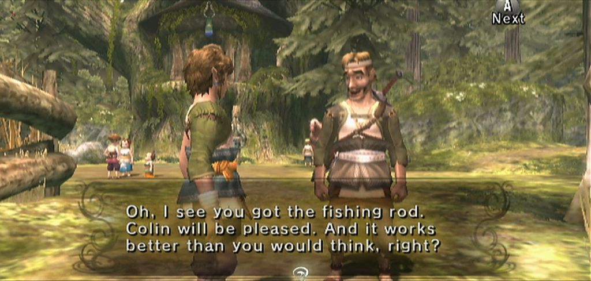
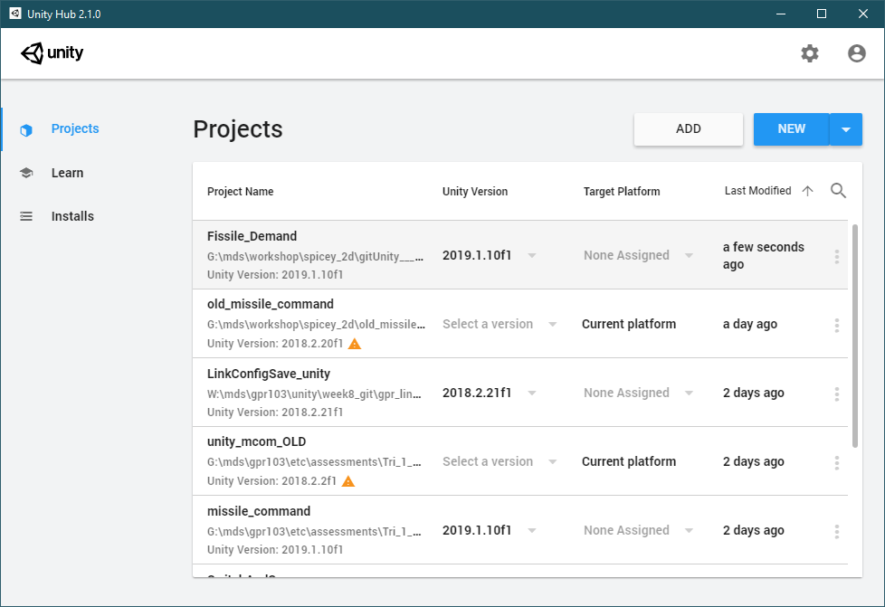
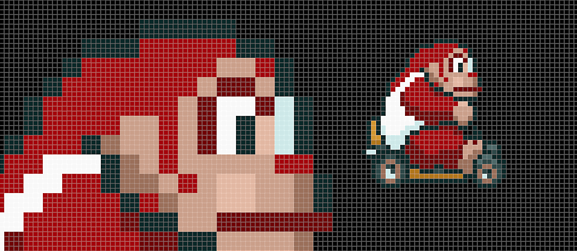
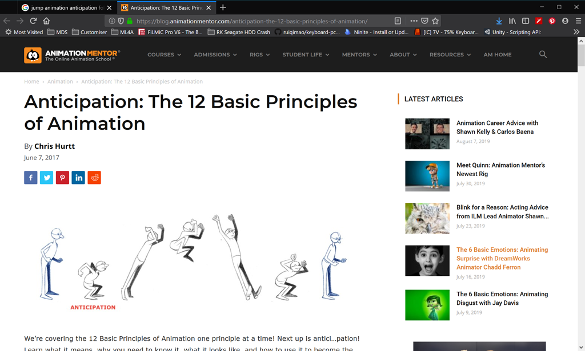

---
html:
  embed_local_images: false
  embed_svg: true
  offline: false
  toc: undefined
export_on_save:
  html: true
---
# Game Design: spice to your games

<!-- @import "[TOC]" {cmd="toc" depthFrom=1 depthTo=6 orderedList=false} -->

<!-- code_chunk_output -->

- [Game Design: spice to your games](#game-design-spice-to-your-games)
  - [Hello](#hello)
  - [Today](#today)
  - [Game Design Principles](#game-design-principles)
  - [Why does it matter?](#why-does-it-matter)
    - [What does agency require?](#what-does-agency-require)
    - [Slow agency](#slow-agency)
    - [Realtime agency](#realtime-agency)
  - [A Design Principle for realtime feedback](#a-design-principle-for-realtime-feedback)
    - [Jumping as a problem](#jumping-as-a-problem)
    - [Some 2D Games with juice](#some-2d-games-with-juice)
  - [Video: Adding Juice GDC](#video-adding-juice-gdc)
    - [Tweens, sound, camera shake, wow!](#tweens-sound-camera-shake-wow)
    - [No juice in old games?](#no-juice-in-old-games)
  - [Video: Your death animation sucks](#video-your-death-animation-sucks)
    - [Try those techniques in FD](#try-those-techniques-in-fd)
  - [Resources](#resources)
  - [Learning paths](#learning-paths)

<!-- /code_chunk_output -->

## Hello

* You
* Me

## Today

* Concepts
* Examples
* Game Developer Conference Talks
* Hands on with Unity
* Theory
* Learning paths, customisable notes.
___

## Game Design Principles

There are a lot of **elements to game design**:
* Story
* Genre
* World building
* Level design
* Balancing
* Progress/Boss encounters

Something common to all of them is **communication**. 

**Things communicated:**
 * Purpose 
 * Physical hazards
 * Routes
 * Solution helpers
 * friend or foe
 * Completion
 * Feasibility

_Did we achieve something? What?_
 
 <iframe width="854" height="480" src="https://www.youtube.com/embed/f3W4fsaw5E8?start=27" frameborder="0" allow="accelerometer; autoplay; encrypted-media; gyroscope; picture-in-picture" allowfullscreen></iframe>
 
 * When you see the boss taking damage, say when
 * Where is he vulnerable
 * At the end how bad is the boss hurt?
 * Is he heavy or light?
 
 ### Real time sense feedback

A game can engage several senses, up to a point.

* Vision, up to the limit of the brightness of your tv. Nits are capped.
* Sound, up to volume limit.
* Some limited touch: physical feedback by vibration, a button completely depressing or an analogue stick reaching its limit.

What we struggle with though, is that lack of physicality, the tameness and directionality of light and sound.

#### A fall from height

* Air roaring in ears
* Hair and clothes flapping
* Shock of pain and overwhelming sense of ground's implacability when you land.

#### An explosion

* Ear splitting sound 
* Blinding light.
* Heat
* Shockwave
* Air hitting like a brick wall

#### G-force

___

## Why does it matter?

A game is a simulation, and we're taking part. We're reacting at human speeds. 

What makes the simulation meaningful? We thrive on a feeling of achievement, agency.
* We got from here to there
* We saw a threat and avoided it
* We found a puzzle and solved it
* We had a fair chance to learn and overcome.

### What does agency require?

* Knowing what's happening
* Having enough information, time and resources to do the job, if we practise.

### Slow agency

Talking to someone, collecting a key, delivering a package, being offered a ride to the castle, discovering and rescuing the princess.

---
### Realtime agency

**Game events can happen in 2 or 3 frames** of a 60fps game. How do we sense these tiny events, process them quickly and react when our senses are so limited?

* 2 hit kill enemy fire
* The plant you're standing on is poisoning you
* Noticing a city in your screen's bottom right was destroyed while you look top left
* That city was very important.

#### Realtime in the real world.

**Woodworkint tools often don’t have rubber handles.** They have metal or wood. It transfers the physical interaction of the blade/head amd the wood through to the skin of your hands.

People have different responses to sensation, different setups that are comfortable, there's an amount of subjectivity. Some people will point out you can do any job with any chisel if you keep it sharp.

**What's less subjective is time.** If you add rubber to the grips, you're muffling the transfer of information. With less information, you'll need to get it elsewhere.
* Lift off the tool and look at the workpiece more
* Lift off the tool and touch the workpiece more

It's true that you'll be fine, you'll still do great work. It's also true your responses will be delayed to those looks/touches, you'll operate at a remove, be a little less in the pocket. 

---

## A Design Principle for realtime feedback

> Use all means at your disposal to replace the missing senses and recover meaning in your game events.

Particles, screen flash, character flash, camera shake, let's do it.

### Jumping as a problem

When we press jump in a game, the response has to be near immediate. If it's more than  a frame or two, it feels like the machine is failing to react. Thing is, your character feels a bit like a paper cutout.

If we were animating for tv or film, we'd have maybe 4 or 8 or more frames of wind up, plus the same or more for landing.

Anticipation and follow through create the sense of weight, of physical presence. The bring gravity and conservation of momentum.

_These tv style keyframes show anticipation. You'd have more in between to smooth it_

_Mega man has to be off the ground almost before you press._

But we can't just shrug our shoulders and accept our characters have no presence.

How do we make up for that? We'll see some things today, but you might remember from playing platformers:
  - camera lag
  - booOIIINg or dooIIIght sounds
  - dust particles on jump?
  - Splats and camera overshoot on land.

<iframe width="854" height="480" src="https://www.youtube.com/embed/dJJnxHcv1z4?start=627" frameborder="0" allow="accelerometer; autoplay; encrypted-media; gyroscope; picture-in-picture" allowfullscreen></iframe>
_Sonic can explain camera lag and dooooIIIght_

<iframe width="854" height="480" src="https://www.youtube.com/embed/dLMvXi_-j2E?start=821" frameborder="0" allow="accelerometer; autoplay; encrypted-media; gyroscope; picture-in-picture" allowfullscreen></iframe>
_Viewtiful Joe demonstrates particles for ground and even air jumps_

* Communicating on multi levels: combining light, sound, shape 

### Some 2D Games with juice

A very small sample of 2D games with juice.

> What 2D games stand out for juiciness?

#### Super meatboy

<iframe width="854" height="480" src="https://www.youtube.com/embed/eILvkKnMxWY?start=12" frameborder="0" allow="accelerometer; autoplay; encrypted-media; gyroscope; picture-in-picture" allowfullscreen></iframe>

#### Fez
  
  <iframe width="854" height="480" src="https://www.youtube.com/embed/Houl_emUdrk?start=38" frameborder="0" allow="accelerometer; autoplay; encrypted-media; gyroscope; picture-in-picture" allowfullscreen></iframe>

#### Guacamelee 2

<iframe width="854" height="480" src="https://www.youtube.com/embed/XiTqmUiuqpM?start=116" frameborder="0" allow="accelerometer; autoplay; encrypted-media; gyroscope; picture-in-picture" allowfullscreen></iframe>

#### More

* Rayman legends
* Ultra Street Fighter 4.
* Donkey Kong Country, if iirc.

## Video: Adding Juice GDC

The problem with looking at characters first is we're pretty biased towards feeling what happens to them.

Here are some experts to show us you can add loads of increased feedback and feel even to classic games quadrangles for characters. 

<iframe width="854" height="480" src="https://www.youtube.com/embed/Fy0aCDmgnxg" frameborder="0" allow="accelerometer; autoplay; encrypted-media; gyroscope; picture-in-picture" allowfullscreen></iframe>
_A classic GDC talk, Juice It Or Lose It_

### Tweens, sound, camera shake, wow!

There is theory there to explore, but first, lets have a look at our demo. A totally original retro arcade classic, Fissile Demand.

Fissile without juice.
Add a bit of tweening to flash and bloat and splode things
Add camera shake
Add sound
Add 2d light flare on earth explosion? Tween down.

The boys in video 1 talked about Tweening. Tweening by code is about types of linear equations, allowing us to change how we make our way from A to B

_Easy to see in big screen_

_Animated visualisation by NoiseCrime_

### No juice in old games?

They added plenty of juice, but had to do it in different ways with greater restrictions.

Remember, we're producing this:

on hardware built to handle this:

So things like camera shake and tween could appear in limited ways in old games. But mostly they did what they could by drawing every frame in a sprite.
___

#### Resolution and Sprites
Effects were it was limited by resolution and colours available, let alone processing speed. 

> **MC Arc**: 256x231, ?fps on 1.25mhz cpu
> **NES:** 256x240 @ (approx)25-30 fps, 1.78mhz cpu.
> **Megadrive:** 320x240 (PAL) at 30fps, 7.6mhz cpu.

**Now**: Average display 1920x1080 (or up to 4K) on.. 4Ghz multi core cpu.

4 billion cycles per second vs 1.25 million. Ouch. Dedicated GPU along with hardware FPU in x64 cpu.

Large pixels in output vs stylised large pixels made up of many pixels in screen buffer
  - Move by small amounts creating subtle motion
  - Rotate, scale in fractions creating very smooth feel
  - We can scale and rotate again by tiny fractions
  - modern 3d shaders can apply to the sprites, bloating and warping. Loads of power to spare.

___
#### Colours

> **MS Arc:** 16 colours
> **NES:** 4 cols per sprite, 16 total on screen of 52 options. 16KB vram
> **Megadrive**: 61 colours displayed of 512 options. 64KB vram.
 
**Now?** 32 bit RGBA pngs we're importing support 16= million colours. No palette limits. 3-8GB vram is pretty typical.

**Whiteboard time** 
Real pixel art on res on low res screen
Upscaled pixel art (nearest neighbour) on high res on quads

#### What does all that mean?

We have much more range to express ourselves. 

> Artists and coders making these games in the 80s and 90s were busting their butts to squeeze all the power and expression they could from their hardware.
> We can **honour their art style** with big pixels, and **their spirit** with modern powered additions!

## Video: Your death animation sucks
 
<iframe width="854" height="480" src="https://www.youtube.com/embed/pmSAG51BybY" frameborder="0" allow="accelerometer; autoplay; encrypted-media; gyroscope; picture-in-picture" allowfullscreen></iframe>

### Try those techniques in FD

Add bloom and CA?
Add more particles?
Maybe counter shake ground? Smoke drift up right?

## Resources

* **Unity Hub**: installs Unity, manages Unity installs, modules and projects
  - We are using 2019.1.10f1 or 2019.1.10f1. Any 2019.1.x version should be project compatible.
  - [Download page](https://unity3d.com/get-unity/download)
  - [Direct link to windows 64 bit hub](https://public-cdn.cloud.unity3d.com/hub/prod/UnityHubSetup.exe)
* **DoTween** [free](https://assetstore.unity.com/packages/tools/animation/dotween-hotween-v2-27676 ) and [pro](https://assetstore.unity.com/packages/tools/visual-scripting/dotween-pro-32416) $15 version on Asset store
* **Free 8-bit shooter sound  effects** on [open game art](https://opengameart.org/content/retro-shooter-sound-effects)
* **Make your own** sound effects with [Bfxr free old school sound fx synthesizer](https://www.bfxr.net/). Source also available on a github repo.

* Download the **Markdown** version of these notes [here](designing_spice.md) 
* To edit markdown notes try [Visual Studio Code](https://code.visualstudio.com/download) for any platform
  - Go to extensions and add
    * Markdown All In One
    * Markdown Preview Enhanced

## Learning paths

If you or your students want to learn more about how to add this kind of feel to games, here are some useful links and videos:

#### 1. Unite Berlin free workshop series
Great education and a downloadable project demonstrating principles in action: [Creating a 2D Platformer playlist](https://www.youtube.com/watch?v=j29NgzV8Dw4&list=PLX2vGYjWbI0REfhDHPpdIBjjrzDHDP-xT)
  * Unity files [Download](https://oc.unity3d.com/index.php/s/8zuIoX4kdMMlmCy/download)
  * eg: how to add to impression of explosion with chromatic abberation:

<iframe width="854" height="480" src="https://www.youtube.com/embed/yXCSunSDxT4?start=608" frameborder="0" allow="accelerometer; autoplay; encrypted-media; gyroscope; picture-in-picture" allowfullscreen></iframe>

#### 2. Brackey's 2d lighting tutorial

Using Unity's light weight render pipeline. Provides links to a **follow-along Unity scene**.

<iframe width="854" height="480" src="https://www.youtube.com/embed/nkgGyO9VG54" frameborder="0" allow="accelerometer; autoplay; encrypted-media; gyroscope; picture-in-picture" allowfullscreen></iframe>

#### 3. DoTween documentation
http://dotween.demigiant.com/documentation.php

#### 4. 12 Principles Of Animation: Anticipation
[On Animation Mentor](https://blog.animationmentor.com/anticipation-the-12-basic-principles-of-animation/)

